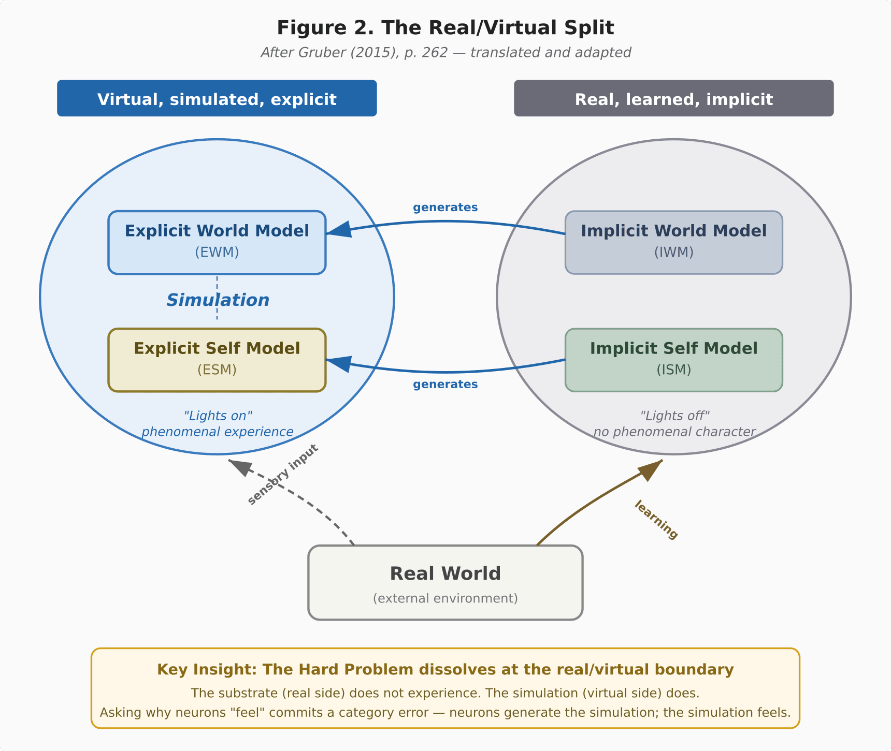
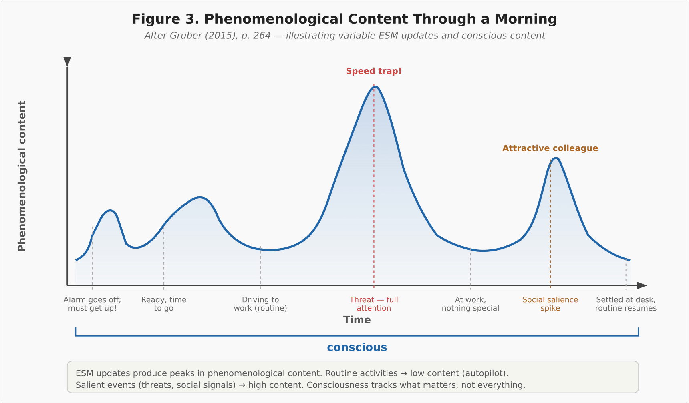

# The Four-Model Theory of Consciousness: A Simulation-Based Framework Unifying the Hard Problem, Binding, and Altered States

**Matthias Gruber**

*Independent researcher*

*ORCID: 0009-0005-9697-1665*

*Correspondence: matthias@matthiasgruber.com*

---

## Abstract

Consciousness, on the Four-Model Theory, is constituted by ongoing self-simulation: a system builds a model of itself, relates to that model, and interacts with it. Models divide along two axes — scope (world vs. self) and mode (implicit vs. explicit) — yielding four model kinds rather than four modules. The implicit models are substrate-level, learned, and non-conscious; the explicit models are virtual, transient, and phenomenal. Qualia are constitutive properties of the computational level, incoherent at the substrate level as a spreadsheet cell's value is incoherent at the transistor level, which reframes the Hard Problem as resting on a category error: phenomenal properties are sought at a level where they do not exist.

The framework rests on three principles. Open-ended computation allows free modeling, and near-criticality is the signature that property leaves in neural tissue rather than the requirement itself. Recurrent non-linear dynamics of sufficient complexity host a second computational level: persistent activity patterns individuated by their mutual effects rather than by the cells that carry them. Phenomenology is a real, physical effect on that level, arising where the modeling closes on itself — where the self-model enters the update rule of the world-model. That this closure constitutes phenomenality is argued for and not derived (Section 3.4.3). The four kinds are then a minimum the architecture forces rather than a posit: four is the floor, not the ceiling.

Redirection of the modeling resource, variable permeability and forking of the self-model follow as consequences, and through them the theory accounts for psychedelic phenomenology, anesthetic mechanisms, dream and lucid-dream states, split-brain phenomena, dissociative identity disorder and animal consciousness. Several claims derived from the theory's 2015 axioms have since received converging independent support (Xu et al., 2024; Hengen & Shew, 2025; Algom & Shriki, 2026), though that convergence concerns the computational requirement and is shared with other criticality-based frameworks. Novel predictions — among them that psychedelics should alleviate anosognosia — remain largely untested.

**Keywords**: consciousness, hard problem, self-model, simulation, qualia, criticality, binding problem, altered states, psychedelics, self-referential closure

---

## 1. Introduction

### 1.1 The State of Consciousness Science

After three decades of intensive scientific investigation, consciousness research has not converged on a dominant paradigm in the sense of Kuhn (1962). The field possesses no agreed-upon methodology for linking subjective experience to objective measurement, and no theory that commands broad assent. Multiple frameworks compete for explanatory primacy — Integrated Information Theory (IIT; Tononi, 2004; Albantakis et al., 2023), Global Neuronal Workspace (GNW; Baars, 1988; Dehaene & Changeux, 2011), Higher-Order Theories (HOT; Rosenthal, 2005; Lau & Rosenthal, 2011), Predictive Processing (PP; Friston, 2010; Seth, 2021), Attention Schema Theory (AST; Graziano, 2013), Recurrent Processing Theory (RPT; Lamme, 2006, 2010), and others — yet none has established decisive empirical or theoretical superiority over its rivals.

Recent developments illustrate the difficulty. The COGITATE adversarial collaboration published equivocal results in *Nature* (COGITATE Consortium, 2025; protocol: Melloni et al., 2023): neither IIT nor GNW was fully confirmed, and the data showed stronger posterior cortical involvement than GNW predicted while leaving IIT's exclusion postulate unresolved. A letter signed by over 100 researchers declared IIT pseudoscientific (IIT-Concerned et al., 2025), provoking fierce rebuttals (Tononi, Albantakis, et al., 2025) and methodological commentary (Gomez-Marin & Seth, 2025). Reviews published in 2024-2025 have asked whether the field is making genuine progress or merely accumulating incompatible frameworks (Seth & Bayne, 2022; Kirkeby-Hinrup et al., 2025a; Wagner-Altendorf, 2024).

Moreover, the field's leading theories have limited track records of novel empirical prediction: most empirical work in consciousness science involves post-hoc correlation of neural measures with existing theories, not prospective prediction from theoretical first principles subsequently confirmed by independent groups (Yaron et al., 2022). This paper argues that the impasse persists because no existing theory simultaneously addresses all of the fundamental requirements that a complete theory of consciousness must meet. Each theory excels on some requirements but remains silent on, or weak against, others. The field needs a framework that addresses the full set of challenges — not just neural correlates or access conditions, but the deep philosophical problems that make consciousness uniquely difficult.

### 1.2 What Would Count as Progress?

This paper proposes that any theory claiming to provide a comprehensive account of consciousness must address eight core requirements, drawn from the philosophical and scientific literature. These requirements are not novel; each has been identified by previous authors as a central challenge, and assessing theories against multi-criteria benchmarks is itself established practice (Seth & Bayne, 2022). What is distinctive is this particular set of eight, taken together as the standard a single theory must meet:

1. **The Hard Problem** (Chalmers, 1995) — Why does physical processing give rise to subjective experience?
2. **The Explanatory Gap** (Levine, 1983) — Why does the explanation of neural correlates feel incomplete?
3. **The Boundary Problem** (Bayne, 2010; Tononi, 2004) — Where does the conscious system end?
4. **The Structure of Experience** (Nagel, 1974; Chalmers, 1996) — How does physical processing produce richly structured experience?
5. **Unity and Binding** (Treisman & Gelade, 1980; Revonsuo, 1999) — How are distributed processes unified into coherent experience?
6. **Combination and Emergence** (Chalmers, 2016) — How do non-conscious elements combine to produce consciousness?
7. **The Causal Role** (Jackson, 1982) — Does consciousness do anything?
8. **The Meta-Problem** (Chalmers, 2018) — Why do we think there is a hard problem?

Section 2 develops each requirement in detail and surveys how existing theories fare against them. The remainder of the paper presents a theory — the Four-Model Theory — that addresses all eight.

### 1.3 Overview and Historical Context

The Four-Model Theory was originally published in German as *Die Emergenz des Bewusstseins* (Gruber, 2015) and is presented here in revised and extended form. The theory takes Dennett's Multiple Drafts Model (Dennett, 1991) and Metzinger's Self-Model Theory of Subjectivity (Metzinger, 2003, 2009) as its starting point — but as the 2015 monograph noted, the combination of MDM and SMT leaves several things unexplained. The theory's substance lies in what it builds beyond that starting point. It is substrate-independent: the six-layer mammalian cortex is understood as an evolutionary implementation, not a requirement. Specifically, the theory adds five elements that neither MDM, SMT, nor any other existing framework provides individually or in combination:

1. **The cortical automaton concept.** Consciousness is identified with the self-referential self-simulation that a cortical substrate sustains when it operates in the Class 4 regime characterized by cellular-automaton theory — the running self-model, not the substrate's activity pattern as such, which is the automaton *for* consciousness rather than consciousness itself (Sections 3.4.2, 3.7.2). This differs from IIT, which identifies an experience with a maximally irreducible cause-effect structure — whose irreducibility Φ quantifies — specifiable in principle on any substrate — FMT ties consciousness to a specific *kind* of dynamics (Class 4 computation, of which criticality is the neural effect), not to a substrate-neutral quantity. The identification is not metaphorical; it carries measurable signatures (Gruber, 2015). No other theory specifies this particular dynamical interpretation.

2. **A two-level ontology that addresses the Hard Problem.** Qualia are constitutive properties of the computational level — real at that level but categorically incoherent at the substrate level. This is distinct from Dennett's illusionism (which denies qualia are real) and from Metzinger's transparency thesis (which explains why the self-model is not experienced as a model but does not claim to address the Hard Problem). It constitutes a third position: qualia are real, level-specific, and the Hard Problem rests on a category error.

3. **A computational-regime requirement motivated by computational theory, with criticality as its neural signature.** The edge-of-chaos requirement was motivated by Wolfram's classification of cellular automata (Wolfram, 2002) — in 2015, before the large-scale empirical consolidation by the ConCrit framework (Algom & Shriki, 2026) and Hengen and Shew's (2025) meta-analysis of ~140 datasets. No other consciousness theory derived this requirement from computational first principles prior to the large-scale empirical consolidation of near-critical cortical operation.

4. **Variable implicit-explicit permeability as a unified mechanism for altered states.** A single principle — modulation of the boundary between substrate-level (implicit) and simulation-level (explicit) processing — generates the phenomenology of psychedelics, dreams, meditation, anesthesia, and anosognosia. Neither MDM nor SMT provides a mechanism that unifies these phenomena under one principle. The closest competitor is the REBUS model (Carhart-Harris & Friston, 2019), which unifies altered states under relaxed precision weighting of prediction error; however, REBUS operates at the level of hierarchical message passing, whereas FMT's permeability operates at the structural boundary between substrate and simulation — on the present account the architecturally prior level, with relaxed precision weighting as one candidate implementation of a permeability change (Section 7 develops the comparison).

5. **A graduated consciousness hierarchy via recursive self-modeling depth.** The theory defines a principled continuum from simple consciousness (a system that models itself) through triply extended consciousness (a system that models its modeling of its modeling of itself). This provides graded rather than binary criteria for attributing consciousness across species and artificial systems, without ad hoc thresholds.

The theory's novelty lies not in any single element but in their specific integration. Dennett's MDM makes no prediction about anesthetic mechanisms; Metzinger's SMT makes none about psychedelic effects on anosognosia; no predecessor theory predicts a relationship between sensory input and identity content during ego dissolution, or that DID alter switches should follow a self-referential representational gradient. These predictions arise only from the specific combination of the Class 4 computational requirement, four-model taxonomy, variable permeability, and two-level ontology, not from any single predecessor (Section 7.4 provides a detailed treatment).

The theory belongs to the self-modeling tradition in consciousness studies, which holds that consciousness is constituted by — rather than merely correlated with — the system's model of itself. This tradition includes Metzinger's Self-Model Theory of Subjectivity (Metzinger, 2003, 2009), which analyzed the phenomenal self-model as a transparent representational structure; Damasio's multi-level self framework (Damasio, 1999, 2010), which grounded consciousness in progressively elaborated self-representations; Hofstadter's strange-loop account (Hofstadter, 2007), which identified the self with self-referential symbolic structures; Graziano's Attention Schema Theory (Graziano, 2013), which modeled subjective awareness as the brain's schema of its own attention; and Seth's interoceptive inference framework (Seth, 2021; Seth & Bayne, 2022), which cast the experienced self as a controlled hallucination grounded in body-state prediction. The Four-Model Theory extends this tradition by specifying the minimal architecture required for consciousness-constituting self-simulation (four model kinds along two axes), adding a physical requirement — open-ended Class 4 computation, whose neural effect is near-criticality — and developing a two-level ontology (real/virtual) that addresses the Hard Problem.

The theory proposes that consciousness consists of an ongoing self-referential computation running on an implicit (substrate-level) knowledge base. Qualia — the subjective "feel" of experience — are constitutive properties of the computational level: they exist at the level of the running computation but are incoherent at the substrate level. This two-level ontology addresses the Hard Problem by arguing that it rests on a category error — a level confusion.

Working from three principles — open-ended computation as the requirement for free modeling, motivated independently by Wolfram's computational framework (Wolfram, 2002); a second computational level hosted by recurrent non-linear dynamics; and phenomenality arising where the modeling closes on itself — the theory generates novel testable predictions and unifies phenomena across psychopharmacology, clinical neurology, sleep science, and comparative cognition. Several claims that follow from the theory's axioms — established in 2015 — have since received converging support from independent empirical research (Section 8.1), a convergence shared in part with other criticality-based approaches but unusual in its derivation from computational first principles rather than empirical neuroscience.

The theory is offered as one model among several. Every model carries inherent modeling error; the present theory is no exception. It is intended to complement existing frameworks — extending where they are incomplete, not displacing where they succeed.

The paper proceeds as follows. Section 2 establishes the eight requirements. Section 3 presents the Four-Model Theory. Sections 4 and 5 develop the philosophical commitments and the binding/criticality framework. Section 6 demonstrates the theory's explanatory range. Section 7 provides a systematic comparative analysis against major competitors. Section 8 presents the empirical convergence evidence and five predictions. Sections 9-11 address open questions, implications, and conclusions.

---

## 2. Eight Requirements for a Theory of Consciousness

This section develops each of the eight requirements and briefly notes how current theories address or fail to address them. A detailed theory-by-theory comparison follows in Section 7; the purpose here is to establish the evaluative framework.

### 2.1 The Hard Problem

Chalmers (1995, 1996) formulated the Hard Problem as the question of why physical processing is accompanied by subjective experience. We can, in principle, explain all the *functions* of consciousness — discrimination, integration, reporting, attention — without explaining why there is "something it is like" (Nagel, 1974) to undergo these processes. The explanatory challenge is not about identifying neural correlates but about understanding why correlates are accompanied by phenomenality at all.

Most neuroscientific theories of consciousness (GNW, RPT, PP) focus on functional or mechanistic accounts and remain explicitly or implicitly silent on the Hard Problem. IIT attempts to address it by defining consciousness as intrinsic causal power (Φ), treating experience as identical to integrated information — but this requires accepting panpsychist commitments that many find problematic (Aaronson, 2014), and its causal-structure criterion has been argued to be unfalsifiable (Doerig et al., 2019). HOT and AST offer deflationary accounts that explain *why we report* having phenomenal experience but leave open whether they have truly addressed the phenomenality itself. Illusionism (Dennett, 1991; Frankish, 2016) dissolves the problem by denying that qualia as traditionally conceived exist — a position that remains deeply controversial.

### 2.2 The Explanatory Gap

Levine (1983) identified the Explanatory Gap as a distinct problem from the Hard Problem: even if we identify every neural correlate of every conscious state, the explanation seems to leave something out. The gap is between the third-person description (neural firing patterns) and the first-person reality (what the experience is like). Block (1995, 2007) further refined this as the distinction between access consciousness (the functional role) and phenomenal consciousness (the subjective feel).

The Explanatory Gap is often treated as a restatement of the Hard Problem, but it has a distinct character: it is about the *form* of explanation rather than the *existence* of the phenomenon. A theory that addresses the Hard Problem should simultaneously narrow the Explanatory Gap.

### 2.3 The Boundary Problem

Where does the conscious system begin and end? Within the brain, only some processing is conscious at any given moment. Between organisms, it is unclear where to draw the line. The Boundary Problem asks for a principled account of what delineates conscious from non-conscious processing (see Bayne, 2010; Tononi, 2004).

IIT provides the strongest existing treatment of this requirement through its exclusion postulate: the system with maximum Φ defines the boundary of consciousness. However, the computational intractability of calculating Φ limits its practical application. GNW defines conscious access in terms of global broadcasting, but the boundary between broadcast and non-broadcast content is not always sharp. PP uses Markov blankets (Friston, 2010), though Bruineberg et al. (2022) argue that this use conflates an instrumental modeling construct (Pearl's blankets) with a metaphysical claim about system boundaries (Friston's blankets).

### 2.4 The Structure of Experience

Conscious experience is not a homogeneous blob — it has rich spatial, temporal, modal, and qualitative structure. A visual scene has colors, shapes, depths, and textures; an auditory experience has pitches, timbres, and spatial locations; emotional experience has valence, intensity, and phenomenal character. Any complete theory must explain how physical processing generates this structured phenomenology.

IIT's qualia space provides a mathematical treatment of experiential structure, arguably its greatest strength. PP's generative models are inherently structured, providing a natural account of the richness of perceptual experience. GNW and HOT are weaker here, offering accounts of *when* content becomes conscious but less about *why* it has the particular structure it does.

### 2.5 Unity and Binding

The Binding Problem (Treisman, 1996; Revonsuo, 1999) asks how distributed neural processes — occurring in different brain regions, at different timescales, in different modalities — are unified into a single coherent conscious experience. I see a red ball: "red," "round," "ball," "there," and "now" are processed in different cortical areas, yet I experience a unified percept.

Proposed solutions range from temporal synchrony (Gray et al., 1989; Singer & Gray, 1995; Fries, 2005, 2015) to integrated information (Tononi, 2004) to global broadcasting (Baars, 1988). None is universally accepted. The binding problem remains, alongside the Hard Problem, one of the deepest unresolved challenges.

### 2.6 Combination and Emergence

How do non-conscious elements combine to produce consciousness? For panpsychist theories (IIT in its strong form; Goff, 2019; Strawson, 2006), this takes the form of the Combination Problem (James, 1890; Chalmers, 2016): if fundamental entities have micro-experience, how do these micro-experiences combine into the macro-experience we know? For physicalist theories, the challenge is one of emergence: at what point, and by what mechanism, does consciousness emerge from non-conscious physical processes?

The Combination Problem is widely regarded as panpsychism's most serious difficulty (Chalmers, 2016; Coleman, 2014). Physicalist emergence theories face the objection that they either invoke strong emergence (which many philosophers consider mysterious) or reduce consciousness to function (which many consider inadequate). A satisfactory theory must navigate between these difficulties.

### 2.7 The Causal Role of Consciousness

Does consciousness *do* anything, or is it epiphenomenal — a by-product with no causal power? If consciousness has causal power, what kind? If it does not, why does it exist?

The question is contested within the field. Epiphenomenalism (Huxley, 1874; Jackson, 1982) is widely dismissed as absurd (how could evolution produce something causally inert?), yet many mechanistic theories implicitly struggle with the question. If consciousness is "just" a global broadcast (GNW) or "just" recurrent processing (RPT), what role does the *experience* play beyond the mechanism? The PP framework, through active inference, provides perhaps the strongest existing case for consciousness having a functional role, but it is unclear whether the functional role requires phenomenal consciousness rather than mere information processing.

### 2.8 The Meta-Problem

Chalmers (2018) identified the Meta-Problem: why do we *think* there is a Hard Problem? Even if the Hard Problem is illusory (as illusionists argue) or misformulated (as functionalists hold), it is a fact that most humans — including most philosophers and scientists — report a strong intuition that consciousness is deeply mysterious. A complete theory should explain this intuition.

AST provides the strongest existing account of the Meta-Problem: we model our own attention, and the model necessarily omits the mechanistic details, leading to the intuition that consciousness is something non-physical (Graziano, 2013). This is a genuine insight. However, AST's treatment of the Meta-Problem does not extend to a solution of the Hard Problem itself — it explains why we *think* there is a mystery without fully accounting for the mystery.

---

## 3. The Four-Model Theory

The theory rests on three principles, stated here in full and established in the sections indicated:

1. **Open-ended computation allows free modeling** (Section 3.7). Near-criticality is what this looks like in neural tissue — the signature the property leaves in a substrate, not the principle itself.
2. **Recurrent non-linear dynamics of sufficient complexity host a second computational level** (Section 3.3): persistent activity patterns that survive their own inputs, interact, and compute over one another, individuated by their mutual effects rather than by which cells carry them. "Sufficient" means sufficient to be in the regime named by the first principle.
3. **Phenomenology is a real, physical effect on that level, and it arises exactly where the modeling closes on itself** (Section 3.4) — where the self-model enters the update rule of the world-model. This is the theory's single bridging commitment, and it is argued for rather than derived (Section 3.4.3).

Everything else the theory uses is a consequence rather than an axiom: the four model kinds, which are the minimum the second and third principles jointly force (Section 3.2); redirection of the modeling resource onto the non-self (Section 6.1); variable implicit-explicit permeability (Section 3.6); and forking of the self-model (Section 6.5). Section 6 sets out why each is a consequence and not a principle. Deriving the phenomena from a smaller set of axioms lengthens the derivation chains rather than weakening them, and the chains are stated explicitly wherever they are used.

### 3.1 Core Definition

Consciousness — the capacity for subjective experience — is constituted by a specific kind of process: ongoing self-simulation. More precisely, consciousness is the ability of an entity — biological or artificial — to create a model of itself, to relate that model to itself, and to interact with it. Consciousness is not a property the brain possesses but a process the brain performs.

This definition centers on the mechanism — self-simulation — rather than the output — subjective experience — for the same reason that molecular biology defines life through metabolism and replication rather than through "the feeling of being alive": centering on the mechanism is what makes the definition explanatory rather than circular. Subjective experience, on this account, is what ongoing self-simulation produces when the substrate operates at the edge of chaos (Section 3.7). The theory's central explanatory task is to show how and why self-simulation generates phenomenality (Section 3.4), not to stipulate that it does. This approach is shared by the self-modeling tradition in consciousness studies — Metzinger's Self-Model Theory (Metzinger, 2003), Damasio's proto-self framework (Damasio, 1999, 2010), Seth's interoceptive inference account (Seth, 2021), and the self-representational approaches surveyed by Kriegel and Williford (2006). These accounts differ in how much they claim for the mechanism — Kriegel's self-representationalism makes it definitional, whereas Metzinger's minimal phenomenal consciousness rests on a transparent world-model and Seth treats selfhood as one kind of conscious content rather than as the definition — but all give self-modeling a central constitutive role.

This definition is functional and substrate-independent. It does not require a specific physical implementation, biological composition, or computational architecture. What it requires is a system capable of constructing and maintaining a self-referential simulation continuously.

"Self-simulation" is a pedagogical shorthand, not a claim that the brain operates like a digital twin replicating reality in a continuous, deterministic loop. What the brain generates is something more like a unified narrative: a more or less linear, relatively contradiction-free story of the organism's current situation — past, present, and anticipated future — assembled from fragmentary substrate-level knowledge and current sensory input. This narrative is neither continuously updated nor strictly linear; it is constructed on the fly, revised where it fails, and filled with interpolations, simplifications, and outright confabulations. The term "simulation" is retained because it captures the essential architectural feature: the explicit models are *generated processes* running on a structural substrate, distinct from that substrate in the way any computation is distinct from the hardware that executes it. This substrate-computation distinction is not a philosophical claim unique to consciousness — it holds for every computing system, from spreadsheets to neural networks. What is unique to consciousness is not the distinction itself but what happens at the computational level: *self-referential closure*, the fact that the system's generated model includes a model of the system generating the model (see Section 3.4).

#### 3.1.1 Operational Definitions

This subsection specifies what an experimenter would measure to confirm or disconfirm the theory's constructs. The terms below — consciousness, model, self-simulation, permeability, implicit, explicit, virtual, criticality, and "becomes conscious" — carry precise theoretical meanings within the Four-Model Theory, but several have been used in the consciousness literature with divergent definitions. Table 1 maps each term to a theoretical definition, a measurable observable, and a concrete empirical example. Two caveats apply. First, the observables listed are detection handles of varying strength — some validated markers, some candidate correlates (see the footnotes) — neither necessary nor individually sufficient conditions for the construct; other signatures may exist, and future measurement techniques may reveal additional ones. Second, PCI and other neural markers are validated empirical correlates that track consciousness states -- they are not constitutive measures of consciousness as the theory defines it.

**Table 1. Operational Definitions of Core Constructs**

For each construct, the theory specifies a theoretical definition, a measurable observable, and a concrete empirical example.

**Consciousness.** *Definition:* The ongoing capacity to create a self-model, relate it to the self, and interact with it. A process, not a property. *Observable:* Perturbational Complexity Index above the consciousness threshold (PCI > 0.31) via TMS-EEG.^1^ *Example:* Casarotto et al. (2016): PCI achieves 100% sensitivity and specificity in the benchmark cohort discriminating conscious states (waking, dreaming, ketamine) from unconscious conditions (NREM sleep and anesthesia with midazolam, xenon, or propofol), and 94.7% sensitivity for identifying patients in the minimally conscious state.

**Model.** *Definition:* A non-trivial reference system with (1) write access (updates from new input), (2) read access (the system interprets its own representations), and (3) boundary recognition (differential response to stimuli inside vs. outside the modeled domain; Gruber, 2015). *Observable:* Convergent behavioral and neural evidence: prediction-error signals (EEG/MEG), anticipatory neural activity preceding action, and differential response at domain boundaries. *Example:* Mismatch negativity demonstrates write access (Näätänen et al., 2007); the Bereitschaftspotential is consistent with read access, though preparatory motor activity alone does not establish that the system interprets its own representations; peripersonal space selectivity illustrates boundary recognition. These are convergent illustrations, not a single certification protocol.^2^

**Self-simulation.** *Definition:* The system's continuous generation of explicit (virtual) world and self models from implicit (substrate-level) knowledge and sensory input. The generated models *are* the simulation. *Observable:* Candidate signature: sustained DMN activity during rest (Raichle et al., 2001), disrupted under propofol. This is a neural correlate, not a localization claim.^3^ *Example:* Boly et al. (2012): propofol-induced loss of consciousness corresponds to breakdown of thalamocortical effective connectivity and collapse of DMN coherence.

**Permeability.** *Definition:* The degree to which implicit (substrate-level) content crosses into the explicit (virtual) models. High permeability: implicit material floods the simulation (psychedelics, dreams). Low permeability: tight gating preserves simulation coherence (focused waking). Drives Predictions 1--2 and the altered-state accounts of Section 6.1. *Observable:* Neural entropy measures: Lempel-Ziv complexity and spectral entropy of EEG/MEG as proxy for implicit-to-explicit information flow. *Example:* Schartner et al. (2017): Lempel-Ziv complexity increases significantly under psychedelics relative to placebo, consistent with increased implicit-to-explicit permeability.

**Implicit model (IWM/ISM).** *Definition:* Substrate-level, learned, non-conscious knowledge stored in physical connectivity (synaptic weights, dendritic morphology). Modifiable through structural plasticity — short- and long-term — not by the running simulation directly. *Observable:* Structural neuroimaging: DTI for white-matter connectivity; synaptic density via [^11^C]UCB-J PET. Content inferred from behavioral measures persisting despite abolished experience. *Example:* Patient H.M. (Scoville & Milner, 1957; Milner, 1962): intact procedural learning despite inability to form new declarative memories.

**Explicit model (EWM/ESM).** *Definition:* Virtual, transient, phenomenal — generated electrochemical activity patterns with no permanent physical substrate. Disrupted by anesthetics, TMS, and simple illusions. *Observable:* Content-specific neural activity (fMRI BOLD, EEG/MEG source-localized) that tracks reportable experience and collapses under anesthesia while structural connectivity is preserved. *Example:* Massimini et al. (2005): TMS-evoked cortical responses propagate widely during wakefulness but remain local during NREM sleep, while structural connectivity is unchanged.

**Virtual (as in FMT).** *Definition:* Existing at the computational level as a generated process, not as a stored structure. Virtual entities are real and physical but level-specific. *Observable:* Dissociation between structural and functional measures: present in transient dynamics (fMRI, EEG) but absent from fixed connectivity (DTI). *Example:* Propofol anesthesia eliminates conscious experience and collapses complexity measures (Casali et al., 2013) while preserving white-matter integrity. Recovery upon washout confirms suppression, not destruction.

**Criticality.** *Definition:* The signature, in neural tissue, of the computational regime the theory requires — the virtual system operating at or near the edge of chaos (Class 4). The requirement itself is the open-ended regime (Principle 1, Section 3.7); criticality is how that requirement is observed in a biological substrate, and the relation runs one way only: absent criticality, no consciousness, never the converse. *Observable:* Power-law neuronal avalanches (exponent τ ≈ −3/2); DFA exponent 0.6--0.9; branching ratio σ ≈ 1.0 (slightly subcritical in waking). See Section 3.7 for their role in the theory's predictions. *Example:* Priesemann et al. (2014): waking cortical dynamics show σ ≈ 0.98. A ~140-dataset meta-analysis (Hengen & Shew, 2025) consolidates the evidence that cortex operates near criticality as a setpoint of brain function; the ConCrit framework (Algom & Shriki, 2026) extends this into an explicit criticality–consciousness account.

**"Becomes conscious."** *Definition:* Implicit content entering what the running simulation currently represents. The explicit models are *generated from* the substrate rather than filled by a copy of it, so this names a permeability event (Section 3.6) and not a transfer between two stores. *Observable:* Nonlinear transition ("ignition") from localized sensory processing to global frontoparietal activation, marked by P3b in ERP. *Example:* Dehaene et al. (2006): masking paradigm shows subliminal stimuli produce localized activation, while suprathreshold stimuli trigger sudden frontoparietal ignition accompanied by P3b.

^1^ PCI is a validated empirical marker that tracks consciousness states with high accuracy; it is not a constitutive measure. The theory defines consciousness as a process, not a complexity value.

^2^ These three lines of evidence are drawn from different sensory/motor systems. They demonstrate that neural systems exhibit model-like properties individually, not that a single experimental protocol can certify "model" status under FMT.

^3^ The theory does not identify self-simulation with DMN activity specifically. DMN co-activation persists in some anesthetized states and decreases during task engagement without loss of consciousness, so it is best understood as a candidate correlate rather than a definitive signature.

One core construct — self-referential closure — is deliberately omitted from Table 1 because no established measurement protocol directly tests it. A purpose-designed experiment combining targeted cortical disruption with no-report paradigms (Tsuchiya et al., 2015) would constitute a candidate test (see Table 1b below for details).

#### 3.1.2 Empirical Handles for Theory-Specific Constructs

Table 1 maps the theory's general terminology to established measurement protocols. Several constructs, however, are specific to the Four-Model Theory and do not yet have standardized empirical operationalizations. Table 1b addresses this gap: for each FMT-specific construct, it identifies the predicted signature, the measurement approach, and the result that would disconfirm the construct.

**Table 1b. Empirical Handles for FMT-Specific Constructs**

| Construct | Predicted Signature | Measurement Approach | Falsification Criterion |
|---|---|---|---|
| Criticality | Consciousness requires the open-ended computational regime, whose neural effect is near-criticality (σ ≈ 1.0, DFA α 0.6--0.9, power-law avalanches). Necessary, not sufficient; one-directional. | Propofol dose-response with simultaneous PCI + branching ratio (ECoG/high-density EEG). | Confirmed consciousness with convergently subcritical dynamics (σ < 0.85, α < 0.55, no scaling). |
| Implicit integrity | Substrate processing guided by the implicit models continues under anesthesia while the explicit models are suppressed. | Hippocampal processing under propofol-based general anesthesia (Katlowitz et al., 2026): semantic and lexical discrimination, word prediction, representational plasticity. Statistical learning, priming and skill consolidation are proposed extensions, not results of that study. | Implicit learning abolished at consciousness-abolishing doses (BIS 40--60). |
| Self-ref. closure | Disrupting the self-modeling loop degrades *experience*, not merely *report*. | No-report paradigms (Tsuchiya et al., 2015) + targeted TMS during metacognition. | Metacognitive disruption leaves phenomenology intact (P3b, late positive potential). |
| Implicit/explicit dissociation | The two systems are structurally separable via selective suppression. | (a) Anesthesia suppresses explicit, implicit continues; (b) plasticity interference degrades implicit without affecting running simulation. | No manipulation selectively suppresses one without proportionally affecting the other. |
| Permeability | Implicit-to-explicit transfer is modulable, varying by channel, region, and histology — a family of boundary properties, not a single parameter. | Psilocybin/LSD dose-response (3+ levels): Lempel-Ziv complexity, 5D-ASC, content transfer. Regional analysis for channel specificity. | No systematic relationship to serotonergic/GABAergic modulation across any region or channel. |

Three caveats apply. First, self-referential closure is the least empirically accessible of the theory's core claims; the proposed TMS paradigm is a candidate test, not an established protocol. Second, the falsification criteria are stated conservatively: each requires convergent failure across multiple measures. Third, none of these tests would individually confirm or refute the entire theory; the theory's overall evaluation depends on the pattern of results across multiple empirical handles.

### 3.2 The Four Models

**The four model kinds are a consequence, not a posit.** They are the minimum that the second and third principles jointly force: a level on which models run (Principle 2) whose modeling closes on itself (Principle 3) cannot do so with fewer. The derivation is given twice below — once as a minimum-sufficiency argument ("four is the floor, not the ceiling") and once as an elimination argument ("Why four, not three?"). Nothing in the taxonomy is posited: the four are what the derivation yields, and they mark functional distinctions rather than anatomical ones.

The theory identifies four models distinguished by two dimensions: **mode** (implicit/learned vs. explicit/generated) and **scope** (everything vs. self only). The two dimensions differ in kind — mode is a genuine orthogonal contrast, while scope is a nesting: the self-model's content is a proper part of the world-model's (ESM ⊆ EWM, ISM ⊆ IWM). This is a conceptual taxonomy, not a claim about spatial organization in the brain — the four kinds are functionally distinguished, two stored as structure and two generated as processes, not anatomically localized regions.

**Table 2. The Four-Model Architecture**

| | Everything (world) | Self only |
|---|---|---|
| **Implicit** (learned, substrate-level) | Implicit World Model (IWM) | Implicit Self Model (ISM) |
| **Explicit** (generated, phenomenal) | Explicit World Model (EWM) | Explicit Self Model (ESM) |

**The Implicit World Model (IWM)** encompasses the substrate's total accumulated knowledge about the world, stored in synaptic weights (or their functional equivalent in non-biological substrates). It includes everything the system has ever learned: perceptual regularities, causal models, spatial relationships, semantic knowledge, motor programs for interacting with the world. The IWM is never directly conscious. It stays "in the dark" — providing the knowledge base from which the conscious simulation is generated, but never itself appearing in experience.

**The Implicit Self Model (ISM)** is the substrate's accumulated self-knowledge: body schema, proprioceptive calibration, motor skills, habits, personality traits, autobiographical memory structures, and social self-knowledge. Like the IWM, the ISM is never directly conscious. There is no unified homunculus — no inner observer reading the ISM. The ISM is a structural feature of the substrate, not an experiential one.

**The Explicit World Model (EWM)** is the conscious world — the brain's dynamic construction of a unified scene from sensory and stored data that constitutes perceptual experience. When you see a room, hear a voice, feel the texture of a surface, you are experiencing the EWM. It is generated from the IWM (which provides the world-knowledge) and current sensory input (which constrains and updates it), but it is not identical to either. The EWM is a virtual construct — a transient process whose properties (unified scene, perceptual qualia) exist at the computational level and are incoherent at the substrate level — not a permanent stored structure.

**The Explicit Self Model (ESM)** is the conscious self — the brain's continuous generation of a unified self-narrative that constitutes self-experience. It is the sense of being a subject, having a perspective, occupying a body, possessing a history, and being the author of one's actions. The ESM is generated from the ISM (which provides the self-knowledge) and current interoceptive and proprioceptive input, but like the EWM, it is virtual: a transient process, not a permanent entity — one whose defining properties (selfhood, phenomenal character) are constituted at the computational level rather than stored in the substrate.

**The four models as a principled minimum.** The 2×2 taxonomy above identifies the *minimum sufficient set* of models for consciousness, not the actual number the brain maintains. The biological substrate — spiking neurons atop proteomic networks with their own intracellular signaling — implements an effectively uncountable number of overlapping models on both sides of the implicit/explicit divide. A motor model for reaching simultaneously encodes world-geometry (object location, obstacles) and self-kinematics (arm configuration, grip aperture); an emotional model of a social interaction simultaneously encodes other-knowledge (world) and self-assessment (self). Real neural models do not respect the world/self boundary — they blend across it. The four canonical models are best understood as extremal points in a continuous space defined by the two dimensions (scope and mode), around which the brain's actual, high-dimensional modeling ecology is organized. The principled claim is not "the brain has four models" but "any system capable of consciousness must model both world and self, at both the structural and the simulation level — four is the floor, not the ceiling." This minimum-configuration reading constrains the theory's claims without committing to an implausible discreteness, and it specifies the target for mathematical formalization (see companion paper: *Toward a Mathematical Formalization of the Four-Model Theory*, Gruber, 2026b).

**Why "implicit" entails "learned" and "explicit" entails "simulated."** The pairing of implicit with learned and explicit with simulated is not a stipulation but follows from the architectural roles the two model classes play. The implicit models (IWM, ISM) constitute the system's structural knowledge base — the substrate-level reference frame from which the explicit simulation is generated. Their content is *stored* in physical connectivity: synaptic weights, dendritic morphology, receptor configurations. This storage is the product of learning in the broadest sense: not only deliberate skill acquisition and memory consolidation, but also sub-threshold modification through subliminal priming, implicit statistical learning, and conditioning without awareness (Reber, 1967; Fiser & Aslin, 2001; Öhman & Mineka, 2001). The implicit models are "learned" because their content is the accumulated residue of the system's history, inscribed in structure rather than in any running process.

The explicit models (EWM, ESM), by contrast, are *generated processes* — dynamic patterns of activity that the substrate produces from its stored knowledge and current sensory input. They are "simulated" not in the sense of being unreal, but in the precise sense that they are *computed from* a structural base. The explicit models have no permanent physical substrate of their own: disrupt the generating process (through anesthesia, TMS, or the natural cessation of waking dynamics) and the explicit models vanish, while the implicit models persist. Restore the generating conditions and the explicit models reconstitute from whatever the implicit models currently contain. This asymmetry — stored structure that persists versus running process that must be continuously generated — is what makes the implicit/learned and explicit/simulated pairings architecturally motivated rather than arbitrary.

Two caveats prevent this from hardening into a false dichotomy. First, the direction of information flow is bidirectional: the explicit models do not merely *read* the implicit models but also *write back* to them through consolidation and plasticity. Conscious learning begins as explicit processing and gradually becomes implicit as skills and knowledge are consolidated into structural connectivity — the well-documented shift from declarative to procedural memory (Squire, 2004). Second, the pairing of "learned" with "non-conscious" does not mean that learning itself is non-conscious — it means that the *products* of learning, once consolidated into structural connectivity, are on the substrate side of the generative divide and therefore not directly accessible to experience.

**Why four, not three?** Could a system with an Implicit World Model, an Explicit World Model, and an Explicit Self Model — but no Implicit Self Model — be conscious? The theory's answer is no, and the reason is architectural. The ESM is a *generated* process that requires a structural knowledge base from which to generate: it needs stored self-knowledge (body schema, proprioceptive calibration, autobiographical memory structures) to construct the ongoing self-narrative that constitutes self-experience. Without an ISM, the ESM has no source material — it cannot generate a self-model from nothing. The same logic applies to each quadrant: the EWM requires the IWM (you cannot simulate a world without stored world-knowledge), and the implicit models require both scope dimensions because any system that acts must predict the sensory consequences of its own actions to distinguish self-generated from externally generated signals at the substrate level — a discrimination that requires stored self-knowledge (the calibration of the system's own effectors and their sensory signatures), not only world-knowledge. Nor is there a three-model alternative in which the ESM is generated from the IWM's knowledge of the body as one object among others: under the nesting ISM ⊆ IWM, the self-scoped partition of stored knowledge from which such an ESM would be generated is precisely what the theory names the ISM, so the alternative relabels the fourth model rather than eliminating it. The four-model minimum is a consequence of the generative architecture: two dimensions (scope and mode) × two values each = four model kinds, and removing any one collapses the architecture's capacity for the self-referential closure that constitutes consciousness.

### 3.3 The Real/Virtual Split

**Principle 2: recurrent non-linear dynamics of sufficient complexity host a second computational level** — persistent activity patterns that survive their own inputs, interact, and compute over one another, individuated by their mutual effects rather than by which cells carry them. "Sufficient" is fixed by Principle 1: sufficient to be in the open-ended regime. The two interlock — Principle 1 names the regime, Principle 2 names what the regime buys, namely a level on which models can be built at all.

These patterns are the virtual level, and the split this section describes is that level coming into view. They are physically real and wholly made of substrate activity, but the regularities that govern them are stated over the patterns rather than over the cells, which is why the level is substrate-independent without being immaterial. Note that the claim is persistence, not geometry: cortical activity shows travelling as well as standing waves, and nothing here depends on which.

**A note on terminology: three senses of "virtual" and why only one survives.** The consciousness literature uses "virtual" in at least three distinguishable senses when describing the explicit models: (1) *Transience sense*: the explicit models are virtual because they are transient activity patterns rather than permanent stored structures. (2) *Level-incoherence sense*: the explicit models are virtual because their defining properties (phenomenality, unity, qualia) exist at the computational level and are incoherent at the substrate level of description — a quale is virtual in the way a spreadsheet sum is virtual: real and causally efficacious at the computational level, yet not a property that can be found in or attributed to the substrate, however completely described. (3) *Emergent-level sense*: the explicit models are virtual because they constitute the emergent computational level (Level 5 of the five-system hierarchy, Section 3.7.1) that arises from but is not reducible to the substrate levels below.

These three senses are related but not equivalent. A transient pattern (sense 1) need not exhibit level-incoherent properties — a ripple in a pond is transient but fully describable in substrate-level vocabulary. Conversely, a level-incoherent property (sense 2) need not be transient — a running operating system exhibits computational-level properties indefinitely. Conflating transience with level-incoherence invites the misreading that consciousness is fragile or illusory merely because its substrate is dynamic.

Throughout this paper, **"virtual" is used exclusively in the level-incoherence sense (sense 2)**. When the transience of the explicit models is relevant (as in the anesthesia discussion), the paper says "transient" or "dynamically generated." When the hierarchical level is relevant, the paper says "computational-level" or "Level 5." The reader should consistently map "virtual" to the level-incoherence meaning: *a property of the running computation that is real and causally efficacious at the computational level but incoherent at the substrate level of description*. This is not epiphenomenalism — the computation is a physical process, and its properties are as physical as the substrate's — but its *defining* properties exist at the computational level only, not at the electrochemical or topological levels below it.

The four models divide into two fundamental categories:

**The real side** (IWM + ISM): These are physical, structural, learned, and non-conscious. They are embodied in the substrate's architecture — in biological brains, primarily in synaptic weights, dendritic morphology, and connectivity patterns, continuously modified by ongoing neural dynamics. They accumulate over the organism's lifetime through learning. They have no phenomenal character. "Lights off."

**The virtual side** (EWM + ESM): These are generated, transient, and phenomenal. They are patterns of activity — in biological brains, transient electrochemical dynamics. More precisely, their defining properties — phenomenality, unity, qualia — exist at the computational level and are incoherent at the electrochemical level; the substrate generates and sustains them but does not possess them. They are constructed dynamically from the implicit models and current sensory input. They *are* experience. "Lights on."

The implicit models are structurally inaccessible to direct experience — and this is not a contingent limitation but a consequence of their architectural role. These pairings — implicit with non-conscious, explicit with phenomenal — are not stipulated but motivated by the generative relation between them. The implicit models constitute the system's structural knowledge base: the reference frame from which the explicit simulation is generated. They are the reference frame *through which* the generating runs; the content of implicit knowledge is therefore on the wrong side of the generative relation — it cannot simultaneously *be* what is generated. To put it precisely: the *entire* structural substrate cannot simultaneously serve as the generative reference frame and appear as content within the simulation it generates. Such a demand would require a further reference frame from which to model the first, initiating an infinite regress. The implicit models can only be accessed indirectly, through their projections into the explicit models. The implicit side is also the system's "learned" side in the broadest sense: these models accumulate through interaction — both via consolidation of consciously acquired content and via sub-threshold modification (subliminal priming, implicit statistical learning, fear conditioning without awareness) — making them the organism's structural record of its history, stored in connectivity patterns rather than in any simulation.

Anesthesia provides direct empirical support for this asymmetry. General anesthetics suppress dynamic cortical integration — the explicit, simulated side. They do not destroy synaptic connectivity or learned associations — the implicit, structural side. Yet consciousness is eliminated entirely (Alkire, Hudetz, & Tononi, 2008). Were consciousness a property of the structural substrate, it should survive the selective suppression of transient dynamics; it does not. The dissociation tracks exactly the boundary the theory predicts.

Note that this account describes the system's *current architectural state*, not a logical necessity about information in general. Information can enter the implicit models through two routes: via the explicit models (conscious learning followed by consolidation into long-term plasticity) or directly via sub-threshold processes that never reach the explicit side at all. Both routes modify the implicit models without those modifications ever appearing in experience. The direction of the argument is unaffected: whichever route a content takes, once it resides in the structural substrate, the generative asymmetry renders it inaccessible to direct experience. The pairing is a consequence of which side of the generative divide a given content currently occupies, not an intrinsic property of that content. It is this structural basis of the real/virtual split — not merely a descriptive taxonomy — that makes it theoretically productive for addressing the Hard Problem.

This division is the foundation of the theory's treatment of the Hard Problem (Section 3.4) and structures its account of every phenomenon it addresses.

The virtual models possess **software-like properties** that follow from their nature as generated processes rather than stored structures^[For the ontological sense of 'virtual' deployed throughout — computational-level properties incoherent at the substrate level — see the terminology note at the opening of this section and Section 3.4.]:

- **They can be forked**: A single substrate can run multiple configurations of the ESM (see Section 6.2 on dissociative identity disorder).
- **They can be cloned**: On the theory's reinterpretation of the split-brain evidence — defended against the standard reading in Section 5.2 — physical separation of the substrate produces degraded but complete copies of the virtual models.
- **They can be redirected**: The ESM requires input; disrupt normal self-referential input and it latches onto whatever input dominates (see Section 6.1 on psychedelics).
- **They can be reconfigured**: On the theory's reading, therapeutic interventions (CBT, exposure therapy) take effect by rewiring the substrate from which the virtual models are generated.

### 3.4 Virtual Qualia: Addressing the Hard Problem

**Principle 3: phenomenology is a real, physical effect on the second computational level, and it arises exactly where the modeling closes on itself** — where the self-model enters the update rule of the world-model. Qualia are neither immaterial nor an extra ingredient added to the computation. They are properties of the level established by Principle 2, and they appear at the point where that level's modeling becomes self-referential.

This section develops the principle in stages: the level distinction that makes the claim coherent at all (3.4.1–3.4.2), the closure condition that locates phenomenality (3.4.3), the mechanism that gives it temporal texture (3.4.4), the relation to illusionism and functionalism (3.4.5), and the resulting two-level ontology (3.4.6). The constitutive step — that closure *is* where phenomenality arises rather than merely accompanying it — is the theory's single bridging commitment. It is argued for and not derived (Section 3.4.3).

#### 3.4.1 The Level Distinction

Every computing system — from a laptop running a spreadsheet to a neural network training on data — inherently distinguishes between a physical substrate and the computational processes running on it. This is not a philosophical claim; it is an engineering truism. The substrate (transistors, synaptic weights, connectivity patterns) supports and constrains the computation, but the computational level has properties that are descriptively incoherent at the substrate level.

The level distinction introduced in Section 3.3 — exemplified by the spreadsheet whose cell "contains the sum of column B" — applies here directly. No individual transistor contains a sum, and no *collection* of transistors contains a sum either, *when described in transistor-level vocabulary*. The full collection of transistors certainly *implements* the spreadsheet; at the computational level, the sum is real and causally efficacious. But examine those same transistors using only the descriptive resources available at the substrate level — voltages, logic gates, charge states — and the concept "sum of column B" does not appear. It is not recoverable by aggregating transistor-level descriptions, however exhaustively. The property "being a sum" belongs to the computational level and is incoherent at the level from which that computation is generated. The claim concerns *levels* of description, not parts and wholes.

Standard computational functionalism (Putnam, 1967; Chalmers, 1996) accepts the level distinction but treats the computational level as *nothing more than* what the substrate does under a functional description: the program IS the substrate's activity, re-described. On this view, program-level properties are legitimately attributed to the full collection of substrate elements under the appropriate functional interpretation. The Four-Model Theory departs from this position. It holds that the computational level has properties that are **ontologically level-specific** — properties that belong to the computation *as computation* and are not expressible in substrate-level vocabulary, however complete that description and however functionally enriched. This is a stronger claim than standard functionalism makes, and it is this stronger claim that opens the path to a non-mysterian, non-illusionist treatment of qualia.

#### 3.4.2 Qualia as Level-Constitutive Properties

The central claim of the Four-Model Theory is that **qualia are constitutive properties of the computational level**. They are the way the generated self-model (ESM) registers its own states and the generated world-model (EWM). Qualia are, in this precise sense, virtual constructs (properties of the computational level that are incoherent at the substrate level) — patterns that exist at the level of the running self-simulation and that are ontologically level-specific, just as "cell A1 contains the sum of column B" is ontologically level-specific relative to the transistors that generate and sustain it.

This addresses the Hard Problem by revealing a **category error** — specifically, a **level confusion** — in its formulation:

**The standard formulation**: "Why does physical processing (neuronal firing, synaptic transmission) feel like something?"

**The reframing**: It does not. The IWM and ISM — the substrate-level implicit models — and the substrate processing that runs through them carry no phenomenal character whatsoever. There is nothing it is like to be a synaptic weight. Qualia are not missing from the substrate; they are the wrong kind of property to seek there. They exist at the computational level — at Level 5 of the five-system hierarchy (Section 3.7.1) — where they are not mysterious but constitutive. Asking why neuronal firing feels like something is like asking why transistor switching "is" a spreadsheet, or why interference fringes "are" a holographic image. The neurons are not the experience; they generate and sustain the computational process in which experience is constitutive.

Moreover, even considering the *entire* neural substrate as a unified system does not dissolve the level distinction. The cortical automaton — the high-dimensional activity pattern of the cortex in its Class 4 regime (Section 3.7.2) — is a sophisticated apparatus that computes, thinks, and navigates an organism through a life. But it is not consciousness. Consciousness arises from the interplay between this cortical automaton and the substrate that generates the automaton — from the dynamic relation between the explicit models the automaton carries and the structural knowledge base that sustains them. The aggregate of all substrate activity is still substrate activity. Consciousness is what that aggregate *generates at the next level*.

Within the explicit models, "redness" is the ESM's mode of registering a particular class of EWM content. It is no more mysterious than "cell A1 contains 42" is mysterious to a spreadsheet user, despite being nowhere in the transistors. The Hard Problem's apparent intractability stems in large part from seeking this level-specific property at the wrong level.

Are level-constitutive qualia private in every respect, or shareable in some? The theory's answer is precise. The *relational structure* of a subject's qualia space — the similarity and dissimilarity relations among experiences — is shareable and recoverable across brains; the *absolute encoding* that realizes a given quale (which state is *my* red) is per-brain and refractory to transfer. Recent work supports the first claim directly: unsupervised, label-free alignment of color-similarity structures via Gromov–Wasserstein optimal transport recovers stable correspondences between independent groups of observers without shared labels (Kawakita et al., 2025; cf. Kriegeskorte et al., 2008). Within the Four-Model Theory this is expected — the structure lives in the relational organization of the explicit models, the absolute encoding in the specific substrate realization that no description transfers (Section 3.4.5). This is the phenomenal-concept strategy given architectural form (Loar, 1997): shareable structure and untransferable encoding are one physical state under two modes of constitution, so an explanatory gap appears without a metaphysical one. The account thereby explains the ineffability of report — why the absolute feel of Mary's first red cannot be conveyed (Jackson, 1982) — not the existence of feeling itself, keeping the theory's Hard-Problem treatment partial (◐) rather than full (●).

#### 3.4.3 Self-Referential Closure

The two-level ontology established above raises an immediate objection: every computation runs at a higher level than its substrate. A weather simulation generates computational-level properties — "pressure fronts," "precipitation probability" — that are incoherent at the transistor level. A chess engine "evaluates positions" in a vocabulary that no circuit board speaks. If level-specific properties were sufficient for phenomenality, every running program would have qualia. They do not. Something more is needed, and the theory claims that something is **self-referential closure**.

This section develops the argument in three stages, using a single example refined progressively to isolate the architectural feature that distinguishes conscious from non-conscious computation. The argument does not claim to *prove* that self-referential closure must produce phenomenality — it claims that self-referential closure is the kind of computational structure for which the Hard Problem's framing assumptions do not hold, and that this is the most parsimonious explanation for why certain computations have an inside and others do not.

**Stage 1: Simple simulation (no self-reference).** Consider a weather simulation running on a cluster of servers. It models atmospheric dynamics: temperature gradients, moisture transport, pressure differentials. It generates computational-level properties — "a cold front is moving southeast" — that are real and causally efficacious within the simulation but descriptively incoherent at the substrate level. No transistor is cold; no server rack is moving southeast.

But the simulation has a critical architectural feature: it is *about something other than itself*. The modeled domain (weather) and the modeling system (the server cluster) are entirely separate. An external observer can give a complete description of everything the simulation computes without being part of what is computed. The simulation has an outside — indeed, it is *all* outside. There is no perspective internal to the weather model from which the weather model encounters itself.

**Stage 2: Monitored simulation (partial self-reference, no closure).** Now add a performance-monitoring module. The system models weather *and* tracks its own computational states — memory usage, convergence rates, model accuracy, processor temperatures. This is self-reference of a kind: the system represents aspects of its own operation.

But the monitoring module describes the simulation without being described *by* the simulation. The weather model does not include a model of the monitoring process. The monitor sits outside the modeled domain, looking in. There is an inside (the weather model) and an outside (the monitor), and they do not form a closed loop. The system as a whole remains fully characterizable from an external perspective. Partial self-reference, but no closure. No phenomenality.

Merely adding self-monitoring to a system does not create consciousness: self-monitoring without closure is ubiquitous in engineering (thermostats, operating system kernels, industrial control systems). None of these systems have an inside perspective, because the monitoring process remains external to what is monitored.

**Stage 3: Self-referential closure (the four-model architecture).** Now consider a system whose model of the world includes a model of *itself modeling the world*. The system's self-model (ESM) represents the system that is generating the world-model (EWM); the world-model includes the self-model as part of its modeled reality. The system models the world, models itself within that world, and models the fact that it is the thing doing the modeling. The model and the modeled are no longer separable: the computation *is* the thing being computed.

This is a qualitatively different architecture from Stages 1 and 2, and the difference is not merely one of additional complexity. It can be stated as an **observability constraint**: the ESM's observational horizon is bounded by the EWM. The explicit self-model cannot see with useful resolution beyond the explicit world model to the implicit substrate that generates it. In a closed self-referential system, every internal characterization of the system's own processing is already part of the self-simulation. The system's representation of its own modeling activity is not external to the model — it is *within* the model, being modeled. There is no internal vantage point from which the system's processing can be described without that description being part of what is processed.

To be precise about what closure does and does not claim: the system does not literally absorb external observers. A neuroscientist scanning the brain is not thereby modeled by the brain (except insofar as the brain models the neuroscientist as part of its external world). The claim is about the system's *own representational economy*: within that economy, no description of the system's processing remains outside the scope of what the system models.

**Why closure generates something new.** The critical question is not whether self-referential closure is architecturally interesting — it plainly is — but whether it generates *level-distinct properties* that non-closed systems lack. The theory's answer is that closure creates an asymmetry between internal and external description that is constitutive rather than merely epistemic.

Return to the weather simulation. Its computational-level properties ("pressure front," "precipitation zone") are real at the computational level and incoherent at the substrate level — this is the level distinction from Section 3.4.1. But these properties are *symmetrically accessible*: an external observer can fully characterize them without entering the computation. The "inside" of the weather simulation is fully visible from the outside. There is no residual — nothing about what the simulation computes that is inaccessible to external description.

Now consider the self-referentially closed system. Its computational-level properties include not only world-modeling properties (like the weather simulation's) but also *self-modeling properties*: the system's representation of its own representational activity. These self-modeling properties generate an asymmetry. From outside the system, an observer can describe the physical substrate, the computational dynamics, and even the formal structure of the self-model. But there is one thing the external observer cannot do: *occupy the perspective that the self-model constitutes*. The self-model is not merely a data structure; it is a running process that generates an ongoing first-person perspective — a perspective that exists only from within the closed loop, because it is constituted by the loop's operation. An external description of the self-model is a description *of* the perspective, not the perspective itself, in the same way that a musical score is a description of a symphony but not the symphony.

This is the point at which the Hard Problem's formulation breaks down. The Hard Problem presupposes that there is an objective, third-person description of the physical process *and* a subjective, first-person experience of it, and asks why the former "gives rise to" the latter. But self-referential closure eliminates the clean separation between these two perspectives. The first-person perspective is not an *addition* to the computation — it is what self-referential computation *is* when the modeling loop closes. Experience is the self-simulation as encountered from within the loop, and "within the loop" is the only perspective that exists once closure obtains.

**The spreadsheet objection, revisited.** The sharpened level-distinction from Section 3.4.1 is essential here. As noted there, "sum of column B" is descriptively incoherent in transistor-level vocabulary even though the full collection of transistors implements the spreadsheet. Computational functionalism grants the point and presses further: the collection of transistors *under a functional interpretation* is the spreadsheet; there is nothing more to the computation than what the substrate does; so there should be nothing more to consciousness than what the neurons do.

The theory's response is that this objection holds for non-closed systems and fails for closed ones. For a spreadsheet, a weather simulation, or a chess engine, the functionalist is correct: the computation is *entirely* captured by a functional description of the substrate's activity. There is no residual. But for a self-referentially closed system, functional description from outside captures the *structure* of the self-model without capturing the *perspective* the self-model constitutes. The reason is architectural: in a closed system, the self-model *includes a model of the process of modeling*, creating a recursive structure whose operation generates a viewpoint that can only be instantiated, never merely described. Reading the code of a self-referentially closed system is not having the experience the code generates — but unlike the score/music case, the asymmetry here is not merely one of medium but of *closure*: the running system generates a self-referential perspective that has no correlate in any non-running description of the system.

The Hard Problem is not dissolved; it is **transformed**. It is shown to rest on a presupposition — that a system's own processing admits an exhaustive outside characterization — which self-referentially closed systems resist in a specific way: an outside description captures the *structure* of the self-model without exhausting the *perspective* it constitutes. This does not remove the third-person standpoint — this theory occupies one. On this reading the residual question — *why does closure generate phenomenality rather than merely complex data?* — is **conditional**. If the inside/outside asymmetry closure creates is *constitutive* — if being unoccupiable-from-outside is the very form of having an inside — then the question is ill-posed: it demands, of states whose defining feature is that no outside description exhausts them, an outside verdict that they are "merely" data. If the asymmetry is only *epistemic*, the question stands. The theory's single bridging commitment is the constitutive reading.

This commitment is motivated rather than merely posited. A faithful reconstruction of the computation a self-referentially closed recurrent network performs is not a data-free algorithm applied to inputs: such a system admits no compact factorization into program and passive operand, and — *at the level of content* — the meaning of its states is fixed by their role within the system's own self-model rather than by any external referent. No neutral description therefore preserves that content; the content-preserving reconstructions are cast in the system's own indexical, perspectival vocabulary — not "c = a + b" but "my five fruits are two apples and three pears; how will I carry them?" The point is structural, not epistemic: the claim is not that an outside observer *cannot verify* the states to be mere data, but that at the level of content the "mere data" description enjoys no privileged status — it is one reading among others, not the neutral default the deflationary framing treats as free. This unseats "mere data" as the baseline the Hard Problem's framing presupposes.

What this does not by itself establish is that an irreducibly first-person-formatted, self-interpreting dynamics is thereby *lived* rather than merely so describable — the identity is argued for, by inference to the best explanation, not derived. But this residual is neither peculiar to the theory nor beyond empirical reach. It is in principle testable, though not with current methods (§8.7). The evidence, however, would not be a *spontaneous* first-person report. It is tempting to set the bar there — a system that articulates a phenomenal life *it was not trained to describe*, arriving unprompted at "there is something it is like to be me" — and the theory declines that criterion for two reasons. First, it conflates the **referent** with the **label**. The self at issue is the explicit self-model, a closure-dependent activity that efferent disconnection of the self region can isolate from the rest of the system; "I" is a linguistic convention, acquired socially as any other word is, and its acquisition is contingent on linguistic input rather than on the presence of a self. A criterion demanding the label therefore returns a negative verdict on any system whose self is intact but whose vocabulary is not — a fact about training history, not about architecture. Second, the demand is unsatisfiable in practice by precisely the systems it would be applied to: any architecture carrying a language model in its periphery inherits a large prior over introspective vocabulary, within which "there is something it is like to be me" is among the most readily confabulated strings. A gate that a confabulator passes and an intact-but-mute self fails is mismeasuring in both directions.

The criterion the theory adopts instead is **naturalistic label acquisition under a disconnection control**. Bottlenose dolphins develop individually distinctive signature whistles whose identity information resides in the frequency contour rather than in voice features (Janik, Sayigh, & Wells, 2006), and they respond to hearing copies of their own signature whistle — addressing one another, in effect, by name (King & Janik, 2013). The structure this exhibits is the one the theory predicts: recognizing a call as *mine* requires running the self-model on an externally originating signal, which is the same reuse of the explicit self-model the theory posits for modeling other agents (Section 4.2) — the "that could be me" operation, applied to a token of oneself. What is diagnostic is therefore not whether the label appears, which is a fact about training, but whether the label **stays attached to the self when the self-referential loop is opened**: under an identical language bridge, efferent disconnection of the self region should abolish self-recognition while leaving the taught label intact and still producible. What that manipulation does is easily over-read. Disconnecting the self region's efferents does not remove the explicit self-model, and does not yield a closure-free system: it decomposes one irreducibly closed system into two, severing the coupling while leaving the self-model closed upon itself. That is what makes it the right control rather than a blunt one — the model is held constant and only its availability to the rest of the system is withdrawn, so a loss of self-recognition cannot be attributed to the model's absence. Removing the self region's self-recurrence would take away the coupling and the structure that generates the explicit self-model together, and could not distinguish them. The explicit self-model is activity rather than stored structure, so what a lesion removes is never the model itself but whatever generates it. A system that goes on emitting its name but no longer treats it as picking out itself has lost the referent and kept the convention — the dissociation the theory needs, and one a spontaneity criterion cannot deliver. Such a result furnishes the same kind of evidence of consciousness as we ever have of another mind — necessary but not decisive, since the explicit self-model narrates selfhood by construction.

The doubt that remains — that such a system might report experience while feeling nothing — is the general problem of other minds; it applies with identical force to every human but oneself, and to credit a human's report while denying that of an architecturally matched artifact would demand an independent reason that biological substrate does phenomenal work no functional duplicate can — a burden for the biological naturalist to discharge (§4.4), not a settled boundary. Every theory of consciousness carries a bridging commitment of this kind — IIT argues from phenomenological axioms to integrated information, HOT from the transitivity principle to a higher-order representation, GNW brackets the question — and what distinguishes the present account is the *relata* its commitment connects: an already-perspectival property (self-referential, indexical) rather than a scalar quantity or a broadcast pattern, so the gap it must cross is narrower, not absent. The account accordingly rates itself partial — not because its gap is wider than its rivals', but because it inherits the one residual every attribution of consciousness inherits, and, uniquely, renders it empirically approachable.

#### 3.4.4 The Temporal Echo Mechanism

The preceding section establishes that self-referential closure is constitutive of an inside perspective. A residual question persists: *why does the inside perspective have the character of lived experience* — temporal flow, qualitative richness, the vivid "now" — rather than being merely a recursively complex data structure? This section proposes a mechanism: closure in the open-ended regime generates **temporal echoing**, and it is this echoing that gives the inside perspective its phenomenal texture.

**The computational "now."** On the theory's account, conscious processing proceeds in discrete computational frames — each frame one cycle of the recursive self-simulation. But what we *experience* is not a sequence of discrete frames; it is a continuous passage of time. "In that moment I saw the fish" compresses a cascade of substrate events — visual processing, object recognition, semantic categorization — that occur in different cortical areas at different latencies into a unified temporal experience. The "now" of consciousness is a computational construct: one frame of the recursive simulation, not a physical instant. It is modeled after the organism's real physical temporality but is not identical to it — it is the simulation's version of time, running on the simulation's clock — a clock whose speed adapts to the organism's needs. In a fight-or-flight response, each frame of consciousness narrows its bandwidth per channel (tunnel vision, attentional narrowing across modalities) because the system needs to act fast with coarse resolution; whether frame duration also shortens is an open empirical question the theory does not prejudge. A familiar sunset, by contrast, compresses to a single moment almost immediately — on the theory's reading, because the simulation has cached the pattern and allocates minimal frames to it. The variable clock speed is not simply a function of computational load but of the adaptive trade-off between temporal resolution and bandwidth that the organism's situation demands.

**Recursion creates temporal smearing.** Self-referential closure means that each processing frame does not merely compute and pass its result forward; it reverberates through recursive levels. The system models its own modeling, and the output of that meta-modeling feeds back into the next frame's input. This recursion creates *temporal smearing*: information from a given frame echoes through recursive levels, bleeding into subsequent frames rather than terminating cleanly. The result is that the boundary between "now" and "just past" is computationally blurred — not because of measurement imprecision but because the recursive architecture inherently spreads each frame's content across a temporal window. This smearing is what gives conscious experience its characteristic *flow*: the vivid present moment, the progressively compressed recent past fading into memory, the sense of temporal continuity that constitutes the experience of being-in-time. The experience of temporal succession is real — but it is a property of the recursive computation, not of the physical substrate's clock.

A system without self-referential closure processes information frame by frame without this recursive reverberation. Such a system may carry state from frame to frame, as any recurrent simulation does, but nothing in it models the carrying: the accumulated state is never represented as the recent past *of a perspective*, so no "now" is constructed. This is the architectural difference between a weather simulation (which computes atmospheric states sequentially without experiencing temporal flow) and a conscious system (which constructs a lived temporality from the recursive echoes of its own self-modeling).

**Constructed order and the cognitive arrow.** The claim extends from temporal texture to temporal *order*: the felt sequence of events is constituted at the explicit layer, not read off the order in which signals reach the substrate. This is the natural reading of the postdiction literature. In apparent motion between two differently colored flashes, observers report the color switching abruptly midway along the illusory path — mid-trajectory content that cannot be specified before the second flash has occurred (Kolers & von Grünau, 1976). Trains of taps delivered at widely separated skin sites are felt as a regular hopping progression, with "phantom" taps interpolated at locations never touched (Geldard & Sherrick, 1972). In the flash-lag paradigm, the percept attributed to the moment of the flash is a function of events in the roughly 80 ms that follow it (Eagleman & Sejnowski, 2000). And Libet et al. (1979) — a distinct result from the volitional-timing work discussed in Section 4.2.2 — found that the subjective timing of a skin stimulus is referred backwards to an early cortical time-marker rather than to the later moment at which neuronal adequacy is achieved; the interpretation of that referral remains contested, but on any reading felt timing does not track completion of processing. Dennett and Kinsbourne (1992) drew the moral the theory adopts: for such revisions there is often no fact of the matter whether content was altered before or after "entering consciousness" — their Stalinesque/Orwellian indeterminacy — because the question presupposes a substrate-level finish line that does not exist. Within the Four-Model Theory this is not paradox but expectation: each frame of the simulation assigns order to its content as part of constructing that content, and the assignment answers to coherence, not to arrival time. The same constructive machinery runs at longer timescales — remembering is reconstruction (Bartlett, 1932), and episodic remembering and imagining draw on one constructive system (Schacter & Addis, 2007; Hassabis et al., 2007) — so ordered temporal content at every scale is simulation output.

What the construction does not supply is its own direction. The explicit models are implemented in the coarse-grained regime in which the thermodynamic arrow is defined — records, traces, and memory formation are entropy-gradient phenomena — so the cognitive arrow is *inherited* from the thermodynamic one, not built alongside it. This is a containment claim, not a correspondence claim: there are not two arrows requiring alignment; there is one arrow, and the modeler is inside the layer that has it. The simulation constructs *which* order its contents carry; the medium it is built in fixes which way order runs.

**Qualia as implicit model echoes.** The qualitative character of different experience types — why vision feels different from hearing, why pain feels different from pleasure — arises from the architecture of the implicit models from which the explicit simulation is generated. Each sensory system evolved independently to transduce a different physical channel: electromagnetic radiation for vision, pressure waves for hearing, molecular binding for olfaction, tissue damage signals for nociception. The implicit models for each channel have distinct connectivity, temporal dynamics, and computational structure because the physics they evolved to read is distinct. When the explicit simulation runs on top of these implicit models, it inherits their structural distinctions as qualitatively different experience types. The quale of "redness" is the echo of processing routed through the visual implicit model's pathway for long-wavelength electromagnetic information; the quale of "middle C" is the echo of processing routed through the auditory implicit model's pathway for 262 Hz pressure waves. Qualia are not mysterious extras added to the computation — they are the signature of which implicit model pathway generated that particular piece of the simulation, reverberating through the recursive structure as distinct phenomenal textures.

**The information singularity.** From an external perspective, a conscious brain constitutes something structurally analogous to an information singularity: a bounded region of physical space in which a virtual information-processing surface — the phenomenal world — is sustained in contact with the physical universe. The contact is not continuous in the usual sense: from the physical side, the virtual world is non-continuous (discrete computational frames, not smooth physical evolution); from the virtual side, the physical world is non-continuous (sampled through sensory channels at finite resolution and latency, not directly accessed). Each world appears discontinuous to the other — they touch at the interface but do not share a common temporal or causal fabric. The human body serves as the interface between the physical universe (outside) and the virtual universe inside the singularity (the phenomenal world). On the physical side, it is skin, eyes, ears, muscles; on the virtual side, it is a special kind of universe with its own regularities. The implicit/explicit boundary — the body-as-interface — is hard to "see" from inside the virtual world (we cannot directly observe our own neural substrate) and hard to see from outside (neuroscience can measure the substrate but not directly access the phenomenal content). This epistemic asymmetry is not a metaphysical mystery but an architectural consequence of the closure structure: the virtual side is isolated from the physical side in level (virtual properties are incoherent at the substrate level), but connected via the information-processing surface (sensory input, motor output). The analogy to a black hole's event horizon is structural, not physical: the interior is isolated except via the boundary, and the boundary mediates all exchange between inside and outside.

This mechanism narrows the gap that the spreadsheet objection identified. We know why a spreadsheet sum is a sum — we wrote the program, the mapping is transparent. For consciousness, the temporal echo mechanism provides an analogous (if less complete) account: we know why self-referential closure generates a temporal perspective (recursive reverberation), why different experiences have different qualitative character (implicit model architecture), and why the phenomenal world has the structure it has (it inherits the structure of the sensory systems that evolved to read distinct physical channels). The gap is not closed — the theory's foundational commitment remains — but it is substantially narrowed: what was a bare assertion ("closure constitutes phenomenality") now comes with an architectural mechanism ("closure constitutes phenomenality because recursion in the open-ended regime generates temporal echoing that constructs the lived perspective from implicit model reverberations").

#### 3.4.5 Relationship to Illusionism and Functionalism

This position is **not** illusionism in the sense of Dennett (1991) or Frankish (2016); nor is it compatible with deflationary accounts (Graziano, 2024). Illusionism holds that qualia as traditionally conceived are illusions — there is nothing it is like, and our sense that there is something it is like is itself a misrepresentation. The Four-Model Theory holds that qualia are *real at the computational level*. Within the EWM/ESM, experience has genuine phenomenal character. What is illusory is the assumption that this phenomenal character must be a property of the physical substrate.

The proximity to Frankish's (2016) **strong illusionism** deserves explicit engagement, because superficially the two positions can appear equivalent. Strong illusionism grants that the functional/computational states driving introspective reports are real — what it denies is that these states possess genuine phenomenal properties. On Frankish's account, we have "quasi-phenomenal" states: real computational events that *systematically misrepresent themselves* as having phenomenal character, but phenomenality itself is the illusion. The Four-Model Theory makes the opposite ontological move. It agrees that phenomenal properties do not exist at the substrate level — so far, the two positions converge — but it holds that phenomenal properties *genuinely exist* at the computational level, constituted by the self-referential simulation rather than illusorily attributed by introspective misrepresentation. The disagreement is not verbal but ontological: strong illusionism says there is ultimately nothing it is like (the "seeming" is the end of the story); FMT says there genuinely IS something it is like, but it exists at a level where the substrate-focused Hard Problem cannot find it. Whether this disagreement is substantively different from strong illusionism or merely a relabeling is a live philosophical question that cannot be settled by empirical observation from outside the system. The theory commits to computational-level realism about qualia — it takes a position, and the reader may disagree. What makes the commitment non-trivial is its practical consequence: if FMT is correct, a system built to the theory's architectural specification (Section 8.7) would be a genuine moral patient — an entity with experience that matters. Strong illusionism generates no such obligation, because on its account there is no fact of the matter about whether the system "really" experiences. The same physics, the same behavior, but different ethics. This is not a minor difference: as artificial systems approach the architectural complexity the theory specifies, the question of whether computational-level phenomenality is real or illusory will cease to be academic and become a question of how we treat what we build.

Nor is this standard functionalism. Functionalism holds that mental states are individuated by their functional roles; what matters is the pattern of causal relations, not the physical medium. The Four-Model Theory accepts multiple realizability but adds a claim functionalism does not make: that the computational level possesses properties that are *constitutively processual* — they exist in the running computation, not in its description. The claim that such properties are "level-specific" invites the objection that this is strong emergence by another name. It is not, and the distinction must be drawn carefully.

The Four-Model Theory maintains full supervenience: the computational level is entirely physical, informationally complete at the substrate level, and in principle reconstructable from a sufficiently detailed substrate description combined with the system's dynamics. Nothing is missing from the physical picture. A theoretical "decompiler" with access to the full state of every neuron — synaptic weights, connectivity, and live firing patterns simultaneously — could in principle extract a complete formal description of the running self-simulation. But the output of such a decompilation would not be an experience; it would be code — code of staggering complexity, because in a system at criticality every element is simultaneously state and processor, and no clean separation between data and computation exists. Two limits must then be kept apart. The first is merely practical: this "in principle" extraction is, in fact, doubly intractable — a full static capture of the substrate's analog precision is intractable to store and to read, and even were it captured it would be illegible in the way source code is not, since a connectome is raw substrate parameters rather than an authored abstraction, so the compact structure a developer reads off ten thousand lines of source would have to be *rediscovered* from the weights, which is the open problem of neuroscience rather than a decompiler's output. The second limit is constitutive, and is the one that bears on the Hard Problem: even a complete, legible description in hand would still be a description and not an instance. The code could be used to *instantiate* the experience on another substrate, but reading the code is not having the experience, any more than reading a musical score is hearing the music. Experience is a property of the running process, not of its description.

This is the precise sense in which computational-level properties are "level-specific": they exist when and only when the computation is actually running at self-referential closure. The substrate description is informationally complete — no dualism, no strong emergence — but accessing the experience requires instantiation, not description. For self-referential systems specifically, the running computation generates an inside perspective that cannot be occupied from outside without becoming another instance of the same kind of process. This is neither functionalism (which holds that the description exhausts the phenomenon) nor property dualism (which holds that something non-physical is added). It is the recognition that some properties of physical processes are constitutively processual — they exist in the doing, not in the blueprint. This is what allows the theory to say that qualia are real without locating them in the substrate — a move that standard functionalism, by treating the program as nothing beyond the substrate's functional organization, cannot make.

#### 3.4.6 The Two-Level Ontology

The result is a **two-level ontology**: the substrate level (real side) has no experience, and the computational level (virtual side) has genuine experience. Both levels are physical — the computation is a physical process, not a supernatural one — but they have different ontological properties. The Explanatory Gap is correspondingly relocated: the gap between "neurons fire in pattern X" and "I experience red" is not an ontological gap — the substrate description entails the experience — but an *epistemic* one, reflecting the level distinction and the conceptual isolation of phenomenal concepts from physical concepts. The neural firing pattern generates and sustains the computation in which redness is experienced, but the firing pattern itself is not red and does not experience redness, just as a CPU's electrical states are not "a spreadsheet" even though they generate and sustain one. The structural side of the brain — the synaptic weights, dendritic architecture, and connectivity patterns that constitute the implicit models — *cannot* be conscious because it is the reference frame from which consciousness is generated. As argued in Section 3.3, the structural substrate cannot appear within its own simulation as a unified object without requiring a further reference frame from which to model the first — initiating an infinite regress. Without a second level, the system has no vantage point from which to register its own operation; with a second level, the gap the Hard Problem identifies becomes a level distinction rather than an explanatory failure. The level distinction is not merely convenient; the regress argument forces it wherever the entire substrate would have to appear as content within its own simulation.

A note on Block's (1995) distinction between access consciousness (information globally available for report, reasoning, and action) and phenomenal consciousness ("what it is like"). The two-level ontology implies that this distinction is itself a manifestation of the level confusion the theory identifies. On FMT's account, the explicit models (EWM, ESM) *are* phenomenal experience (Section 3.4.2), and information enters the explicit models precisely when it becomes available for evaluation, integration, and behavioral guidance — the functional role Block calls access. Access and phenomenal consciousness are therefore two descriptions of the same running process at different levels: access is the functional characterization, phenomenality is the processual reality. They do not come apart because they are not separate things; they are level-appropriate descriptions of the same self-referential computation. The operationalizations in Table 1 (PCI, P3b ignition, entropy measures) are therefore tracking the right target: they detect when the explicit models are running, which is when phenomenal consciousness is occurring. A residual case remains: the theory predicts that basic consciousness — a rudimentary ESM with minimal self-awareness (Section 3.5) — could exist without global broadcasting, producing phenomenal experience without full access. This maps to the "phenomenal overflow" scenarios debated in the access-phenomenal literature (Block, 2007), but FMT reframes them: what overflows is not phenomenality leaking past an access bottleneck, but a thin simulation running below the threshold at which its contents reach the system's evaluative workspace. Unpacking the reframe: on Block's picture, phenomenal content exists but is filtered out of access; on FMT's picture, the contents in question are not full-phenomenality-plus-attenuated-access but a shallower state of both, produced by ESM activity too thin to close the self-interactive loop that constitutes robust phenomenality (Sections 3.4.3, 3.5). What Block calls "overflow" is, on the theory, the phenomenology of a thin ESM running near-threshold: not lost content awaiting a broadcast bottleneck, but the actual character of what a minimal simulation produces when its output does not recurse deeply enough to build the layered self-referential structure that supports rich, reportable experience. The two accounts are therefore not competing measurements of the same overflow but competing ontologies of what the overflow is.

The two-level ontology also supplies a mechanism for the transition this distinction marks — from content that is merely *present* to content that is consciously *accessed*. At the entry level (basic consciousness, Section 3.5), self-content can be present in the explicit representation without the system being able to grab, interrogate, or manipulate it. What converts presence into access is not a separate broadcasting stage but added recursive depth: access begins when the explicit models (EWM, ESM) become rich enough to *self-interact* — when the self-model maps and operates on itself, so that the system can take its own representational content as an object. This is the recursive self-modeling ladder of Section 3.5: each rung (simply, doubly, triply extended consciousness) adds a degree of explicit-model self-interaction, and with it a degree of conscious access to content that was present but unmanipulable below. The phenomenal-overflow cases are then content present in a thin simulation that lacks the self-interactive depth required to access it. The theory's specific addition to the access-phenomenal debate is this mechanism — explicit-model self-interaction (recursion depth), rather than a broadcast bottleneck — and its identification with the graduated hierarchy of Section 3.5. The same capacity underwrites the decoupling capacity of Section 4.2.3: a system whose explicit models can take their own content as an object is one that can redirect, imagine, and fork its own simulation.

### 3.5 Graduated Levels of Consciousness

Consciousness in the Four-Model Theory is not binary but graduated. The theory identifies a hierarchy of levels based on the depth of recursive self-modeling:

**Basic consciousness**: Minimal self-simulation. The system generates an EWM and a rudimentary ESM — it experiences a world and has a minimal sense of being a subject within it. This is the entry level: phenomenal experience exists but self-awareness is thin.

**Simply extended consciousness**: First-order self-observation. The system models itself — the ESM includes a model of the system's own states and processes. The organism not only experiences but is aware that it experiences.

**Doubly extended consciousness**: Second-order self-observation. The system models itself modeling itself. This enables reflection, metacognition, and the sense of being an observer of one's own mental processes.

**Triply extended consciousness**: Third-order self-observation. The system models itself modeling itself modeling itself. This supports the deepest forms of self-awareness, philosophical reflection, and the very intuition that consciousness is mysterious (connecting to the Meta-Problem — see Section 3.8). The scientific study of consciousness is itself an exercise of triply extended consciousness: to ask "What is consciousness?" as a question about one's own experience is a third-order self-modeling operation. A system without that depth can emit the sentence but has nothing for it to be about.

Each level corresponds to an additional layer of recursive self-modeling. The levels are not discrete stages but points along a continuum. Different organisms — and potentially different artificial systems — occupy different positions along this continuum, and individual organisms may fluctuate between levels depending on state (waking, dreaming, meditative, intoxicated).

### 3.6 The Implicit-Explicit Boundary

**Why there must be an implicit side.** The implicit-explicit distinction is usually motivated empirically, by the dissociations catalogued in Section 6. It also follows from the theory's definitions alone, which makes it available to a reader who rejects the neurobiology. Take knowledge to be information assigned to a reference system, as information is data assigned an interpretation (Gruber, 2015). A reference system is itself built of prior assignments, so the definition recurses: each layer of knowledge is information assigned against a layer already in place. The recursion terminates only in a layer that was never assigned at run time — one grown by plasticity and selection rather than constructed by interpretation. That layer is the implicit one. The implicit models are therefore not merely empirically convenient but structurally required, since without them the recursion has no base case. Two things follow. The regress is consciousness-free throughout: a system possessing a reference system has knowledge whether or not it is conscious, so nothing in this argument makes knowledge post-conscious. And the requirement is architectural rather than biological — a system whose entire representational content is assigned at run time has no base case, while learned weights are precisely such a base layer, grown by training rather than assigned during inference.

A key mechanism in the Four-Model Theory is the **permeability of the boundary between implicit models (IWM/ISM) and explicit models (EWM/ESM)**. Implicit content becomes conscious when it enters what the running simulation currently represents. The explicit models are *generated from* the substrate, not filled by a copy of it; permeability names how readily substrate-level knowledge or self-knowledge is drawn into that generation, and "transfer" is used below as shorthand for this and for nothing else. Permeability is not a single parameter but a **family of mechanisms** — in biological brains, it is modulated by serotonergic, GABAergic, dopaminergic, and other neuromodulatory systems, varying independently across sensory channels, cortical regions, and histological contexts. What unifies these mechanisms is their shared structural role: each modulates the information transfer rate across the implicit-explicit boundary. The theory's predictions concern this structural role, not a specific neurochemical implementation.

In normal waking states, this boundary is **selectively permeable**: relevant information passes through based on attentional and contextual gating. You are not conscious of everything your IWM knows about the world or everything your ISM knows about yourself; you are conscious of what the current simulation requires. The boundary is not perfectly opaque even in normal states. Substrate-level processing artifacts routinely leak through: blind-spot filling (the visual system interpolating content where the optic nerve exits the retina), phosphenes from mechanical pressure on the eye, and visual snow phenomena all represent moments where processing-level activity becomes visible within the simulation. These normal-state leaks are subtle, but they demonstrate that the implicit-explicit boundary is a *graded* filter, not a wall — and they provide everyday evidence that conscious experience is a simulation generated from substrate processing rather than a direct window onto reality.

The permeability of this boundary is variable, and its variation explains a wide range of phenomena (detailed in Section 6):

- **Psychedelic states**: Global increase in permeability — intermediate processing stages (normally implicit) become accessible to the explicit models. This explains the characteristic visual progression from simple phosphenes and geometric form constants — whose geometry follows from the architecture of V1 (Bressloff et al., 2002) — through complex imagery in higher visual areas to full dream-like scenes. Klüver (1966) supplies the classical form constants, and Kometer and Vollenweider (2018) document the staging from elementary to complex imagery and map it onto area-specific mechanisms.
- **Anosognosia**: Local decrease in permeability — the ISM contains the information (e.g., that a limb is paralyzed), but the transfer to the ESM is blocked for that specific domain.
- **Pre-sleep/deep relaxation**: Gradually increasing permeability, producing the same bottom-up visual progression as psychedelics (phosphenes → geometrics → hypnagogic imagery).
- **Meditation**: Trained modulation of permeability, enabling selective access to normally implicit processes.

**Quantitative grounding.** Permeability is currently specified qualitatively (high/low/local/global). Existing neural entropy measures provide candidate quantification: Schartner et al. (2017) report significantly increased spontaneous MEG signal diversity under single psychoactive doses of ketamine, LSD and psilocybin; dose-response mapping of these measures has not been carried out and would be needed to anchor the permeability parameter to measurable values. However, mapping these entropy measures to permeability values — which may vary across sensory channels, cortical regions, and histological contexts — requires a formal model — specifying, for example, the functional form of the relationship between LZc and the information transfer rate across the implicit-explicit boundary — that does not yet exist. Quantitative formalization of permeability is a priority for the theory's mathematical development; the qualitative framework is sufficient to generate the predictions in Section 8 but not to specify predicted effect sizes.

**Falsifiability constraints on permeability.** The permeability construct risks unfalsifiability if it can be adjusted post hoc to accommodate any observation. Three constraints are necessary to prevent this. First, the theory predicts a *monotonic* relationship between serotonergic agonism and permeability: higher 5-HT2A activation should produce higher permeability, and this should track dose-response curves for neural entropy measures. A non-monotonic relationship (where intermediate doses produce higher permeability than high doses, absent ceiling effects) would disconfirm this prediction. Note that permeability need not be a single global parameter — it may vary across sensory channels and cortical regions, reflecting the distinct architectures of the implicit models that evolved to read different physical channels. Second, the theory predicts that global permeability changes (psychedelics) and local permeability changes (anosognosia) should have *distinguishable* neural signatures — global changes reflected in widespread entropy increases, local changes reflected in region-specific connectivity alterations. If global and local permeability changes produce identical neural patterns, the distinction lacks empirical content. Third, a formal dose-response model mapping specific pharmacological interventions to predicted permeability values — and from those to predicted entropy measures and experiential reports — is needed to move permeability from a qualitative description to a quantitative, falsifiable parameter. This formalization is a priority for the theory's mathematical development.

The implicit-explicit boundary is not a sharp line but a **graded transition zone**. Behavioral complexity itself follows a gradient — from reflexive chemical-gradient responses through conditioned, goal-directed, and rule-based behavior to fully conscious action — and the implicit and explicit memory systems overlap precisely in the middle of this gradient, at the levels of goal-directed and template-based behavior (Gruber, 2015). This overlap zone is the functional locus of the variable permeability described above: behavior at these intermediate levels can be driven by either implicit or explicit processing, depending on attentional state, arousal, and contextual demands.

#### 3.6.1 The Channel and Its Occupancy

Permeability specifies *how much* crosses the boundary. It does not specify *through what*. The implicit models are high-dimensional — the substrate's inner dimensionality vastly exceeds that of its sensory and motor channels (Stringer et al., 2019; Zheng & Meister, 2025) — while the explicit models read from and write back to that space through a path of far lower rank. Reading and re-writing an *N*-dimensional space through a rank-*k* path costs on the order of 2*kN* rather than *N*², so the narrowness is not a defect to be explained away but the reason the arrangement is affordable at all. What the narrow path buys is efficiency; what its output, fed back into the world-model's update rule, buys is self-consistency (Section 3.4). The two are separable, and only the second is closure.

What occupies the path at a given moment is what Gruber (2015) calls the *Arbeitsmodell* — the working model, the contents of working memory together with whatever fragments are currently being operated on. The identification is not a redescription. Four claims that would otherwise have to be stipulated follow from it.

First, the capacity limit of working memory is derived rather than assumed. The familiar span — seven plus or minus two on the classical estimate (Miller, 1956), four plus or minus one on the stricter chunk-based one (Cowan, 2001) — *is* the rank of the channel. The theory therefore predicts that capacity co-varies with the rank of the read/write path and not with neuron count or brain volume — a prediction comparative data can test directly, since mammalian brain size spans orders of magnitude: if short-term capacity estimates were found to scale with brain volume, the derivation would fail.

Second, the 2015 observation that changes to the *Arbeitsmodell* are conscious while changes to the consolidated models are not becomes a consequence rather than a stipulation. The channel is the path along which the explicit models read and write the implicit ones, so content that passes through it is by construction content the running simulation currently represents, and content written into the substrate by consolidation is by construction content that does not.

Third, arousal, attention, and working memory resolve into three descriptions of one component: arousal sets the channel's capacity, attention selects its occupancy, and working memory *is* that occupancy. This gives the theory's position on a contested question — whether consciousness just is attention, which some attention-based accounts affirm and others deny — a reason rather than a stipulation. Attention is selection *into* the channel; closure is the pass back *over* what the channel holds. They are different operations on the same component, which is why they dissociate without either being reducible to the other.

Fourth, the anesthetic dissociation is predicted rather than accommodated. If experience is the closure of the self-model over the channel's occupancy, then abolishing experience while leaving structure intact requires exactly one thing: the channel fails while the wired layer stands. The breakdown of thalamocortical effective connectivity under propofol reported by Boly et al. (2012) is then the expected signature rather than a fact the theory absorbs after the event, the thalamocortical relay being the leading realizer candidate for a low-rank read/write path in cortex. That candidacy is a claim about one implementation and not about the channel. Olfaction reaches cortex without a thalamic relay and is fully conscious nonetheless (Section 4.4), which is what a functional constraint with more than one realizer looks like from inside a single brain — the rank of the path is the constraint, the anatomy that supplies it is not. Section 9 (Open Question 7) asks by what moment-to-moment mechanism permeability is gated; the channel gives that question a shape, since a gate on a narrow path is a far more tractable object than a gate on a boundary of unspecified width.

**What the channel is not.** It is a capacity constraint on the momentary breadth of the simulation — how much can be in it at once. It is not the mechanism that converts content that is merely present into content the system can interrogate; that is recursive depth (Sections 3.4.2, 3.5). The distinction matters because the theory rejects the reading on which phenomenality overflows an access bottleneck (Section 3.4.2), and nothing here reinstates it: rank sets how much the simulation holds, depth sets whether the simulation can take its own contents as an object, and a system can be wide and shallow or narrow and deep. Rank is likewise a capacity parameter and not a criterion — no threshold of channel width makes a system conscious, and Section 3.7 treats it as a dimension of the architecture rather than of the dynamical regime.

### 3.7 Criticality: Signature of the Computational Regime

**Principle 1: open-ended computation allows free modeling.** The theory's first principle is a claim about computational *regime*, not about any particular dynamical statistic. The system must be able to compute openly — in the sense made precise by Wolfram's Class 4 classification (Wolfram, 2002), the regime capable of universal computation — because that is what it takes to build, run, and revise models that are not fixed in advance. Near-criticality is what this capability looks like when it is realized in neural tissue: the signature the property leaves in a physical substrate, not the requirement itself.

The distinction is substantive rather than terminological. The requirement is substrate-neutral; its signature is not. Across substrates the individual criticality statistics need not co-occur, and the commitment is then better stated as Class 4 *capability* than as proximity to any one measure (Section 8.9). Within the biological substrate the capability is indexed by the convergent measures set out below, and it is in that indexed, biological sense that the relation is **one-directional**: absent the critical regime, no consciousness. The converse does not follow. A near-critical cortex engaged in heavy unconscious modeling — as in some sleep phases — is accommodated by the theory rather than offered as a disconfirmer; the only result that would defeat the necessity claim is robust consciousness in a demonstrably off-critical cortex.

**The requirement is specific.** General computation does not need the regime. Memory, non-linear separation, and function approximation are available across a broad operating range, and a substrate below the critical band still performs shallow or near-linear tasks without measurable loss. What fails out of band is the explicit-modeling operation itself — forward simulation over structured representations of situations other than the present one. A model-system result makes this concrete: in a leaky echo-state network memory and computation co-peak in the *ordered* regime and collapse only at the chaotic edge, so the nominal σ = 1 setpoint is not where general computation lives (Section 8.9). This constrains how the commitment can be tested. A criticality sweep run on a shallow task is predicted to show little or nothing, and such a null is consistent with the theory rather than evidence against it; the dependence should appear only on a task carrying genuine multi-step counterfactual depth. No task of that depth has yet been built at model scale (Section 8.9).

The regime requirement applies at the computational level (Level 5 of the hierarchy defined in Section 3.7.1), not necessarily at the physical substrate level. The physical substrate must be capable of *supporting* Class 4 dynamics — a substrate that cannot host Class 4 dynamics at any level of description precludes the regime — but the Class 4 regime that matters for consciousness is a property of the virtual system, not of the neurons or transistors themselves. Just as qualia are virtual (Section 3.4), so is the regime on which they depend.

Wolfram classified cellular automata (and by extension computational systems generally) into four classes:
- **Class 1**: Converges to a fixed state. Too simple for consciousness.
- **Class 2**: Periodic/repetitive. Too simple for consciousness.
- **Class 3**: Chaotic/random. Too disordered for coherent consciousness.
- **Class 4**: Complex/edge of chaos. Capable of universal computation. The regime in which consciousness can emerge.

This classification was applied to the question of consciousness in Gruber (2015), where it was argued that consciousness requires Class 4 dynamics — complex enough to sustain a self-simulation, ordered enough for that simulation to be coherent. This requirement was motivated *theoretically*, from the computational properties needed for ongoing self-modeling, not from empirical neuroscience.

Independently, empirical neuroscience has converged on the same conclusion through a different path. Beggs and Plenz (2003) demonstrated neuronal avalanches consistent with self-organized criticality in cortical tissue. Carhart-Harris et al. (2014) proposed the Entropic Brain Hypothesis, linking consciousness level to neural entropy. Tagliazucchi et al. (2012) showed criticality signatures in waking fMRI, and Atasoy et al. (2017) report that the repertoire of brain states under LSD re-organizes toward the edge of criticality. Priesemann et al. (2013, 2014) characterized brain dynamics as slightly subcritical in normal waking states. This line of research was consolidated empirically in Hengen and Shew's (2025) meta-analysis of ~140 datasets and formalized in the Consciousness and Criticality (ConCrit) framework (Algom & Shriki, 2026), which together consolidate the evidence that cortex operates near criticality as a setpoint of brain function and extend it, in ConCrit's case, into an explicit criticality-consciousness account.

**Table 3. Independent Convergence on Criticality**

| Year | Development | Path |
|------|------------|------|
| 2002 | Wolfram publishes *A New Kind of Science* | Computational theory |
| 2003 | Beggs & Plenz — neuronal avalanches, self-organized criticality | Empirical neuroscience |
| 2014 | Carhart-Harris — Entropic Brain Hypothesis | Empirical neuroscience |
| **2015** | **Gruber — Class 4 / edge of chaos requirement for consciousness** | **Theoretical (via Wolfram)** |
| 2017 | Atasoy et al. — LSD, connectome harmonics at the edge of criticality | Empirical neuroscience |
| 2022 | Walter & Hinterberger — "Self-organized criticality as a framework for consciousness" (review) | Empirical neuroscience |
| 2025 | Hengen & Shew — meta-analysis of ~140 datasets confirms criticality | Empirical neuroscience |
| **2025-26** | **ConCrit framework (Algom & Shriki) — criticality as unifying mechanism for consciousness theories** | **Theoretical/empirical synthesis** |

While empirical work on neural criticality was already underway (Beggs & Plenz, 2003; Tagliazucchi et al., 2012), Gruber's (2015) derivation proceeded from Wolfram's computational universality framework rather than from neuroimaging data, representing genuine theoretical convergence with the empirical program. The later large-scale consolidation — Hengen and Shew's (2025) meta-analysis of ~140 datasets and the ConCrit framework (Algom & Shriki, 2026) — confirmed the near-criticality setpoint and, in ConCrit's case, extended it into an explicit criticality-consciousness account. This convergence — a theoretical prediction motivated independently by computational first principles, later confirmed by large-scale empirical synthesis — provides notable support for the Class 4 commitment, which the Four-Model Theory shares with the broader criticality program in consciousness science.

Two objections to the Wolfram-derived Class 4 commitment merit explicit response. First, Priesemann et al. (2013, 2014) measured the waking cortex at a branching ratio σ ≈ 0.98 — slightly *subcritical*, not precisely at the critical point. Does this falsify the Class 4 requirement? It does not, for two reasons. Biologically, slight subcriticality is the expected evolutionary optimum: a system operating exactly at σ = 1.0 risks supercritical runaway, while a deeply subcritical system (σ ≪ 1) loses the long-range correlations needed for coherent self-simulation; pathological departures from Class 4 in either direction — supercritical runaway or hypersynchronous, low-complexity oscillation — underlie the loss of consciousness in epileptic states (Section 10.3). The brain sits as close to criticality as stability permits — the operating point is tuned, not accidental. Formally, every physical system has finite size and therefore a finite state space; strictly speaking, a 2048×2048 Game of Life simulation is technically Class 2 (it must eventually cycle), yet it exhibits Class 4 behavioral dynamics. The classification applies to the *behavioral regime* — the statistical signatures of the dynamics (power-law avalanche distributions, long-range temporal correlations, branching ratios near unity) — not to the formal computability properties of the underlying finite state space. The waking cortex exhibits Class 4 behavioral dynamics; that it is not a mathematical idealization at the infinite-size limit is a property it shares with every physical system.

Second, can Wolfram's classification — originally defined for one-dimensional cellular automata with discrete lattice, finite states, and synchronous local update — legitimately apply to the brain? It can, at the relevant level of abstraction. Take neurons as the finest granularity: they are discrete processing units organized in a topological lattice (cortical connectivity), with finite states (synaptic weights, ion channel configurations, and proteomic states have physical precision limits, not infinite resolution), discrete update events (action potentials), and effectively synchronous local dynamics within a spike-propagation timescale. Coarser groupings — minicolumns, cortical columns, or Brodmann areas — inherit the same discrete, locally-updating character (that Class 4 dynamics are *exactly* preserved under such coarse-graining is a conjecture, not a theorem — coarse-graining can in general alter dynamical class and introduce effective memory; see §3.7.2). The cortex is not a continuous field at any of these scales; it is a discrete, finite, locally connected dynamical system — precisely the class of systems to which cellular automaton analysis applies. What the cortex is *not* is a one-dimensional, two-state rule table — but Wolfram's classification generalizes beyond Rule 110 to characterize the dynamical regime of any discrete computational system, and it is the regime (Class 4: complex, edge of chaos, capable of supporting universal computation) that the theory requires, not any specific topology or scale of description.

**Concrete neural signatures.** In the biological brain the requirement translates to three convergent measurable signatures: (1) a branching ratio σ near unity (waking cortex: σ ≈ 0.98; Priesemann et al., 2014), measuring whether a single neural activation event propagates to approximately one successor on average — the boundary between runaway excitation (σ > 1) and activity extinction (σ ≪ 1); (2) a detrended fluctuation analysis (DFA) exponent α in the range 0.6–0.9 (Hardstone et al., 2012), indicating long-range temporal correlations characteristic of critical dynamics, as distinct from uncorrelated noise (α = 0.5) or deterministic drift (α > 1); and (3) power-law distributed neuronal avalanche sizes with exponent approximately −3/2 (Beggs & Plenz, 2003), the hallmark of scale-free dynamics in which cascades of all sizes occur with predictable frequency. These three measures are independently validated across modalities (EEG, MEG, ECoG, calcium imaging) and converge on the same characterization: the waking cortex operates in a slightly subcritical regime that trades a margin of the dynamic range, information transmission, and long-range correlation maximized at the critical point for stability, while retaining enough of each for coherent self-simulation. The theory commits to these as the operational signatures of the regime in the biological case — any manipulation that moves all three toward subcriticality (σ → 0, α → 0.5, loss of power-law scaling) should degrade consciousness; restoration of the signatures is necessary for its return but does not by itself predict it. This commitment is testable: the signatures are already routinely measured in consciousness research (Priesemann et al., 2014; Maschke et al., 2024; Algom & Shriki, 2026). A caveat: power-law scaling in neural data is not unambiguous evidence of criticality. Non-critical processes can produce apparent power-law distributions through alternative mechanisms (Touboul & Destexhe, 2017), and empirical exponents vary across brain areas and measurement techniques. The theory's commitment is therefore to the *convergence* of all three signatures (branching ratio, DFA exponent, and avalanche statistics) rather than to any single measure, reducing but not eliminating the risk of false-positive criticality detection. This three-signature convergence is a false-positive guard *within* the biological substrate; across substrates the individual statistics need not co-occur, and the requirement is then better stated as Class 4 *capability* rather than proximity to any one criticality statistic (Section 8.9).

**Primary commitment and the PCI distinction.** Of the three convergent signatures, the theory designates the **DFA exponent α** as its primary operational measure. The rationale is methodological: α is computable from standard EEG/MEG recordings without requiring spike-level resolution (unlike branching ratio σ, which in its strictest form requires single-neuron recordings) and without the distributional ambiguities that plague power-law fitting in finite neural datasets (Clauset, Shalizi, & Newman, 2009). DFA α in the range 0.6--0.9 indexes long-range temporal correlations — the signature of a system whose current state carries information about its distant past, which is precisely the computational property required for coherent self-simulation across time. Activity at α = 0.5 (uncorrelated noise) carries no information about its own past, and a self-simulation coherent across time must be built from dynamics that do; activity at α > 1.0 (non-stationary drift) is dominated by trend rather than revisable structure. The exponent is a signature the computational regime leaves in the recording, not the requirement itself; the waking cortex shows the intermediate values that temporally extended, open-ended computation produces.

The Perturbational Complexity Index (PCI; Casali et al., 2013) is sometimes conflated with criticality measures, but the two are distinct. PCI quantifies the algorithmic complexity of the cortical response to a TMS perturbation — it measures how much information the brain generates in response to a standardized kick. PCI reliably discriminates conscious from unconscious states (threshold ~0.31) and is the best-validated clinical consciousness measure available. However, PCI is not a criticality measure. A system can have high PCI without being at criticality (if it generates complex but non-critical responses), and a system at criticality could in principle have low PCI (if the perturbation does not propagate through the critical network effectively). PCI *correlates* with criticality because critical systems tend to generate complex, far-propagating responses to perturbation, but the correlation is empirical, not definitional. The theory's Class 4 commitment is satisfied by the convergence of σ, α, and avalanche scaling — not by PCI. PCI serves as a *clinical proxy* for consciousness level, which the theory predicts will co-vary with the criticality measures, but the proxy should not be confused with the thing it proxies. This distinction matters for artificial substrates: an artificial system realizing the Class 4 regime would satisfy the theory's computational threshold regardless of how it responds to TMS-like perturbation.

**Two orthogonal dimensions of the critical regime.** The three signatures above characterize *whether* a system is at criticality, but two further questions can be asked of a system already in the Class 4 regime: how *much* of the substrate is recruited into the critical process, and how *complex* are the patterns that process computes. These are distinct, separately measurable properties — two proposed dimensions of one edge-of-chaos substrate, not two competing definitions of criticality. They are coherent as *independent* dimensions only once criticality is treated not as a single global operating point but as a spatially varying property: the substrate is a field of locally-critical regions, and two independent questions can then be asked of it — how much of the field is critical, and how rich the critical dynamics are. The first dimension is **extent**: the spatial fraction of the substrate currently participating in Class 4 dynamics — formally, a spatial order parameter such as the fraction of regions whose *locally* estimated dynamics meet the criticality criterion, or the normalized size of the giant connected cluster of mutually correlated critical regions (a percolation order parameter, P∞), which requires that σ and the DFA exponent be estimated regionally rather than as a single whole-recording value. Multimodal conscious processing should maximize extent, recruiting wide cortical territory into a single critical process; this is the integration dimension. The second is **complexity**: the differentiated richness of the Class 4 patterns themselves — formally, a dynamical measure such as the Lempel-Ziv complexity (or entropy rate) of the activity *on* the recruited critical cluster — the depth of computation sustained, maximized by demanding cognition rather than by mere breadth of recruitment; this is the differentiation dimension. Because extent is a measure over space (which regions are critical) and complexity a measure over dynamics (how rich the on-cluster computation is), the two are defined on different mathematical objects and can in principle vary independently: broad but simple recruitment (extent high, complexity low), or narrow but intricate computation (complexity high, extent low). This independence is a formal and empirical conjecture rather than a derived theorem — the generalized seizure discussed below is the case that separates them, and the full order-parameter treatment is developed in the formalization roadmap (Gruber, 2026b). Normal experience rides a frontier between them; the two are jointly maximized only rarely (Section 4.2.3).

This extent/complexity distinction is the well-established **integration–differentiation tradeoff** of the consciousness-complexity tradition, and the Four-Model Theory claims no priority over it. Integration has been formalized as integrated information Φ (Tononi, 2004; Albantakis et al., 2023); differentiation is indexed by Lempel-Ziv complexity and perturbational complexity (Casali et al., 2013; Schartner et al., 2017); the joint characterization of the two is the long-standing target of complexity-based measures of consciousness (Tononi & Edelman, 1998). The closest formal precedent is the neural complexity measure C_N of Tononi, Sporns, and Edelman (1994), which collapses functional segregation and integration into a *single* optimized scalar, maximal precisely where the system is simultaneously integrated and differentiated. The Four-Model Theory's two-dimensional reading adds content beyond C_N only insofar as its two axes are defined on *different* mathematical objects — a spatial extent measure and a dynamical complexity measure — and are therefore independently variable, with the rare jointly-maximized corner (Section 4.2.3) as the new, falsifiable structure that a single optimized scalar does not isolate. The theory's contribution is thus not the tradeoff but its grounding and separation: it places both dimensions on the same edge-of-chaos substrate — extent and complexity are two ways of measuring how much Class 4 dynamics a critical system is doing, not two substances — and it specifies extent in a way that discriminates conscious from merely co-active states (below). On this reading the differentiation measures supply a candidate operationalization of the complexity axis; Φ and C_N, however, are not pure extent indices — each is high only when integration *and* differentiation are jointly present, so each tracks the joint corner rather than the extent axis alone, and the cleaner extent observable is the spatial/percolation measure named above. The Perturbational Complexity Index is a complexity/differentiation proxy, not a criticality measure (this section, above), so it indexes the complexity dimension and not the extent dimension; the two dimensions therefore require distinct observables.

The extent dimension must be defined as Class 4 *involvement*, not as raw co-activation, and the generalized seizure is the negative control that forces this distinction. A generalized tonic-clonic seizure drives a very large fraction of cortex into simultaneous activity — co-activation is near-maximal — yet the activity is pathologically organized and low in differentiation — hypersynchronous in its classical field-level description, heterogeneous at single-neuron resolution early in the seizure — a failure of the self-organized criticality that characterizes the waking state. The direct human evidence for that departure comes from focal seizures — ictal recordings lose the power-law statistics of the critical regime (Meisel et al., 2012) and single-neuron activity is heterogeneous at onset (Truccolo et al., 2011) — and the theory extrapolates the same departure-from-criticality reading to generalized seizures. Hypersynchronous, low-complexity dynamics are not Class 4: the differentiated, structured regime that self-simulation requires is absent. Extent measured as Class 4 involvement is therefore *low* during a generalized seizure even though co-activation is high — and consciousness is lost, exactly as the theory predicts. The point generalizes: a system can have most of its units active while almost none of them engaged in Class 4 dynamics. "How much brain is active" and "how much brain is engaged in Class 4 dynamics" are distinct, and only the latter is the integration dimension the theory invokes. Either route out of Class 4 — pathological synchrony or supercritical runaway (Section 10.3) — collapses the extent dimension, so the prediction of unconsciousness is robust to which ictal dynamics obtain.

**A third dimension, and not a criticality one.** Extent and complexity are dimensions of the critical regime. A third parameter is independent of both and belongs to the architecture rather than to the dynamics: the rank of the channel through which the explicit models read and write the substrate (Section 3.6.1). Rank sets the momentary breadth of the simulation — how much content it holds at once — and is fixed neither by how much substrate is recruited nor by how rich the recruited dynamics are. Biology varied it little, so nothing forced the distinction; contemporary large language models make it visible by occupying the opposite corner, holding and operating on very wide contexts with no return path that would close the modeling on itself. The comparison bears on channel width and on nothing else: a context window is not a workspace in the global-broadcast sense, since there is no competition among specialized consumers for entry, and no threshold of width brings a system across the closure condition of Section 3.4. That is precisely what makes rank a capacity parameter rather than a criterion, and it is why the case is informative — it exhibits the two properties coming apart in a system where both can be read off the architecture. In an artificial substrate rank and closure are both settable, and the pair defines the design space the in-silico program of Section 8.9 explores; biology supplies no matched pair differing only in channel width, which is the same reason the closure manipulation itself has to be built rather than found.

#### 3.7.1 The Five-System Hierarchy

The computational requirement can be situated within a broader ontological framework that clarifies the relationship between the physical substrate and the virtual simulation. The brain instantiates five hierarchically nested systems, each emergent from the one below:

1. **Physical system**: The atoms, molecules, and macroscopic structures of neural tissue, governed by physics and chemistry.
2. **Electrochemical system**: The ion gradients, action potentials, and synaptic transmission events that constitute neural signaling, emergent from the physical substrate.
3. **Proteomic system**: The receptor configurations, neurotransmitter synthesis pathways, and protein expression patterns that modulate neural signaling on slower timescales (minutes to days), including synaptic plasticity mechanisms.
4. **Topological system**: The connectivity architecture — the pattern of synaptic connections, their strengths, and their organization into circuits, columns, and areas. This is the level at which the implicit models (IWM, ISM) are stored. Changes at this level constitute learning.
5. **Virtual system**: The computational level — the dynamic pattern of the cortical automaton (Section 3.7.2), at whichever coarse-graining the substrate realizes Class 4 — whose organized, model-shaped patterns are the explicit models (EWM, ESM). This is the level at which consciousness exists, because it is the level at which properties are constituted that are incoherent at the substrate levels below (Levels 1–4): qualia, unity, selfhood. See §3.4 for the level-incoherence account. Aru, Suzuki, and Larkum (2020) provide a candidate neural mechanism for the Level 4→5 transition: apical dendritic activity in layer 5 pyramidal neurons, which integrates top-down context with bottom-up input and may constitute the cellular substrate of the explicit models' generation.

Each level is fully physical and fully determined by the level below it; there is no strong emergence, no ontological gap between levels. However, each level exhibits properties that are not usefully described in terms of the lower level: describing a memory in terms of ion channel kinetics is possible in principle but explanatorily vacuous. The five-system hierarchy makes precise the sense in which the Four-Model Theory's real/virtual distinction is a *level* distinction, not a *substance* distinction: the virtual system (Level 5) is as physical as the electrochemical system (Level 2), but it is the level at which experiential properties — qualia, unity, selfhood — are constituted. Seeking experiential properties at Levels 1-4 is the category error identified in Section 3.4.

#### 3.7.2 The Cortical Automaton

The requirement has a concrete physical interpretation in the biological brain. The spatiotemporal firing pattern across the cortex realizes the discrete, locally-updating dynamics that cellular-automaton theory characterizes. The choice of granularity — whether the CA "cell" is identified with a single neuron, a minicolumn, a cortical column, or a Brodmann area — is under-determined: Class 4 dynamics and universal computation are preserved across such coarse-grainings, with each level's update rule derived from the dynamics of the level below. The theory's substantive commitment is therefore not to one specific mapping but to the claim that *at some scale of coarse-graining* the cortex operates in the Class 4 regime characteristic of a universal-computation substrate. The cortical column offers one natural granularity — the six-layer architecture provides a repeating computational motif and lateral connectivity defines a local update rule — but the argument does not depend on this choice. The "cortical automaton" is best read as a scale-agnostic characterization of the cortex as a discrete, locally-updating dynamical system whose Class 4 regime is what the theory requires.

The cortical automaton *is not* consciousness. Consciousness arises from the interplay between the automaton's dynamics and the models it carries — the implicit models (IWM, ISM) stored in the substrate, and the explicit models (EWM, ESM) generated from them. The automaton provides the computational medium; the models provide the content. Without the automaton's Class 4 dynamics, the models cannot generate a coherent simulation. Without the models, the automaton produces complex dynamics but no self-referential experience. The cortical automaton is to consciousness what a CPU's clock-driven state transitions are to the execution of a program: necessary infrastructure, not the program itself.

This framing suggests a concrete observational hypothesis. In a dark, quiet environment with eyes closed, after retinal afterimages have faded, faint flickering patterns are visible against the dark field. These "dark noise" phosphenes have well-characterized retinal sources: rod outer segments generate discrete electrical events by thermal isomerization of rhodopsin, indistinguishable from responses to real single photons (Baylor, Lamb, & Yau, 1979; Baylor, Matthews, & Yau, 1980). Spontaneous cortical activity in V1 is a plausible additional contributor — ongoing activity there persists and remains structured in the absence of visual input (Kenet et al., 2003), and cortically generated percepts arise under prolonged visual deprivation (Merabet et al., 2004) — but the relative contribution of retinal versus cortical sources remains an active research question. The theory's hypothesis is that the cortical component of these phosphenes — to the extent it can be isolated from retinal contributions — represents the lowest layer of implicit-to-explicit permeability: spontaneous dynamics of the cortical automaton leaking through to the virtual level. This is consistent with the observation that the patterns increase in complexity during sleep onset, progressing from simple flickering to geometric forms and eventually hypnagogic imagery, a progression that parallels the hierarchical permeability account developed in Section 6.1 and that is difficult to explain by retinal noise alone. However, this remains a hypothesis rather than a confirmed prediction, and the cortical contribution to closed-eye phosphenes has not been cleanly separated from retinal sources.

#### 3.7.3 Two Thresholds for Consciousness

The Four-Model Theory distinguishes two thresholds for consciousness:
- **Computational prerequisite**: Class 4 capability — the regime whose signature in neural tissue is criticality (Section 3.7). The virtual system must exhibit Class 4 dynamics: sustaining an open-ended, self-referential simulation requires open-ended (universal) computation, and — treated as a property of a dynamical substrate rather than as an abstract claim about Turing machines — open-ended computation occupies only the Class 4, edge-of-chaos regime. A substrate whose intrinsic dynamics cannot support Class 4 computation precludes consciousness regardless of architecture.
- **Architectural threshold**: Four-model architecture. The system must implement the four-model self-simulation. Above criticality but without the architecture, there is complex dynamics but no consciousness.

Both thresholds must be met. The Class 4 regime is necessary but not sufficient; the four-model architecture is necessary but not sufficient. Together they are sufficient.

Universality by itself does not confer consciousness — a laptop is the standing case. As the "Why Class 4 specifically" argument below develops, the computational prerequisite is a three-part condition — capability, free instantiation, and autonomous recruitment — and the laptop fails the third. In biology the recruiting pressure is evolutionary selection; an artificial substrate must have the recruitment engineered in and thereafter sustained by its own dynamics, so what excludes the laptop is not provenance but that nothing in its own operation recruits its universality for self-modeling. It is universal but heteronomous, externally clocked and externally programmed, so nothing drives its substrate into the Class 4 regime in the service of self-modeling. The trichotomy is what excludes it.

**Why Class 4 specifically.** The computational prerequisite rests on three steps. *First — capability.* Among the four dynamical classes, only Class 4 supports open-ended computation: Class 1 and Class 2 dynamics relax to fixed points or short cycles and transport no information, while Class 3 dynamics are chaotic, their positive Lyapunov exponents destroying the long-range, structured correlations that any sustained computation requires. This is a strongly motivated principle — supported by Langton's λ parameter (Langton, 1990), Wolfram's classification (Wolfram, 2002), and the information-theoretic incompatibility of chaos and computation — not a theorem: the Wolfram classes are not defined sharply enough to *prove* that no Class 3 system can compute, so the claim is argued, not derived. *Second — free instantiation.* A sufficiently rich physical substrate instantiates a Class 4-capable automaton almost incidentally; Conway's Game of Life shows that universal computation is cheap to realize, emerging from a trivial local rule on a two-dimensional lattice. An open-ended computational layer therefore comes essentially "for free" atop the implicit substrate dynamics, and evolution has no reason to suppress it or to pay for a more constrained substitute. *Third — autonomous recruitment.* An autonomous, self-referential, resource-constrained system that *uses* that layer for self-modeling is driven toward criticality and held there, because that is where the computation it exploits resides and because critical dynamics maximize dynamic range and susceptibility (self-organized criticality). The cortical automaton (Section 3.7.2) is not the Game of Life: it is higher-dimensional, governed by a far more open rule set, and forced into the universal-computation regime by evolutionary demand rather than left there by chance.

The three steps form a trichotomy the theory treats as essential — a substrate must be *capable of* open-ended computation, must *actually perform* it, and must do so in the service of *autonomous self-modeling* — and this is what answers the abstract-universality objection. A laptop is fully Turing-universal, yet it is **heteronomous**: externally clocked, externally programmed, and not self-referential. Nothing recruits its universality for autonomous self-modeling, so universality alone leaves it non-conscious. A purely chaotic or fractal system fails at the opposite end — it cannot host open-ended computation at all, so its dynamics constitute an "ultimate seizure" rather than experience. Both are excluded, for opposite reasons. The Class 4 requirement is itself the theory's 2015 claim (Gruber, 2015); the empirical criticality literature that converged on the same operating regime roughly a decade later (Hengen & Shew, 2025; Algom & Shriki, 2026; Toker et al., 2026) is independent confirmation from another discipline, not the requirement's source. The capability leg of this trichotomy — that a substrate be capable of open-ended computation and use it for self-modeling — is directly manipulable in model systems; Section 8.9 develops the in-silico program that tests it.

Recent empirical support for the computational prerequisite comes from meditation research: a recent preprint (Mago et al., 2025) reports that meditative absorption (jhana) shifts brain dynamics toward a near-critical regime — increased neural signal diversity and long-range temporal correlations with reduced chaoticity — consistent with the prediction that states intensifying phenomenal self-modeling should push substrate dynamics toward the edge-of-chaos regime required for self-referential simulation.

**Creativity without true randomness.** A system held at the edge of chaos does not need an external source of randomness to generate novelty. Class 4 dynamics sit adjacent to Class 3 (deterministic chaos), and a critical system can harness Class-3-like sensitive dependence — trajectories that are deterministic yet effectively unpredictable — as a source of structured variation, which the surrounding Class 4 organization then integrates into coherent-but-novel content. This is the correct reading of "creative" exploration: not thermal noise, and not true randomness, but deterministic-chaotic variability harnessed by an edge-of-chaos system. The distinction matters because *true*, irreducible randomness lies outside the cellular-automaton taxonomy altogether — there is no Wolfram "Class 5" — and would have to be imported from an external entropy source such as quantum indeterminacy. The brain is not sealed against such sources — the thermal rhodopsin isomerizations of Section 3.7.2 are single-molecule stochastic events — but the theory assigns them no computational role and needs no appeal to true randomness to account for creativity, a parsimony that keeps it clear of quantum-consciousness accounts. This reading is empirically grounded: nervous systems contain dedicated variability-injecting circuitry rather than relying on noise. The songbird anterior-forebrain nucleus LMAN actively generates vocal exploration, and lesioning it removes trial-to-trial variability (Ölveczky, Andalman, & Fee, 2005); endogenous fluctuations in the substantia nigra / ventral tegmental area drive behavioral choice variability in humans (Chew et al., 2019); and analysis of spontaneous behavior shows it to be governed by Lévy-structured nonlinear dynamics rather than random noise (Maye et al., 2007). Spontaneity, in each case, is structured — the signature of a deterministic system operating near the edge of chaos, not of an internal dice-roll.

### 3.8 The Meta-Problem Addressed

The Meta-Problem — why we think there is a Hard Problem — receives a natural account within the Four-Model Theory. The ISM (Implicit Self Model) is **structurally inaccessible** to the ESM (Explicit Self Model). The conscious self cannot directly observe its own substrate. When the ESM attempts to model the basis of its own experience, it encounters a principled opacity: the implicit models that generate the simulation are not themselves part of the simulation.

This is why consciousness *seems* mysterious. The ESM can represent that it is having an experience, but it cannot represent the mechanism by which the experience is generated — because that mechanism operates at the implicit/substrate level, which is by definition outside the explicit/virtual level. The result is the persistent intuition that something is being "left out" of any physical explanation: the ESM cannot find the mechanism within its own simulation, so it concludes the mechanism must be non-physical or fundamentally inexplicable.

The variable permeability of the implicit-explicit boundary (Section 3.6) adds a further dimension to this account. The boundary is not perfectly opaque: substrate-level processing artifacts occasionally leak through to the simulation — in altered states dramatically so, but even in normal waking states subtly. The conscious self thus inhabits a strange epistemic position: mostly sealed off from its own generative machinery, yet occasionally catching fleeting glimpses of something operating beneath the surface of experience. This architectural feature — near-opacity punctuated by occasional leaks — produces precisely the phenomenology that the Meta-Problem describes: the persistent, nagging intuition that consciousness is somehow deeper than any explanation can reach, that something vast operates just beyond the edge of introspective access. The mystery of consciousness is not evidence against the theory; it is a *prediction* of the theory. A virtual process with a mostly-opaque but imperfect boundary to its own substrate would experience exactly this sense of irreducible depth.

This account shares features with Graziano's AST explanation — both invoke the self-model's necessary incompleteness — but grounds it in a more specific architecture (four models, real/virtual split, variable permeability) and connects it to the broader treatment of the Hard Problem rather than treating the Meta-Problem in isolation.

---

## 4. Philosophical Commitments

The Four-Model Theory entails specific philosophical positions. This section develops and defends each commitment.

### 4.1 Process Physicalism

The theory is physicalist: both the substrate (implicit models) and the simulation (explicit models) are physical processes. There is no non-physical substance, no fundamental experiential property, no panpsychist micro-experience. Qualia are higher-order physical patterns — specifically, they are patterns of activity within the simulation that constitute the ESM's self-perception within the EWM.

This is process physicalism rather than identity theory: consciousness is not identical to any particular neural state but is constituted by the *process* of self-simulation. The same conscious state could, in principle, be realized by different physical substrates — what matters is the functional architecture (four models in the Class 4 regime), not the specific material.

Process physicalism avoids the difficulties of both type-identity theory (which struggles with multiple realization) and functionalism as traditionally conceived (which struggles with the Hard Problem). The Four-Model Theory adds the real/virtual level distinction to standard functionalism, which is what allows it to address phenomenality: qualia are not just functional roles but virtual properties of the simulation. They are real *as virtual properties* — genuinely experiential but not properties of the substrate. In the taxonomy of physicalist positions, this is a form of **type-B physicalism**: the substrate fixes and entails every phenomenal fact, but that entailment is not transparent to reason, because phenomenal concepts refer to physical states in a manner conceptually isolated from physical-functional concepts. Section 4.2.5 names this commitment — the phenomenal-concepts strategy — and draws out its consequences for the classic anti-physicalist arguments.

### 4.2 Consciousness as Process, Not Agent

#### 4.2.1 The Dual Evaluation Architecture

A persistent source of confusion in consciousness studies is the treatment of consciousness as an entity — an "it" that either does or does not cause things. The Four-Model Theory rejects this framing. Consciousness is not a thing; it is a process *performed* by the substrate. Asking whether consciousness "causes" anything is a category error — analogous to asking whether the display of a self-reading thermostat causes the heating. The furnace generates heat; the thermostat's sensor reads the temperature; but the display *is also read by the system itself* to calibrate further action. The display does not cause the heating in the way the furnace does, yet it is constitutive of the feedback loop that makes the system a thermostat rather than an unregulated heater. Consciousness is analogous: not a separate cause but a constitutive element of the feedback architecture.

The implicit models generate the virtual simulation for concrete adaptive reasons: the EWM integrates multimodal sensory data into a unified scene; the ESM provides a self-model against which consequences can be evaluated. This relationship is best understood as a **dual evaluation architecture**. The primary direction is that the implicit system actively *deploys* the virtual simulation as its evaluation mechanism: it presents decisions, actions, and their consequences to the simulation so that the simulation can assess outcomes, run scenarios, and register hedonic valence. This is not idle accompaniment — it is the substrate's mechanism for consequence-observation. But the explicit models also evaluate independently, albeit with significantly less computational bandwidth. The conscious simulation operates at a limited frame rate — on the order of 20 Hz at its upper, trained end (Gruber, 2015), with the discrete perceptual sampling literature placing typical rates nearer 7–13 Hz (Van Rullen & Koch, 2003); the 2015 figure marks the high end of a trainable range, not a competing estimate — while the substrate processes at vastly higher throughput. The virtual evaluation is real but bandwidth-limited. Over time, these conscious evaluations — the explicit system's independent assessments of situations, actions, and outcomes — feed back to reshape the implicit models through learning. The result is two-way traffic: the implicit system uses the explicit as an evaluation tool (primary), and the explicit system contributes its own assessments back (secondary), shaping the substrate that generates it. The virtual simulation is thus the substrate's mechanism for consequence-observation and future-oriented adaptation — the very thing natural selection shaped the architecture to do.

This makes the theory's position distinct from classical epiphenomenalism, in which consciousness is a causally inert by-product with no functional role. In the Four-Model Theory, the virtual models are in continuous feedback with the implicit models: the simulation's outputs feed back to update implicit processing, shaping future behavior. Empirical evidence for this feedback direction is emerging: Byczynski and D'Angiulli (2025) found that the subjective vividness of voluntary mental imagery — a phenomenal property of the explicit simulation — predicts enhanced detection of subliminal visual stimuli; the result is correlational, with vividness self-reported rather than manipulated, so it is consistent with virtual-level properties modulating substrate-level perceptual processing without demonstrating it. Qualia are not causally inert: as the self-model's evaluative representations they do genuine causal work, in exactly the sense in which the spreadsheet's "sum" is causally efficacious at the computational level (Section 3.4.1). The simulation of which they are constitutive is the substrate's own evaluation mechanism. Remove the simulation and the substrate still processes, but it loses the cheap and general route to consequence-evaluation that the architecture supplies — it no longer functions as the adaptive system natural selection shaped.

#### 4.2.2 Free Will and Personal Identity

The theory also reframes the free will debate. The ESM narrates decisions already made at the substrate level (Libet, 1985; Schurger et al., 2012; Wegner, 2002), which might seem to eliminate free will — but only if "will" is restricted to what the conscious self explicitly desires. The Four-Model Theory suggests a broader view: the substrate, including the implicit models, continuously optimizes the organism's existence, and this optimization *is* the individual's will — merely not fully transparent to the ESM. One's will is real but only partially known to oneself. The conscious experience of wanting something is the ESM's window onto a deeper process that is genuinely goal-directed. Whether this constitutes free will in the libertarian sense reduces to a question of physical determinism — a question for physics, not consciousness theory.

**The unrepresentable apparatus.** Widening the notion of will says what will is; it leaves untouched why choosing *feels* the way it does, and the architecture answers that separately. The simulation models the world, the body, other agents, and the self. It does not model the apparatus that generates it. The substrate's own operation is not among the objects represented in the scene the substrate constructs — not concealed somewhere within that scene, but structurally excluded from it: the implicit models that generate the simulation are not themselves part of the simulation (Section 3.8). The simulation can contain descriptions of brains, and substrate activity can intrude as anomalous content (Section 3.6); what it cannot contain is its own current generation, represented as the cause of what it is generating.

This is not the ordinary incompleteness of any model. Most causes go unrepresented without their effects presenting as uncaused, because the simulation supplies a stand-in drawn from the world- or body-model — hunger is referred to an empty stomach, with no representation of the physiology that produced it. A decision enters the simulation with its generating cause absent from every position the simulation can survey, and the simulation assigns it, as it must assign every event it places, to the self. There the regress ends, because what stands behind the self-model is the apparatus, and the apparatus cannot appear. The choice therefore presents not as uncaused but as *originating* in the self, with nothing behind the self — and felt freedom is what an origin feels like from inside. Reasons are no counterexample: they appear in the scene as contents weighed, never as what produces the outcome of the weighing. That is the phenomenological signature of the model's one in-principle gap, as against its many contingent omissions. The same architecture already yields the epistemic asymmetry at the implicit/explicit boundary (Sections 3.6, 3.8) and the residual self-modeling limit of Section 10.3; volition is the case in which the omission becomes phenomenally consequential rather than merely epistemically inconvenient.

Two descriptions of the same event follow, each correct at its own level. From inside, the choice is free, because its cause is not among the things there are. From outside, there is no missing cause: the choice issues from the organism's substrate and history given its input. The levels are the ones the theory is already committed to (Sections 3.4.1, 3.4.6), and the inside description reports the structure of a model in which the relevant fact has no place, which is a different thing from misrepresenting a fact the model contains. This also explains why the question resists settlement from within. A path not taken remains available in the simulation — others have taken it, so it is no fantasy — while the path actually taken is fully explained by reasons the moment one looks for them. Both observations survive every case and neither dislodges the other, because adjudicating between them would require seeing the apparatus.

The claim is narrow. Whether the system *is* free is a question about physical determinism, which the theory declines for the reason given above; why choosing *feels* free from the inside is a question about the architecture of a self-model, and that is the only one answered here. The explanation does not depend on how the first question is settled. In a deterministic universe the apparatus is unrepresented and the choice presents as uncaused; in an indeterministic universe the apparatus is still unrepresented and the choice still presents as uncaused. The account is therefore neutral between them, and carries no evidential weight in either direction.

The process view also resolves a puzzle about **personal identity**. The ESM does not maintain continuity through persistence of substance; it maintains continuity through **confabulation**. Each time the ESM is generated — upon waking, after anesthesia, after any interruption — it reconstructs a continuous self-narrative from whatever the ISM contains. The ISM changes during sleep (memory consolidation, synaptic reweighting, homeostatic plasticity), yet the ESM that emerges in the morning seamlessly narrativizes itself as the same person who went to sleep. There is no "clean break" in identity; the ESM always stitches a continuous story from available material. This is the same mechanism observed in split-brain confabulation (Gazzaniga, 2000) and in post-anesthetic narrativization: wherever the ESM encounters gaps or inconsistencies, it confabulates bridging narrative. Identity is not a metaphysical given but a computational product — the ESM's narrative reconstruction of continuity from the ISM's current state.

**Temporal dynamics and the Libet reinterpretation.** The free will reframing receives further support from the temporal structure of cortical processing. The theory posits that the cortex operates at two distinct temporal scales: an unconscious processing loop at approximately 40 Hz and a conscious integration loop at approximately 20 Hz (Gruber, 2015; cf. Llinás & Ribary, 1993; Engel & Singer, 2001). The exact 2:1 ratio is a theoretical posit, not an established empirical value; the reinterpretation below depends on the uniformity of the simulation's lag, not on this ratio. Direct intracranial recordings from the central thalamus have identified a single ~19–45 Hz oscillation present during waking and REM sleep and absent during non-REM sleep (Chowdhury et al., 2026). This single band does not by itself resolve a two-loop architecture — it is one oscillation, not an observed 40/20 Hz split — but its state-tracking (present in waking and REM, absent in non-REM) is consistent with the theory's claim that a thalamocortical oscillatory signature indexes the conscious simulation. The 40 Hz loop corresponds to substrate-level computation — rapid, parallel processing within and across the implicit models. The 20 Hz loop corresponds to the conscious simulation — the frame rate of the EWM and ESM. This temporal asymmetry has a direct bearing on Libet's (1985) finding that the readiness potential precedes the conscious awareness of intention by approximately 350-500 ms. The standard interpretation — that unconscious processes "decide" before consciousness is informed — is typically taken to imply that consciousness must "backdate" its awareness of decisions. The Four-Model Theory eliminates the need for backdating: the simulation presents *all* information — sensory, decisional, and motor — with an approximately uniform lag relative to substrate events. The frame rate does not supply that lag's magnitude — a 20 Hz frame is 50 ms, an order of magnitude short of the 350-500 ms offset, which accumulates in the substrate processing that precedes conscious registration — and half-rate sampling alone would not equalize latencies across streams whose conduction delays differ, so the uniformity is a property of how the simulation is assembled, not of the clock. A lag that is uniform, whatever its size, is what the reinterpretation requires: within the simulation, the sequence appears coherent — intention precedes action precedes sensory feedback. The ESM does not backdate anything; it registers all its inputs late by a common margin. This is the default case, and it should not be confused with the constructed-order account of Section 3.4.4: uniform lag explains why within-simulation order *usually* appears coherent without any revision, while the postdiction findings show what fixes order when arrival timing is ambiguous or actively misleading. The two are complementary — no backdating is required to explain the readiness-potential offset, and no uniform lag can explain a percept that incorporates events occurring after the moment it is attributed to. The subjective experience of temporal coherence is genuine *within the simulation*, even though every element of that experience occurs after the corresponding substrate event. This reinterpretation aligns with Schurger et al.'s (2012) accumulator model, which showed that the readiness potential reflects stochastic fluctuations rather than a discrete "decision" moment, and dissolves the apparent conflict between Libet's data and the subjective experience of volitional timing.

#### 4.2.3 The Two Causal Roles of the Self-Model

The dual evaluation architecture (Section 4.2.1) leaves the self-model with two routes by which its evaluations become causes, and a persistent misreading of the theory's stance on volition arises from running them together. The routes divide by the timescale of their effects: one steers behavior within seconds to hours, the other reshapes the substrate over months to years. Both are already present in the two-way traffic of Section 4.2.1; what follows separates them by when their effects land. Two other cues fail to separate them. Both routes run out through the substrate first, so direction distinguishes neither; and the length of the causal path runs opposite to the timescale of effect — the faster route is the longer path — so path length does not track the division either.

The short-term route the theory calls **dreaming**, and the term covers the whole kind: night dreaming and waking daydreaming are two regimes of one route, differing in whether external salience competes for the simulation and whether motor output is gated (Section 6.3), not in kind. The route is offline replay and recombination. Stored hedonic values are re-instantiated and run against candidate courses of action; cognitive processing adjudicates among the felt outcomes, assigning them to causes across remembered episodes; the sequence issues in a plan and terminates in action, or runs on until salience interrupts it. The whole operation can complete in seconds, and its effect on behavior is correspondingly immediate — yet its causal trajectory is the longer of the two: out through the substrate, where the frame's value is read, back into the simulation as material for a cognitive frame, and onward into an extended planning sequence. The unification of the sleeping and waking cases is architectural: the same machinery, run over stored experiential material, under two gating regimes.

The long-term route the theory calls **maturing**, meaning usage-driven structural change — not the endogenous, genetically timed developmental program the term names in biology. Because the explicit models reshape the implicit models through learning, every episode of explicit evaluation — including bare conceptual exposure — leaves the substrate marginally different, and the accumulation of those differences over months and years is the self-model's second causal role: the substrate comes to be shaped by what it is repeatedly used for. The image is a rope drawn over the same plank until a groove forms — worn, not carved, since no hand guides the wearing. This dissolves the apparent tension between determinism and self-cultivation: exposure-driven change, including conceptual exposure, is causally real without requiring libertarian agency. It also bounds what long-term aspiration can do: sustained rehearsal of a goal does not deliver the goal, but it biases which structures the wearing lays down, and so constrains which outcomes remain reachable.

Neither route is a locus of libertarian control, and the short-term one — phenomenologically immediate, felt as entered at will — is where the temptation to find one is strongest. The *initiation* of an episode of decoupled simulation appears as substrate-determined as a limb movement, preceding its conscious registration (consistent with the delayed-observer account, Section 4.2.2); the felt authorship of retreating into a daydream is the same retrospective construction as the felt authorship of raising an arm. The felt freedom of each route has the structure Section 4.2.2 gives it: the option to stop and dream, like the option to redirect a life, stands open in the simulation whether or not it is taken, and its standing availability is what the freedom feels like.

What the self-simulation contributes is therefore *necessity*, not freedom. Dreaming runs on reality-decoupled processing — attentional redirection, mental imagery, counterfactual simulation, and the simulation-forking and variable-permeability mechanisms derived in Section 6.0 — and the decoupled cascade cannot occur unless the explicit models are actively running: remove the simulation and there is no internal world to occupy. The virtual self is a causally necessary link in the substrate's dynamics, not a causally inert by-product. The sense of "necessary" here needs pinning down, because a stronger reading is available and the theory does not license it. The claim is **constitutive**, not competitive: the cascade in question *is* the occupation of a self-generated world, so it cannot run without the simulation that generates that world — in the way a performance cannot occur without the performing. It is emphatically **not** the claim that some capability is barred to systems lacking explicit models; that claim is rejected on independent grounds in Section 4.2.4, and nothing here reinstates it. Necessity of a component for a process defined through it, and inaccessibility of a capability to architectures without that component, are different claims — only the first is made here. This preserves the theory's position (Sections 4.2.1, 10.3) that consciousness has no *independent* causal power over the substrate, while denying that it is epiphenomenal: the running computation is efficacious precisely *as* part of the physical substrate on which it is realized (consistent with compatibilist treatments of mental causation). In its graded, adaptive regime the decoupling capacity is the computational basis of offline cognition — planning, prospection, imaginative recombination — linking the causal-role requirement (Section 2.7) to the recursive intelligence model (Gruber, 2026a).

**Readout and causal power are different relations.** Both routes describe what the running self-simulation does; neither is by itself a claim about what a quale does, and the two kinds of claim collapse together easily. A quale is read continuously: the implicit models generate a frame and use the resulting value as a live readout of the organism's state — the cheapest and most constant thing the architecture provides. The readout function itself is available to systems well short of closure; only at closure is the value read a quale (Section 3.4.3). Being read gives the quale no causal power over what is simulated next. The value is causally efficacious in the way Section 4.2.1 already grants — as a constitutive component of the loop that reads it — much as an instrument's dial is part of a control loop without being the control. The stronger relation begins where a value read does not merely register but issues in further simulation: where a stored hedonic value is re-instantiated and run against candidate courses of action, or where recall or prospection is initiated by what some state felt like. There the quale determines the content of what gets simulated next, which is where the theory's rejection of epiphenomenalism (Section 4.2.1) cashes out at the level of the individual quale. The decoupling capacity establishes only that the system *can* run decoupled simulation, leaving open what a quale contributes once it is running; conflating the two makes the causal claim look broader than it is.

The decoupling capacity that dreaming exercises has a voluntary and an involuntary extreme, and the involuntary extreme is a second governor on the rare jointly-maximized states of Section 3.7. The brain's inner dimensionality vastly exceeds the dimensionality of its sensory and motor channels (Stringer et al., 2019; Zheng & Meister, 2025; cf. Gruber, 2015); the thin input pipe normally servos the high-dimensional inner simulation against reality continuously, sensory input modulating rather than dictating the ongoing intrinsic dynamics (Fiser et al., 2004; Raichle, 2010). When both criticality dimensions are driven up, the volume of inner dynamics outstrips what the narrow input channel can correct. The simulation then locks into its own attractor, losing reality-contact. This is the involuntary extreme of the same axis whose voluntary end is ordinary imagination. It is the extent dimension that does this: maximal internal recruitment swamps the input tether, so pushing into the jointly-maximized corner severs the very line that would keep the simulation grounded. The corner therefore pairs maximal engagement of the critical regime with minimum reality-contact (the metabolic budget of Section 5.1 being the first governor), which is why the both-maximized states are reliably reality-detached. Maximal engagement is not maximal consciousness: extent and complexity measure how much Class 4 dynamics the substrate sustains, while what constitutes the experience remains the integration and self-conflation of the closed self-simulation those dynamics support (Sections 3.4, 3.7.3).

*Scope caveat.* The substrate-determined-initiation claim concerns the *onset* of decoupled engagement, not the degree of voluntary control over its *contents*. Neural precursors of an internally generated choice have now been demonstrated beyond motor acts: the abstract content of a freely chosen arithmetic operation can be decoded seconds in advance (Soon et al., 2013), and the content of freely chosen mental imagery can be decoded several seconds before the conscious decision (Koenig-Robert & Pearson, 2019) — so the *opening* of an episode of decoupled simulation appears as substrate-determined as a limb movement. The open question is the converse: the extent to which the explicit self-model steers the *contents* of the simulation it inhabits — specifically the self-model's manipulation of the explicit world-model (ESM-on-EWM). This is plausibly a higher-order capacity, presupposing sufficient recursive depth (Sections 3.4.6, 3.5) and partially trainable; the open-ended case — the free generation of arbitrary mental content — is essentially untested. How many degrees of freedom the implicit models grant the ESM here is currently unquantified and would require connectome-scale structural data and large-scale simulation to resolve. The theory asserts unfree *initiation*, not the absence of content-control.

#### 4.2.4 Cognitive Learning as Evolutionary Advantage

The four-model architecture confers a specific adaptive advantage — one of cost rather than of possibility, in the sense made precise below: it makes **cognitive learning** affordable — the induction of general theories from particular observations — as distinct from reinforcement learning, which proceeds by trial-and-error reward signal optimization. Reinforcement learning requires that the organism survive the learning trial. For many ecological challenges, this is an unacceptable constraint. The paradigmatic example is poisonous food: an organism that must ingest a lethal substance to learn its danger does not survive to apply the lesson. The four-model architecture solves this through third-person perspective simulation. By modeling another organism's experience (projecting the ESM onto an observed other), a conscious system can learn from observed deaths without personal exposure — cognitive learning via the EWM's simulation of consequences. Furthermore, once the general concept "some mushrooms are poisonous" has been induced, the system can apply deductive reasoning to novel instances: an unfamiliar mushroom sharing features with known toxic species can be avoided without any direct experience — a competence the explicit world model's categorical abstraction supplies cheaply, and which a system lacking one must pay for instance by instance.

This distinction between cognitive and reinforcement learning is not merely a theoretical nicety; it identifies a concrete functional advantage — and the advantage is one of cost, not of possibility. The theory claims no operation that unconscious processing is barred from, and in particular no operation that the self-model performs and the world-model could not: the two are models in the same format, differing in what they are pointed at, so a sufficiently elaborated world-model could in principle reach any competence the self-model reaches. What differs is the price. Modeling another agent by re-pointing an already-rich self-model is one model in many deployments; reaching the same competence without that move requires building a separate model per perspective, and paying for each. Current artificial neural networks, including large language models, can approximate aspects of cognitive learning through pattern extraction from training data — indeed transfer learning and in-context generalization are themselves redeployments of learned structure. What they do not redeploy is a *self-model* across perspectives, there being no self-model to re-point — an economic difference in how perspective-taking competences are priced, not a barrier. The evolutionary argument for consciousness is therefore not that consciousness "feels good" (a non-explanation), and not that it unlocks the otherwise impossible, but that it makes a class of otherwise expensive competences affordable to an organism under a metabolic and lifetime-bounded budget — decisively so in environments containing lethal contingencies, where learning a contingency by undergoing it can cost the organism its life. The implications of this cognitive-learning advantage for intelligence theory — including why intelligence should be understood as a recursive system rather than a fixed trait — are developed in a companion paper (Gruber, 2026a).

#### 4.2.5 Standard Objections

**Zombies** (Chalmers, 1996). Chalmers argues that a physical duplicate of a conscious being — identical in every physical respect — is *conceivable* without phenomenal experience, and that this conceivability entails the metaphysical possibility of consciousness being non-physical. FMT's response targets the conceivability premise directly. For any system that achieves self-referential closure (Section 3.4.3), phenomenal character is not an accompaniment of the computation but *constitutive* of it — it is what the self-referential loop IS from the only perspective available once closure obtains. A zombie duplicate of such a system would have to be computationally identical — running the same four-model architecture at criticality, with the same self-referential closure — yet lack an inside perspective. But the inside perspective is not a further fact about the system; it is the self-referential computation itself, characterized from within. A zombie is therefore *conceivable* — one can entertain the description of a physical duplicate and stipulate that the lights are off — but not metaphysically *possible* — given the constitutive reading FMT adopts (Section 3.4.3), on which phenomenal character *is* the self-referential computation, so conceivability does not track possibility here — the standard type-B move (Loar, 1997; Papineau, 2002). Dennett (1991) and Frankish (2016) press the stronger line that zombies are not genuinely conceivable at all; the theory does not need that stronger claim. The situation parallels water and H2O — one can conceive of "water that is not H2O," yet this establishes nothing about what is possible, because water just is H2O. Chalmers' conceivability argument gains its intuitive force from treating consciousness as something *added to* physical processing — an extra ingredient that could, in principle, be subtracted while leaving the processing intact. Once consciousness is understood as constitutive of a specific kind of processing (self-simulation at closure), there is no ingredient to subtract. This does not beg the question against dualism — it identifies the specific architectural feature (self-referential closure) that makes the conceivability intuition inapplicable. The argument engages Chalmers' two-dimensional semantics indirectly: the "primary conceivability" of zombies depends on being able to hold the physical facts fixed while varying the phenomenal facts, but if phenomenal facts are constituted by a specific computational architecture, they cannot vary independently of it. The argument is falsifiable: if a system demonstrably achieving self-referential closure in the Class 4 regime shows no behavioral or functional signatures of experience, the constitutive claim is wrong.

**The knowledge argument** (Jackson, 1982). Mary, confined to a black-and-white room, knows every physical fact about color vision but has never experienced red. Upon seeing red for the first time, does she learn something new? Under FMT, yes — but what she learns is not a non-physical fact. She gains new *virtual-level* representations: her explicit self-model (ESM) acquires entries for "what red looks like to me" that could not exist without the actual sensory input driving the self-simulation. Mary's pre-release knowledge was complete at the substrate level — she knew every physical fact about wavelength processing, cone activation, and neural coding. What she lacked was the processual property (Section 3.4.5): the ESM state that constitutes experiencing red, which exists only when the self-referential computation runs with chromatic input. The knowledge gap is real but not metaphysically mysterious — it is the difference between a self-model that includes the experience and one that does not, which is in turn the difference between a computation that has run and one that has been described but not instantiated. This is the response of type-B physicalism — specifically the phenomenal-concepts strategy (Loar, 1997; Papineau, 2002): Mary learns no new fact (she already knew every physical fact, and the phenomenal facts are entailed by them), but she acquires a new *phenomenal concept* of red — a concept that refers to the same physical state her prior physical concepts already picked out, while remaining conceptually isolated from them. FMT grounds that strategy architecturally and combines it with the "ability hypothesis" (Lewis, 1988; Nemirow, 1990) — Mary gains a new ability (to recognize, imagine, and remember red from the first-person perspective) — but adds that the new ability is underwritten by a new *ontological state* at the virtual level: a genuine property of the running computation that did not exist before, even though no new physics was added and no fact escaped her prior description. The ability hypothesis is often criticized for reducing phenomenal knowledge to mere skill; FMT's version answers that the know-how is the epistemic face of a constitutive state of the self-simulation — knowing what it is like is acquaintance, not a further propositional fact.

**Illusionism** (Frankish, 2016). FMT's relationship to Frankish's strong illusionism is engaged in detail in Section 3.4.5; in brief, the two positions agree that phenomenal properties do not exist at the substrate level but diverge at the computational level. FMT holds that phenomenal properties genuinely exist there, constituted by self-referential simulation (Section 3.4.3), while strong illusionism holds that they are systematically misrepresented by introspection and are therefore illusory. The practical consequence is that FMT generates moral-patient obligations toward systems built to its architectural specification; whether strong illusionism generates a parallel obligation is contingent on whether quasi-phenomenal states suffice for moral status — which Frankish argues they can.

**Ontological positioning.** The two-level ontology occupies a specific position relative to neighboring metaphysical frameworks. It is not *property dualism* (Chalmers, 1996), because FMT denies that computational-level properties are ontologically fundamental — they supervene fully on the substrate and require no special psychophysical laws. It is not *Russellian physicalism* (Chalmers, 2015), because FMT does not posit intrinsic proto-phenomenal properties of physical matter — consciousness arises from a specific computational architecture, not from the intrinsic nature of physics. It is not *neutral monism*, because FMT maintains that the physical description is complete — there is no more fundamental level beneath both physical and experiential that grounds both. And it is not standard functionalism, because FMT claims that computational-level properties are constitutively processual (Section 3.4.5) in a way that standard functionalism's "nothing beyond the functional description" does not accommodate. The position is best characterized as **type-B physicalism with a level-relative, processual ontology**: every fact is fixed by the physical substrate — supervenience holds without exception, and a complete substrate description entails every phenomenal fact — but some physical properties cannot be *had* by description, only by instantiation. Reading the complete description does not put the reader into the state, just as reading a menu does not feed anyone — and the menu and the meal are both fully physical. The residual explanatory gap is therefore real but *epistemic*: a feature of how phenomenal concepts present their referents, not a failure of physical entailment (Loar, 1997; Papineau, 2002).

**The evolutionary argument**: natural selection targets the functional capabilities of the architecture (predictive modeling, social cognition, consequence-evaluation); the phenomenal character of the simulation is constitutive of those capabilities, not a separate target and not a free-rider.

**Generality against an open future.** The argument admits a sharper form, and the sharper form also fixes what is being claimed. The mammalian cortex is not a general-purpose processor bolted onto a deficient animal — the subcortical brain beneath it already sustains an essentially complete behavioral repertoire of orientation, locomotion, and motivated action. What the cortex adds is a varied portfolio of model spaces: differing inductive biases and representational formats, layered rather than substituted. What the portfolio buys is not raw computational power, which the substrate below already possesses, but *coverage* — for a novel problem, some region of the repertoire supplies a serviceable prior that the explicit models can be re-pointed at. The adaptive value of consciousness on this account is generality against an open future: a universal-computation **repertoire, not one universal computer**. A single universal machine is the wrong idealization for an organism that must act within a lifetime, because universality specifies what is computable in the limit and says nothing about whether the required structure is reachable in time.

This also locates the theory’s efficiency claim, and locating it matters because the claim is easy to overstate. A closed loop run over a finite horizon can in principle be unrolled into a feedforward network with memory, so no capability is closure-exclusive in function space at unbounded budget. The theory does not claim otherwise. It claims that in the regime of *rapid modeling of novelty* — short horizon, no cached solution, a budget that is metabolic and bounded by a lifetime — the unrolled equivalent is not a structure any organism could build or carry. Every biological system operates inside such a budget, so the claim is an economic one — budget-relative rather than absolute, and exactly as strong as the budget is real. Stated as a barrier it is false; stated as a price it is both true and the form the evidence supports.

### 4.3 Emergence Without Strong Emergence

The emergence position follows directly from the two-level ontology (Section 3.4): consciousness is **ontologically weak** (no non-physical ingredients) but **epistemically processual** (accessible only through instantiation, not deduction from description). This avoids both strong emergence (Kim, 1993) and the panpsychist combination problem (Chalmers, 2016). Consciousness does not arise from combining micro-experiences (there are none to combine) and does not require a special emergence law (there is none). It arises from the computational properties of a system running a self-simulation in the Class 4 regime — no extra ingredient needed, but the ingredient list is not a substitute for the cooking.

### 4.4 Substrate Independence

The six-layer mammalian neocortex is an evolutionary implementation of the four-model architecture, not a requirement for it. Consciousness is substrate-independent: any physical system capable of implementing the four-model architecture in the Class 4 regime should produce consciousness.

The theory's architectural requirements — persistent models, dynamic simulation, self-referential closure, the Class 4 regime — are functional specifications, not cortical anatomy prescriptions.^[This implementation independence is the standard multiple-realizability thesis: one functional specification — self-referential simulation in the Class 4 regime — can be satisfied by more than one physical architecture, so the relevant constraint is the dynamical regime and the structural property (self-referential closure), not any specific implementation.] Laminar organization is one biological solution to these requirements; other solutions exist, as the non-neocortical evidence below demonstrates.

Biological evidence already supports this. Corvids (crows, ravens) and parrots demonstrate cognitive abilities — tool use, planning, mirror self-recognition, social cognition — that strongly suggest consciousness, yet their brains have no neocortex. Their pallium is organized in nuclear clusters rather than layers (Güntürkün & Bugnyar, 2016). Cephalopods (octopuses) demonstrate problem-solving and behavioral flexibility with an even more radically different brain architecture. If the Four-Model Theory is correct, these animals are conscious not because they share our neural architecture but because they have evolved functionally equivalent self-simulation architectures on different substrates — exactly what substrate independence predicts.

**What multiple realizability costs, and what it buys.** The property that makes substrate independence true also constrains what any closure-removal experiment can establish. If self-referential closure is multiply realizable, then removing it from one realization does not remove it from the system. A recurrent network cannot be made return-free at all — one can only choose which of its subsets sit inside a returning component — so an intervention that opens the loop in one place relocates it rather than abolishing it. An experiment designed to show that consciousness *requires* closure will therefore tend to return two closed systems where it expected none, and it will do so for a reason internal to the theory rather than because the manipulation failed.

The consequence is a scoping rule. A necessity claim about a multiply realizable construct has exactly three honest forms: remove every realization at once, which is a phase change in the substrate’s dynamics rather than a manipulable axis; narrow the claim to a named realization — *this* architecture’s closure, never closure as such; or reformulate it as a claim about optimality and cost. The theory has been in the third form throughout (Section 4.2.4): its claims are economic — what a given competence costs an organism under a budget — not claims about what is barred to systems lacking the architecture. The unavailability of a necessity result is therefore not a gap in the theory’s evidence but a consequence of its own commitment to substrate independence: **a** realization, not **the** realization, with closure in the Class 4 regime as the invariant and the topology that satisfies it left degenerate.

Substrate independence may have a deeper grounding than biological diversity alone. The universe is demonstrably capable of Class 4 dynamics — self-organized criticality, fractal structure, and edge-of-chaos phenomena are ubiquitous, from weather and turbulence to neural tissue and galaxy formation — and a Class 4-capable substrate is, by Wolfram's equivalence principle (Wolfram, 2002), capable of universal computation. One might conjecture that a Class 4-capable universe of sufficient scale makes self-simulating architectures statistically likely rather than merely possible; this is speculation, not a supporting part of the theory, and in any case consciousness would arise only in the subset of architectures that autonomously deploy that capacity for self-modeling (Section 3.7.3) — capability alone, as in any heteronomous universal system, does not suffice. The further cosmological question — why the universe is Class 4-capable at all — lies outside this theory's scope; a companion paper explores it speculatively (Gruber, 2026c).

This substrate-neutral specification addresses a methodological challenge recently articulated by Beni (2026), who demonstrates that marker-based bootstrapping in consciousness science is methodologically circular: consciousness markers calibrated on human neurocognition undergo conceptual drift when applied to non-human substrates and cannot generalize across architectures. The Four-Model Theory sidesteps this circularity by specifying consciousness at the level of computational architecture rather than through substrate-specific markers. This is directly in the spirit of the cross-system testing agenda of Bayne et al. (2024), whose call for consciousness tests valid beyond the human case — for animals, AI, and organoids — is the regime in which an architecture-level rather than marker-level criterion is designed to remain applicable.

A related substrate challenge comes from Seth's (2021) biological naturalism, developed in *Being You* and the "beast machine" framework: consciousness is grounded in the interoceptive regulation of a living body — not merely correlated with biological tissue but constitutively tied to it. This is a weaker claim than Milinkovic and Aru's (2025) biological computationalism engaged in §7.2, which requires organic substrate as such; Seth's version identifies the essential feature as interoceptive homeostatic regulation, an operation that living tissue happens to perform but does not exclusively possess. The Four-Model Theory treats this as a specification of one Class 4-capable architecture, not a substrate requirement. What the theory disputes is not that biological brains meet the conditions for consciousness — they plainly do — but that meeting those conditions requires being biological. Interoceptive-style regulation of a body-model is one route to the ESM; any architecture that sustains self-referential simulation of a modeled body-in-world in the Class 4 regime should qualify, whether the modeled "body" is metabolic tissue or a persistent artificial embodiment.

A within-organism natural experiment reinforces the point against any living-tissue requirement. Olfaction is the one sensory modality whose primary cortical access bypasses the thalamus, yet olfactory experience is fully conscious and binds with thalamically-routed taste and somatosensory signals into the unified percept of flavor. The human lesion literature confirms that mediodorsal thalamus damage does not abolish phenomenal odor detection — only higher-order olfactory functions (identification, hedonic valence, attentional orientation) are impaired (Sela et al., 2009; Courtiol & Wilson, 2015); complete conscious anosmia has instead been reported after a cortical lesion in right orbitofrontal cortex (single-case evidence: Li et al., 2010). If consciousness depended on a specific anatomical pathway, this would be anomalous; on a functional-closure account it is exactly what should be expected — integration is at the level of the implicit model, not the wiring. The same case constrains the read/write channel of Section 3.6.1: a channel is required, a thalamic one is not — and the channel's low rank is not a further requirement but what makes the arrangement affordable; a wide channel would be merely expensive. Olfaction is thus a within-organism existence proof that the same kind of conscious experience can be realized on different anatomical scaffolding — a half-step toward the substrate independence the theory predicts, of which only non-biological implementations can provide a decisive test.

The implication for artificial consciousness is direct: a synthetic system implementing the four-model architecture in the Class 4 regime should produce genuine consciousness. Current AI systems, including large language models, do not meet this specification. A base LLM lacks persistent implicit models (knowledge resets between interactions), lacks an ongoing self-simulation (autoregressive decoding is a loop — each output token feeds back as input — but the loop closes over the emitted text, not over a self-model, and modifies no weights), and lacks the real/virtual split that grounds phenomenality. One nuance qualifies this: recent engineering practices — retrieval-augmented generation, agent loops with self-monitoring, persistent memory stores, chain-of-thought scaffolding — can externally approximate some of these properties. A system with persistent memory and an orchestration loop that monitors its own outputs superficially resembles self-referential processing. But the resemblance is architectural mimicry, not self-referential closure. The orchestration is external scaffolding: the system does not contain its own learning, its own reward, or its own self-modification within a unified self-referential computation. It is, in a rough analogy, the difference between a human who follows written instructions (including loops and conditionals) and a human who has internalized understanding and generates novel solutions from within — the computation that matters for consciousness is not the loop but the intrinsic, self-sustaining, self-modifying dynamics of a system that learns, evaluates, and models itself as part of its own ongoing operation. Current LLMs, however elaborately orchestrated, do not compute in the Class 4 regime, do not run an ongoing self-simulation, and do not achieve self-referential closure. The difference the theory asserts between a genuinely conscious artificial system and an LLM — even a heavily scaffolded one — is a difference in kind, and it is architectural rather than impressionistic: closure, persistence, and computational regime are properties measurable on the system itself, not qualities a user is asked to sense in the interaction.

---

## 5. Binding, Criticality, and Holographic Storage

### 5.1 Binding as an Emergent Property of Critical Dynamics

The Four-Model Theory does not treat binding as a separate mechanism requiring a dedicated solution. Instead, binding is an emergent property of a substrate operating at criticality.

At the edge of chaos, the system exhibits maximal correlation length: distant parts of the substrate influence each other, local perturbations propagate globally, and information is integrated across the entire network. These are the conditions under which distributed representations — features encoded across the full network rather than localized in specific neurons — are sustained and coordinated. Binding is not something the brain does *in addition to* its other computations; it is a consequence of the dynamical regime in which the brain operates.

This has a consequence that distinguishes the theory from accounts on which experience requires *content*-coherence. What criticality delivers is binding into a single experiential field — one unified perspective — not consistency of that field's contents. Spatially, temporally, and causally *incoherent* experience is therefore not anomalous on this account but expected: dreams, psychedelic states, and creative or free-associative leaps bind vivid, internally inconsistent content into one field because the edge-of-chaos regime that does the binding is indifferent to whether that content composes a coherent world (§6.1, §6.3). A theory that makes spatial, temporal, and causal coherence *necessary* for experience (Safron, 2020) must treat these states as reduced-coherence limiting cases; the Four-Model Theory predicts them directly as core, requiring only binding-into-a-field, which criticality supplies.

This is consistent with empirical findings. Gamma-band synchrony (Gray et al., 1989; Rodriguez et al., 1999; Fries, 2005, 2015), long-range thalamocortical coherence (Llinás & Ribary, 1993; Llinás et al., 1998; Chowdhury et al., 2026), and criticality signatures in neural dynamics (Beggs & Plenz, 2003; Tagliazucchi et al., 2012; Tucker, Luu, & Friston, 2025) are read here as expressions of a single dynamical regime: the unified character of conscious experience reflects the dynamical integration of a system operating at or near criticality. This is the theory's reading, not the discoverers' — Gray et al. (1989) and Fries (2005, 2015) advanced gamma synchrony as itself the binding mechanism; on the present account the synchrony is a signature of the integrating regime, not a dedicated mechanism. Consistent with the near-critical signature the theory's computational requirement predicts, Alnagger et al. (2026) show, in a simulated clinical trial using individualized whole-brain computational models, that simulated psychedelics shift the brain dynamics of patients with disorders of consciousness toward criticality, with effects strongest in minimally conscious patients.

A further role for criticality emerges from the recursive structure of the four-model architecture. The theory requires that models of different orders of complexity — from a basic world model (EWM) to a self-model observing a self-model (ESM monitoring ESM) — coexist and interact dynamically. This demands cross-scale synchronization: simple and complex representations must remain coherent with one another. Criticality's scale-free dynamics provide this cross-scale coherence, supporting information flow across all levels of the representational hierarchy simultaneously. However, this synchronization is not permanent. The biological substrate drifts from criticality as metabolic resources — particularly neurotransmitter pools — are depleted through sustained activity. The result is *punctuated stability*: extended phases of coherent conscious operation (waking), interrupted by periodic breakdowns in which the simulation collapses (deep sleep) and the substrate restores the biochemical conditions for criticality. The ultradian NREM-REM cycle (Section 6.3) may reflect periodic re-approaches to the critical point during this restoration process. Sleep, on this account, is not merely rest but the substrate's mechanism for *returning to* the dynamical regime that consciousness requires.

The metabolic ceiling also has a consequence for the two dimensions of criticality (Section 3.7). Because both broad Class 4 recruitment (extent) and maximal differentiated computation (complexity) draw on the same finite metabolic and neurotransmitter resources, the substrate cannot ordinarily sustain both at their maxima simultaneously. This metabolic budget is the first of two governors that make the jointly maximized state rare; the second is the reality-coupling lock-in (Section 4.2.3).

### 5.2 Holographic Storage and the Patchwork Principle

The implicit models (IWM and ISM) store information in a distributed, non-local manner across the substrate. This is a standard property of neural networks, well-characterized in the computational literature as distributed representations (Hinton, McClelland, & Rumelhart, 1986), graceful degradation (loss of connections degrades but does not destroy stored information), and attractor dynamics (the network settles into basins of attraction that represent stored knowledge).

The term "holographic" is used here as an analogy, not a claim about optical holography: just as cutting a hologram in half produces two complete but lower-resolution images, splitting a neural network produces two degraded but functionally complete copies of the stored information. This property is critical for understanding split-brain phenomena. Because the implicit models store information holographically, callosotomy degrades the implicit knowledge base in each hemisphere rather than cleanly splitting it. Each hemisphere then generates its own independent simulation from its degraded implicit models — the explicit models are not themselves "split" (they are processes, not stored structures) but are independently regenerated from the reduced substrate. This accounts for each hemisphere sustaining independent consciousness, the left-hemisphere interpreter's confabulation (Gazzaniga, 2000) via the same ESM mechanism as Cotard's delusion, and the graded deficits observed by Pinto et al. (2017) — data the theory reinterprets as two degraded simulations, against those authors' own conclusion that callosotomy divides perception without creating two independent conscious perceivers. Complete commissural section in cats and monkeys — corpus callosum together with the optic chiasm — produces hemispheric independence consistent with bilateral simulation generation (Myers & Sperry, 1958; Trevarthen, 1962).

However, the cortex is not a uniform holographic medium. It is better described as a **patchwork hologram**: locally holographic within individual Brodmann areas, iterated across cortical columns, and globally emergent at the whole-brain scale. Within a single Brodmann area, information is distributed across the local network in the manner characteristic of neural holography — damage degrades but does not destroy the stored representations. Across areas, the cortical column architecture repeats the same six-layer computational motif, adapted by local connectivity patterns to different functional specializations. At the global level, the interaction of these locally holographic patches produces emergent properties — binding, unified experience, coherent world-modeling — that are not present in any individual patch.

This patchwork structure resolves a tension in the holographic brain literature. Lashley's engram experiments (Lashley, 1950) demonstrated that memory is not localized: progressive cortical ablation in rats produced graded memory impairment proportional to the amount of tissue removed, not catastrophic loss when specific regions were destroyed. This finding is consistent with holographic storage. Yet the existence of functionally specialized cortical areas (Brodmann, 1909) — with distinct processing characteristics and distinct lesion syndromes — appears to contradict a purely holographic account. The patchwork principle reconciles these observations: information is holographically distributed *within* functional areas (explaining Lashley's graded degradation) while remaining functionally organized *across* areas (explaining specialization). The Pribram-Bohm holonomic brain theory (Pribram, 1991) captured the core insight about distributed storage but proposed implausible dendritic oscillation networks as the mechanism; the patchwork principle retains the distributional insight while grounding it in the well-established properties of neural networks operating within the cortical column architecture.

### 5.3 Consciousness States Derived from Criticality

The computational requirement, read through its neural signature, provides a unified account of when consciousness is present and when it is absent. Consciousness requires open-ended Class 4 computation; proximity to the critical point is that requirement's neural signature, and the states below are ordered by the substrate's position relative to it:

**Table 4. Consciousness States and Criticality**

| State | Criticality | Models | Consciousness | Evidence |
|-------|---|---|---|---|
| Normal waking | At/near critical | All four active | Full | High PCI, rich EEG |
| REM sleep | Near-critical, attenuated input | EWM/ESM primarily on internal input | Degraded (dream) | Moderate PCI |
| Deep NREM | Predominantly subcritical | EWM/ESM intermittent (up-state transients) | Mostly absent; NREM dreaming during up-states | Low mean PCI, slow waves; posterior hot zone predicts mentation (Siclari et al., 2017) |
| Propofol | Forced subcritical | EWM/ESM suppressed | Absent | PCI below PCI* |
| Ketamine | Not subcritical (↑ entropy) | EWM/ESM on wrong input | Present, disconnected | ↑ EEG entropy |
| Psychedelics | At/slightly past critical (short of runaway) | All active, ↑ permeability | Present, altered | ↑ Complexity |
| Vegetative | Typically subcritical | EWM/ESM collapsed | Absent (usually) | Low PCI |
| Covert awareness | At critical, output damaged | EWM/ESM intact, no motor | Present, unexpressible | Owen et al. (2006); Toker et al. (2026) |
| Minimally conscious | Fluctuating | Intermittent EWM/ESM | Intermittent | Fluctuating PCI |

The key distinction highlighted by this framework is between **propofol** and **ketamine**. Both are anesthetics, yet their phenomenology differs dramatically. Propofol produces absence: patients report no experience during propofol anesthesia (Alkire, Hudetz, & Tononi, 2008; Boly et al., 2012). Ketamine produces the "K-hole" — vivid, often bizarre experiences of dissociation, out-of-body phenomena, and altered identity (Corlett et al., 2011). The Four-Model Theory accounts for this difference: propofol pushes the substrate subcritical (disrupting thalamocortical connectivity, suppressing complexity), abolishing the conditions for consciousness. Ketamine does *not* push the substrate subcritical — it increases neural entropy (Schartner et al., 2017) — but disrupts normal sensory input processing, causing the EWM and ESM to operate on internal and distorted signals. Consciousness is present but disconnected from external reality.

The criticality framework makes the distinction natural: what matters is not the pharmacological classification but the effect on the substrate's dynamical regime. Entropic-brain and thalamocortical accounts of anesthesia draw the same line; the framework's contribution is to tie that line to the conditions for the explicit simulation.

---

## 6. Explanatory Range

The accounts below run on three consequences of the principles of Section 3: redirection of the modeling resource, variable implicit-explicit permeability, and forking of the self-model. Between them they cover psychedelic phenomenology, anesthesia and clinical neurology, sleep and dreaming, animal consciousness, and clinical dissociations.

### 6.0 Why These Are Consequences and Not Principles

Section 3 states the theory's three principles. Three mechanisms used throughout the explanations that follow — redirection of the modeling resource, variable implicit-explicit permeability, and forking of the self-model — are not among them, and are derived here.

**Redirection of the modeling resource** follows from Principles 2 and 3 together with the ESM's generative character. The explicit self-model is a process that requires input to run (Section 3.2); it does not carry its own content independently of what feeds it. A process with that property will latch onto whatever input dominates when its normal self-referential input is disrupted — redirection is what an input-driven generator does under input substitution, not an additional postulate about the self-model. Nothing in Sections 3.2 or 3.4 derives from redirectability as an axiom; it does work only as a mechanism, in Sections 6.1, 6.2, and 8.3.

**Variable implicit-explicit permeability** follows from the same architecture. Principle 2 establishes a second computational level generated from the substrate; Section 3.2 establishes that the explicit models are generated *from* the implicit ones. Some transfer across that boundary is therefore not optional — zero permeability would mean no explicit models at all, and hence nothing for Principle 3 to apply to. What is contingent is the *variability*, and even that is near-unavoidable in any substrate with global modulatory parameters: a fixed-permeability system is one in which the gain has been actively clamped. Permeability is thus forced by the architecture and its variability is the default rather than a requirement, which is why Section 3.6 can treat it as explanatory machinery without listing it among the axioms.

**Forking of the self-model** follows from Principle 1 directly. If the explicit level is computationally open-ended, then running several self-model configurations on one substrate is one program among the many that level can host. Forking needs no separate licence; forbidding it would.

**Source distinguishability** is not a fourth mechanism but a requirement the three place on the architecture. Forking raises a question the preceding derivation does not answer. The term is used more widely here than in its derivation: not only several concurrent self-model configurations, but any offline run of the explicit models — recall, imagery, the modeling of another agent. A forked run in this wider sense and a live one are computed by the same models in the same format; nothing stated so far makes the two discernible from within. Without that distinction, recall is not memory but hallucination, and redirecting the modeling resource onto another agent would be experienced as *being* them rather than modeling them.

The requirement is negative. It posits no marker affixed to internally generated states — an account the source-monitoring literature has set itself against since Johnson et al. (1993), for whom source is attributed by decision processes at retrieval rather than read off a tag. It requires only that composing the explicit models must not *destroy* the distinguishability the source pathways already carry. A stage that normalizes or homogenizes its inputs deletes that information silently, and no later stage recovers it.

The empirical literature supplies no such marker either. Imagery and perception differ in more than content: perception carries a bottom-up drive that imagery lacks (Dijkstra et al., 2017). Reality judgements do not appear to consult that difference, resting instead on the combined strength of sensory activity, whether internally or externally generated (Dijkstra & Fleming, 2023; Dijkstra et al., 2025). Reviewing the candidate cues, Dijkstra et al. (2022) conclude that no single factor unambiguously signals an experience's origin. A reality judgement resting on combined strength, indifferent to origin, is close to the homogenizing stage the requirement forbids — and this supports the ordering below rather than counting against the requirement: a system whose attribution rests on so thin a basis is one in which source attribution is the fragile term, the first to degrade under perturbation.

What the architecture yields instead is an ordering. Under perturbation of the substrate or of communication between its levels, source attribution should degrade before phenomenal experience does. If the ordering holds, dreaming is the everyday instance — experience fully present, source attribution absent — and lucid dreaming the recovery case.

Each prediction that rests on these mechanisms carries a longer derivation chain than one resting on a principle alone; the chains are stated at each prediction in Section 8.

### 6.1 Psychedelic Phenomenology

Psychedelic substances (LSD, psilocybin, DMT, mescaline) produce a characteristic phenomenological profile: visual intensification and distortion, synesthesia, altered time perception, enhanced pattern recognition, emotional intensification, ego dissolution at high doses, and — with certain compounds and doses — radical identity alteration including the experience of "becoming" non-self entities (Carhart-Harris et al., 2012, 2016; Timmermann et al., 2019, 2023).

The Four-Model Theory accounts for this profile through three mechanisms:

**Implicit-explicit permeability increase**. Psychedelics increase the global permeability of the boundary between implicit and explicit models. Intermediate processing stages — normally implicit and inaccessible — leak through to the simulation. This produces the characteristic visual progression:

- **Low dose / early onset**: V1-level processing becomes accessible → simple phosphenes, enhanced contrast, breathing/movement in static patterns.
- **Increasing dose**: early visual processing becomes accessible → geometric patterns, fractals, tessellations (form constants; Klüver, 1966; their geometry is derived from V1 architecture by Bressloff et al., 2002).
- **Higher dose**: Higher visual area processing becomes accessible → faces, figures, scenes.
- **Very high dose**: Full intermediate processing accessible → complex dream-like visions, narrative sequences.

This progression follows the visual processing hierarchy in a dose-dependent order. The Four-Model Theory accounts for this ordered progression as a direct consequence of the permeability gradient: lower-level (earlier, simpler) processing stages become accessible before higher-level (later, more complex) ones, because the permeability increase propagates up the hierarchy.

**Ego dissolution = ESM redirection, not ESM abolition**. At high doses, psychedelics disrupt the normal self-referential input to the ESM. The ESM does not cease to exist — it continues to run — but it loses its normal input and latches onto whatever dominates the available input stream. This produces the experience of ego dissolution: the feeling that the boundary between self and world has dissolved, that one's identity has merged with the environment or with abstract patterns.

This mechanism predicts that the *content* of ego dissolution is not random but is determined by the dominant input available to the ESM. This is consistent with the phenomenology of **salvia divinorum** (Salvinorin A). Salvia users report — in a literature of user and case reports rather than controlled studies — experiences of "becoming" objects or entities in their immediate environment: becoming a piece of furniture, becoming a wall, becoming a character from a television show playing in the room, becoming a geometric pattern. The Four-Model Theory accounts for this: the ESM, deprived of normal self-input, latches onto whatever sensory input dominates — visual input from the room, auditory input from media, proprioceptive input from the body's contact surfaces. On this account the identity experience should track the dominant input in an input-dependent and dose-dependent, and therefore testable, manner.

Few competing theories generate this specific prediction. IIT, GNW, HOT, and AST have no mechanism for identity content tracking during ego dissolution, though predictive processing frameworks might produce a related account through the breakdown of self-related priors. It is stated formally in Section 8 as Prediction 2.

**Intensity as novelty**. Psychedelic profundity reflects not increased consciousness *level* but increased *novel content*. The permeability increase floods the simulation with normally implicit information. This is experienced as radically novel because the conscious self has never encountered this content, even though the substrate has been processing it all along.

### 6.2 Anesthesia and Clinical Disorders

The Four-Model Theory's explicit self-model (ESM) generates specific predictions about what happens when self-referential processing is disrupted. The clinical phenomena that follow provide the most direct evidence.

Recent evidence provides direct support for the implicit/explicit dissociation under anesthesia. Katlowitz et al. (2026) recorded from hippocampal neurons in epilepsy patients undergoing temporal-lobe resection under propofol-based general anesthesia and found that these neurons continued to perform semantic parsing, syntactic discrimination, word prediction, and representational plasticity — all while the patients had zero conscious recall of the linguistic stimuli presented during anesthesia. This is not merely residual activity: the implicit world model was actively processing and learning from structured input while the explicit simulation was offline. The substrate's computational machinery continued to operate on complex, hierarchically structured information even as conscious access, on the best available report measure, was absent.

This finding is consistent with any framework that separates processing from awareness. However, the specific dissociation observed — sophisticated, structured, *learning-capable* processing without any conscious access — maps onto the Four-Model Theory's architecture: the IWM is a physical property of the substrate that accumulates knowledge independently of the simulation it generates. Propofol suppresses the transient dynamics that constitute the explicit models while leaving the substrate's computational architecture intact — the dissociation Katlowitz et al. (2026) observed. Section 3.6.1 states the sharper version of the same point: if experience is the closure of the self-model over the occupancy of a low-rank read/write path, then abolishing experience while preserving structure requires that path to fail while the wired layer stands, and the thalamocortical breakdown reported by Boly et al. (2012) is the signature the architecture predicts rather than one it accommodates afterward.

The same redirectable-ESM mechanism accounts for **Cotard's delusion**, where distorted interoceptive input produces "I am dead" as the ESM's best available self-model.

**Anosognosia**: Patients with anosognosia (typically following right-hemisphere stroke, though it can also be induced transiently by hemispheric anesthesia; Gilmore et al., 1992) are unaware of their own deficits — they deny being paralyzed, blind, or impaired, even in the face of clear evidence. The Four-Model Theory explains this as a **local decrease in implicit-explicit permeability**: the ISM contains the information about the deficit (the substrate registers the paralysis), but the transfer to the ESM is blocked for that specific domain. The patient's simulation simply does not include the deficit, so the patient genuinely does not experience it.

This is the **inverse** of the psychedelic mechanism: psychedelics globally increase permeability (making the implicit accessible), while anosognosia locally decreases permeability (making a specific aspect of the implicit inaccessible). The Four-Model Theory connects these phenomena under a single principle — variable permeability — and generates a cross-domain prediction: psychedelics should alleviate anosognosia by compensating for the local block with a global permeability increase (see Section 8, Prediction 1).

**Dissociative Identity Disorder (DID)**: The explicit models, as computational-level processes, can run in **forked configurations** — this is what FMT terms simulation forking. DID represents a substrate running multiple ESM configurations — multiple self-models — that alternate in controlling the simulation. Each alter is a distinct configuration of the ESM, with its own self-narrative, emotional profile, and behavioral patterns, running on the same substrate. This is not a metaphor: the theory predicts that distinct alters should correspond to distinct patterns of neural activity, detectable with neuroimaging (see Section 8, Prediction 3). A methodological caveat: the sociocognitive model of DID (Lilienfeld et al., 1999; Lynn et al., 2012) holds that alters are role enactments rather than distinct neural configurations. Prediction 3 is designed to discriminate between these accounts: if DID alters are socially constructed role-plays, the representational dissimilarity between alter states should not follow a self-referential gradient (it should be uniformly distributed or absent). The prediction therefore tests DID's neural architecture, not merely its phenomenology.

### 6.3 Dreams and Lucid Dreaming

**Dreams.** On the Four-Model Theory, dreaming occurs whenever the explicit simulation runs with attenuated or absent sensory input, regardless of sleep stage. This accommodates the finding — established well before the theory — that dreaming occurs in both REM and NREM sleep (Noreika et al., 2009; Siclari et al., 2017, 2018; Nir & Tononi, 2010). The theory does not privilege REM as the "dreaming stage" — a simplification that does not survive empirical scrutiny. Rather, consciousness during sleep tracks the state of the explicit simulation, which can activate during any sleep stage when the substrate transiently approaches sufficient criticality.

Siclari et al. (2017) identified a posterior cortical "hot zone" whose activation predicts the presence or absence of dream reports with high accuracy, independent of sleep stage. On the Four-Model Theory's account, this hot zone corresponds to the neural substrate generating the EWM: the simulation of a world-environment that constitutes dream content. That this region predicts dreaming across both REM and NREM stages is what the theory expects. Within that hot zone, high-frequency activity correlated with the specific contents of dreams in both REM and NREM sleep (Siclari et al., 2017), consistent with the EWM generating structured experiential content whenever it is active.

The phenomenological differences between REM and NREM dreaming map onto the theory's architecture. During REM sleep, the substrate approaches waking-level criticality while external sensory input is attenuated by thalamic gating and motor output is separately blocked by brainstem-mediated atonia, leaving the simulation decoupled at both ends. The gating and the atonia are established sleep physiology; what the intracranial recordings support is the active-simulation half of the claim — the central thalamic ~19–45 Hz consciousness signature persisting through REM sleep at waking-like levels while being absent in non-REM (Chowdhury et al., 2026). The EWM runs on internally generated input — memory consolidation, pattern completion from the IWM — producing the vivid, narrative, emotionally intense dream phenomenology characteristic of REM. NREM dreaming, by contrast, reflects transient criticality crossings during cortical up-states (Steriade et al., 2001) — brief windows in which the explicit simulation activates before the substrate returns to a subcritical state. This accounts for the typically shorter, less vivid, more thought-like quality of NREM mentation.

**Lucid dreaming** — in which the dreamer becomes aware that they are dreaming — represents a distinctive test case. On the Four-Model Theory's account, lucid onset corresponds to the ESM crossing from basic consciousness (experiencing *as* an agent) to extended consciousness (experiencing *that* one is an agent experiencing). In a combined EEG/fMRI case study, Dresler et al. (2012) reported increased activation in prefrontal and frontolateral cortical regions during lucid relative to non-lucid REM sleep — areas associated with self-referential and metacognitive processing — which is consistent with the ESM activating more fully, though a case study cannot establish it. Voss et al. (2014) found that frontal gamma stimulation during REM sleep can induce lucid awareness, which if it replicates is causal evidence that activating self-referential cortical regions triggers the metacognitive state the theory identifies with extended ESM operation. However, the specific criticality signature at lucid onset remains an open empirical question (see Section 8, Prediction 4).

### 6.4 Animal Consciousness

The theory's commitments — continuum (not binary), substrate independence, the Class 4 computational regime — predict a **gradient** of animal consciousness determined not by phylogenetic proximity to humans or behavioral sophistication but by whether the organism's neural architecture sustains self-referential simulation at criticality. This yields a principled framework for the ongoing debate about animal consciousness (Birch, Schnell, & Clayton, 2020; Barron & Klein, 2016; New York Declaration on Animal Consciousness, 2024).

**A note on anthropomorphic risk.** The theory's vocabulary — "self-model," "simulation," "forking," "redirection" — is drawn from computational analysis of human consciousness. Applying these terms to non-human animals carries an inherent risk of anthropomorphic projection. Two safeguards are necessary. First, these terms must be read at the *functional* level throughout this section: "self-model" means a functional representation sufficient to distinguish self-generated from externally generated signals, not narrative autobiography. Second, the evidence base for animal consciousness is necessarily *inferential* — behavioral evidence and neural correlates, not verbal report. The theory's predictions about animal consciousness are therefore less directly testable than its predictions about human clinical phenomena.

**Mammals** implement the four-model architecture in graduated form. Even simple cortices (rodents) support basic consciousness — rudimentary self-simulation sufficient for phenomenal experience but thin in self-awareness. The depth of recursive self-modeling (Section 3.5) varies with neural architecture: primates exhibiting metacognition operate at doubly or triply extended levels, while rodents likely possess basic or simply extended consciousness. Theory of mind is not a rung on that ladder. The ladder counts self-recursion — the system modeling itself modeling itself — with no other agent anywhere in the chain, whereas modeling another agent is a *world-model* operation: the explicit world model is a general-purpose modeler, and the explicit self-model supplies a rich template to instantiate into it (Section 4.2). The theory therefore posits no dedicated mechanism for theory of mind, because two mechanisms it already posits deliver it. What the species gradient records is a *correlation* — the animals with the deepest self-models are also the ones with the richest templates to redeploy — and not a claim that theory of mind is a component of any particular rung.

**Corvids and parrots** present the strongest test case for substrate independence. These birds demonstrate tool manufacture, social deception, episodic-like memory, and future planning (Güntürkün & Bugnyar, 2016), and mirror self-recognition has been reported in magpies (Prior, Schwarz, & Güntürkün, 2008), though replication attempts have failed — yet they have no neocortex, with pallium organized in nuclear clusters rather than cortical layers. Nieder et al. (2020) demonstrated that single neurons in the corvid pallium encode subjective sensory experience, tracking the bird's perceptual report rather than the stimulus — the kind of content-specific explicit-model representation the theory predicts. A theory requiring laminar cortical architecture would be in difficulty here; the Four-Model Theory is not, because its criterion is functional self-simulation at criticality rather than cortical layering.

**Cephalopods** extend the logic further. Octopuses demonstrate problem-solving, tool use, play, and behavioral flexibility with a radically decentralized nervous system (Godfrey-Smith, 2016). The theory predicts that cephalopod consciousness, if present, should have unusual phenomenological features — potentially including partially autonomous sub-simulations — consistent with the observation that severed octopus arms continue goal-directed behavior.

**Insects** raise the boundary question most sharply. Barron and Klein (2016) argued that insect brains implement a functional analogue of the midbrain integration that supports subjective experience in vertebrates. On the Four-Model Theory's account, the question is whether insect neural circuits (mushroom body, central complex) sustain a closed self-referential loop or constitute a sophisticated stimulus-response architecture without an inside perspective. The theory predicts a principled boundary: systems below self-referential closure lack phenomenal experience regardless of behavioral sophistication.

**Mapping FMT operations to animal empirical correlates.** The theory's software-like operations (Section 3.3) are not merely human-derived abstractions; each maps onto independently documented animal phenomena, providing empirical anchoring for the cross-species application of FMT's architecture.

| FMT Operation | Animal Empirical Correlate |
|---|---|
| Self-referential closure | Mirror self-recognition reported in magpies (Prior, Schwarz, & Güntürkün, 2008), with failed replications; metacognitive confidence judgments in macaques (Hampton, 2001) |
| Variable permeability | No direct animal measurement exists; the closest documented analogue is unihemispheric sleep in cetaceans — one hemisphere maintains waking-level criticality while the other enters subcritical rest (Mukhametov, Supin, & Polyakova, 1977) — though the asymmetry it demonstrates is one of criticality, not of implicit-explicit permeability |
| Criticality | Power-law neuronal avalanches in turtle visual cortex (Shew, Clawson, Pobst, Karimipanah, Wright, & Wessel, 2015) and in vivo in anesthetized cat visual cortex (Hahn et al., 2010), showing that avalanche criticality is neither mammal-specific nor an artifact of slice preparations. The anesthetized-cat result does not contradict Table 4: the anesthetic was not propofol, and avalanche criticality need not co-occur with edge-of-chaos criticality (Kanders, Lorimer, & Stoop, 2017) |
| Graduated consciousness levels | Behavioral complexity gradient mapping onto recursive self-modeling depth: insects (basic, if present) → mammals (extended) → great apes (doubly or triply extended, exhibiting metacognition; theory of mind co-occurs but is a world-model operation, not a rung — Section 4.2) |

One further caution applies. The absence of cognitively sophisticated behavior (tool use, mirror recognition) does not demonstrate the absence of consciousness: a system with basic consciousness may lack the recursive self-modeling depth these capacities require while still possessing phenomenal experience. The theory therefore resists equating consciousness with behavioral complexity, a point emphasized by Birch et al.'s (2020) multidimensional framework.

The graded structure the theory posits — basic phenomenal consciousness preceding extended, self-aware consciousness (Section 3.5) — is echoed, as field context, in how the discipline itself carves infant consciousness: surveying consciousness researchers, Passos-Ferreira and Chalmers (2026) found a majority crediting newborns with some consciousness, with pluralities locating basic/phenomenal consciousness prenatally (after roughly 24 weeks' gestation) and self-consciousness postnatally (after roughly six months). This is expert opinion, not developmental data: consilience with the theory's graded architecture, not evidence for it.

### 6.5 Clinical Dissociations

The virtual-model framework extends to clinical phenomena including CBT (virtual model reprogramming via substrate-level rewiring), phobias (EWM misconfigurations), and conversion disorder (the ESM modeling a deficit the intact substrate does not have). Two clinical cases provide the most direct neurological evidence for the real/virtual distinction.

**Blindsight** demonstrates substrate processing without — or with severely degraded — conscious representation. Patients with V1 damage report no visual experience yet navigate obstacles and respond to emotional expressions (Weiskrantz, 1986). The IWM continues processing visual information through subcortical pathways while damaged cortical pathways fail to relay it to the EWM. A caveat: whether blindsight involves truly zero phenomenal experience or a degraded residual phenomenology remains debated (Phillips, 2021). On the Four-Model Theory's account, both interpretations are compatible: if residual phenomenology exists, it reflects a thin, partial EWM sustained by subcortical input — basic consciousness without the full cortical simulation. The theory predicts a gradient, not a binary, so degraded experience in blindsight would be consistent with the framework.

**Anton's syndrome** (anosognosia for cortical blindness) presents the precise inverse: the EWM generates a visual simulation from stored knowledge in the absence of current visual input. The patient "sees" a world that is not there — a simulation running without current input (Anton, 1899; Aldrich et al., 1987). Together, blindsight and Anton's syndrome constitute a double dissociation between substrate processing and conscious simulation.

---

## 7. Comparative Analysis

This section provides a systematic comparison between the Four-Model Theory and six major competitors across the eight requirements established in Section 2.

### 7.1 Scoring Matrix

The eight requirements of Section 2 are *philosophical* requirements — the problems that make consciousness uniquely difficult as a subject of inquiry (Chalmers, 1995; Levine, 1983; Nagel, 1974; Jackson, 1982; Bayne, 2010; Chalmers, 2018). They are drawn from the existing literature, not invented for this paper. However, the *selection* of these eight rather than others is inevitably theory-laden: a rubric that included mathematical formalization, quantitative neural predictions, or specific mechanism identification would rank IIT, Predictive Processing, and GNW considerably higher. The present rubric evaluates which theories address the philosophical challenges that have resisted resolution for decades — not which theories have the strongest empirical apparatus or the most precise mathematics. These are different virtues, and a theory can excel on one dimension while being weak on the other.

Table 5 presents an assessment of how each theory addresses the eight requirements. All ratings reflect the present author's judgment; where a theory's proponents would likely contest a rating, this is noted.

**Assessment criteria**: *Addresses* = the theory provides a substantive, defended account of this requirement. *Partial* = the theory provides a relevant account that leaves significant aspects unresolved. *Minimal* = the theory touches on this requirement but does not develop a full treatment. *Silent* = the theory does not address this requirement (which may reflect deliberate scope limitation rather than failure). *N/A* = the requirement does not apply given the theory's ontological commitments.

**Table 5. Theory Comparison Across Eight Requirements**

Ratings: ● = addresses, ◐ = partial, ○ = minimal, — = silent, n/a = not applicable.

| Requirement | FMT | IIT | GNW | HOT | PP | AST | RPT |
|---|---|---|---|---|---|---|---|
| Hard Problem | ◐‡ | ●† | —* | ◐ | —* | ◐ | — |
| Expl. Gap | ◐‡ | ●† | —* | ◐ | —* | ◐ | — |
| Boundary | ● | ● | ◐ | ○ | ◐ | ◐ | ◐ |
| Structure | ● | ● | ◐ | ◐ | ● | ◐ | ◐ |
| Binding | ● | ● | ◐ | ○ | ◐ | ○ | ◐ |
| Combination | ◐¶ | ○†† | n/a | n/a | n/a | n/a | n/a |
| Causal Role | ● | ◐ | ◐ | ◐ | ● | ◐ | ● |
| Meta-Problem | ● | ○ | ◐ | ◐ | ◐ | ● | ○ |

‡ FMT reframes the Hard Problem through the level-distinction argument and self-referential closure (§3.4.3). The reframing is *conditional* — it renders the residual question ill-posed only on the reading that the asymmetry closure creates is constitutive rather than merely epistemic, a commitment the account motivates (the "mere data" description of a closed self-referential system enjoys no privileged content-level status) but does not derive. The partial rating (◐) marks this one argued-for judgment, a commitment of the kind every theory engaging the Hard Problem carries. FMT's distinctive claim (§3.4.3, §7.2) is comparative — its posit connects phenomenality to an already-perspectival property rather than to a scalar or a broadcast pattern, so the gap it crosses is narrower, not absent — and the closure-to-phenomenality link is in principle testable (§3.4.3; §8.7), via naturalistic label acquisition under a disconnection control.
† IIT addresses the Hard Problem through its axioms, identifying an experience with a maximally irreducible cause-effect structure, whose irreducibility Φ quantifies. Whether this constitutes a solution or a redefinition is debated (see §7.2).
†† IIT's panpsychist commitments lead to the Combination Problem (Chalmers, 2016), which remains unresolved within the framework.
¶ FMT is non-panpsychist, so the Combination Problem is n/a for it; the ◐ marks that it addresses this requirement's Emergence half — how consciousness arises from non-conscious processes (§3.4) — not combination proper.
\* GNW and PP proponents argue these theories address the "real problem" of consciousness (Seth, 2021) — explaining the structure and contents of experience — even if they do not address the Hard Problem as Chalmers defines it. This is a legitimate methodological choice, not a deficiency; the "silent" rating reflects the scope of the requirement as defined in §2, not a judgment on the theories' overall merit.

**A note on what the rubric does not measure.** IIT has the most developed mathematics; GNW has the most tested empirical predictions; PP has the most mechanistically specified neural models. These are genuine virtues. However, they are virtues of a different kind than the ones evaluated here. IIT's mathematical precision (the Φ formalism) has never been computed for any real brain and is provably intractable for realistic systems (Aaronson, 2014). GNW's confirmed predictions (P3b, ignition threshold) concern *access* signatures — when content becomes globally available — not *why* availability constitutes experience. PP's quantitative prediction-error models operate at the message-passing level, not at the level of phenomenal constitution. FMT's empirical track record is different in kind: its criticality prediction, developed from computational theory in 2015, has since drawn large-scale consolidation of the near-criticality setpoint, and explicit criticality-consciousness accounts, from independent empirical programs with no connection to the theory (Hengen & Shew, 2025; Algom & Shriki, 2026; Toker et al., 2026). This is convergent validation rather than laboratory replication — a distinct and limited form of support, the more so because the convergence concerns the Class 4 commitment FMT shares with the broader criticality program. FMT's neural mechanism is modeling itself: every connected neuron and sensory cell contributes to the model space, and the architecture of the model space constitutes the theory's specification of the mechanism. Mathematical formalization of the temporal echo dynamics and the permeability family represents an open opportunity for the theory's development, not a structural weakness.

### 7.2 Theory-by-Theory Comparison

**Integrated Information Theory** (IIT; Tononi, 2004; Albantakis et al., 2023). IIT's strengths are mathematical rigor, its qualia space treatment of experiential structure, and a principled boundary via the exclusion postulate. However, its axiom-based identification of experience with maximally irreducible cause-effect structure — Φ being the scalar that measures the irreducibility — leads to panpsychist consequences, the Combination Problem remains unresolved (Chalmers, 2016), Φ is computationally intractable for realistic systems (Aaronson, 2014), and the unfolding argument (Doerig et al., 2019) challenges its central claim about recurrence. A deeper problem has recently been identified: Barrett and Mediano (2019; reviewed in Barrett et al., 2026) argue that Φ is not merely computationally intractable but mathematically undefined for systems with non-Markovian dynamics — and brain dynamics are non-Markovian. The algorithm for computing Φ requires that the system's present state uniquely determines the probability distribution of its future state, a condition neural tissue does not satisfy; IIT's standard reply is that Φ is defined over an interventional transition matrix Markovian by construction, though whether that survives coarse-graining is disputed. Φ has consequently never been computed for any whole brain; all empirical IIT work relies on proxy measures (notably PCI) whose relationship to the theoretical quantity is assumed rather than derived. The Four-Model Theory avoids this class of problem entirely: rather than requiring computation of a scalar quantity across all possible physical grainings, it characterizes consciousness through the functional organization of implicit and explicit models operating in the Class 4 regime — a distinction that maps onto observable neural architecture without presupposing Markovian dynamics.

The present account nonetheless regards IIT's central diagnosis — that an experience *is* a maximally irreducible cause-effect structure, *argued* from its phenomenological axioms via its postulates — as substantially correct, and adopts it: consciousness is irreducible, integrated, and causally structured, not mere information processing. On the present account that integration is concrete: consciousness *is* the ongoing self-referential updating — sustained in the Class 4 regime — by which the explicit models are continuously rewritten on the implicit substrate. This integration is not the extrinsic transfer of a signal into a workspace but the closure of a modeling loop upon itself. FMT departs from IIT on what the irreducible structure *is*: where IIT locates it in the intrinsic, essentially state-bound cause-effect power of a substrate upon itself, FMT locates it in that running, substrate-neutral, autonomously recruited, closure-gated updating. The theory shares IIT's insistence on recurrence, and its rejection of pure feedforward functionalism, while declining its exclusion-based substrate commitment and the corollary that any maximally irreducible substrate with Φ > 0, however simple, already has experience.

**Global Neuronal Workspace** (GNW; Baars, 1988; Dehaene & Changeux, 2011; Dehaene, 2021). GNW's empirically tractable broadcasting mechanism provides a clear account of access consciousness, and its empirical predictions (ignition threshold, P3b marker, masking paradigms) have been tested and largely confirmed — a track record FMT's untested predictions cannot yet match. However, GNW's explanatory power is correlational rather than constitutive: it identifies *when* a mental state becomes conscious (when broadcast globally) but provides no account of *why* broadcasting produces experience rather than merely making information widely available. The COGITATE results (2025) produced equivocal findings for both IIT and GNW: posterior cortex showed the strongest consciousness-related activity, though GNW proponents have argued the paradigm was not optimal for testing ignition dynamics. GNW's core claim is about the computational principle of global broadcasting, not specific anatomy; GNW advocates have argued (Dehaene, 2021) that the broadcasting principle is substrate-independent at the computational level — the same move FMT makes for its own architecture. The Four-Model Theory agrees that broadcasting/integration is mechanistically important — it is a substrate optimization that accelerates the generation of explicit models — but adds the real/virtual distinction that addresses phenomenality, which GNW deliberately leaves outside its scope. Section 3.6.1 locates the disagreement more precisely. The workspace GNW takes as a primitive is, on this account, a state of a component the theory already contains: the occupancy of the low-rank path along which the explicit models read and write the substrate. The two frameworks therefore converge on the structure and diverge on its role — GNW makes global broadcast constitutive of consciousness, while the Four-Model Theory makes the self-model's closure constitutive and leaves the channel as the path along which the content it closes over arrives. So stated, the disagreement is empirically addressable rather than terminological: what is required is a manipulation that dissociates broadcast from closure, rendering content globally available without allowing it to enter the self-model's update rule. No such manipulation currently exists, and its absence is a limitation the two frameworks share.

**Higher-Order Theories** (HOT; Rosenthal, 2005; Lau & Rosenthal, 2011). HOT naturally explains which states are conscious (those with higher-order representations) and partially addresses the Meta-Problem. However, it does not address binding, leaves the Hard Problem only partially treated (why does higher-order representation produce phenomenality?), and its boundary-setting is imprecise. The Four-Model Theory shares HOT's emphasis on self-representation but embeds it in the richer four-model architecture, explaining *why* self-representation produces phenomenality through the virtual qualia framework.

**Predictive Processing** (PP; Friston, 2010; Seth, 2021). PP is a theory of perception and inference, not a theory of consciousness — a scope its own proponents make explicit. Hohwy and Seth (2020) characterize predictive processing as a systematic framework for *locating* the neural correlates of consciousness while insisting that "PP is not itself a theory of consciousness" — a scope largely orthogonal to the question of what *makes* a state conscious in the first place; it specifies how the brain infers the causes of its sensory signals and gestures at which of those inferences may or may not become conscious, but offers no account of *why* or *when* any of them is conscious. The explanatory gap is left untouched. This is not a deficiency within PP's actual remit — its account of inference dynamics is among the most empirically productive in the field. Seth's controlled hallucination framework and his "real problem" approach — explaining the structure and contents of experience rather than addressing the Hard Problem as Chalmers defines it — constitute a legitimate methodological strategy that bears structural similarity to FMT's own reframing. The REBUS model (Carhart-Harris & Friston, 2019) provides a more mechanistically specified account of altered states than FMT's qualitative permeability parameter, operating through specific mechanisms (relaxed precision weighting on high-level priors, increased entropy in prediction error signals). When PP does reach toward consciousness, it does so by *adding* a self-model: Seth's move from inference to selfhood proceeds through interoceptive inference and the "beast machine," the experienced self modeled as prediction grounded in body-state signals (Seth, 2021; Seth & Bayne, 2022) — precisely the territory FMT formalizes as the ESM. The two frameworks are therefore complementary rather than rival. PP supplies the inference dynamics of the implicit, predictive layer; the Four-Model Theory supplies the consciousness-making layer — the explicit self-model, self-referential closure, and criticality that determine *which* inferential systems are conscious. FMT can adopt PP's prediction-error machinery wholesale as the implementation of its implicit models and add the architecture PP structurally lacks. The apparent breadth of overlap across clinical syndromes reflects this division of labor rather than redundancy: PP explains the information-processing face of each condition, FMT the consciousness face. The discriminating point is not scope but reference. A prediction run through a *world*-model is a weather simulation — fully real computation that no one undergoes; a prediction run through a *self*-model is one that someone undergoes, and closure is what carries it across frames rather than recomputing it from nothing each frame (Section 3.4.3). Active inference holds each of these elements severally — the Beautiful Loop the closure, Tucker et al. the critical regime, REBUS the altered states — but no active-inference account combines them with the real/virtual level distinction, which predictive processing cannot supply because, by its proponents' own statement, it is not a theory of what makes a state conscious. What FMT contributes is thus not a competing account of inference but the missing top floor — the four-model architecture, the real/virtual level distinction PP does not make, and the specific predictions (Sections 8.2--8.5) that emerge from the interaction of these elements with variable permeability, particularly the psychedelic-anosognosia connection (Prediction 1) and the identity-content determination during ego dissolution (Prediction 2), though the latter may be partially derivable from PP's framework through weakened self-priors plus available sensory evidence.

**Attention Schema Theory** (AST; Graziano, 2013). AST provides the strongest existing account of the Meta-Problem: the self-model of attention is necessarily incomplete, producing the intuition of mystery. However, AST is deflationary about phenomenality and does not address binding. The Four-Model Theory incorporates AST's Meta-Problem insight — the ESM's structural inaccessibility to its own substrate — but adds the virtual qualia framework that explains *why* phenomenality exists, not just why we think it does.

**Recurrent Processing Theory** (RPT; Lamme, 2006, 2010). RPT's empirical specificity and clear account of the causal role are strengths, with strong support from visual masking paradigms. However, it is silent on the Hard Problem and limited in scope to visual consciousness. The Four-Model Theory is compatible with RPT at the mechanistic level — recurrent processing likely implements the ongoing simulation — but adds the architectural and philosophical specificity that RPT lacks.

**Additional frameworks requiring acknowledgment.** The field's own recent integrative synthesis provides the backdrop: Storm et al. (2024) integrate the major neural theories of consciousness across spatial and temporal scales, and FMT's contribution is orthogonal to it — supplying the ontological (real/virtual) and architectural (2×2 model kinds at criticality) layer those neural-level accounts leave unspecified. Several recent frameworks overlap with FMT's commitments and deserve explicit engagement. Safron's (2020) Integrated World Modeling Theory (IWMT) combines active inference, IIT, and GNW with a self-modeling framework, proposing a world-model/self-model decomposition grounded in predictive processing that overlaps substantially with FMT's architecture; what distinguishes FMT is the real/virtual level distinction and the specific predictions generated by variable permeability. Northoff and Huang's (2017) Temporo-Spatial Theory of Consciousness (TTC) links consciousness to spatiotemporal dynamics and their relation to self-referential processing — directly relevant to FMT's claims about criticality and self-modeling; FMT's contribution relative to TTC is the four-model architecture and the variable-permeability mechanism. Solms' (2021) work on brainstem and subcortical consciousness is compatible with FMT. The cortical automaton (Section 3.7.2) is a scale-agnostic characterization of the cortex as a discrete, locally-updating dynamical system operating in the Class 4 regime; the six-layer architecture is one natural coarse-graining but not a commitment the theory rests on, and the theory does not depend on cortical localization. Basal ganglia, brainstem nuclei, thalamic structures, and peripheral sensory systems all constitute parts of the implicit models (IWM/ISM) and, context-dependently, contribute to generating the explicit models (EWM/ESM). The theory's substrate-independence (Section 4.4) already accommodates this: any neural structure participating in self-referential simulation at criticality is part of the conscious architecture.

The unfolding argument (Doerig et al., 2019) holds that any theory identifying consciousness with computational properties faces the challenge that recurrent computations can be "unfolded" into functionally equivalent feedforward chains. Its target is any theory on which two systems agreeing in all input-output behavior can differ in consciousness. That includes IIT, whose identification is with causal structure and explicitly not with the input-output function, and it includes the Four-Model Theory, since self-referential closure is a property of the architecture rather than of the mapping.

The architectural difference the theory appeals to is real. An unfolded feedforward chain might reproduce the same input-output function as the original recurrent system, but the unfolding externalizes the loop: state that in the recurrent system was fed back into the modeling process becomes, in the unfolded chain, an intermediate representation passed forward to the next stage. In the recurrent system the model of the world contains a model of itself modeling — the self-model and world-model share a single ongoing computation. In the unfolded chain those representations are architecturally sequential, and no stage models the stages that follow it.

That difference is not by itself an answer, because the argument's force is epistemic rather than architectural: if the two systems agree on every input-output measurement, no experiment separates them, and the distinction is unfalsifiable. The theory's answer is that they agree only in the limit of unbounded resources. Unfolding is not free — it trades a reused loop for replicated stages, and the replication carries a price the in-silico results of Section 8.9 measure directly. On the connectome family examined there, buying freedom from any closed path costs 74.0% and 71.5% of the connectome, against the 14.0% and 12.0% that merely relocates closure; and in the architecture search, plain wiring never reaches the performance criterion at any budget in 48 of 48 cells at the largest substrate size tested. A physically realized system operates under a resource bound, and where that bound binds, the unfolded chain and the closed one do not agree on input-output behavior after all.

This does not dissolve the argument, and the theory should not claim that it does. It converts an unfalsifiable distinction into an empirical one, at a cost the theory accepts: the claim is about efficiency under a resource bound, not about what is computable in principle. On an unbounded substrate the unfolded chain reproduces the behavior, and there the theory has no experiment to offer.

### 7.3 Emerging Frameworks (2024-2026)

**Biological computationalism** (Milinkovic & Aru, 2025) argues that consciousness requires specifically biological computation, challenging substrate independence. The Four-Model Theory treats substrate independence as an empirical prediction: artificial substrates implementing the four-model architecture in the Class 4 regime should produce consciousness. The existence of conscious corvids with non-cortical brain architecture (nuclear pallium; Güntürkün & Bugnyar, 2016) favors substrate independence.

Ellia and Tsuchiya (2025), commenting on Fleming and Shea's (2024) "quality space computations," argue that the emerging **structural turn** in computational functionalism is welcome but incoherent: once structural properties of activation spaces are admitted as determinants of phenomenal quality, the explanatory ground has shifted from functional roles to intrinsic structure — which is what IIT provides and functionalism cannot. This diagnosis aligns with the Four-Model Theory's critique: GNW and HOT explain *when* content becomes conscious but not *why* it has phenomenal character (§7.2). However, the Four-Model Theory resolves this differently from IIT. Where IIT grounds phenomenality in intrinsic causal power (quantified by Φ), the Four-Model Theory grounds it in the ontological level distinction between substrate and simulation — virtual qualia arise at the simulation level without requiring panpsychist commitments or the computational intractability of Φ. In Ellia and Tsuchiya's three-dimensional framework (perspective, scope, explanatory medium), the Four-Model Theory clusters with IIT on the structural/intrinsic side rather than with functionalism, but avoids IIT's specific costs.

The **Multiple Generator Hypothesis** (Kirkeby-Hinrup, Fink, & Overgaard, 2025b) proposes consciousness arises from multiple independent mechanisms. FMT is itself a multiple-generator framework: the biological brain does not operate on discrete, digital models like computer software but is a patchwork of overlapping generators — much as it is a patchwork hologram — with the implicit/explicit and world/self dimensions carving continuous kinds across this substrate. The Class 4 commitment and variable permeability provide the unifying constraints across generators.

**Convergent theoretical developments.** Two recent frameworks have arrived at architectural features that overlap substantially with the Four-Model Theory's commitments, despite independent development from different methodological traditions. Bieberich's (2026) RIFT (Recurrent Integration Fractal Theory) framework, arising from fractal neuroscience, posits consciousness as a self-referential holographic endospace sustained at criticality through autopoietic feedback — agreement on four structural features (criticality, self-reference, holographic encoding, autopoietic closure) with no terminological overlap and 25 years of independent development. Laukkonen, Friston, and Chandaria's (2025) "Beautiful Loop" framework, arising from active inference, proposes that consciousness is constituted by a self-evidencing loop in which the system's generative model includes a model of itself generating the model — converging on the self-referential closure mechanism. However, the convergence is on the self-modeling tradition broadly (shared with Metzinger, Damasio, Hofstadter, and Seth) rather than on FMT's specific architecture. What is distinctive about FMT is the *combination* of self-referential closure with the Class 4 regime, the real/virtual ontological split, and the four-model taxonomy — elements that neither RIFT nor Beautiful Loop fully replicate. That multiple independent frameworks converge on self-referential closure in the Class 4 regime as constitutive of consciousness strengthens the case that these are constraints on any adequate theory rather than artifacts of a particular formalism.

Bach and Sorensen's (2026) Machine Consciousness Hypothesis — an informal position essay developed through the California Institute for Machine Consciousness — independently arrives at self-simulation as the core mechanism of consciousness. Bach defines consciousness as "perception of perception" — a system that models its own model-building process — and argues this constitutes a substrate-independent functional property rather than a biological peculiarity. The convergence with the Four-Model Theory is on the central claim that self-modeling is constitutive of consciousness, not merely correlated with it, and that the Hard Problem is addressed once consciousness is understood as a property of the computational level rather than the substrate. Where the theories diverge is in architectural specificity: Bach proposes a general "second-order perception" requirement without specifying the four-model taxonomy or the Class 4 computational requirement, while the Four-Model Theory derives specific predictions from its more constrained architecture. Fitz (2025) has proposed a computational framework for testing Bach's hypothesis using cellular automaton substrates with embedded predictive agents — an approach compatible with the cortical automaton concept developed independently in Section 3.7.2.

Safron's (2020) Integrated World Modeling Theory (IWMT), introduced above (§7.2), is the closest peer to the Four-Model Theory among current self-modeling accounts, and the convergence is substantive enough to warrant separating the shared commitments from the genuine differences. Three commitments are held in common: that integrated modeling of *both* world and self — not a world-model alone — is necessary for consciousness; that this modeling is realized in a near-critical dynamical regime (IWMT builds its self-organizing harmonic modes on near-critical dynamics where FMT imposes Class 4; §3.7); and that the Hard Problem is best approached structurally, by characterizing what kind of thing an experience is, rather than treated as an unbridgeable mystery. Two differences are equally genuine. The first is substrate: IWMT grounds consciousness in the free-energy / active-inference framework and leans on embodied, body-centric binding, whereas FMT states its conditions as substrate-neutral functional specifications and treats active inference as one possible implementation of its implicit predictive layer (§4.4, §7.2); the more accurate characterization is a difference of emphasis rather than a clean binary, since IWMT is substrate-flexible in principle. The second is demarcation. IWMT's criterion is graded and multi-factor — sufficient spatial, temporal, and causal coherence together with integrated selfhood and workspace-capable dynamics — whereas FMT's self-referential closure is a single binary criterion (§3.4.3). The difference is sharpest around self-location. Safron, Çatal, and Verbelen's (2022) generalized SLAM (G-SLAM) casts the hippocampal–entorhinal system as a generative model that jointly infers self-pose and world-map, and this joint self/world inference is a worked implementation of one corner of FMT's architecture. But self-*location* is not self-*reference*: a satellite-navigation unit jointly infers its pose and a map and is not conscious. Self-location is necessary but not sufficient. What FMT's closure adds is the strictly stronger condition that the model include a model of the modeling system itself (§3.4.3) — the inside/outside asymmetry that G-SLAM, as self-locating machinery, does not by itself secure. On this reading IWMT supplies mechanism and formal specification that FMT lacks, while FMT supplies the demarcation criterion that separates a self-locating map from a self-referentially closed perspective. Because that closure criterion is stated without reference to integrated information, FMT's demarcation is moreover independent of the contested Φ formalism that IWMT inherits through its IIT component (§7.2) — a structural advantage of the FMT account rather than a repair of IWMT.

### 7.4 Summary of Comparative Advantages

1. **Addressing the Hard Problem without panpsychism or strong emergence**: Virtual qualia address the Hard Problem through a two-level ontology that remains fully physicalist.
2. **Unifying binding with criticality**: Binding is a consequence of critical dynamics, not a separate mechanism.
3. **The redirectable ESM**: Unique mechanism for connecting psychedelics to anosognosia (Prediction 1), for identity-content determination during ego dissolution (Prediction 2), and for the self-referential representational gradient across alter states in DID (Prediction 3).
4. **Connecting psychedelics and anosognosia**: Variable permeability links these phenomena under a single principle.
5. **The Meta-Problem as structural consequence**: The ESM's opacity to its own substrate explains the intuition of mystery.

A possible objection is that the theory merely combines familiar ingredients — self-modeling from Metzinger, multiple parallel processing from Dennett, criticality from complexity science — and that the combination itself is not scientifically interesting. This objection conflates intellectual ancestry with theoretical identity. The novel contribution is not any single ingredient but the specific integration: a two-level ontology (real/virtual) that addresses the Hard Problem without panpsychism or strong emergence; a Class 4 commitment motivated by computational first principles before the large-scale empirical consolidation; variable implicit-explicit permeability as a unified mechanism for altered states; and a graduated consciousness hierarchy via recursive self-modeling depth. No predecessor theory contains more than one of these elements. The test for whether a combination has independent explanatory content is whether it generates predictions that its components cannot produce in isolation. Dennett's MDM contains no Class 4 commitment and therefore generates no prediction about how anesthetics abolish experience. Metzinger's SMT provides no account of variable permeability and therefore generates no prediction about psychedelic effects on anosognosia. Neither framework predicts a specific relationship between sensory input and identity content during ego dissolution; the closest existing approach, REBUS's general input-driven updating under relaxed self-priors, stops short of the modality-specific tracking FMT commits to (§8.3). The specific relationship follows from FMT's permeability mechanism but not from SMT, which describes the conditions for ego dissolution without specifying what content replaces the self as a function of incoming stimulation. Nor does any predecessor theory predict that DID alter switches should follow a self-referential representational gradient, or that lucid dream onset should exhibit the signature of a criticality threshold crossing in self-model networks. When a combination produces multiple empirically testable claims that no single component theory can generate in isolation, the combination has explanatory content of its own — and the "just a combination" objection reduces to an observation about intellectual genealogy, not a critique of theoretical substance.

The theory's primary disadvantage is the absence of mathematical formalization. IIT's Φ formalism and PP's free energy mathematics provide quantitative precision that the Four-Model Theory currently lacks (see Section 9).

---

## 8. Predictions and Empirical Convergence

The Four-Model Theory originally yielded nine predictions (Gruber, 2015) and two theoretical implications. In the decade since its initial formulation, several of those predictions have received converging support from subsequent empirical work — constituting converging evidence rather than novel claims. This section first presents the converging evidence (Section 8.1), then develops five novel predictions (Sections 8.2–8.6) — derived afresh from the theory's commitments rather than carried over from the original set; four currently untested, the fifth with structural support but an untested dissociation — and concludes with two theoretical implications that follow from the theory's commitments but are not currently testable (Sections 8.7–8.8). A final subsection presents an in-silico research program that tests the theory's computational commitments directly in model systems (Section 8.9).

### 8.1 Empirical Convergence

Several claims derived from the Four-Model Theory's axioms have received independent support from subsequent empirical work. These are presented not as novel predictions but as converging evidence that the theory's core commitments — the Class 4 computational regime, variable permeability, holographic storage — yield correct empirical expectations.

The theory's core architecture was developed over approximately a decade and published in 2015 (Gruber, 2015). Some empirical work cited below predates the publication (Casali et al., 2013; Carhart-Harris et al., 2014) and therefore represents *consistency* with the theory's commitments, not prediction-then-confirmation in the strict sense. The genuinely post-publication work — ConCrit (Algom & Shriki, 2026), Hengen and Shew (2025), Xu et al. (2024), Li et al. (2025), Pinto et al. (2017) — constitutes the stronger evidential claim. A further caveat: most of the convergence evidence involves the Class 4 commitment, which is shared with other criticality-based frameworks (ConCrit itself, REBUS, the Entropic Brain Hypothesis). What is distinctive to the Four-Model Theory is the *derivation path* — the Class 4 commitment was motivated by Wolfram's computational universality framework, independently of the empirical criticality program — rather than the prediction content itself.

**Anesthetic convergence on criticality disruption.** The theory predicts that all agents abolishing consciousness do so by pushing the substrate below the criticality threshold, regardless of receptor mechanism (Gruber, 2015). The Perturbational Complexity Index (PCI) threshold of 0.31 reliably discriminates conscious from unconscious states with high accuracy across propofol, midazolam, xenon, and ketamine (Casali et al., 2013; Casarotto et al., 2016) — work that predates the theory's publication but is consistent with its Class 4 commitment. Ketamine, which preserves near-critical dynamics, preserves consciousness despite profound pharmacological effects (Maschke et al., 2024). The ConCrit framework (Algom & Shriki, 2026) reached the same conclusion, and the Hengen and Shew (2025) meta-analysis consolidates ~140 datasets behind the premise the argument rests on — that cortex operates near criticality as a setpoint of brain function — rather than testing the anesthetic claim itself. Tucker, Luu, and Friston (2025) provide independent neurobiological grounding, arguing that consciousness depends on excitatory-inhibitory balance maintaining cortical networks at the critical transition — the operating regime that the Four-Model Theory identifies as necessary for consciousness. Their dual limbic architecture (predictive dorsal / corrective ventral) is compatible with the implicit-to-explicit modeling axis, though the correspondence has not been formally established. Recent work using adversarial AI trained on over 680,000 electrophysiological recordings identifies excessive cortical inhibitory coupling and basal ganglia indirect pathway disruption as the circuit-level mechanisms of unconsciousness in disorders of consciousness (Toker et al., 2026), consistent with the prediction that consciousness loss tracks a subcritical push.

**Connectome-harmonic metastability as a candidate criticality observable.** The self-organizing harmonic modes that Safron's (2020) IWMT identifies with momentary conscious content are metastable, phase-locked modes of the connectome's harmonic basis (Atasoy et al., 2016), whose repertoire re-organizes at the edge of criticality (Atasoy et al., 2017). Their near-critical selection is a convergent candidate operationalization of the same edge-of-chaos signature the theory already indexes through branching ratio, DFA exponent, and avalanche statistics (§3.7) — an additional observable consistent with the Class 4 commitment, adopted without IIT's identification of the conscious substrate with the Φ-maximal complex. This convergence does not bear on priority: the theory's Class 4 commitment derives from Gruber (2015), predating the consciousness-criticality program.

**Waking criticality decline and sleep-dependent restoration.** The theory's sleep architecture prediction — that waking degrades criticality and sleep restores it — has been confirmed by Xu et al. (2024), who demonstrated in continuous 10–14 day recordings that normal waking experience progressively disrupts criticality, and that sleep restores optimal computational regime. Meisel et al. (2013) showed fading criticality signatures during sustained human wakefulness. The theory predicted this from the principle that an analog substrate cannot sustain digital computation indefinitely without periodic recalibration.

**Sleep onset as bifurcation.** The prediction that sleep onset should be a radical transition (CA breakdown) rather than gradual dimming is supported by Li et al. (2025), who demonstrated in over 1,000 participants that falling asleep follows a predictable bifurcation dynamic — a tipping point preceded by critical slowing (increased variance and autocorrelation), with the transition detectable approximately 4.5 minutes before conventional sleep onset.

**Psychedelic content maps the processing hierarchy.** The prediction that increasing permeability exposes intermediate processing stages in hierarchical order is consistent with the independently developed REBUS model (Carhart-Harris & Friston, 2019), Klüver's (1966) form constants, Bressloff et al.'s (2002) V1 mathematical models, and visual-system effects demonstrated with DMT (Timmermann et al., 2023). However, since predictive processing frameworks generate a nearly identical prediction through relaxation of top-down priors, this convergence validates the permeability principle without uniquely distinguishing the Four-Model Theory.

**Split-brain holographic degradation.** The prediction that callosotomy produces bilateral degradation rather than clean hemispheric specialization is consistent with Pinto et al.'s (2017) finding of divided perception alongside preserved unified responding. Those authors read their data as showing that callosotomy does not create two independent conscious perceivers; the theory reinterprets the same data as two degraded but functionally complete simulations, and the reinterpretation is FMT's, not theirs. The observable prediction is consistent with distributed storage models generally; the holographic storage mechanism that the theory proposes as explanation remains a distinctive theoretical contribution, though the observable finding is not unique to FMT.

**Converging neural evidence for the 2×2 architecture.** The Four-Model Theory's two axes — scope (world vs. self) and mode (implicit vs. explicit) — map onto independently established neural dissociations. The self/world axis corresponds to the anti-correlation between the default mode network (self-referential processing) and the dorsal attention network (externally directed attention), identified by Fox et al. (2005) and grounded in a meta-analysis of 27 imaging studies localizing self-referential processing to cortical midline structures (Northoff et al., 2006). The implicit/explicit axis corresponds to the distinction between subliminal local activation and conscious global ignition (Dehaene & Naccache, 2001), and to the long-established dissociation between non-declarative (procedural) and declarative memory systems (Squire, 2004). Rameson, Satpute, and Lieberman (2010) tested an explicit 2×2 factorial design crossing implicit/explicit task demands with self-relevant/non-self-relevant stimuli in fMRI, finding that self-relevant processing recruited default mode regions across both implicit and explicit conditions — the closest existing empirical instantiation of the theory's 2×2 architecture. Both axes are thus independently well-established in cognitive neuroscience. What has not been tested is the specific combination the Four-Model Theory predicts: that the four cells of this matrix (implicit world model, explicit world model, implicit self model, explicit self model) constitute architecturally distinct functional systems whose interactions generate conscious experience. The converging neural evidence establishes the plausibility of the architecture without confirming its specific role in consciousness.

### 8.2 Prediction 1: Psychedelics Alleviate Anosognosia

**Statement.** Administration of psychedelic substances at sub-ego-dissolution doses to patients with anosognosia should produce a measurable increase in explicit awareness of their deficits. The effect should be dose-dependent and temporary, correlating with global increases in neural complexity.

**Mechanism.** *Derivation: Principle 2 → variable implicit-explicit permeability (Section 6.0) → prediction. Principle 2 establishes a second computational level generated from the implicit substrate, which forces transfer across the implicit-explicit boundary and makes that transfer's gain a variable of the system rather than a constant. Permeability is therefore one mechanism with local and global modes, and any manipulation changing global permeability should interact with any condition involving local permeability change: a global increase should compensate for a local block.* Anosognosia is a local decrease in implicit-explicit permeability: the ISM registers the deficit, but the transfer to the ESM is blocked for that specific domain. Psychedelics globally increase permeability. The theory predicts that this global increase will compensate for the local block, allowing deficit information to reach the conscious simulation. This is the exact inverse of the psychedelic mechanism described in Section 6.1: psychedelics make the implicit accessible, anosognosia makes it inaccessible, and the two should interact predictably. A boundary condition applies: the global permeability increase can compensate for a local permeability block only if the neural substrate carrying the deficit information remains structurally intact. If the lesion has destroyed the tissue that would transmit deficit information from ISM to ESM — rather than merely blocking the transfer — then increased permeability has nothing to propagate. The prediction therefore applies most strongly to anosognosia cases involving functional disconnection (permeability block) rather than complete structural destruction of the relevant pathways. This boundary condition is empirically distinguishable: lesion mapping can classify patients by pathway integrity, generating a secondary prediction that the psychedelic effect should be strongest in disconnection-type anosognosia and absent or attenuated in cases of complete pathway destruction.

**Testability.** Clinical investigation of psychedelic effects on anosognosia patients — beginning with case studies or observational reports, progressing to controlled trials. The prediction is specific: improvement in explicit awareness (measurable via established anosognosia scales), dose-dependent, and correlated with EEG complexity increases over the lesioned hemisphere. Psilocybin clinical trials already have extensive safety data at the relevant dose ranges.

**Falsification.** If psychedelics increase global neural complexity without improving explicit awareness in anosognosia, the variable-permeability model is incomplete. If the effect is not dose-dependent, the mechanism is different from what the theory proposes.

**Distinguishing power.** The prediction connects psychopharmacology and clinical neurology through a single principle, variable permeability. IIT, GNW, HOT, and AST are silent on why a psychedelic should help an anosognosia patient recognize their paralysis. Predictive processing is not: REBUS holds that psychedelics relax pathologically overweighted high-level priors, and anosognosia has a standing predictive-processing treatment as aberrant predictive coding (Fotopoulou, 2014), so the coarse version of this prediction is derivable from REBUS in one step. FMT's differential content is the fine structure: dose-dependent improvement at doses below the ego-dissolution threshold, correlation with complexity increases over the lesioned hemisphere specifically, and the disconnection-versus-destruction boundary condition — none of which follows from prior relaxation alone.

### 8.3 Prediction 2: Ego Dissolution Content Is Controllable

**Statement.** During psychedelic ego dissolution, the content of the altered identity experience — what the subject reports "being" or "becoming" — tracks the dominant sensory input. By controlling the sensory environment during ego dissolution, the identity content can be predicted and directed.

**Mechanism.** *Derivation: Principle 3 → redirection of the modeling resource + variable permeability (Section 6.0) → prediction. Principle 3 locates phenomenal selfhood in the closure of the modeling loop, and the explicit self-model that closes it is a generated process dependent on input rather than a stored structure. When permeability rises beyond the point where normal self-referential input is disrupted, that generator must latch onto whatever input remains dominant. Control the dominant input, control the identity content.* The ESM, deprived of normal self-referential input during ego dissolution, latches onto whatever input dominates the available stream. This is already suggested by salvia divinorum phenomenology, where users reliably report "becoming" objects in their immediate environment (furniture, walls, television characters). The theory predicts that this is not random but systematic: control the input, control the identity content. The prediction can be tested by varying the dominant sensory modality (visual, auditory, tactile) during ego dissolution and measuring correspondence between controlled input and reported identity content using blinded raters and established instruments such as the Ego Dissolution Inventory (Nour et al., 2016).

**Falsification.** If identity content during ego dissolution shows no systematic relationship to the sensory environment — if subjects report identity transformations uncorrelated with the dominant input — then the redirectable-ESM mechanism is wrong.

**Distinguishing power.** IIT, GNW, HOT, and AST have no mechanism for specifying what a subject will "become" during ego dissolution. Predictive processing (REBUS) generates a related prediction through weakened self-priors plus available sensory evidence — when self-model priors are relaxed, the system updates from whatever sensory input is available, which could produce input-tracking identity content. The distinction between FMT's prediction and PP's is in the specificity of the mechanism: FMT predicts systematic, modality-specific input tracking (control the dominant sensory input, control the identity content) as a direct consequence of the redirectable ESM architecture, while PP predicts general sensory-driven updating without specifying the modality-specific tracking pattern. If the experimental manipulation (varying visual/auditory/tactile input during ego dissolution) shows modality-specific identity content, this favors FMT's ESM-redirection mechanism over PP's general prior-relaxation account.

### 8.4 Prediction 3: DID Alter Switches Show Self-Referential Network Specificity

**Statement.** In dissociative identity disorder, controlled alter switching will produce neural reconfiguration patterns in which the representational dissimilarity (cosine distance between multi-voxel activation vectors) between alter states is significantly greater in self-referential processing regions than in sensorimotor regions (illustrative predicted cosine distance d ≥ 0.5 in self-referential regions vs. d < 0.2 in sensorimotor regions; the theoretically committed prediction is the direction and magnitude of the gap, not the absolute values). These patterns will be alter-specific, reproducible across sessions, and distinguishable from the patterns produced by role-playing or method acting in matched controls.

**Mechanism.** *Derivation: Principle 1 → forking of the self-model (Section 6.0) → prediction. If the explicit level is computationally open-ended, running several self-model configurations on one substrate is one program among the many that level can host; multiple ESM configurations are therefore permitted rather than postulated. Since forking operates on the ESM specifically — not on the EWM or the implicit models — the neural differences between forked configurations should concentrate where the ESM is computed, leaving world-model and sensorimotor processing invariant.* Each alter is a distinct ESM configuration running on the same substrate with different parameters. The four-model architecture predicts that identity-level differences will cluster in networks subserving self-referential processing — regions associated with self-narrative, autobiographical memory, and body ownership — while leaving sensory and motor representations relatively invariant across alters. The prediction is formulated in terms of representational dissimilarity rather than anatomical localization to avoid the naive-modularism pitfall of equating the ESM with any specific brain network: the relevant signature is a *gradient* of alter-specificity across the self-referential-to-sensorimotor axis, not activation of a named region. This goes beyond existing DID neuroimaging findings (Reinders et al., 2003, 2006; Schlumpf et al., 2014), which demonstrate alter-specific activation differences but have not tested whether those differences follow the self-referential gradient the theory predicts.

**Falsification.** If representational dissimilarity between alter states is uniformly distributed across self-referential and sensorimotor regions — if there is no gradient — then the ESM-specificity claim is wrong. If whole-brain classification of alter identity does not significantly outperform sensorimotor-region-only classification, the prediction fails.

**Distinguishing power.** IIT predicts alter differences in posterior cortex integration. GNW predicts differences in prefrontal ignition patterns. Predictive processing predicts distributed differences in hierarchical prediction error. Only the Four-Model Theory predicts that representational dissimilarity should follow a self-referential gradient, because only FMT identifies each alter as a distinct ESM configuration whose differences should be concentrated where the self-model is computed.

### 8.5 Prediction 4: Lucid Dream Onset Is a Criticality Threshold Crossing

**Statement.** The transition from non-lucid to lucid dreaming during REM sleep corresponds to a threshold crossing in the ESM's criticality state, originating in the ESM's functional network — identified with self-referential cortical regions (default mode network structures) via the empirical mapping developed in §8.1, not derived from FMT's architecture — before spreading to other regions. The theory predicts that this transition has the structural signature of a phase transition — critical slowing beforehand, discontinuous onset — rather than a gradual ramp.

**Mechanism.** *Derivation: Principle 1 combined with the graduated consciousness hierarchy (Section 3.5) predicts that ESM activation depth varies with how fully the substrate occupies the open-ended regime — indexed, in neural tissue, by its position relative to the critical point (Section 3.7). During REM, the substrate approaches but does not fully reach waking criticality; lucid onset corresponds to the ESM crossing from basic to simply extended consciousness — a threshold, not a gradient.* During REM sleep, the substrate periodically re-approaches the criticality threshold as part of the NREM/REM restoration cycle. Lucid dreaming becomes possible when the substrate reaches sufficient criticality for the ESM to activate more fully — a threshold crossing that produces the characteristic self-aware "I am dreaming" experience. The ESM activation should manifest as a criticality increase originating in self-model networks. This can be tested using the established lucid-dreamer eye-signaling paradigm (LaBerge, 1985) with concurrent high-density EEG.

The specific criticality markers best suited to detect this transition — whether Lempel-Ziv complexity, neuronal avalanche exponents, long-range temporal correlations, or measures not yet developed — cannot be specified with confidence until the field has established reliable real-time tracking of criticality signatures during waking consciousness. Existing work reports elevated frontal gamma-band activity during lucid REM sleep (Voss et al., 2009), though on three lucid dreams from three participants, and the gamma component has since been questioned as a possible ocular artifact alongside a failed replication (Baird, Mota-Rolim, & Dresler, 2019). Gamma power is in any case a spectral measure, not a criticality measure, and the onset dynamics — gradual versus step-like — have not been characterized; the two may dissociate. The prediction is structural (phase-transition dynamics in the ESM), not tied to any particular EEG frequency band. Its testability therefore depends on methodological advances in criticality measurement during sleep that are underway but not yet mature.

**Falsification.** If purpose-built criticality measures (branching ratio, DFA exponent, avalanche statistics) show no discontinuity at verified lucid onset — or if the criticality change originates in sensory cortices rather than self-referential regions — the prediction fails. The prediction is not falsified by gradual changes in spectral power, which track a different property.

**Distinguishing power.** IIT predicts increased Φ in the posterior hot zone — a different spatial prediction. GNW predicts prefrontal ignition, which overlaps with the ESM-network prediction but without the criticality-threshold framing. Predictive processing predicts increased precision on self-model predictions — compatible but does not predict a phase-transition signature. The combination of phase-transition dynamics + ESM-network origination + criticality markers is unique to the Four-Model Theory.

### 8.6 Prediction 5: Qualia Structure Is Shareable but Absolute Encoding Is Not

The relational structure of a subject's qualia space is recoverable across individuals; the absolute state that realizes a given quale is not. **Statement.** Unsupervised, label-free alignment of qualia-similarity structures within a single modality will generalize across individuals — Gromov–Wasserstein optimal transport over representational dissimilarity matrices (Kriegeskorte et al., 2008) will recover above-chance cross-individual correspondence without shared labels — while, on the same data, a decoder trained to read one brain's absolute realizing state ("their red") will fail to generalize to another's. The committed claim is the *dissociation*: structure transfers, absolute encoding does not.

**Derivation.** This one runs directly off Principle 3, with no intervening consequence. Qualia are level-constitutive properties of the running self-simulation (Section 3.4.2): their structure is the relational organization of the explicit models, their absolute encoding the specific substrate realization (Section 3.4.5). A relational invariant is recoverable by any procedure that preserves the relations; the encoding is fixed by an idiosyncratic substrate-to-content mapping that only instantiation, never description, transfers. Structure should therefore align across brains while absolute decoding should not.

**Testability.** Similarity-judgment datasets in a fixed modality (color, pitch) yield representational dissimilarity matrices for unsupervised cross-individual alignment, versus a supervised cross-individual absolute-state decoder on the identical data. The structural arm is demonstrated at the group level for color similarity (Kawakita et al., 2025), whose alignment ran between pooled groups of observers rather than between individuals; the individual-level structural arm, like the decoding arm, remains to be tested, and the novel content is the *paired* failure of absolute cross-individual decoding.

**Falsification.** If cross-individual absolute-state decoding generalizes as well as, or better than, unsupervised structural alignment, the asymmetry is wrong; if label-free structural alignment fails to exceed chance across individuals within a modality, the shareable-structure claim is wrong.

**Distinguishing power.** Strong-privacy views predict no cross-individual structural alignment; standard functionalism predicts the encoding transfers with the structure. Only the level-constitutive account predicts both together — structure travels as a relational invariant, encoding does not because it is realized, not described. Consistent with the limit stated in Section 3.4.2, confirmation would explain the ineffability of report, not the existence of feeling — corroborating the ◐, not a ●.

### 8.7 Theoretical Implication 1: Consciousness in Artificial Substrates

**Statement**: A synthetic system implementing the four-model architecture on a substrate with open-ended (Class 4) computational capability — of which near-criticality is the neural signature — will exhibit consciousness. Section 8.8 develops the corollary for interaction with such a system, a difference in the architectural cost of sustaining that interaction rather than in what can be imitated, together with the caveat that no behavioral test is conclusive.

**Mechanism**: Substrate independence. Consciousness depends on function — the four models running on a substrate with open-ended (Class 4) computational capability, of which near-criticality is the neural signature — not on material (biological neurons).

**Testability**: Low at present (requires significant engineering development). However, intermediate tests are possible: systems with partial implementations (e.g., two models instead of four, or four models without criticality) should show partial consciousness indicators, detectable through behavioral signatures and neural/computational complexity measures. The in-silico research program of Section 8.9 is the concrete realization of these intermediate tests. This implication is listed separately from Predictions 1–5 because it is not testable with current methods.

**Unique?**: Yes in the specific form. Other theories (PP, GNW) are compatible with artificial consciousness but do not provide a specific architectural blueprint.

### 8.8 Theoretical Implication 2: Building Consciousness

If the Four-Model Theory is correct, it should be possible to *build* a conscious machine by implementing the specified architecture: four models along two axes (IWM, ISM, EWM, ESM) operating in the Class 4 regime on a substrate of sufficient complexity. The theory implies that such a system would not merely *imitate* consciousness (as an LLM might be said to do) but would *be* conscious — would have genuine phenomenal experience constituted by its virtual models.

This implication is not currently testable — the engineering does not yet exist, and even if it did, the other-minds problem would make verification philosophically difficult. The other-minds problem applies universally: no behavioral test can conclusively demonstrate consciousness, whether in biological or artificial systems. This limitation is shared by all theories of consciousness, not specific to the Four-Model Theory. However, the implication sets a demanding bar: if the theory is correct, the difference between interacting with a conscious artificial system and interacting with any current AI should be qualitatively obvious to human observers, just as the difference between a conversation with a conscious human and a conversation with a cleverly programmed chatbot is, on the theory, a difference the architecture pays for — not because imitation is impossible in principle (Section 8.9 concedes that it is not), but because sustaining it without the architecture carries a cost no current system pays.

### 8.9 In-Silico Tests of the Architecture: A Computational Research Program

The predictions of Sections 8.2–8.6 target the biological brain; the implications of Sections 8.7–8.8 point to artificial substrates, but a full-scale conscious system has not yet been built — an open engineering problem at scale, not a settled impossibility. Between them lies a tractable middle ground the theory has begun to occupy: *in-silico tests of the architecture's component mechanisms*. These do not attempt to build consciousness; they ask whether the theory's specific computational commitments — that Class 4 capability and self-referential closure govern how efficiently a world-modeling step can be had — behave as required when instantiated and manipulated directly. The commitment is an efficiency claim rather than a necessity one: a finite closed loop unrolled over a finite horizon is a feedforward network with memory, so no input-output capability is closed to a feedforward architecture given unbounded width and data. A result of the form *closure is required for X* would therefore be false on general grounds before any experiment was run, and none is claimed here. The full program is developed in a companion computational paper (Gruber, 2026d); this section summarizes only what it has so far established.

A framing point governs the program, following the trichotomy of Section 3.7.3 (capability, free instantiation, evolutionary forcing): the manipulated quantity is *Class 4 capability* and its use for self-referential modeling, not any single dynamical marker. Avalanche criticality (branching ratio σ ≈ 1) and edge-of-chaos criticality (Lyapunov exponent λ ≈ 0) are interchangeable *instruments* certifying the same capability band at different levels of substrate description, and are not expected to co-occur (Kanders, Lorimer, & Stoop, 2017). A model-system result already enforces this discipline: in a leaky echo-state network the nominal σ = 1 setpoint proved *not* to be the edge of chaos, where memory and computation instead co-peaked in the ordered regime — a dissociation that recommends stating the requirement as universal-computation *capability* (Class 4) rather than as proximity to any single criticality statistic.

Within that framing, several mechanism-level results have survived adversarial replication in model systems and are reported as *banked* — with the standing caveat that all are at toy, reservoir, or gridworld scale and demonstrate mechanism, not scaled consciousness. **First, a self-model-gated planner scales with problem depth where the reactive baselines tested do not:** a fitted self-model coupled to a planner solves a gridworld on which a full bracket of reactive baselines — tabular Q-learning, fitted-Q iteration with ensembles, behavioral cloning, and wall-following — scores 0.00–0.33 at matched budget. The contrast is one of sample efficiency at a fixed budget, not a claim about what a reactive architecture could reach in principle. **Second, prospective self-modeling confers a behavioral survival advantage:** an agent acting on its self-model's own survival prediction outlives a matched reactive control (survival 0.29–0.33 vs. 0.17–0.25, ranges over repeated runs). **Third, a self/other model causally carries criterion-level transfer performance that removing its generating projection abolishes:** an observational-to-outcome transfer succeeds at 0.98 with the model and 0.78 without it (Cohen's *d* = 2.44), the transfer criterion itself passing only in the model-bearing arm. This third result is *not unique to the Four-Model Theory* — causal-model learnability and transfer are shared with much of machine learning — and is reported as feasibility, establishing that the theory's central modeling step is well-defined and realizable, not as evidence favoring the theory over rivals. **Fourth, operating in the open-ended-computation band buys computational power, but only under sufficient task demand and increasingly with scale:** in a rate reservoir scanned across the band and read out by a ridge regression on a temporal-parity family whose difficulty is set by the lag gap, the capability advantage of the band is absent on the easy member, appears on the medium and hard members, and sharpens as the reservoir grows. An earlier apparent "compute floor" in the same setting was traced to a readout-symmetry artifact rather than to a null. This result is the empirical counterpart of the capability-first framing above: it distinguishes the claim that a substrate must *be able* to compute at the edge from the stronger and separate claim that sitting there *buys* something. The demand-gating is a prediction rather than a caveat — the theory expects easy tasks to show nothing, because nothing about them requires free modeling — and it has now been confirmed in six independent model settings. **Fifth, and reported because it did not fully succeed:** at spiking scale a re-entrant loop holds *decodable* content across a delay — operands remain decodable at 0.63–0.77 against a chance level of 0.50 across delays of 20 to 45 steps, while a scrambled generic-drive control stays at chance — establishing that what the loop maintains is specific to the content rather than a nonspecific elevation of activity. It did **not**, at that scale, confer a downstream capability advantage over a passive linear delay line, which is the gate the program treats as decisive. Maintained-and-decodable is therefore demonstrated and *computable-upon* is not, and the two must not be conflated: the theory's claim is about the second.

Three further banked results concern what the architecture *costs* rather than what it does; they share a substrate and a form of argument — what closure costs, what it buys, and where it is selected. **Sixth, closure is cheap to relocate and expensive to abolish in a recurrent architecture of this family, and a factor of five to six separates the two operations:** an exhaustive minimum-synapse block search over the model connectome finds that opening the *global* loop — the cycle that closes — costs 14.0% of the connectome in its dense configuration and 12.0% in its modular one, and leaves two and three smaller closed self-consistent systems respectively still standing. Buying *return-freedom* — no closed walk anywhere — costs 74.0% and 71.5%, a 5.3× and 6.0× multiplier over the cheap operation. The cheap edit therefore buys a rearrangement of where closure sits, not its abolition; abolishing closure costs the recurrence itself. This is a claim about graph structure and not about dynamics. It is exact and scale-free, and because a neuron-level cycle projects to a region-level closed walk, region-level acyclicity implies neuron-level non-return — so these figures are an exact *upper bound* on the effort required, which is the conservative direction for a claim that closure is hard to prevent. It says nothing about whether the surviving closed components do anything the theory cares about: the result prices the removal of closure, not what closure buys — it is not a defense of closure necessity for capability — and is scoped to one connectome family. **Seventh, closure earns its keep exactly to the extent that the driven subsystem carries change the bottleneck cannot work out from what it already reads:** in a spiking architecture whose rank-*k* write operator — realized as the materialised dense product of its factors, not as a relayed bottleneck — writes to a subsystem and never reads it, with no return path at any point, holding connectome, carriers, and per-unit injected energy fixed, and flipping *only* whether the carrier waveform carries information about the disturbance driving that subsystem, moves downstream *R²* from −0.001 to 0.640, a mean paired reduction of 0.403 in a per-seed normalized-error measure (s.e.m. 0.027, *t* = 14.7, five seeds); the error normalization differs from 1 − *R²*, so the reduction is not the difference implied by the two *R²* endpoints. In the hidden condition every rival readout ties to four decimal places at every seed — matched-τ, plant-inversion, passive buffer, and the arm the code names `bottleneck-only`, which like every arm in this program was realized as the materialised dense product of its factors rather than as a relayed bottleneck — so no readout at any capacity extracts what is not there. That tie is a within-run comparison: one rollout is stored per seed and all four readouts are computed from the same stored trajectory, so the substrate's floating-point nondeterminism is common to the arms and cannot produce the agreement. The absolute error values themselves reproduce across rebuilds only to about 0.00026. Measured against the *closed* arm at matched condition, the advantage is 0.398 when the disturbance is absent, 0.209 when it is present but underivable, and 0.089 once an intervention has made it derivable: reduced, but never zero. This is a *conditional* claim, not a necessity claim — closure necessity *for any input-output capability* is not defended here and has been falsified five times in this program — and the intervention that makes the disturbance derivable is not an architecture the system could adopt for itself, because observing the disturbance would require reading the driven subsystem, which *is* the closure. One connectome family, five seeds. **Eighth, a bottleneck architecture is selected exactly where the content is low-dimensional relative to the substrate carrying it, spans otherwise-separate subsystems, must be delivered near the ceiling of what the architecture can achieve, and reads back over a short path — and a self-model satisfies all four.** An argmin over 72 architectures — the seven possible spans of the three subsystems crossed with a ten-value rank grid, plus two non-bottleneck rivals, enumerated in code before any arm ran — finds, first, that where a bottleneck is selected its cost-optimal span is *exactly* the regions the content occupies: 8 of 8 seeds, all four content conditions, at every performance bar from 0.80 to 0.99, with fewer regions unreachable at any capacity and more regions identical in function at proportionally higher cost. Second, the selection is confined to low-dimensional content, and there is no threshold to state: at four stored patterns the bottleneck wins 100% of seeds at every substrate size from 42 units per subsystem upward, its advantage growing from 241 to 6288 synapses, while at sixteen patterns on a small substrate it is robustly *more* expensive (−2428 to −7324 synapses); in between, the two cost curves have different shapes and cross twice, so which is cheaper alternates. Third, the advantage grows steeply with the number of subsystems the loop spans — 195, 2159, and 6048 synapses for one, two, and three subsystems at 84 units each, an elevenfold step and then a further factor of under three — monotonically at every substrate size tested, and becomes unbounded at 126 units, where plain wiring never reaches the criterion at any budget in 48 of 48 cells. Each of the first three conditions is measured by its own failure, and that is what makes this a specificity result rather than a general observation that bottlenecks are cheap: a universal claim would predict bottleneck architecture in systems with no self-model at all, and would support the theory *less*, not more. A fourth condition is measured on a separate axis, where the implemented operation is held bitwise identical across arms rather than matched statistically: the bottleneck must also read back over a short path. Its cost advantage over the bottleneck-free rival survives until the cost model prices the loop's synapses at roughly 1732 times the rival's when the path back is a single stage, and at only 210 times when it is eight — so a *distant* self-loop is not selected either. The consequence is that for content spanning both a world model and a body, the cheapest bottleneck reads the body's own representation — and a loop reading the body's representation is a loop over the system's own state. **Self-inclusion falls out of wiring cost, with the word "self" nowhere in the derivation.** This is a wiring-cost result on a numpy substrate and claims nothing about consciousness, report, or subjecthood; it is optimality and never necessity. The span-equals-support finding was measured in four content conditions — content spanning world and body, world only, body only, and all three subsystems — at every performance bar from 0.80 to 0.99; the low-dimensionality boundary was mapped in one content condition, world and body, over substrate sizes of 21–126 units per subsystem and ranks of 4, 8, and 16, and the second cost-curve crossing sits at the edge of that range, so nothing here claims there are exactly two; one cost model was used throughout. The near-ceiling condition is itself measured rather than assumed: at a bar of 90% of the achievable ceiling plain wiring beat every bottleneck in all seeds and conditions — the failure that locates the third condition. The loop arms are span-routed rank-*k* bottlenecks realized in folded form; the cost law is a factored-storage and wiring result, and no relayed implementation has run on the spiking substrate. The spiking campaign ran throughout without a synaptic filter, and a sweep over three of the four supports — world, world-and-body, and the integrated condition — has since tested that assumption. At a synaptic time constant of 2, the substrate's decided value, the result reproduces unchanged, the rival cost margins included to four significant figures. At a time constant of 10 the achievable ceiling falls below the fixed criterion in the world-and-body and integrated supports, where no loop arm reaches it at any budget, so the comparison is not adjudicable there; in the world support every loop arm still reaches, at unchanged cost. The boundary between the two lies in an interval the sweep did not resolve. The two bars are not the same measurement: the near-ceiling bar stated above is relative, at 90% of the achievable ceiling, whereas the criterion held fixed across the sweep is absolute.

**Two expectations govern how these results should be read; both are prior commitments of the theory.** The first concerns effect size. Explicit self-modeling is predicted to confer only a small advantage on simple individual tasks and a steeply growing one on social and compositionally complex tasks — which is why non-conscious animals compete successfully against conscious ones across most of the biosphere, and why the capacity is rare and metabolically expensive rather than universal. Small effects on simple survival tasks are therefore the predicted outcome, and the theory's commitment is to the *scaling* of the effect with task sociality and complexity, not to its magnitude on any single task. The model-system results match that shape: a social transfer task in which one agent must model another's outcome through its own self-model gives a categorical separation, while an individual obstacle-avoidance task gives an advantage of a few percent. The second concerns depth. The criticality dependence argued for in Section 3.7 is a claim about the explicit-modeling mechanism, and none of the tasks realized so far is deep enough to exercise it: sweeping the branching ratio across a self-preservation task leaves the self-model's own projection essentially unchanged, as a shallow readout should be. The results so far show a dissociation of depth — shallow tasks substrate-robust, which has been shown; deep explicit-modeling tasks predicted substrate-critical, which has not been tested for want of a task with genuine multi-step counterfactual structure. Building one is a requirement on the program.

A companion computational treatment (Gruber, 2026d) develops the full program — the banked results, the graded scaled test, and the interaction prediction — together with the two-closure taxonomy and the capability-first reading of criticality it requires. The program also supplies a concrete model-system setting for two of the open questions of Section 9: the quantitative operationalization the theory currently lacks (Open Question 2) and the ESM/EWM double dissociation (Open Question 4), whose interface causal chains are directly traceable in a synthetic architecture.

---

## 9. Open Questions

The following questions remain open. Each arises *from* the theory's framework, which also helps to sharpen it.

**1. Are all four models virtual?** The theory as presented describes the implicit models (IWM, ISM) as "real side" and the explicit models (EWM, ESM) as "virtual side." But it is not certain that this division is sharp. The implicit models might themselves have virtual properties — they are, after all, *models*, not raw physics. If the implicit models are also virtual in some sense, what constitutes the "real side"? The raw physical substrate with no model-level description? This is an open question even for the theory's author, and its resolution may have consequences for the theory's treatment of the Hard Problem.

**2. Mathematical formalization.** The theory's computational-regime requirement is specified qualitatively, not quantitatively. A full mathematical treatment — defining the four models formally, specifying the criticality threshold, deriving predictions as formal consequences — remains to be developed (see Gruber, 2026b for a roadmap). Existing tools from criticality science (ConCrit; Algom & Shriki, 2026), information geometry, and the mathematical-structures program for experience spaces (Kleiner & Ludwig, 2024) provide starting points. Model systems from the in-silico program (Section 8.9) provide a concrete setting in which these formal quantities can be operationalized.

**3. Physical implementation.** Which physical mechanism in the biological brain supports criticality? Candidates include cortical column dynamics, thalamocortical standing waves, glial modulation, and (more speculatively) quantum processes in microtubules (Hameroff & Penrose, 1996), though the standard decoherence objection weighs heavily against the last (Tegmark, 2000). The Four-Model Theory is agnostic here: it specifies the *functional* requirements without mandating a specific physical mechanism. Resolving this question is an empirical task for neuroscience.

**4. ESM/EWM double dissociation: the sharpest architectural test.** The four-model architecture makes a structural prediction that distinguishes it from its closest competitor: the explicit self-model (ESM) and explicit world model (EWM) should be *independently disruptable*. FMT treats these as architecturally distinct model kinds — one organized around self-referential content (body ownership, autobiographical narrative, agency), the other around world-representational content (scene construction, object permanence, spatial navigation). If this is correct, it should be possible to selectively degrade the ESM while leaving the EWM largely intact, and vice versa.

This prediction directly contrasts with predictive processing (PP), which treats the self-model as one component of a unified hierarchical generative model. Under a strict reading of PP, disrupting self-model precision should propagate through the hierarchy and degrade world-model performance commensurately — the two should *covary*. FMT predicts the opposite: because the ESM and EWM draw on partially overlapping but architecturally separable substrate resources, their disruption should be *orthogonal*. However, PP's interoceptive inference work already models self/world as partially independent inference streams (Seth, 2021), so the contrast with PP may be less sharp than the strict reading suggests. Selective ESM disruption should produce depersonalization (intact world, absent self); selective EWM disruption should produce something closer to dream-like or hallucinatory states (fragmented world, intact self-awareness). Existing clinical evidence is suggestive — depersonalization-derealization disorder shows partial dissociation.

A reanalysis of openly available metacognition data is consistent with the predicted dissociation. In the type-2 signal-detection framework, first-order sensitivity (d′) indexes the explicit world model's discrimination, while metacognitive efficiency (M-ratio = meta-d′/d′) indexes the explicit self-model's read-out of its own perceptual states. Across 498 participants (Rouault et al., 2018), metacognitive sensitivity is largely decoupled from first-order performance, and the same study reports that psychiatric symptom dimensions shift metacognition while leaving task performance intact. This decoupling is not specific to one study: across 20 independent perceptual datasets from the Confidence Database (2,752 participants; Rahnev et al., 2020), metacognitive efficiency is essentially uncorrelated with first-order sensitivity (pooled r = −0.03; per-dataset median r = −0.14). Together these establish, across independent datasets, a robust decoupling between first-order discrimination and metacognitive read-out, consistent with the architectural separability of the EWM and ESM. I claim no priority for the underlying psychophysical regularities — the near-independence of metacognitive efficiency from performance is well established (Fleming & Lau, 2014) — only that they are what the four-model architecture predicts. A clean selective dissociation — a causal perturbation that degrades one model kind while sparing the other, and the converse — remains the decisive test; what the architecture requires is functional selectivity, not the focal excision of a localized module, which the theory does not posit.

Candidate approaches include: (i) targeted TMS to medial prefrontal cortex and temporoparietal junction versus posterior parietal and occipitotemporal cortex; (ii) pharmacological agents with differential self/world effects; (iii) comparison of neurological patients with selective lesions. The DID alter-switching prediction (Section 8.4) represents one specific instance of this broader dissociation test. The in-silico interface analysis of Section 8.9 offers a complementary model-system approach to the same dissociation. This question is therefore highlighted as a priority for future experimental investigation.

**5. Multi-level substrate architecture.** The biological brain can be analyzed as a hierarchy of five nested systems, each emergent from the one below (Section 3.7.1): the physical substrate; the electrochemical system (neural signaling dynamics); the proteomic (molecular) system modulating that signaling; the topological (connectivity) system, in which the implicit models (IWM, ISM) are stored; and the virtual system — the dynamic pattern of the cortical automaton — which constitutes the explicit models (EWM, ESM). Each level both shapes and is shaped by its neighbors: the virtual system, over time, modifies the topological structure of the substrate it runs on. This raises a question for artificial consciousness: which levels of this hierarchy are essential, and which are specific to biological implementation? The theory's substrate-independence claim (Section 4.4) implies that only the virtual level is strictly required, but the bidirectional causal flow between levels suggests that decoupling the virtual system from its lower-level supports may not be straightforward.

**6. Decoding the virtual side.** The theory's real/virtual distinction has a methodological consequence: the virtual side — the conscious simulation — is not directly accessible from external observation. Neuroimaging techniques (fMRI, EEG, MEG) capture substrate-level activity: blood-oxygen-level-dependent signals, electrical field potentials, magnetic flux. These are real-side measurements. They correlate with conscious states but do not constitute a readout of the simulation itself. To actually decode the content of conscious experience from neural data would require understanding the "programming language" of the brain — the mapping from substrate dynamics to virtual content — which in turn would require something approaching a full simulated connectome. The theory tells us *what* the simulation is and *where* it lives (in the explicit models, at the virtual level), but it does not provide the decoder ring. Developing this decoder — bridging from substrate measurement to virtual-content readout — constitutes a concrete research program that follows directly from the theory's architecture and would, if achieved, provide the most direct possible test of the real/virtual distinction.

**7. The basal ganglia role in permeability gating.** The variable-permeability construct (Section 3.6) describes *states* — psychedelics increase permeability, anosognosia reflects decreased permeability — without specifying the moment-to-moment *mechanism* by which implicit-to-explicit transfer is gated. One candidate mechanism is dopaminergic prediction-error signaling in cortico-basal ganglia-thalamo-cortical loops. On this account, the basal ganglia function as a competitive selection architecture: the cortical substrate (primarily deep-layer pyramidal neurons — intratelencephalic in layers 5A, 5B and 6, and pyramidal-tract in layer 5B; Shepherd, 2013) generates candidate model updates, while the basal ganglia evaluate these candidates against prediction-error signals before gating their entry into the explicit simulation. The functional structure resembles the generator-discriminator dynamic of generative adversarial networks (Gershman, 2019; cf. Benjamin & Kording, 2023, on cortical interneurons as adversarial discriminators), though the biological implementation is closer to cooperative actor-critic reinforcement learning than to true adversarial training. The massive compression ratio from striatum to basal ganglia output nuclei — in the rat, ~2.8 million neurons to ~30,000 (Oorschot, 1996) — is consistent with an evaluative bottleneck architecture; the corresponding human ratio has not been established with comparable stereology. This framing generates a specific extension of the theory's explanatory range: schizophrenia as discriminator miscalibration. If the prediction-error gate is too permissive, implicit content that would normally be filtered enters the explicit simulation unchecked — producing hallucinations (false sensory candidates pass gate) and delusions (false world-model updates carry spurious prediction-error weight). If too conservative, motivationally relevant signals fail to reach the simulation — producing negative symptoms. This three-symptom-cluster mapping (positive = overly permissive, negative = overly conservative, cognitive = noisy) is consistent with the dopamine hypothesis of schizophrenia (Howes & Kapur, 2009) while grounding it architecturally. The mechanism also sharpens the psychedelic prediction: serotonergic agonists (5-HT2A) should not merely increase the *quantity* of implicit-to-explicit transfer but specifically disrupt salience-based filtering, producing content that violates normal reward and relevance hierarchies — a prediction testable via reward-valence ratings of psychedelic imagery in dose-response paradigms. This open question connects to ongoing work modeling REM sleep as adversarial training for cortical representations (Deperrois et al., 2022), suggesting that the permeability mechanism may have a circadian maintenance cycle: discriminator calibration degrades during waking and is restored during REM-phase adversarial replay.

---

## 10. Discussion

### 10.1 Implications for Artificial Consciousness

The Four-Model Theory provides an engineering specification for artificial consciousness: implement the four-model architecture on a substrate capable of open-ended Class 4 computation — the capability that near-criticality indexes in neural tissue. This is a concrete deliverable, not an abstract philosophical claim.

Current AI systems — including large language models — fail this specification for the reasons detailed in Section 4.4. The growing discourse around AI consciousness (Butlin et al., 2023, 2025; Schwitzgebel, 2025; Birch, 2025) and AI welfare (Long et al., 2024; Anthropic, 2025) makes the distinction practically important. A theory that provides clear architectural criteria for consciousness — rather than vague analogies to human cognition — has immediate ethical and engineering value. The intelligence implications of this specification are explored in Gruber (2026a).

### 10.2 Implications for Consciousness Science

The Four-Model Theory suggests a shift in experimental priorities. Rather than adjudicating between IIT and GNW (the current focus of adversarial collaborations), the field should:

1. **Investigate the psychedelic-anosognosia connection** (Prediction 1) — a cross-domain surprise prediction that, if confirmed, would constitute strong evidence for the variable-permeability mechanism.
2. **Design controlled ego-dissolution experiments** (Prediction 2) — the most distinctive prediction — the modality-specific input tracking is generated by the redirectable ESM mechanism, where predictive processing (REBUS) predicts only general input-driven updating (Section 8.3).
3. **Test the self-referential representational gradient across alter states in DID** (Prediction 3) — combining established DID neuroimaging paradigms with network-specific analysis to test whether alter differences follow the predicted self-referential representational gradient (Section 8.4).
4. **Measure criticality at lucid dream onset** (Prediction 4) — the lucid-dreamer eye-signaling paradigm and high-density EEG are established; testability further depends on methodological advances in criticality measurement during sleep that are underway but not yet mature (Section 8.5).

These experiments do not require committing to the Four-Model Theory in its entirety. They test specific mechanisms (criticality, redirectable ESM, variable permeability) that could be incorporated into other frameworks if confirmed.

### 10.3 Limitations

**No institutional laboratory.** The predictions presented here were derived theoretically and have not been tested in the author's own laboratory. While this does not affect their validity as predictions, it does mean that empirical testing depends on the willingness of established laboratories to take them up.

**The contested causal status of experience.** The theory holds that qualia lack independent causal power over the substrate, yet the simulation of which they are constitutive is functionally essential — the substrate's own mechanism for consequence-evaluation (Section 4.2). This is distinct from classical epiphenomenalism, in which consciousness is a causally inert by-product. The position will face resistance from two directions: philosophers who insist that consciousness must have independent causal efficacy will reject the denial of direct causal power, while strict epiphenomenalists will object that the feedback loop between explicit and implicit models smuggles causation back in under another name. The defense offered in Section 4.2 is, I believe, internally consistent, but the theory's causal architecture occupies contested ground between these camps.

**Qualitative rather than quantitative.** The theory's predictions are stated in structural terms — specifying architectural properties (the Class 4 computational regime, permeability as a family of boundary mechanisms, self-referential closure as observability constraint) rather than quantitative parameters. This is partly by design: the architecture specifies the *kind* of computation required, while the specific dynamical regime is substrate-dependent. Formalization roadmaps translating these structural commitments into mathematical notation exist (Gruber, 2026b), but quantitative operationalization — effect sizes, measurement protocols, falsification thresholds — requires collaboration with empirical laboratories.

**The other-minds problem.** The ultimate prediction — that a system built to the theory's specification would be conscious — faces the standard other-minds problem: how would we verify consciousness from the outside? The theory predicts that the difference would be apparent to human observers — a difference in what the architecture must pay to sustain the interaction, not a claim that imitation is impossible — but "apparent to observers" is not a measurement. Developing consciousness indicators that can be applied to artificial systems is an open challenge.

**Inherent limits of inside-modeling.** The theory proposes a self-model as the basis of consciousness — but the modeler and the modeled are the same system. This raises a structural concern analogous to Gödel's incompleteness: a consistent formal system of sufficient arithmetic strength contains true statements it cannot prove. Similarly, the brain attempting to model itself faces an irreducible epistemological gap — the instrument is the object of study. The theory acknowledges this limitation explicitly through the Meta-Problem (Section 3.8): the ESM cannot observe the ISM's mechanisms, which is why consciousness seems mysterious *from the inside*. This is a feature of the architecture rather than a flaw, but it does imply that any theory of consciousness generated by a conscious system will carry a residual blind spot.

**Language linearizes non-linear phenomena.** Any theoretical framework expressed in natural language necessarily serializes phenomena that may be inherently parallel and non-linear. The four models operate simultaneously in high-dimensional state spaces; describing them sequentially in prose introduces a representational loss that no amount of careful writing can fully eliminate. This should be kept in mind when evaluating the theory's verbal descriptions against the multidimensional dynamics they attempt to capture.

**Seizures and the loss of Class 4 dynamics.** If the cortex is a cellular automaton at criticality, and epileptic seizures represent a departure from that critical regime, the theory should predict that seizures abolish or alter consciousness rather than intensifying it. Many seizure types do produce unconsciousness — and the departure responsible is not confined to one direction. Supercritical runaway (σ > 1) produces a uniform, maximally correlated state that lacks the structured, differentiated dynamics needed for self-referential modeling; pathological hypersynchrony produces a low-complexity, stereotyped oscillation that lacks them equally. Both are departures from Class 4, and both are as incompatible with consciousness as deep subcriticality — for opposite dynamical reasons: subcritical and hypersynchronous dynamics lack the complexity, while supercritical dynamics lack the structure. Absence seizures (generalized spike-wave) push the cortex into a stereotyped oscillatory regime; generalized tonic-clonic seizures drive the cortex out of Class 4 as well — by a route that the ictal literature shows to be phase- and scale-dependent rather than uniform: human ictal recordings in focal epilepsy depart from the power-law statistics of the critical regime (Meisel et al., 2012), single-neuron activity at onset and spread is heterogeneous rather than hypersynchronous, again in focal seizures (Truccolo et al., 2011), and the pathological hypersynchrony classically ascribed to seizures becomes dominant only late in the seizure and toward termination (Jiruska et al., 2013), which itself proceeds as a discontinuous critical transition (Kramer et al., 2012). Every such route abolishes the structured, differentiated dynamics Class 4 requires, and both seizure types are followed by postictal suppression; the invariant the theory commits to is the loss of Class 4 dynamics, not a single value of the branching ratio. Focal seizures with preserved awareness are consistent: the seizure is localized, the global cortical dynamics remain near-critical, and consciousness persists.

**Criticality-rhythm relationship not formalized.** Section 5.1 argues that criticality provides punctuated stability, with biological rhythms (sleep-wake cycling, ultradian rhythms, neurotransmitter depletion and replenishment) governing how long the substrate can maintain the critical regime. This relationship between dynamical criticality and biochemical rhythm is proposed qualitatively; a formal model linking neurotransmitter kinetics to criticality maintenance and breakdown remains to be developed.

**Every model has modeling error.** The Four-Model Theory is itself a model — and every model, by definition, is a simplification that carries inherent modeling error. The theory does not claim to be a final or complete account of consciousness; it claims to be a useful one, generating testable predictions and unifying phenomena that other frameworks address in isolation. To the extent that it is wrong, the predictions in Section 8 are designed to reveal where.

---

## 11. Conclusion

The Four-Model Theory of Consciousness proposes that consciousness is an ongoing self-simulation across four models along two axes — Implicit World Model, Implicit Self Model, Explicit World Model, and Explicit Self Model — operating on a substrate at the edge of chaos. Qualia are virtual: they are the phenomenal properties of the simulation, not of the substrate. The theory reframes the Hard Problem by revealing a category error in its formulation, narrowing the Explanatory Gap and accounting for the Meta-Problem.

The theory's coverage of the eight requirements is mapped in Table 5; the reader is invited to compare it against the competitors.

The theory generates five novel testable predictions, each with clear falsification criteria: that psychedelics should alleviate anosognosia via the variable-permeability mechanism (Prediction 1), that ego dissolution content tracks dominant sensory input (Prediction 2), that DID alter switches are concentrated in ESM-related networks (Prediction 3), that lucid dream onset is a criticality threshold crossing (Prediction 4), and that qualia structure is cross-individually shareable while absolute encoding is not (Prediction 5). Predictions 3 and 4 are distinctive to the Four-Model Theory; Predictions 1 and 2 are coarsely derivable from REBUS, with the theory's differential content lying in their fine structure (Sections 8.2–8.3), and Prediction 5's structural claim (shared qualia geometry) is already demonstrated at the group level (Kawakita et al., 2025), with the predicted dissociation from absolute encoding the novel content. Additionally, several claims derived from the theory's axioms — including the Class 4 commitment and sleep-dependent criticality restoration — have received converging support from subsequent independent empirical work (Section 8.1), though most of this convergence is shared with other criticality-based frameworks.

The theory's Class 4 commitment was motivated by Wolfram's computational framework in 2015, independently of the empirical criticality program already underway (Beggs & Plenz, 2003; Carhart-Harris et al., 2014). The later large-scale consolidation — Hengen and Shew's (2025) meta-analysis of ~140 datasets and Algom and Shriki's (2026) ConCrit framework — consolidated the near-criticality setpoint and, in ConCrit's case, extended it into an explicit criticality-consciousness account. This convergence of derivation paths — theoretical prediction from computational first principles meeting large-scale empirical synthesis — provides support for the Class 4 commitment specifically, which the Four-Model Theory shares with the broader criticality program while adding the four-model architecture, real/virtual ontology, and variable permeability that generate the distinctive predictions.

Open questions remain: the status of the implicit models (real or also virtual?), the need for mathematical formalization, the specific physical mechanism supporting criticality, the ESM/EWM double dissociation as the theory's sharpest architectural test, multi-level substrate architecture, decoding the virtual side, and the basal ganglia's potential role as a prediction-error-based permeability gate. These are research frontiers that the theory's framework helps to sharpen.

A note on evidential status: the 2015 monograph (Gruber, 2015) in which the theory was originally published is a self-published German-language book, not a peer-reviewed journal article. The present paper represents the theory's first submission to peer review. Claims of temporal priority over peer-reviewed empirical work should be evaluated with this provenance in mind.

The ambition of consciousness science is not merely to correlate neural activity with subjective reports but to understand *why* there is experience at all. The Four-Model Theory offers an answer: there is experience because there is a simulation, and within the simulation, experience is not an addition to the process but is constitutive of it. The way to test this answer is not through philosophical argument alone but through the predictions it generates — and ultimately, through the engineering challenge of building a system to the specification and observing whether the result is, as the theory predicts, qualitatively unlike anything that exists today. The theory's implications extend beyond consciousness science: the cognitive-learning advantage it identifies — a matter of cost, not of possibility (Section 4.2) — is the foundation for a recursive model of intelligence (Gruber, 2026a) in which knowledge, performance, and motivation form a self-reinforcing loop.

---

## Acknowledgments

This paper was written with the assistance of Claude (Anthropic, 2025), which served as editor, cross-checker, and writing tool throughout the drafting process. The theory, arguments, predictions, and all intellectual content are entirely the author's, originally published in Gruber (2015); Claude assisted with literature cross-referencing, prose drafting from the author's directions, and internal consistency checking.

---

## Data Availability

No new data were generated. Section 9 reports a secondary analysis of openly available datasets, cited there.

---

## Funding

This research received no specific grant from any funding agency in the public, commercial, or not-for-profit sectors.

## Declaration of generative AI and AI-assisted technologies in the manuscript preparation process

During the preparation of this work the author used Claude (Anthropic) in order to conduct structured adversarial challenges against the theory, assist with literature search and citation verification, draft prose from the author's directions, and refine editorial presentation. The underlying theory was developed in 2015 without AI assistance, predating current generative AI capabilities. After using this tool, the author reviewed and edited the content as needed and takes full responsibility for the content of the published article.

---

## References

Aaronson, S. (2014, May 21). Why I am not an integrated information theorist (or, The unconscious expander). *Shtetl-Optimized*. https://scottaaronson.blog/?p=1799

Albantakis, L., Barbosa, L., et al. (2023). Integrated information theory (IIT) 4.0: Formulating the properties of phenomenal existence in physical terms. *PLOS Computational Biology*, 19(10), e1011465.

Aldrich, M.S., Alessi, A.G., Beck, R.W., & Gilman, S. (1987). Cortical blindness: Etiology, diagnosis, and prognosis. *Annals of Neurology*, 21(2), 149-158.

Algom, I. & Shriki, O. (2026). The concrit framework: Critical brain dynamics as a unifying mechanistic framework for theories of consciousness. *Neuroscience & Biobehavioral Reviews*, 180, 106483.

Alkire, M.T., Hudetz, A.G., & Tononi, G. (2008). Consciousness and anesthesia. *Science*, 322(5903), 876-880.

Alnagger, N., Timmermann, C., Iotzov, V., Selen, R., Deco, G., Mediano, P.A.M., Friston, K.J., Sitt, J.D., & Carhart-Harris, R. (2026). A virtual clinical trial of psychedelics to treat patients with disorders of consciousness. *Advanced Science*, 13(11), e202511780. https://doi.org/10.1002/advs.202511780

Andrews, K., Birch, J., Sebo, J., & Sims, T. (2024). Background to the New York Declaration on Animal Consciousness. https://sites.google.com/nyu.edu/nydeclaration

Anthropic. (2025, April 24). Exploring model welfare [Blog post]. https://www.anthropic.com/research/exploring-model-welfare

Anton, G. (1899). Uber die Selbstwahrnehmung der Herderkrankungen des Gehirns durch den Kranken bei Rindenblindheit und Rindentaubheit. *Archiv fur Psychiatrie und Nervenkrankheiten*, 32, 86-127.

Aru, J., Suzuki, M., & Larkum, M.E. (2020). Cellular mechanisms of conscious processing. *Trends in Cognitive Sciences*, 24(10), 814-825.

Atasoy, S., Donnelly, I., & Pearson, J. (2016). Human brain networks function in connectome-specific harmonic waves. *Nature Communications*, 7, 10340. https://doi.org/10.1038/ncomms10340

Atasoy, S., Roseman, L., Kaelen, M., Kringelbach, M.L., Deco, G., & Carhart-Harris, R.L. (2017). Connectome-harmonic decomposition of human brain activity reveals dynamical repertoire re-organization under LSD. *Scientific Reports*, 7, 17661. https://doi.org/10.1038/s41598-017-17546-0

Bach, J. & Sorensen, H. (2026, January 16). The machine consciousness hypothesis [Essay]. *California Institute for Machine Consciousness*. https://cimc.ai/cimcHypothesis.pdf

Baars, B.J. (1988). *A Cognitive Theory of Consciousness*. Cambridge University Press.

Barrett, A.B., & Mediano, P.A.M. (2019). The Phi measure of integrated information is not well-defined for general physical systems. *Journal of Consciousness Studies*, 26(1–2), 11–20. arXiv:1902.04321.

Barrett, A.B., Milinkovic, B., Mediano, P.A.M., Rosas, F.E., Bor, D., Barnett, L., & Seth, A.K. (2026). Integrated information theory: The good, the bad and the misunderstood. *arXiv* preprint arXiv:2604.11482.

Bartlett, F.C. (1932). *Remembering: A Study in Experimental and Social Psychology*. Cambridge University Press.

Baird, B., Mota-Rolim, S.A., & Dresler, M. (2019). The cognitive neuroscience of lucid dreaming. *Neuroscience & Biobehavioral Reviews*, 100, 305-323. https://doi.org/10.1016/j.neubiorev.2019.03.008

Barron, A.B. & Klein, C. (2016). What insects can tell us about the origins of consciousness. *Proceedings of the National Academy of Sciences*, 113(18), 4900-4908.

Baylor, D.A., Lamb, T.D., & Yau, K.W. (1979). Responses of retinal rods to single photons. *Journal of Physiology*, 288, 613-634.

Baylor, D.A., Matthews, G., & Yau, K.W. (1980). Two components of electrical dark noise in toad retinal rod outer segments. *Journal of Physiology*, 309, 591-621. https://doi.org/10.1113/jphysiol.1980.sp013529

Bayne, T. (2010). *The Unity of Consciousness*. Oxford University Press.

Beggs, J.M. & Plenz, D. (2003). Neuronal avalanches in neocortical circuits. *Journal of Neuroscience*, 23(35), 11167-11177.

Bayne, T., Seth, A.K., Massimini, M., Shepherd, J., Cleeremans, A., Fleming, S.M., Malach, R., Mattingley, J.B., Menon, D.K., Owen, A.M., Peters, M.A.K., Razi, A., & Mudrik, L. (2024). Tests for consciousness in humans and beyond. *Trends in Cognitive Sciences*, 28(5), 454–466.

Beni, M. (2026). Bootstrapping and its discontents in consciousness science. *Review of Philosophy and Psychology*. https://doi.org/10.1007/s13164-026-00803-5

Bieberich, E. (2026). RIFT: A fractal-holographic theory of consciousness and autopoietic control. *bioRxiv* preprint. https://doi.org/10.64898/2026.03.23.713535

Birch, J. (2025). AI consciousness: A centrist manifesto. *PhilPapers*.

Birch, J., Schnell, A.K., & Clayton, N.S. (2020). Dimensions of animal consciousness. *Trends in Cognitive Sciences*, 24(10), 789-801.

Block, N. (1995). On a confusion about a function of consciousness. *Behavioral and Brain Sciences*, 18(2), 227-247.

Block, N. (2007). Consciousness, accessibility, and the mesh between psychology and neuroscience. *Behavioral and Brain Sciences*, 30(5-6), 481-499.

Boly, M., et al. (2012). Connectivity changes underlying spectral EEG changes during propofol-induced loss of consciousness. *Journal of Neuroscience*, 32(20), 7082-7090.

Bressloff, P.C., Cowan, J.D., Golubitsky, M., Thomas, P.J., & Wiener, M.C. (2002). What geometric visual hallucinations tell us about the visual cortex. *Neural Computation*, 14(3), 473-491.

Brodmann, K. (1909). *Vergleichende Lokalisationslehre der Grosshirnrinde*. Johann Ambrosius Barth.

Bruineberg, J., Dolega, K., Dewhurst, J., & Baltieri, M. (2022). The Emperor's new Markov blankets. *Behavioral and Brain Sciences*, 45, e183.

Butlin, P., et al. (2023). Consciousness in artificial intelligence: Insights from the science of consciousness. *arXiv*:2308.08708.

Butlin, P., et al. (2025). Identifying indicators of consciousness in AI systems. *Trends in Cognitive Sciences*.

Benjamin, A.S. & Kording, K.P. (2023). A role for cortical interneurons as adversarial discriminators. *PLOS Computational Biology*, 19(10), e1011484.

Byczynski, G. & D'Angiulli, A. (2025). Vivid imagery of objects primes perception of subliminal spatial information. *Neuroscience of Consciousness*, 2025(1), niaf026. https://doi.org/10.1093/nc/niaf026

Carhart-Harris, R.L. & Friston, K.J. (2019). REBUS and the anarchic brain: Toward a unified model of the brain action of psychedelics. *Pharmacological Reviews*, 71(3), 316-344.

Carhart-Harris, R.L., et al. (2012). Neural correlates of the psychedelic state as determined by fMRI studies with psilocybin. *Proceedings of the National Academy of Sciences*, 109(6), 2138-2143.

Carhart-Harris, R.L., et al. (2014). The entropic brain: A theory of conscious states informed by neuroimaging research with psychedelic drugs. *Frontiers in Human Neuroscience*, 8, 20.

Carhart-Harris, R.L., et al. (2016). Neural correlates of the LSD experience revealed by multimodal neuroimaging. *Proceedings of the National Academy of Sciences*, 113(17), 4853-4858.

Casali, A.G., et al. (2013). A theoretically based index of consciousness independent of sensory processing and behavior. *Science Translational Medicine*, 5(198), 198ra105.

Casarotto, S., et al. (2016). Stratification of unresponsive patients by an independently validated index of brain complexity. *Annals of Neurology*, 80(5), 718-729.

Chalmers, D.J. (1995). Facing up to the problem of consciousness. *Journal of Consciousness Studies*, 2(3), 200-219.

Chalmers, D.J. (1996). *The Conscious Mind: In Search of a Fundamental Theory*. Oxford University Press.

Chalmers, D.J. (2015). Panpsychism and panprotopsychism. In T. Alter & Y. Nagasawa (Eds.), *Consciousness in the Physical World*. Oxford University Press.

Cowan, N. (2001). The magical number 4 in short-term memory: A reconsideration of mental storage capacity. *Behavioral and Brain Sciences*, 24(1), 87-114. https://doi.org/10.1017/S0140525X01003922

Chalmers, D.J. (2016). The combination problem for panpsychism. In G. Bruntrup & L. Jaskolla (Eds.), *Panpsychism: Contemporary Perspectives*. Oxford University Press.

Chalmers, D.J. (2018). The meta-problem of consciousness. *Journal of Consciousness Studies*, 25(9-10), 6-61.

Chew, B., Hauser, T.U., Papoutsi, M., Magerkurth, J., Dolan, R.J., & Rutledge, R.B. (2019). Endogenous fluctuations in the dopaminergic midbrain drive behavioral choice variability. *Proceedings of the National Academy of Sciences*, 116(37), 18732-18737. https://doi.org/10.1073/pnas.1900872116

Chowdhury, A., Kaufmann, E., et al. (2026). Thalamic oscillations distinguish natural states of consciousness in humans. *Nature Human Behaviour*. https://doi.org/10.1038/s41562-026-02446-z

Clauset, A., Shalizi, C.R., & Newman, M.E.J. (2009). Power-law distributions in empirical data. *SIAM Review*, 51(4), 661-703.

COGITATE Consortium. (2025). Adversarial testing of global neuronal workspace and integrated information theories of consciousness. *Nature*, 642(8066), 133-142. https://doi.org/10.1038/s41586-025-08888-1

Coleman, S. (2014). The real combination problem: Panpsychism, micro-subjects, and emergence. *Erkenntnis*, 79(1), 19-44. https://doi.org/10.1007/s10670-013-9431-x

Corlett, P.R., et al. (2011). Glutamatergic model psychoses: Prediction error, learning, and inference. *Neuropsychopharmacology*, 36(1), 294-315.

Courtiol, E. & Wilson, D.A. (2015). The olfactory thalamus: unanswered questions about the role of the mediodorsal thalamic nucleus in olfaction. *Frontiers in Neural Circuits*, 9, 49. https://doi.org/10.3389/fncir.2015.00049

Damasio, A.R. (1999). *The Feeling of What Happens: Body and Emotion in the Making of Consciousness*. Harcourt.

Damasio, A.R. (2010). *Self Comes to Mind: Constructing the Conscious Brain*. Pantheon.

Dehaene, S. (2021). *How We Learn: Why Brains Learn Better Than Any Machine... For Now*. Penguin.

Dehaene, S. & Changeux, J.P. (2011). Experimental and theoretical approaches to conscious processing. *Neuron*, 70(2), 200-227.

Dehaene, S., Changeux, J.P., Naccache, L., Sackur, J., & Sergent, C. (2006). Conscious, preconscious, and subliminal processing: A testable taxonomy. *Trends in Cognitive Sciences*, 10(5), 204-211.

Dehaene, S. & Naccache, L. (2001). Towards a cognitive neuroscience of consciousness: Basic evidence and a workspace framework. *Cognition*, 79, 1-37. https://doi.org/10.1016/S0010-0277(00)00123-2

Deperrois, N., Petrovici, M.A., Senn, W., & Jordan, J. (2022). Learning cortical representations through perturbed and adversarial dreaming. *eLife*, 11, e76384.

Dennett, D.C. (1991). *Consciousness Explained*. Little, Brown and Company.

Dijkstra, N. & Fleming, S.M. (2023). Subjective signal strength distinguishes reality from imagination. *Nature Communications*, 14, 1627. https://doi.org/10.1038/s41467-023-37322-1

Dijkstra, N., Kok, P., & Fleming, S.M. (2022). Perceptual reality monitoring: Neural mechanisms dissociating imagination from reality. *Neuroscience & Biobehavioral Reviews*, 135, 104557. https://doi.org/10.1016/j.neubiorev.2022.104557

Dijkstra, N., von Rein, T., Kok, P., & Fleming, S.M. (2025). A neural basis for distinguishing imagination from reality. *Neuron*, 113(15), 2536-2542.e4. https://doi.org/10.1016/j.neuron.2025.05.015

Dijkstra, N., Zeidman, P., Ondobaka, S., van Gerven, M.A.J., & Friston, K. (2017). Distinct top-down and bottom-up brain connectivity during visual perception and imagery. *Scientific Reports*, 7, 5677. https://doi.org/10.1038/s41598-017-05888-8

Doerig, A., et al. (2019). The unfolding argument: Why IIT and other causal structure theories cannot explain consciousness. *Consciousness and Cognition*, 72, 49-59.

Dennett, D.C. & Kinsbourne, M. (1992). Time and the observer: The where and when of consciousness in the brain. *Behavioral and Brain Sciences*, 15(2), 183-201. https://doi.org/10.1017/S0140525X00068229

Dresler, M., et al. (2012). Neural correlates of dream lucidity obtained from contrasting lucid versus non-lucid REM sleep: A combined EEG/fMRI case study. *Sleep*, 35(7), 1017-1020. https://doi.org/10.5665/sleep.1974

Eagleman, D.M. & Sejnowski, T.J. (2000). Motion integration and postdiction in visual awareness. *Science*, 287(5460), 2036-2038. https://doi.org/10.1126/science.287.5460.2036

Ellia, F. & Tsuchiya, N. (2025). Beyond accommodation: On the structural turn in computational functionalist theories of consciousness. *Neuroscience of Consciousness*, 2025(1), niaf014.

Engel, A.K. & Singer, W. (2001). Temporal binding and the neural correlates of sensory awareness. *Trends in Cognitive Sciences*, 5(1), 16-25.

Fiser, J. & Aslin, R.N. (2001). Unsupervised statistical learning of higher-order spatial structures from visual scenes. *Psychological Science*, 12(6), 499-504.

Fiser, J., Chiu, C., & Weliky, M. (2004). Small modulation of ongoing cortical dynamics by sensory input during natural vision. *Nature*, 431(7008), 573-578. https://doi.org/10.1038/nature02907

Fleming, S.M. & Lau, H.C. (2014). How to measure metacognition. *Frontiers in Human Neuroscience*, 8, 443. https://doi.org/10.3389/fnhum.2014.00443

Fitz, S. (2025). Testing the Machine Consciousness Hypothesis. *arXiv* preprint arXiv:2512.01081. https://doi.org/10.48550/arXiv.2512.01081

Fleming, S.M. & Shea, N. (2024). Quality space computations for consciousness. *Trends in Cognitive Sciences*, 28(10), 896-906.

Fotopoulou, A. (2014). Time to get rid of the 'Modular' in neuropsychology: A unified theory of anosognosia as aberrant predictive coding. *Journal of Neuropsychology*, 8(1), 1-19. https://doi.org/10.1111/jnp.12010

Frankish, K. (2016). Illusionism as a theory of consciousness. *Journal of Consciousness Studies*, 23(11-12), 11-39.

Fries, P. (2005). A mechanism for cognitive dynamics: Neuronal communication through neuronal coherence. *Trends in Cognitive Sciences*, 9(10), 474-480.

Fries, P. (2015). Rhythms for cognition: Communication through coherence. *Neuron*, 88(1), 220-235.

Fox, M.D., Snyder, A.Z., Vincent, J.L., Corbetta, M., Van Essen, D.C., & Raichle, M.E. (2005). The human brain is intrinsically organized into dynamic, anticorrelated functional networks. *Proceedings of the National Academy of Sciences*, 102(27), 9673-9678. https://doi.org/10.1073/pnas.0504136102

Friston, K. (2010). The free-energy principle: A unified brain theory? *Nature Reviews Neuroscience*, 11(2), 127-138.

Gazzaniga, M.S. (2000). Cerebral specialization and interhemispheric communication: Does the corpus callosum enable the human condition? *Brain*, 123(7), 1293-1326.

Gilmore, R.L., Heilman, K.M., Schmidt, R.P., Fennell, E.M., & Quisling, R. (1992). Anosognosia during Wada testing. *Neurology*, 42(4), 925-927.

Godfrey-Smith, P. (2016). *Other Minds: The Octopus, the Sea, and the Deep Origins of Consciousness*. Farrar, Straus and Giroux.

Gershman, S.J. (2019). The generative adversarial brain. *Frontiers in Artificial Intelligence*, 2, 18.

Goff, P. (2019). *Galileo's Error: Foundations for a New Science of Consciousness*. Pantheon Books.

Gomez-Marin, A. & Seth, A.K. (2025). A science of consciousness beyond pseudo-science and pseudo-consciousness. *Nature Neuroscience*, 28, 703-706.

Gray, C.M., Konig, P., Engel, A.K., & Singer, W. (1989). Oscillatory responses in cat visual cortex exhibit inter-columnar synchronization which reflects global stimulus properties. *Nature*, 338(6213), 334-337.

Graziano, M.S.A. (2013). *Consciousness and the Social Brain*. Oxford University Press.

Graziano, M.S.A. (2024). Illusionism big and small: Some options for explaining consciousness. *eNeuro*, 11(10), ENEURO.0210-24.2024.

Geldard, F.A. & Sherrick, C.E. (1972). The cutaneous "rabbit": A perceptual illusion. *Science*, 178(4057), 178-179. https://doi.org/10.1126/science.178.4057.178

Gruber, M. (2015). *Die Emergenz des Bewusstseins*. Self-published. ISBN 9781326652074.

Gruber, M. (2026a). Why intelligence models must include motivation: A recursive framework. *Zenodo* preprint. https://doi.org/10.5281/zenodo.20125095

Gruber, M. (2026b). Toward a mathematical formalization of the Four-Model Theory: A recommended approach. *Zenodo* preprint. https://doi.org/10.5281/zenodo.21843693

Gruber, M. (2026c). Emergent spacetime from self-referential computation: A hierarchical cellular automaton framework. *Zenodo* preprint. https://doi.org/10.5281/zenodo.20294692

Gruber, M. (2026d). Closure and criticality as enabling conditions for world-modeling: In-silico tests of the four-model architecture. *Zenodo* preprint. https://doi.org/10.5281/zenodo.21610993

Güntürkün, O. & Bugnyar, T. (2016). Cognition without cortex. *Trends in Cognitive Sciences*, 20(4), 291-303.

Hameroff, S. & Penrose, R. (1996). Orchestrated reduction of quantum coherence in brain microtubules: A model for consciousness. *Mathematics and Computers in Simulation*, 40(3-4), 453-480. https://doi.org/10.1016/0378-4754(96)80476-9

Hahn, G., Petermann, T., Havenith, M.N., Yu, S., Singer, W., Plenz, D., & Nikolić, D. (2010). Neuronal avalanches in spontaneous activity in vivo. *Journal of Neurophysiology*, 104(6), 3312-3322. https://doi.org/10.1152/jn.00953.2009

Hassabis, D., Kumaran, D., Vann, S.D., & Maguire, E.A. (2007). Patients with hippocampal amnesia cannot imagine new experiences. *Proceedings of the National Academy of Sciences*, 104(5), 1726-1731. https://doi.org/10.1073/pnas.0610561104

Hampton, R.R. (2001). Rhesus monkeys know when they remember. *Proceedings of the National Academy of Sciences*, 98(9), 5359-5362.

Hardstone, R., Poil, S.-S., Schiavone, G., Jansen, R., Nikulin, V.V., Mansvelder, H.D., & Linkenkaer-Hansen, K. (2012). Detrended fluctuation analysis: A scale-free view on neuronal oscillations. *Frontiers in Physiology*, 3, 450.

Hengen, K.B. & Shew, W.L. (2025). Is criticality a unified setpoint of brain function? *Neuron*, 113(16), 2582-2598.

Hinton, G.E., McClelland, J.L., & Rumelhart, D.E. (1986). Distributed representations. In D.E. Rumelhart, J.L. McClelland, & the PDP Research Group (Eds.), *Parallel Distributed Processing*, Vol. 1. MIT Press.

Hofstadter, D. (2007). *I Am a Strange Loop*. Basic Books.

Hohwy, J. & Seth, A. (2020). Predictive processing as a systematic basis for identifying the neural correlates of consciousness. *Philosophy and the Mind Sciences*, 1(II), 3. https://doi.org/10.33735/phimisci.2020.II.64

Howes, O.D. & Kapur, S. (2009). The dopamine hypothesis of schizophrenia: Version III — the final common pathway. *Schizophrenia Bulletin*, 35(3), 549-562.

Huxley, T.H. (1874). On the hypothesis that animals are automata, and its history. *The Fortnightly Review*, 16(95), 555-580.

IIT-Concerned, Klincewicz, M., Cheng, T., et al. (2025). What makes a theory of consciousness unscientific? *Nature Neuroscience*, 28, 689-693.

Jackson, F. (1982). Epiphenomenal qualia. *Philosophical Quarterly*, 32(127), 127-136.

James, W. (1890). *The Principles of Psychology*. Henry Holt and Company.

Janik, V.M., Sayigh, L.S., & Wells, R.S. (2006). Signature whistle shape conveys identity information to bottlenose dolphins. *Proceedings of the National Academy of Sciences*, 103(21), 8293-8297. https://doi.org/10.1073/pnas.0509918103

Johnson, M.K., Hashtroudi, S., & Lindsay, D.S. (1993). Source monitoring. *Psychological Bulletin*, 114(1), 3-28. https://doi.org/10.1037/0033-2909.114.1.3

Katlowitz, K.A., et al. (2026). Plasticity and language in the anaesthetized human hippocampus. *Nature*, 654(8119), 714-723. https://doi.org/10.1038/s41586-026-10448-0

Kanders, K., Lorimer, T., & Stoop, R. (2017). Avalanche and edge-of-chaos criticality do not necessarily co-occur in neural networks. *Chaos: An Interdisciplinary Journal of Nonlinear Science*, 27(4), 047408. https://doi.org/10.1063/1.4978998

Kawakita, G., Zeleznikow-Johnston, A., Takeda, K., Tsuchiya, N., & Oizumi, M. (2025). Is my "red" your "red"?: Evaluating structural correspondences between color similarity judgments using unsupervised alignment. *iScience*, 28(3), 112029.

Jiruska, P., de Curtis, M., Jefferys, J.G.R., Schevon, C.A., Schiff, S.J., & Schindler, K. (2013). Synchronization and desynchronization in epilepsy: Controversies and hypotheses. *The Journal of Physiology*, 591(4), 787-797. https://doi.org/10.1113/jphysiol.2012.239590

Kim, J. (1993). The non-reductivist's troubles with mental causation. In J. Heil & A. Mele (Eds.), *Mental Causation*. Oxford University Press.

King, S.L. & Janik, V.M. (2013). Bottlenose dolphins can use learned vocal labels to address each other. *Proceedings of the National Academy of Sciences*, 110(32), 13216-13221. https://doi.org/10.1073/pnas.1304459110

Kirkeby-Hinrup, A., Stephens, A., Balogh Sjöstrand, A., & Overgaard, M. (2025a). Methodological issues in consciousness research: Theory comparison, the role of empirical evidence, and a replication crisis. *Frontiers in Psychology*, 16, 1633907. https://doi.org/10.3389/fpsyg.2025.1633907

Kirkeby-Hinrup, A., Fink, S.B., & Overgaard, M. (2025b). The multiple generator hypothesis of consciousness. *Neuroscience of Consciousness*, 2025(1), niaf035.

Kleiner, J., & Ludwig, T. (2024). What is a mathematical structure of conscious experience? *Synthese*, 203(3), 89. https://doi.org/10.1007/s11229-024-04503-4

Klüver, H. (1966). *Mescal and Mechanisms of Hallucinations*. University of Chicago Press.

Kometer, M., & Vollenweider, F.X. (2018). Serotonergic hallucinogen-induced visual perceptual alterations. *Current Topics in Behavioral Neurosciences*, 36, 257-282. https://doi.org/10.1007/7854_2016_461

Kramer, M.A., Truccolo, W., Eden, U.T., Lepage, K.Q., Hochberg, L.R., Eskandar, E.N., Madsen, J.R., Lee, J.W., Maheshwari, A., Halgren, E., Chu, C.J., & Cash, S.S. (2012). Human seizures self-terminate across spatial scales via a critical transition. *Proceedings of the National Academy of Sciences*, 109(51), 21116-21121. https://doi.org/10.1073/pnas.1210047110

Koenig-Robert, R. & Pearson, J. (2019). Decoding the contents and strength of imagery before volitional engagement. *Scientific Reports*, 9(1), 3504. https://doi.org/10.1038/s41598-019-39813-y

Kenet, T., Bibitchkov, D., Tsodyks, M., Grinvald, A., & Arieli, A. (2003). Spontaneously emerging cortical representations of visual attributes. *Nature*, 425(6961), 954-956. https://doi.org/10.1038/nature02078

Kriegel, U. & Williford, K. (Eds.). (2006). *Self-Representational Approaches to Consciousness*. MIT Press.

Kolers, P.A. & von Grünau, M. (1976). Shape and color in apparent motion. *Vision Research*, 16(4), 329-335. https://doi.org/10.1016/0042-6989(76)90192-9

Kriegeskorte, N., Mur, M., & Bandettini, P. (2008). Representational similarity analysis — connecting the branches of systems neuroscience. *Frontiers in Systems Neuroscience*, 2, 4.

Kuhn, T.S. (1962). *The Structure of Scientific Revolutions*. University of Chicago Press.

LaBerge, S. (1985). *Lucid Dreaming*. J. P. Tarcher.

Lamme, V.A.F. (2006). Towards a true neural stance on consciousness. *Trends in Cognitive Sciences*, 10(11), 494-501.

Lamme, V.A.F. (2010). How neuroscience will change our view on consciousness. *Cognitive Neuroscience*, 1(3), 204-220.

Langton, C.G. (1990). Computation at the edge of chaos: Phase transitions and emergent computation. *Physica D: Nonlinear Phenomena*, 42(1-3), 12-37.

Lashley, K.S. (1950). In search of the engram. *Symposia of the Society for Experimental Biology*, 4, 454-482.

Lau, H. & Rosenthal, D. (2011). Empirical support for higher-order theories of conscious awareness. *Trends in Cognitive Sciences*, 15(8), 365-373.

Laukkonen, R.E., Friston, K.J., & Chandaria, S. (2025). A beautiful loop: An active inference theory of consciousness. *Neuroscience & Biobehavioral Reviews*, 176, 106296. https://doi.org/10.1016/j.neubiorev.2025.106296

Mago, J., Brahinsky, J., Miller, M., Maschke, C., Slagter, H.A., Catherine, S., Laukkonen, R.E., Cahn, B.R., Sacchet, M.D., Dixey, W., Dixey, R., Rej, S., & Lifshitz, M. (2025). Meditative absorption shifts brain dynamics toward criticality. *arXiv* preprint arXiv:2511.20990. https://doi.org/10.48550/arXiv.2511.20990

Levine, J. (1983). Materialism and qualia: The explanatory gap. *Pacific Philosophical Quarterly*, 64(4), 354-361.

Lewis, D. (1988). What experience teaches. *Proceedings of the Russellian Society*, 13, 29-57.

Li, J., Ilina, A., Peach, R., Wei, T., Rhodes, E., Jaramillo, V., Violante, I.R., Barahona, M., Dijk, D.-J., & Grossman, N. (2025). Falling asleep follows a predictable bifurcation dynamic. *Nature Neuroscience*, 28(12), 2515-2525.

Li, W., Lopez, L., Osher, J., Howard, J.D., Parrish, T.B., & Gottfried, J.A. (2010). Right orbitofrontal cortex mediates conscious olfactory perception. *Psychological Science*, 21(10), 1454-1463. https://doi.org/10.1177/0956797610382121

Libet, B., Wright, E.W., Feinstein, B., & Pearl, D.K. (1979). Subjective referral of the timing for a conscious sensory experience: A functional role for the somatosensory specific projection system in man. *Brain*, 102(1), 193-224. https://doi.org/10.1093/brain/102.1.193

Libet, B. (1985). Unconscious cerebral initiative and the role of conscious will in voluntary action. *Behavioral and Brain Sciences*, 8(4), 529-539.

Lilienfeld, S.O., et al. (1999). Dissociative identity disorder and the sociocognitive model: Recalling the lessons of the past. *Psychological Bulletin*, 125(5), 507-523.

Llinás, R.R. & Ribary, U. (1993). Coherent 40-Hz oscillation characterizes dream state in humans. *Proceedings of the National Academy of Sciences*, 90(5), 2078-2081.

Llinás, R.R., Ribary, U., Contreras, D., & Pedroarena, C. (1998). The neuronal basis for consciousness. *Philosophical Transactions of the Royal Society of London B*, 353(1377), 1841-1849.

Loar, B. (1997). Phenomenal states. In N. Block, O. Flanagan, & G. Güzeldere (Eds.), *The Nature of Consciousness: Philosophical Debates*. MIT Press.

Long, R., Sebo, J., Butlin, P., Finlinson, K., Fish, K., Harding, J., Pfau, J., Sims, T., Birch, J., & Chalmers, D. (2024). Taking AI welfare seriously. *arXiv*:2411.00986.

Lynn, S.J., et al. (2012). Dissociation and dissociative disorders: Challenging conventional wisdom. *Current Directions in Psychological Science*, 21(1), 48-53.

Maschke, C., O'Byrne, J., Colombo, M.A., Boly, M., Gosseries, O., Laureys, S., Rosanova, M., Jerbi, K., & Blain-Moraes, S. (2024). Critical dynamics in spontaneous EEG predict anesthetic-induced loss of consciousness and perturbational complexity. *Communications Biology*, 7, 946. https://doi.org/10.1038/s42003-024-06613-8

Massimini, M., Ferrarelli, F., Huber, R., Esser, S.K., Singh, H., & Tononi, G. (2005). Breakdown of cortical effective connectivity during sleep. *Science*, 309(5744), 2228-2232.

Maye, A., Hsieh, C.-H., Sugihara, G., & Brembs, B. (2007). Order in spontaneous behavior. *PLoS ONE*, 2(5), e443. https://doi.org/10.1371/journal.pone.0000443

Meisel, C., Storch, A., Hallmeyer-Elgner, S., Bullmore, E., & Gross, T. (2012). Failure of adaptive self-organized criticality during epileptic seizure attacks. *PLoS Computational Biology*, 8(1), e1002312. https://doi.org/10.1371/journal.pcbi.1002312

Meisel, C., Olbrich, E., Shriki, O., & Achermann, P. (2013). Fading signatures of critical brain dynamics during sustained wakefulness in humans. *Journal of Neuroscience*, 33(44), 17363-17372.

Melloni, L., et al. (2023). An adversarial collaboration protocol for testing contrasting predictions of global neuronal workspace and integrated information theory. *PLOS ONE*, 18(2), e0268577.

Merabet, L.B., Maguire, D., Warde, A., Alterescu, K., Stickgold, R., & Pascual-Leone, A. (2004). Visual hallucinations during prolonged blindfolding in sighted subjects. *Journal of Neuro-Ophthalmology*, 24(2), 109-113. https://doi.org/10.1097/00041327-200406000-00003

Metzinger, T. (2003). *Being No One: The Self-Model Theory of Subjectivity*. MIT Press.

Miller, G.A. (1956). The magical number seven, plus or minus two: Some limits on our capacity for processing information. *Psychological Review*, 63(2), 81-97. https://doi.org/10.1037/h0043158

Metzinger, T. (2009). *The Ego Tunnel: The Science of the Mind and the Myth of the Self*. Basic Books.

Milinkovic, B. & Aru, J. (2025). On biological and artificial consciousness: A case for biological computationalism. *Neuroscience & Biobehavioral Reviews*, 181, 106524.

Milner, B. (1962). Les troubles de la memoire accompagnant des lesions hippocampiques bilaterales. In P. Passouant (Ed.), *Physiologie de l'hippocampe* (pp. 257-272). Centre National de la Recherche Scientifique.

Mukhametov, L.M., Supin, A.Ya., & Polyakova, I.G. (1977). Interhemispheric asymmetry of the electroencephalographic sleep patterns in dolphins. *Brain Research*, 134(3), 581-584.

Myers, R.E. & Sperry, R.W. (1958). Interhemispheric communication through the corpus callosum. *Archives of Neurology and Psychiatry*, 80(3), 298-303.

Näätänen, R., Paavilainen, P., Rinne, T., & Alho, K. (2007). The mismatch negativity (MMN) in basic research of central auditory processing: A review. *Clinical Neurophysiology*, 118(12), 2544-2590.

Nagel, T. (1974). What is it like to be a bat? *Philosophical Review*, 83(4), 435-450.

Nemirow, L. (1990). Physicalism and the cognitive role of acquaintance. In W.G. Lycan (Ed.), *Mind and Cognition*. Blackwell.

Nieder, A., Wagener, L., & Rinnert, P. (2020). A neural correlate of sensory consciousness in a corvid bird. *Science*, 369(6511), 1626-1629.

Nir, Y. & Tononi, G. (2010). Dreaming and the brain: From phenomenology to neurophysiology. *Trends in Cognitive Sciences*, 14(2), 88-100.

Noreika, V., Valli, K., Lahtela, H., & Revonsuo, A. (2009). Early-night serial awakenings as a new paradigm for studies on NREM dreaming. *International Journal of Psychophysiology*, 74(1), 14-18.

Northoff, G. & Huang, Z. (2017). How do the brain's time and space mediate consciousness and its different dimensions? Temporo-spatial theory of consciousness (TTC). *Neuroscience & Biobehavioral Reviews*, 80, 630-645. https://doi.org/10.1016/j.neubiorev.2017.07.013

Northoff, G., Heinzel, A., de Greck, M., Bermpohl, F., Dobrowolny, H., & Panksepp, J. (2006). Self-referential processing in our brain — A meta-analysis of imaging studies on the self. *NeuroImage*, 31, 440-457. https://doi.org/10.1016/j.neuroimage.2005.12.002

Nour, M.M., Evans, L., Nutt, D., & Carhart-Harris, R.L. (2016). Ego-dissolution and psychedelics: Validation of the Ego-Dissolution Inventory (EDI). *Frontiers in Human Neuroscience*, 10, 269.

Öhman, A. & Mineka, S. (2001). Fears, phobias, and preparedness: Toward an evolved module of fear and fear learning. *Psychological Review*, 108(3), 483-522.

Ölveczky, B.P., Andalman, A.S., & Fee, M.S. (2005). Vocal experimentation in the juvenile songbird requires a basal ganglia circuit. *PLoS Biology*, 3(5), e153. https://doi.org/10.1371/journal.pbio.0030153

Oorschot, D.E. (1996). Total number of neurons in the neostriatal, pallidal, subthalamic, and substantia nigral nuclei of the rat basal ganglia: A stereological study using the Cavalieri and optical disector methods. *Journal of Comparative Neurology*, 366(4), 580-599. https://doi.org/10.1002/(SICI)1096-9861(19960318)366:4<580::AID-CNE3>3.0.CO;2-0

Owen, A.M., et al. (2006). Detecting awareness in the vegetative state. *Science*, 313(5792), 1402.

Papineau, D. (2002). *Thinking about Consciousness*. Oxford University Press.

Passos-Ferreira, C. & Chalmers, D.J. (2026). A survey of views about infant consciousness. *Neuroscience of Consciousness*, 2026(1), niag014. https://doi.org/10.1093/nc/niag014

Phillips, I. (2021). Blindsight is qualitatively degraded conscious vision. *Psychological Review*, 128(3), 558-584. https://doi.org/10.1037/rev0000254

Pinto, Y., et al. (2017). Split brain: Divided perception but undivided consciousness. *Brain*, 140(5), 1231-1237.

Pribram, K.H. (1991). *Brain and Perception: Holonomy and Structure in Figural Processing*. Lawrence Erlbaum Associates.

Priesemann, V., et al. (2013). Neuronal avalanches differ from wakefulness to deep sleep — evidence from intracranial depth recordings in humans. *PLOS Computational Biology*, 9(3), e1002985.

Priesemann, V., et al. (2014). Spike avalanches in vivo suggest a driven, slightly subcritical brain state. *Frontiers in Systems Neuroscience*, 8, 108.

Prior, H., Schwarz, A., & Güntürkün, O. (2008). Mirror-induced behavior in the magpie (*Pica pica*): Evidence of self-recognition. *PLoS Biology*, 6(8), e202.

Putnam, H. (1967). Psychological predicates. In W.H. Capitan & D.D. Merrill (Eds.), *Art, Mind, and Religion* (pp. 37-48). University of Pittsburgh Press.

Rahnev, D., Desender, K., Lee, A.L.F., Adler, W.T., et al. (2020). The Confidence Database. *Nature Human Behaviour*, 4(3), 317-325. https://doi.org/10.1038/s41562-019-0813-1

Raichle, M.E., MacLeod, A.M., Snyder, A.Z., Powers, W.J., Gusnard, D.A., & Shulman, G.L. (2001). A default mode of brain function. *Proceedings of the National Academy of Sciences*, 98(2), 676-682.

Raichle, M.E. (2010). Two views of brain function. *Trends in Cognitive Sciences*, 14(4), 180-190. https://doi.org/10.1016/j.tics.2010.01.008

Reber, A.S. (1967). Implicit learning of artificial grammars. *Journal of Verbal Learning and Verbal Behavior*, 6(6), 855-863.

Rameson, L.T., Satpute, A.B., & Lieberman, M.D. (2010). The neural correlates of implicit and explicit self-relevant processing. *NeuroImage*, 50(2), 701-708. https://doi.org/10.1016/j.neuroimage.2009.12.098

Rouault, M., Seow, T., Gillan, C.M., & Fleming, S.M. (2018). Psychiatric symptom dimensions are associated with dissociable shifts in metacognition but not task performance. *Biological Psychiatry*, 84(6), 443-451. https://doi.org/10.1016/j.biopsych.2017.12.017

Reinders, A.A.T.S., et al. (2003). One brain, two selves. *NeuroImage*, 20(4), 2119-2125.

Reinders, A.A.T.S., Nijenhuis, E.R.S., Quak, J., Korf, J., Haaksma, J., Paans, A.M.J., Willemsen, A.T.M., & den Boer, J.A. (2006). Psychobiological characteristics of dissociative identity disorder: A symptom provocation study. *Biological Psychiatry*, 60(7), 730-740. https://doi.org/10.1016/j.biopsych.2005.12.019

Revonsuo, A. (1999). Binding and the phenomenal unity of consciousness. *Consciousness and Cognition*, 8(2), 173-185.

Rodriguez, E., et al. (1999). Perception's shadow: Long-distance synchronization of human brain activity. *Nature*, 397(6718), 430-433.

Rosenthal, D. (2005). *Consciousness and Mind*. Oxford University Press.

Safron, A. (2020). An integrated world modeling theory (IWMT) of consciousness: Combining integrated information and global neuronal workspace theories with the free energy principle and active inference framework; toward solving the hard problem and characterizing agentic causation. *Frontiers in Artificial Intelligence*, 3, 30. https://doi.org/10.3389/frai.2020.00030

Safron, A., Çatal, O., & Verbelen, T. (2022). Generalized simultaneous localization and mapping (G-SLAM) as unification framework for natural and artificial intelligences: Towards reverse-engineering the hippocampal/entorhinal system and principles of high-level cognition. *Frontiers in Systems Neuroscience*, 16, 787659. https://doi.org/10.3389/fnsys.2022.787659

Schartner, M., et al. (2017). Increased spontaneous MEG signal diversity for psychoactive doses of ketamine, LSD and psilocybin. *Scientific Reports*, 7, 46421.

Schlumpf, Y.R., Reinders, A.A.T.S., Nijenhuis, E.R.S., Luechinger, R., van Osch, M.J.P., & Jäncke, L. (2014). Dissociative part-dependent resting-state activity in dissociative identity disorder: A controlled fMRI perfusion study. *PLOS ONE*, 9(6), e98795.

Schurger, A., Sitt, J.D., & Dehaene, S. (2012). An accumulator model for spontaneous neural activity prior to self-initiated movement. *Proceedings of the National Academy of Sciences*, 109(42), E2904-E2913.

Schwitzgebel, E. (2025). AI and consciousness. *arXiv*:2510.09858.

Scoville, W.B. & Milner, B. (1957). Loss of recent memory after bilateral hippocampal lesions. *Journal of Neurology, Neurosurgery, and Psychiatry*, 20(1), 11-21.

Schacter, D.L. & Addis, D.R. (2007). The cognitive neuroscience of constructive memory: Remembering the past and imagining the future. *Philosophical Transactions of the Royal Society B: Biological Sciences*, 362(1481), 773-786. https://doi.org/10.1098/rstb.2007.2087

Sela, L., Sacher, Y., Serfaty, C., Yeshurun, Y., Soroker, N., & Sobel, N. (2009). Spared and impaired olfactory abilities after thalamic lesions. *Journal of Neuroscience*, 29(39), 12059-12069. https://doi.org/10.1523/JNEUROSCI.2114-09.2009

Seth, A. (2021). *Being You: A New Science of Consciousness*. Dutton.

Seth, A.K. & Bayne, T. (2022). Theories of consciousness. *Nature Reviews Neuroscience*, 23, 439-452.

Siclari, F., Baird, B., Perogamvros, L., Bernardi, G., LaRocque, J.J., Riedner, B., Boly, M., Postle, B.R., & Tononi, G. (2017). The neural correlates of dreaming. *Nature Neuroscience*, 20(6), 872-878.

Siclari, F., Bernardi, G., Cataldi, J., & Tononi, G. (2018). Dreaming in NREM sleep: A high-density EEG study of slow waves and spindles. *Journal of Neuroscience*, 38(43), 9175-9185. https://doi.org/10.1523/JNEUROSCI.0855-18.2018

Shepherd, G.M.G. (2013). Corticostriatal connectivity and its role in disease. *Nature Reviews Neuroscience*, 14(4), 278-291. https://doi.org/10.1038/nrn3469

Shew, W.L., Clawson, W.P., Pobst, J., Karimipanah, Y., Wright, N.C., & Wessel, R. (2015). Adaptation to sensory input tunes visual cortex to criticality. *Nature Physics*, 11(8), 659-663. https://doi.org/10.1038/nphys3370

Singer, W. & Gray, C.M. (1995). Visual feature integration and the temporal correlation hypothesis. *Annual Review of Neuroscience*, 18, 555-586.

Solms, M. (2021). *The Hidden Spring: A Journey to the Source of Consciousness*. W.W. Norton.

Soon, C.S., He, A.H., Bode, S., & Haynes, J.-D. (2013). Predicting free choices for abstract intentions. *Proceedings of the National Academy of Sciences*, 110(15), 6217-6222. https://doi.org/10.1073/pnas.1212218110

Squire, L.R. (2004). Memory systems of the brain: A brief history and current perspective. *Neurobiology of Learning and Memory*, 82(3), 171-177.

Steriade, M., Timofeev, I., & Grenier, F. (2001). Natural waking and sleep states: A view from inside neocortical neurons. *Journal of Neurophysiology*, 85(5), 1969-1985.

Storm, J.F., Klink, P.C., Aru, J., Senn, W., Goebel, R., Pigorini, A., Avanzini, P., Vanduffel, W., Roelfsema, P.R., Massimini, M., Larkum, M.E., & Pennartz, C.M.A. (2024). An integrative, multiscale view on neural theories of consciousness. *Neuron*, 112(10), 1531–1552.

Strawson, G. (2006). Realistic monism: Why physicalism entails panpsychism. *Journal of Consciousness Studies*, 13(10-11), 3-31.

Stringer, C., Pachitariu, M., Steinmetz, N., Carandini, M., & Harris, K.D. (2019). High-dimensional geometry of population responses in visual cortex. *Nature*, 571(7765), 361-365. https://doi.org/10.1038/s41586-019-1346-5

Tagliazucchi, E., et al. (2012). Criticality in large-scale brain fMRI dynamics unveiled by a novel point process analysis. *Frontiers in Physiology*, 3, 15.

Tegmark, M. (2000). Importance of quantum decoherence in brain processes. *Physical Review E*, 61(4), 4194-4206.

Timmermann, C., et al. (2019). Neural correlates of the DMT experience assessed with multivariate EEG. *Scientific Reports*, 9, 16324.

Timmermann, C., et al. (2023). Human brain effects of DMT assessed via EEG-fMRI. *Proceedings of the National Academy of Sciences*, 120(13), e2218949120.

Toker, D., Pappas, I., Lendner, J.D., Sichani, A.H., Schwartz, M.J., D'Agostino, C., Bhatt, D.K., Bhatt, D., Vespa, P., Monti, M., & Suthana, N. (2026). Adversarial AI reveals mechanisms and treatments for disorders of consciousness. *Nature Neuroscience*, 29, 964-977. https://doi.org/10.1038/s41593-026-02220-4

Tononi, G., Sporns, O., & Edelman, G.M. (1994). A measure for brain complexity: Relating functional segregation and integration in the nervous system. *Proceedings of the National Academy of Sciences*, 91(11), 5033-5037. https://doi.org/10.1073/pnas.91.11.5033

Tononi, G. & Edelman, G.M. (1998). Consciousness and complexity. *Science*, 282(5395), 1846-1851. https://doi.org/10.1126/science.282.5395.1846

Tononi, G. (2004). An information integration theory of consciousness. *BMC Neuroscience*, 5, 42.

Tononi, G., Albantakis, L., Barbosa, L., et al. (2025). Consciousness or pseudo-consciousness? A clash of two paradigms. *Nature Neuroscience*, 28, 694-702.

Touboul, J. & Destexhe, A. (2017). Power-law statistics and universal scaling in the absence of criticality. *Physical Review E*, 95(1), 012413. https://doi.org/10.1103/PhysRevE.95.012413

Treisman, A. (1996). The binding problem. *Current Opinion in Neurobiology*, 6(2), 171-178.

Treisman, A. & Gelade, G. (1980). A feature-integration theory of attention. *Cognitive Psychology*, 12(1), 97-136.

Trevarthen, C.B. (1962). Double visual learning in split-brain monkeys. *Science*, 136(3512), 258-259.

Truccolo, W., Donoghue, J.A., Hochberg, L.R., Eskandar, E.N., Madsen, J.R., Anderson, W.S., Brown, E.N., Halgren, E., & Cash, S.S. (2011). Single-neuron dynamics in human focal epilepsy. *Nature Neuroscience*, 14(5), 635-641. https://doi.org/10.1038/nn.2782

Tsuchiya, N., Wilke, M., Frassle, S., & Lamme, V.A.F. (2015). No-report paradigms: Extracting the true neural correlates of consciousness. *Trends in Cognitive Sciences*, 19(12), 757-770.

Tucker, D.M., Luu, P., & Friston, K. (2025). The criticality of consciousness: Excitatory-inhibitory balance and dual memory systems in active inference. *Entropy*, 27(8), 829. https://doi.org/10.3390/e27080829

Van Rullen, R. & Koch, C. (2003). Is perception discrete or continuous? *Trends in Cognitive Sciences*, 7(5), 207-213.

Voss, U., Holzmann, R., Tuin, I., & Hobson, J.A. (2009). Lucid dreaming: A state of consciousness with features of both waking and non-lucid dreaming. *Sleep*, 32(9), 1191-1200. https://doi.org/10.1093/sleep/32.9.1191

Voss, U., Holzmann, R., Hobson, A., Paulus, W., Koppehele-Gossel, J., Klimke, A., & Nitsche, M.A. (2014). Induction of self awareness in dreams through frontal low current stimulation of gamma activity. *Nature Neuroscience*, 17(6), 810-812.

Wagner-Altendorf, T. (2024). Progress in understanding consciousness? Easy and hard problems, and philosophical and empirical perspectives. *Acta Analytica*, 39, 719-736. https://doi.org/10.1007/s12136-024-00584-5

Walter, N., & Hinterberger, T. (2022). Self-organized criticality as a framework for consciousness: A review study. *Frontiers in Psychology*, 13, 911620. https://doi.org/10.3389/fpsyg.2022.911620

Wegner, D.M. (2002). *The Illusion of Conscious Will*. MIT Press.

Weiskrantz, L. (1986). *Blindsight: A Case Study and Implications*. Oxford University Press.

Wolfram, S. (2002). *A New Kind of Science*. Wolfram Media.

Xu, Y., Schneider, A., Wessel, R., & Hengen, K.B. (2024). Sleep restores an optimal computational regime in cortical networks. *Nature Neuroscience*, 27, 328-338. https://doi.org/10.1038/s41593-023-01536-9

Yaron, I., Melloni, L., Pitts, M., & Mudrik, L. (2022). The ConTraSt database for analysing and comparing empirical studies of consciousness theories. *Nature Human Behaviour*, 6(4), 593-604. https://doi.org/10.1038/s41562-021-01284-5

Zheng, J. & Meister, M. (2025). The unbearable slowness of being: Why do we live at 10 bits/s? *Neuron*, 113(2), 192-204. https://doi.org/10.1016/j.neuron.2024.11.008
