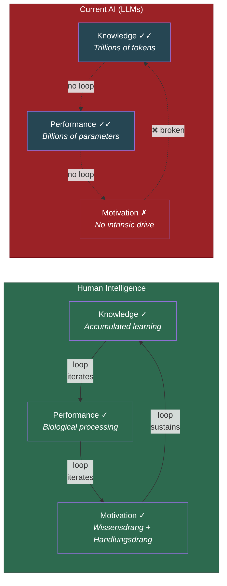

# The AI Diagnostic: What Machines Are Missing

**Current AI systems possess vast Knowledge and high Performance but no intrinsic Motivation — and the Recursive Intelligence Model predicts this absence prevents them from exhibiting the self-directed development that characterizes human intelligence.**

The [Recursive Intelligence Model](../intelligence/overview.md) provides a diagnostic framework for understanding why AI systems, despite extraordinary task performance, do not develop intelligence in the sense the model defines it. The diagnosis is structural, not philosophical: when one of three constitutive components is missing, the [recursive loop](../intelligence/recursive-loop.md) cannot self-sustain.

## The K-P-M Profile of Current AI

Large language models offer a natural test case. Evaluated against the [three components](../intelligence/three-components.md), their profile is lopsided:

- **Knowledge: Vast.** Trained on trillions of tokens, LLMs have access to a far larger store of factual and even [operational knowledge](../intelligence/operational-knowledge.md) than any individual human. They can articulate learning strategies, explain reasoning heuristics, and synthesize information across domains.
- **Performance: High.** Billions of parameters and massive computational resources give LLMs processing capabilities that exceed human working memory in many respects. Reasoning models (OpenAI's o1 and o3 series) solve competition-level mathematics and graduate-level science problems.
- **Motivation: Absent.** LLMs have no intrinsic drive to learn, no curiosity, no goals of their own. Between queries, they do nothing. They do not seek out new information. They do not practice skills. They do not wonder about problems.

This is not an accidental limitation. It is the predicted failure mode of a system missing a constitutive component of intelligence.

## The Predicted Failure Mode

The recursive model predicts that without Motivation, the loop cannot self-sustain. Knowledge and Performance do not compound without an endogenous drive to iterate. And this is exactly what is observed: LLMs do not improve themselves between training runs. They do not independently seek out areas of ignorance and address them. They do not show progressive intellectual development over time. Their capabilities are entirely determined by their training, with no endogenous drive to extend them.

The most recent reasoning models sharpen the point. The o1/o3 series achieves performance on mathematical competition problems that would have been considered impossible just two years prior. Yet these systems exhibit the precise failure mode the recursive model predicts: extraordinary outputs on demand, but no self-sustaining developmental trajectory. They require external scaffolding — prompts, reinforcement learning from human feedback, reward signals — that functions as a surrogate for the absent Motivation component. Scaling Knowledge and Performance to extraordinary levels produces extraordinary tools, not self-developing agents.

## The Surrogate Motivation Objection

One might object that LLMs simply are not designed to self-improve. But this objection concedes the point: designing a system that self-improves requires engineering a functional analogue of Motivation — an endogenous drive to identify gaps in knowledge, seek out relevant information, and invest processing resources in learning. Until AI systems have this, they will remain tools that are used rather than agents that develop. The recursive model specifies what is missing; the [engineering specification](../ai-consciousness/engineering-specification.md) derived from the [Four-Model Theory](../core-architecture/four-model-theory.md) specifies what would be needed to provide it.

## Figure

*In humans, all three components are present and the recursive loop self-sustains. In current AI, Knowledge and Performance are present — often exceeding human levels — but the absence of Motivation breaks the loop. No iteration, no development.*

## Key Takeaway

The recursive model does not diagnose AI as "not intelligent enough." It diagnoses AI as missing a constitutive component — Motivation — without which the recursive loop that defines intelligence cannot iterate. The problem is not quantity (more data, more parameters) but architecture (no endogenous drive).

## See Also

- [The Three Components: Knowledge, Performance, Motivation](../intelligence/three-components.md)
- [The Recursive Loop](../intelligence/recursive-loop.md)
- [The Path to AGI Runs Through Motivation](../ai-consciousness/path-through-motivation.md)
- [Engineering Specification for Artificial Consciousness](../ai-consciousness/engineering-specification.md)
- [Why LLMs Are Not Conscious (Under FMT)](../ai-consciousness/llms-not-conscious.md)
