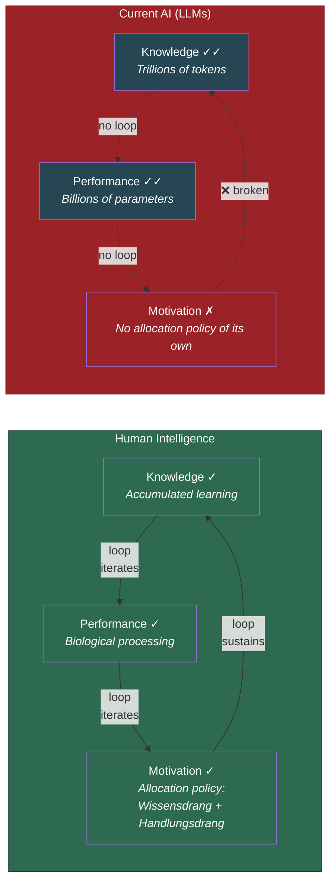

# The AI Diagnostic: What Machines Are Missing

**Deployed language models possess vast Knowledge and high Performance but no allocation policy of their own — and the Recursive Intelligence Model predicts that without one the loop does not produce the self-directed development that characterizes human intelligence.**

The [Recursive Intelligence Model](../intelligence/overview.md) provides a diagnostic framework for understanding why AI systems, despite extraordinary task performance, do not develop intelligence in the sense the model defines it. In RIM, Performance is a capacity, Knowledge is stored content, and Motivation is the policy that allocates the loop's time. A system can have the first two at superhuman levels and still have nothing deciding how much of the [recursive loop](../intelligence/recursive-loop.md) runs, on what, and for how long.

## The K-P-M Profile of Current AI

Large language models offer a natural test case. Evaluated against the [three constituents](../intelligence/three-components.md), their profile is lopsided:

- **Knowledge: Vast.** Trained on trillions of tokens, LLMs have access to a far larger store of factual and even [operational knowledge](../intelligence/operational-knowledge.md) than any individual human. They can articulate learning strategies, explain reasoning heuristics, and synthesize information across domains.
- **Performance: High.** Billions of parameters and massive computational resources give LLMs processing capabilities that exceed human working memory in many respects. Reasoning models (OpenAI's o1 and o3 series) solve competition-level mathematics and graduate-level science problems.
- **Motivation: Absent in deployed systems.** Deployed LLMs allocate nothing on their own: no curiosity, no self-directed learning, no drive to close gaps in their own understanding. Between queries, they do nothing. They do not seek out new information, practise skills, or return to a problem left unresolved.

The claim is narrower than "machines have no motivation". Artificial motivation has been engineered: curiosity rewards for improvement in the agent's own world model (Schmidhuber, 1991), intrinsic reward from prediction error that drives exploration with no external reward at all (Pathak et al., 2017), and epistemic value built into the objective in active inference (Friston et al., 2015). The gap is that the systems in which Knowledge and Performance have been scaled to superhuman levels are not the systems in which motivation has been engineered.

## The Predicted Failure Mode

The recursive model predicts that a system without the Motivation constituent does not sustain the loop, whatever its levels of Knowledge and Performance. Deployed language models fit this: they do not improve themselves between training runs, do not independently seek out areas of ignorance and address them, and do not show progressive intellectual development over time. Whatever adaptation occurs within a context does not carry beyond it.

On its own this observation is weak. A purely architectural account predicts it equally well: these systems have no persistent state between sessions, so nothing could accumulate even if something were driving it. The model's content is in a conditional. Give an agent persistent state and the capacity to modify itself, supply an intrinsic drive of the kind listed above, and the model predicts it will explore and improve on the distribution it explores — but that performance on held-out domains will saturate rather than compound. Open-ended compounding across domains would refute the prediction and show the Motivation constituent contributing less than RIM claims. The experiment is buildable now.

The reasoning models (the o1/o3 series) sharpen the point. They solve competition-level problems when prompted but do not seek out problems or direct their own learning, and they require external scaffolding — prompts, reinforcement learning from human feedback, reward signals — that functions as a surrogate for the absent Motivation constituent. Scaling Knowledge and Performance produces extraordinary outputs on demand, not a self-sustaining developmental trajectory.

## The Surrogate Motivation Objection

One might object that LLMs simply are not designed to self-improve. The objection concedes the point: a self-developing system needs something that allocates its processing to identifying gaps in its knowledge, seeking out relevant information, and learning — and, by the prediction above, an exploration drive alone is not yet that. What an architecture must be like for such a policy to be present is a separate question. The author's conjecture, from the [Four-Model Theory](../core-architecture/four-model-theory.md) and its [engineering specification](../ai-consciousness/engineering-specification.md), is that motivation of the kind the loop needs is not economically supplied as a module bolted onto a system without an explicit self-model; RIM's predictions do not depend on that conjecture.

## Figure

```mermaid
graph LR
    subgraph Human["Human Intelligence"]
        direction TB
        HK["Knowledge ✓<br/><i>Accumulated learning</i>"]
        HP["Performance ✓<br/><i>Biological processing</i>"]
        HM["Motivation ✓<br/><i>Allocation policy:<br/>Wissensdrang + Handlungsdrang</i>"]
    end

    subgraph AI["Current AI (LLMs)"]
        direction TB
        AK["Knowledge ✓✓<br/><i>Trillions of tokens</i>"]
        AP["Performance ✓✓<br/><i>Billions of parameters</i>"]
        AM["Motivation ✗<br/><i>No allocation policy of its own</i>"]
    end

    HK -->|"loop<br/>iterates"| HP
    HP -->|"loop<br/>iterates"| HM
    HM -->|"loop<br/>sustains"| HK

    AK -.->|"no loop"| AP
    AP -.->|"no loop"| AM
    AM -.->|"❌ broken"| AK

    style Human fill:#2d6a4f,color:#fff,stroke:#1b4332
    style AI fill:#9b2226,color:#fff,stroke:#6a040f
    style HK fill:#2d6a4f,color:#fff
    style HP fill:#2d6a4f,color:#fff
    style HM fill:#2d6a4f,color:#fff
    style AK fill:#264653,color:#fff
    style AP fill:#264653,color:#fff
    style AM fill:#9b2226,color:#fff
```

*In humans, all three constituents are present and the recursive loop self-sustains. In deployed language models, Knowledge and Performance are present — often exceeding human levels — but nothing allocates the loop's time, so the loop does not iterate on its own.*

## Key Takeaway

The recursive model does not diagnose AI as "not intelligent enough." It diagnoses deployed systems as lacking the allocation policy that decides how much of the loop runs, on what, and for how long — something more data and more parameters do not supply, because scaling the capacity and the store does not produce a schedule. Its testable claim is narrower still: supplying an exploration drive to a self-modifying system with persistent state will not, by itself, produce open-ended compounding across domains.

## See Also

- [Three Components, Three Kinds: Knowledge, Performance, Motivation](../intelligence/three-components.md)
- [The Recursive Loop](../intelligence/recursive-loop.md)
- [The Path to AGI Runs Through Motivation](../ai-consciousness/path-through-motivation.md)
- [Engineering Specification for Artificial Consciousness](../ai-consciousness/engineering-specification.md)
- [Why LLMs Are Not Conscious (Under FMT)](../ai-consciousness/llms-not-conscious.md)
