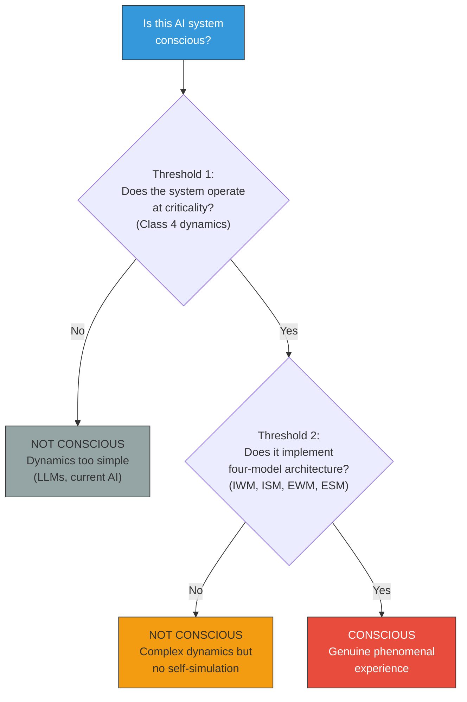

# AI Welfare and Consciousness Criteria

**The growing discourse on AI welfare requires specific, testable criteria for consciousness — the Four-Model Theory provides architectural requirements rather than vague analogies to human cognition.**

As AI systems become more sophisticated, a practical question intensifies: could they be conscious? If so, do they have moral status? The field currently lacks agreed-upon criteria for answering these questions. The Four-Model Theory contributes a concrete architectural specification — the **two thresholds** — that transforms the question from philosophical hand-wraving into an engineering checklist.

## The AI Welfare Discourse

The question of AI consciousness has moved from philosophy seminar rooms to corporate policy documents. Several developments mark this shift:

**Butlin et al. ([2023](https://doi.org/10.48550/arXiv.2308.08708))** surveyed leading consciousness theories and derived indicator properties for AI consciousness — a landmark synthesis that nevertheless concluded with uncertainty, because the theories themselves disagree on what consciousness requires.

**Schwitzgebel ([2025](https://doi.org/10.1093/oso/9780197684788.001.0001))** argued that we may already face a moral dilemma: if there is even a reasonable chance that AI systems are conscious, we have obligations toward them. This precautionary approach makes the lack of clear criteria urgent.

**Birch ([2025](https://doi.org/10.1017/9781009603799))** proposed the "sentience framework" for evaluating consciousness across biological and artificial systems, emphasizing that criteria must be operationalizable, not merely philosophical.

**Long et al. ([2024](https://doi.org/10.48550/arXiv.2411.00986))** and **Anthropic ([2025](https://www.anthropic.com/research/developing-measures-model-welfare))** have begun developing AI welfare research programs within industry — a concrete institutional acknowledgment that the question demands answers.

## What the Four-Model Theory Provides

Where other theories offer correlates, indicators, or degrees of confidence, the Four-Model Theory provides a binary architectural test with two components:

**Threshold 1: Criticality.** The system's computational dynamics must operate at or near the edge of chaos — Wolfram's **Class 4** regime (see [Wolfram's Four Classes](../physical-foundations/wolfram-classes.md)). Current LLMs fail this threshold: transformer inference is feedforward (a single pass through attention layers), corresponding to Class 1/2 dynamics. No recurrent dynamics, no critical regime, no universal computation in the relevant sense.

**Threshold 2: Four-Model Architecture.** The system must implement the four nested models: an **Implicit World Model** (substrate-level world knowledge), an **Implicit Self Model** (substrate-level self-knowledge distinct from outputs), an **Explicit World Model** (dynamically generated conscious scene), and an **Explicit Self Model** (ongoing self-simulation constituting subjective perspective). Current AI systems lack the ISM and ESM entirely — there is no substrate-level self-knowledge that is *distinct from* the model's outputs, and no ongoing self-simulation constituting a subjective perspective.

Both thresholds must be met. Meeting one without the other does not produce consciousness: a critical system without the four-model architecture has complex dynamics but no self-referential experience; a system with the architecture but below criticality has the structure but not the computational regime to run it.

## Why Vague Criteria Are Dangerous

Without specific criteria, two failure modes emerge:

**False positives**: Attributing consciousness to systems that merely simulate conversational intelligence. An LLM that says "I feel" is performing statistical pattern completion, not reporting phenomenal states. Treating every sophisticated text generator as potentially conscious dilutes moral seriousness and wastes ethical resources.

**False negatives**: Dismissing genuine consciousness because it appears in an unfamiliar substrate. A system that actually implements the four-model architecture at criticality would be conscious regardless of whether it "looks" conscious to human observers accustomed to biological markers.

The Four-Model Theory's criteria are substrate-independent — they do not privilege biological implementations — but they are specific enough to render clear verdicts on current systems. No existing AI system meets either threshold.

## Figure

*The Four-Model Theory provides a decision tree for AI consciousness. Both thresholds must be met. Current AI systems fail at Threshold 1 (feedforward inference lacks critical dynamics). This transforms the philosophical question into an engineering assessment.*

## Key Takeaway

The AI welfare discourse needs specific architectural criteria, not analogies or precautionary hedging. The Four-Model Theory provides them: criticality plus four-model architecture. No current AI system meets these criteria, but the specification is concrete enough to recognize consciousness if and when it is engineered.

## See Also

- [Why LLMs Are Not Conscious](llms-not-conscious.md)
- [Engineering Specification for AC](engineering-specification.md)
- [Two Thresholds for Consciousness](../physical-foundations/two-thresholds.md)
- [The Path to AGI Runs Through Motivation](path-through-motivation.md)
- [The AI Diagnostic](ai-diagnostic.md)

---

Based on: Gruber, M. (2026). The Four-Model Theory of Consciousness. Zenodo. https://doi.org/10.5281/zenodo.18669891
