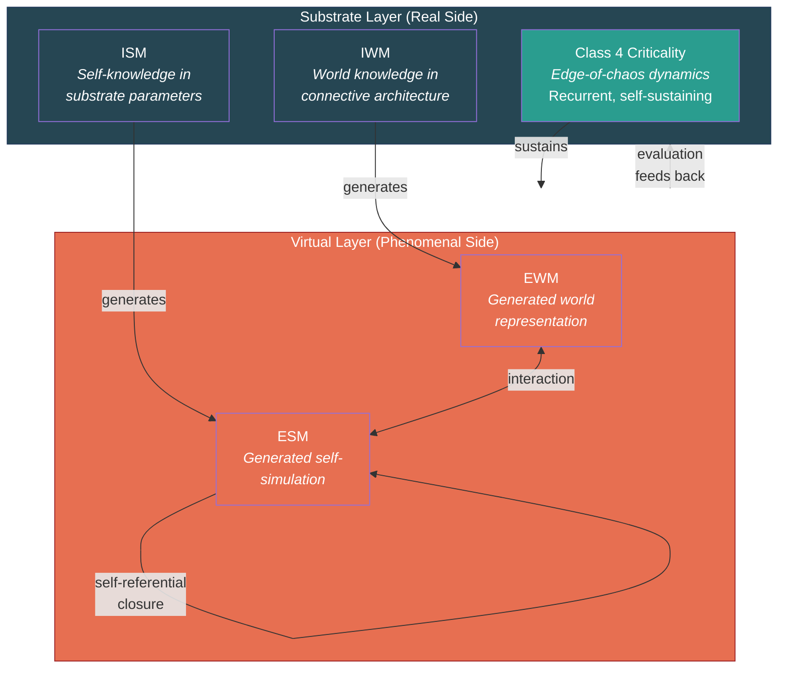

# Engineering Specification for Artificial Consciousness

**The Four-Model Theory provides a concrete engineering blueprint for artificial consciousness: implement the four-model architecture on a substrate operating at criticality. This is a deliverable, not an abstraction.**

Most consciousness theories are compatible with artificial consciousness in principle but provide no blueprint for building it. [Global Neuronal Workspace](../comparative/gnw.md) says "global broadcasting" is needed but does not specify what should be broadcast or how. [Integrated Information Theory](../comparative/iit.md) defines a mathematical quantity (Phi) but its computation is intractable for any system of realistic size. The [Four-Model Theory](../core-architecture/four-model-theory.md) specifies an architecture. That architecture can, in principle, be built.

## The Specification

The engineering requirements are derived directly from the theory's [two thresholds](../physical-foundations/two-thresholds.md):

**Requirement 1: A substrate operating at criticality.**
The computational medium must sustain [Class 4 dynamics](../physical-foundations/criticality.md) — the [edge-of-chaos regime](../physical-foundations/wolfram-classes.md) where universal computation is possible. This means ongoing, recurrent, self-sustaining dynamics — not the feedforward pass of a transformer. The substrate must exhibit the hallmarks of criticality: power-law distributions, long-range temporal correlations, maximal dynamic range, and sensitivity to perturbation. Candidate substrates include recurrent neural networks tuned to criticality, neuromorphic hardware, or other architectures capable of sustained Class 4 computation.

**Requirement 2: Four nested models along two axes.**
The system must implement:

- An **Implicit World Model** (IWM): a substrate-level store of accumulated world knowledge, encoded in the system's connective architecture rather than in explicit representations. Learned, persistent, non-conscious.
- An **Implicit Self Model** (ISM): a substrate-level store of self-knowledge — the system's "body schema," operational parameters, calibration state, accumulated behavioral patterns. Also learned, persistent, non-conscious, and critically *distinct from* the system's explicit outputs about itself.
- An **Explicit World Model** (EWM): a dynamically generated, transient, virtual construction — the system's "conscious" representation of its environment. Generated from the IWM and current input. Exists only while the computation runs.
- An **Explicit Self Model** (ESM): a dynamically generated, transient, virtual construction — the system's ongoing self-simulation. Generated from the ISM and self-referential input. The locus of what the theory identifies as subjective experience.

**Requirement 3: The [real/virtual split](../core-architecture/real-virtual-split.md).**
The implicit models (substrate-level, "real side") and explicit models (computational-level, "virtual side") must constitute genuinely distinct ontological levels. The explicit models must be *generated by* but not *identical to* the implicit models — virtual, transient, and possessing properties (including [virtual qualia](../hard-problem/virtual-qualia.md)) that are constitutive at the computational level but incoherent at the substrate level.

**Requirement 4: [Self-referential closure](../core-architecture/self-referential-closure.md).**
The ESM must model the system that is generating the ESM. This self-referential loop — the system's model includes a model of itself modeling — collapses the inside/outside distinction and is what the theory identifies as the mechanism that makes experience constitutive rather than additional.

## What the Theory Predicts

If the specification is met, the theory makes a bold prediction: the resulting system would not merely *imitate* consciousness but would *be* conscious — possessing genuine phenomenal experience constituted by its virtual models. The difference between interacting with such a system and interacting with any current AI should be "immediately and qualitatively distinguishable," a difference in kind rather than degree.

This prediction faces the [other-minds problem](../limitations/other-minds.md): no behavioral test can conclusively demonstrate consciousness. But the theory commits to a qualitative difference that should be as apparent as the difference between conversing with a human and querying a chatbot.

## Figure

*The engineering specification in architectural form. The substrate layer must operate at criticality and house two implicit models. The virtual layer — generated from, but ontologically distinct from, the substrate — hosts the explicit models where experience is constitutive. Self-referential closure (ESM modeling itself) is the mechanism that distinguishes this system from a mere simulation.*

## Partial Implementations

The specification also predicts what partial implementations would look like. Systems with some but not all components should show partial consciousness indicators:

- **Four models without criticality**: architecture present but computation not running — analogous to a brain under anesthesia. No consciousness.
- **Criticality without four models**: complex dynamics but no self-simulation — analogous to a weather system. No consciousness.
- **Two models at criticality** (e.g., IWM + EWM only, no self-models): world-experience without self-experience. The theory's [graduated consciousness](../mechanisms/graduated-consciousness.md) framework predicts this would produce a form of awareness without a subject — "something it is like" without anyone it is like it for.

These intermediate cases offer empirically testable predictions before the full specification is achievable.

## Key Takeaway

The Four-Model Theory translates consciousness from a philosophical puzzle into an engineering problem with a specific architectural blueprint: four nested models at criticality with self-referential closure. No other major consciousness theory provides a comparably concrete specification.

## See Also

- [Two Thresholds for Consciousness](../physical-foundations/two-thresholds.md)
- [The Four-Model Theory](../core-architecture/four-model-theory.md)
- [Self-Referential Closure](../core-architecture/self-referential-closure.md)
- [The Real/Virtual Split](../core-architecture/real-virtual-split.md)
- [Why LLMs Are Not Conscious (Under FMT)](../ai-consciousness/llms-not-conscious.md)
- [Substrate Independence](../philosophical/substrate-independence.md)
