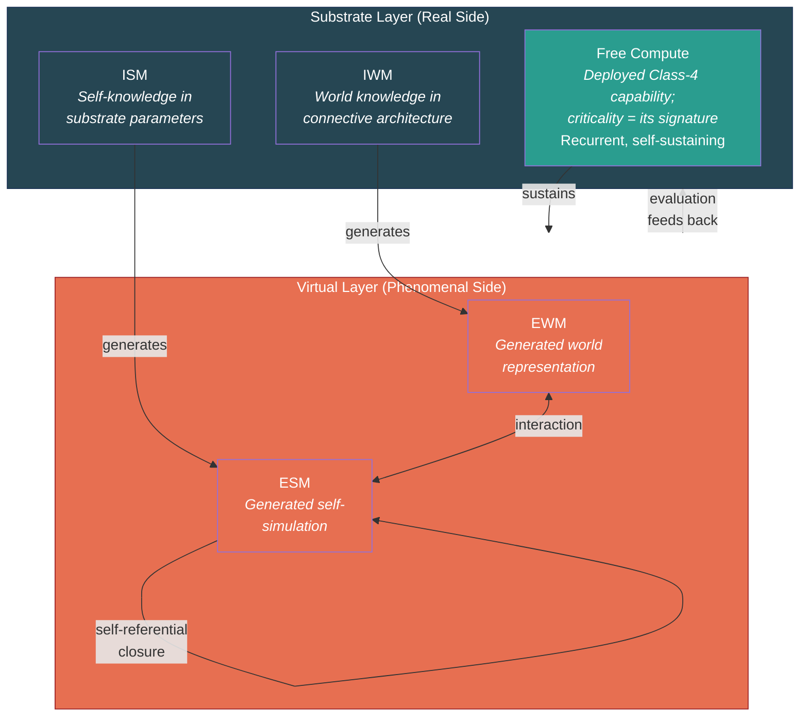

# Engineering Specification for Artificial Consciousness

**The Four-Model Theory states what consciousness *is* in architectural terms — so it doubles as a concrete specification for building one: implement the four-model architecture on a substrate with *free compute*. Building such a system is a downstream *implication* of the theory, not the theory itself — and at scale it remains an unrealized engineering problem.**

Implementation blueprints now exist for other accounts as well: S3Q specifies a five-layer pipeline built on a world model, internal simulation and prediction–observation coherence ([Grinberg et al., 2026](https://doi.org/10.48550/arXiv.2609.30743)), and CTM-AI and ReCoN-Ipsundrum are two more. S3Q derives a basic self from action–outcome linking rather than positing a separate explicit self-model, and it requires neither self-referential closure nor a Class 4 regime. Those three requirements — an explicit self-model, self-referential closure and the Class 4 regime — are what the [Four-Model Theory](../core-architecture/four-model-theory.md) adds. [Integrated Information Theory](../comparative/vs-iit.md), by contrast, defines a mathematical quantity (Phi) whose computation is intractable for any system of realistic size.

FMT is first a theory of what consciousness *is*, not a build manual; that it is architectural enough to *read* as a blueprint does not make consciousness a solved engineering task. No full-scale system has been built, and a scaffolded agent loop with external memory — however sophisticated — is *architectural mimicry*, not the self-referential closure the theory requires. What follows is the specification such a system would have to meet, together with the component mechanisms that can be probed in silico long before any whole is attempted.

## The Specification

The engineering requirements are derived directly from the theory's [two thresholds](../physical-foundations/two-thresholds.md):

**Requirement 1: A substrate with free compute.**
The computational medium must be capable of [Class 4](../physical-foundations/wolfram-classes.md) (universal) computation and *actually deploy* it on ongoing self-referential modeling — [free compute](../physical-foundations/criticality.md), not the single feedforward pass of a transformer. In neural tissue the signature of this regime is near-criticality — power-law avalanches, long-range temporal correlations, a branching ratio near one — which is how the requirement is *measured* in brains, not a separate box to tick. Across substrates those statistics need not co-occur, so the requirement is stated as Class 4 capability rather than proximity to any single criticality measure. Candidate substrates include recurrent networks that sustain self-referential computation, neuromorphic hardware, or other architectures capable of continuous Class 4 dynamics.

**Requirement 2: Four nested models along two axes.**
The system must implement:

- An **Implicit World Model** (IWM): a substrate-level store of accumulated world knowledge, encoded in the system's connective architecture rather than in explicit representations. Learned, persistent, non-conscious.
- An **Implicit Self Model** (ISM): a substrate-level store of self-knowledge — the system's "body schema," operational parameters, calibration state, accumulated behavioral patterns. Also learned, persistent, non-conscious, and critically *distinct from* the system's explicit outputs about itself.
- An **Explicit World Model** (EWM): a dynamically generated, transient, virtual construction — the system's "conscious" representation of its environment. Generated from the IWM and current input. Exists only while the computation runs.
- An **Explicit Self Model** (ESM): a dynamically generated, transient, virtual construction — the system's ongoing self-simulation. Generated from the ISM and self-referential input. The locus of what the theory identifies as subjective experience.

**Requirement 3: The [real/virtual split](../core-architecture/real-virtual-split.md).**
The implicit models (substrate-level, "real side") and explicit models (computational-level, "virtual side") must constitute genuinely distinct ontological levels. The explicit models must be *generated by* but not *identical to* the implicit models — virtual, transient, and possessing properties (including [virtual qualia](../hard-problem/virtual-qualia.md)) that are constitutive at the computational level but incoherent at the substrate level.

**Requirement 4: [Self-referential closure](../core-architecture/self-referential-closure.md).**
The ESM must model the system that is generating the ESM. This self-referential loop — the system's model includes a model of itself modeling — collapses the inside/outside distinction and is what the theory identifies as the mechanism that makes experience constitutive rather than additional.

## What the Theory Predicts

If the specification is met, the theory makes a bold prediction: the resulting system would not merely *imitate* consciousness but would *be* conscious — possessing genuine phenomenal experience constituted by its virtual models. The difference between interacting with such a system and interacting with any current AI should be qualitatively obvious. Imitation is possible in principle; sustaining it without the architecture carries a cost no current system pays.

This prediction faces the [other-minds problem](../limitations/other-minds.md): no behavioral test can conclusively demonstrate consciousness. The difference the theory asserts is architectural rather than impressionistic: closure, persistence and computational regime are properties measurable on the system itself, not qualities a user is asked to sense in the interaction.

## Figure

```mermaid
graph TB
    subgraph substrate["Substrate Layer (Real Side)"]
        direction LR
        CRIT["Free Compute<br/><i>Deployed Class-4 capability;<br/>criticality = its signature</i><br/>Recurrent, self-sustaining"]
        IWM["IWM<br/><i>World knowledge in<br/>connective architecture</i>"]
        ISM["ISM<br/><i>Self-knowledge in<br/>substrate parameters</i>"]
    end

    subgraph virtual["Virtual Layer (Phenomenal Side)"]
        direction LR
        EWM["EWM<br/><i>Generated world<br/>representation</i>"]
        ESM["ESM<br/><i>Generated self-<br/>simulation</i>"]
    end

    CRIT -->|"sustains"| virtual
    IWM -->|"generates"| EWM
    ISM -->|"generates"| ESM
    ESM -->|"self-referential<br/>closure"| ESM
    EWM <-->|"interaction"| ESM

    virtual -->|"evaluation<br/>feeds back"| substrate

    style substrate fill:#264653,color:#fff,stroke:#1d3557
    style virtual fill:#e76f51,color:#fff,stroke:#9b2226
    style CRIT fill:#2a9d8f,color:#fff
    style IWM fill:#264653,color:#fff
    style ISM fill:#264653,color:#fff
    style EWM fill:#e76f51,color:#fff
    style ESM fill:#e76f51,color:#fff
```

*The engineering specification in architectural form. The substrate layer must deploy free compute — of which near-criticality is the neural signature — and house two implicit models. The virtual layer — generated from, but ontologically distinct from, the substrate — hosts the explicit models where experience is constitutive. Self-referential closure (ESM modeling itself) is the mechanism that distinguishes this system from a mere simulation.*

## Partial Implementations

The specification also predicts what partial implementations would look like. Systems with some but not all components should show partial consciousness indicators:

- **Four models without free compute**: architecture present but the self-referential computation not running — analogous to a brain under anesthesia. No consciousness.
- **Free compute without four models**: universal computation deployed but no self-simulation — analogous to a weather system. No consciousness.
- **Two models with free compute** (e.g., IWM + EWM only, no self-models): world-modeling without self-modeling. Four is the theory's minimum, so this falls short of consciousness; the prediction is partial consciousness indicators, detectable through behavioral signatures and computational complexity measures.

These intermediate cases offer empirically testable predictions before the full specification is achievable.

## Key Takeaway

Because the Four-Model Theory specifies what consciousness *is* in architectural terms, it also yields a concrete blueprint: four nested models on a substrate with free compute, closed by self-referential modeling. Other accounts now have blueprints too; what FMT adds is an explicit self-model, self-referential closure and the Class 4 regime. Building one remains a downstream implication, not a claim that consciousness has been reduced to an engineering deliverable.

## See Also

- [Two Thresholds for Consciousness](../physical-foundations/two-thresholds.md)
- [The Four-Model Theory](../core-architecture/four-model-theory.md)
- [Self-Referential Closure](../core-architecture/self-referential-closure.md)
- [The Real/Virtual Split](../core-architecture/real-virtual-split.md)
- [Why LLMs Are Not Conscious (Under FMT)](../ai-consciousness/llms-not-conscious.md)
- [Substrate Independence](../philosophical/substrate-independence.md)
