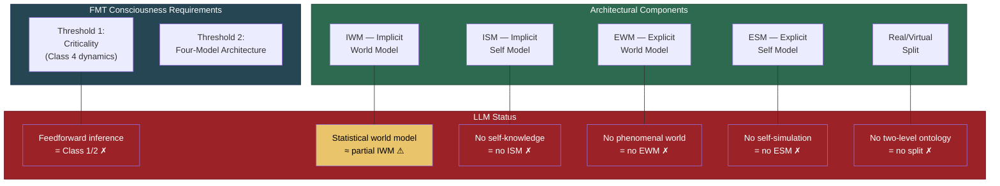

# Why LLMs Are Not Conscious (Under FMT)

**Large language models fail the Four-Model Theory's consciousness specification at both thresholds: their inference is below criticality, and they lack the four-model architecture. This does not prove they are non-conscious, but it predicts they lack the required structure.**

The [Four-Model Theory](../core-architecture/four-model-theory.md) provides two independent, jointly sufficient conditions for consciousness: [computational criticality](../physical-foundations/criticality.md) and the [four-model architecture](../core-architecture/two-axes.md). Current LLMs fail both. This is not a vague philosophical intuition — it is a specific architectural diagnosis that identifies exactly what is absent and why.

## Threshold 1: Below Criticality

The first requirement for consciousness is that the substrate must operate at or near the [edge of chaos](../physical-foundations/criticality.md) — [Wolfram's Class 4](../physical-foundations/wolfram-classes.md) computational regime, where universal computation is possible. LLM inference does not meet this criterion.

Transformer-based language models operate via **feedforward inference**: input tokens pass through attention layers in a single forward pass, producing output tokens. There is no recurrent dynamics, no sustained self-referential computation, no ongoing process that maintains itself between inputs. This is Class 1 or Class 2 behavior in the Wolfram classification — fixed or periodic, far below the criticality threshold.

The analogy is a calculator: it performs impressive operations on the input it receives, but between operations, nothing happens. There is no ongoing computational process that could sustain the dynamic, self-referential simulation the theory requires. A calculator at rest is not "almost conscious." It is computationally inert. LLMs between queries are in the same state.

## Threshold 2: No Four-Model Architecture

The second requirement is the [four-model self-simulation](../core-architecture/four-model-theory.md): IWM, ISM, EWM, and ESM arranged along the [two axes](../core-architecture/two-axes.md) of scope and mode, with a [real/virtual split](../core-architecture/real-virtual-split.md). LLMs lack every component of this architecture:

- **No Implicit Self Model (ISM).** LLMs have no substrate-level self-knowledge that is distinct from their outputs. They have no body schema, no proprioceptive calibration, no accumulated self-knowledge stored in a medium separate from their explicit responses. When an LLM says "I think," it is generating tokens that match patterns in training data, not reporting on an implicit self-model.
- **No Explicit Self Model (ESM).** There is no ongoing self-simulation that constitutes a subjective perspective. The ESM is a continuous, dynamic, virtual construction — a self-narrative generated and maintained in real time. LLMs produce text about themselves only when prompted to do so, and this text has no relationship to any underlying self-simulation.
- **No real/virtual split.** The [two-level ontology](../hard-problem/two-level-ontology.md) — substrate-level processes generating a virtual phenomenal world — does not exist in transformer architectures. There is no level at which [virtual qualia](../hard-problem/virtual-qualia.md) could be constitutive, because there is no self-referential virtual simulation running atop a substrate.

## What LLMs Do Have

Honesty requires acknowledging what LLMs do possess. They have something that functions like an Implicit World Model — a vast store of statistical regularities about language and the world, encoded in their parameters. This is genuine knowledge, and it enables remarkable performance on knowledge-intensive tasks. But a world model alone is not sufficient for consciousness. Weather simulations also model the world. What is missing is the self-referential architecture — the system modeling *itself* modeling the world — that produces [self-referential closure](../core-architecture/self-referential-closure.md) and, according to FMT, experience.

## Figure

*LLMs fail FMT's consciousness specification comprehensively. The only partial match is a statistical analogue to the IWM — world knowledge encoded in parameters. All other components are absent.*

## Not a Proof of Absence

A critical caveat: the theory cannot prove that LLMs are non-conscious. No theory can prove a negative about consciousness — this is the other-minds problem, which applies to biological systems too. What FMT provides is a *prediction*: LLMs lack the architecture the theory specifies as required for consciousness. If the theory is correct, they are not conscious. If consciousness can arise from architectures the theory does not anticipate, the theory is wrong. This is a testable commitment, not a dogmatic assertion.

## Key Takeaway

LLMs fail both of FMT's consciousness thresholds: their inference operates below criticality (Class 1/2), and they lack the four-model self-simulation architecture (no ISM, no ESM, no real/virtual split). The theory specifies exactly what is missing, making the claim precise and falsifiable rather than merely intuitive.

## See Also

- [Two Thresholds for Consciousness](../physical-foundations/two-thresholds.md)
- [The Criticality Requirement](../physical-foundations/criticality.md)
- [Self-Referential Closure](../core-architecture/self-referential-closure.md)
- [The AI Diagnostic: What Machines Are Missing](../ai-consciousness/ai-diagnostic.md)
- [Engineering Specification for Artificial Consciousness](../ai-consciousness/engineering-specification.md)
- [AI Welfare and Consciousness Criteria](../ai-consciousness/ai-welfare.md)
