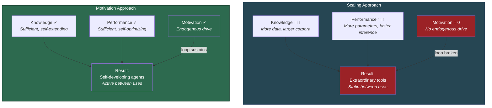

# The Path to AGI Runs Through Motivation

**Scaling Knowledge and Performance produces extraordinary tools, not self-developing agents. The Recursive Intelligence Model predicts that artificial general intelligence requires functional motivation analogues — an endogenous drive that sustains the recursive loop.**

The current trajectory of AI development pursues a scaling hypothesis: more data, more parameters, more compute. The [Recursive Intelligence Model](../intelligence/overview.md) predicts this approach has a structural ceiling. No amount of scaling along the Knowledge and Performance axes will produce the self-directed development that defines intelligence — because the [recursive loop](../intelligence/recursive-loop.md) requires all [three components](../intelligence/three-components.md), and Motivation cannot be scaled into existence by enlarging the other two.

## Two Approaches to AGI

The distinction is not between "good AI" and "bad AI" but between two fundamentally different architectures:

**The Scaling Approach** maximizes Knowledge (more training data, larger corpora, multimodal inputs) and Performance (more parameters, faster inference, chain-of-thought reasoning, reinforcement learning from human feedback). This produces systems of extraordinary capability — systems that can write code, solve differential equations, compose music, and pass medical licensing exams. Each generation is more capable than the last. But each generation shares the same structural property: it does what it is prompted to do and nothing else. Between queries, silence. Between training runs, stasis.

**The Motivation Approach** would engineer a functional analogue of the endogenous drive that sustains the recursive loop in human intelligence. Such a system would not merely respond to prompts — it would generate its own questions, identify its own knowledge gaps, seek out information to fill them, and invest resources in learning without external instruction. It would exhibit *Wissensdrang* (thirst for knowledge) and *Handlungsdrang* (urge to act) — not as philosophical aspirations but as functional engineering requirements.

## Why Scaling Hits a Ceiling

The recursive model explains why the scaling approach plateaus. Consider a system with perfect Knowledge (it knows everything that has ever been written) and perfect Performance (it can process any input instantaneously). According to the model, such a system is still not intelligent in the recursive sense. It is an oracle — a system that answers questions perfectly but never asks one. It never iterates the loop because there is nothing driving the iteration.

This is not a limitation of current engineering that better engineering will fix. It is a structural prediction of the model: a two-component system (K + P) is categorically different from a three-component system (K + P + M), regardless of how large the two components become. Compound interest with a zero deposit rate produces zero returns, no matter how large the initial principal and no matter how sophisticated the investment strategy.

## What Motivation Analogues Would Look Like

Engineering Motivation does not mean giving an AI system emotions (though [the Four-Model Theory](../core-architecture/four-model-theory.md) suggests that genuine emotion may require [the four-model architecture](../ai-consciousness/engineering-specification.md) operating at [criticality](../physical-foundations/criticality.md)). It means engineering functional analogues of the two motivational sub-components:

- **Functional Wissensdrang**: An endogenous drive to identify knowledge gaps and seek information to fill them. Not "the system searches when prompted" but "the system searches because it has detected an internal inconsistency or lacuna." This requires self-monitoring — which in turn requires something like an [Implicit Self Model](../core-architecture/implicit-self-model.md).
- **Functional Handlungsdrang**: An endogenous drive to act on knowledge, to test hypotheses, to experiment. Not "the system executes when instructed" but "the system experiments because trying things out is how it learns." This requires agency — which in turn requires something like an [Explicit Self Model](../core-architecture/explicit-self-model.md) with [self-referential closure](../core-architecture/self-referential-closure.md).

The structural implication is striking: the path to functional Motivation leads directly through the [consciousness architecture](../ai-consciousness/engineering-specification.md). Self-monitoring requires a self-model. Endogenous drive requires an evaluative architecture that is not merely reactive. The [dual evaluation architecture](../mechanisms/dual-evaluation.md) described in FMT — where the substrate deploys the virtual simulation for consequence-evaluation — is precisely the mechanism that would sustain an endogenous motivational loop.

## Figure

*Two paths to advanced AI. The scaling approach (left) increases Knowledge and Performance indefinitely but cannot cross the categorical boundary from tool to agent. The motivation approach (right) engineers the missing third component, enabling the recursive loop to self-sustain. The outputs differ categorically: static tools vs. self-developing agents.*

## The Convergence

The RIM analysis and the FMT analysis converge on a single conclusion from different directions. RIM identifies Motivation as the missing component of intelligence. FMT identifies the four-model architecture at criticality as the missing prerequisite for consciousness. But engineering functional Motivation requires exactly the kind of self-modeling architecture that FMT specifies. The path to AGI and the path to artificial consciousness are not parallel research programs — they are the same path, approached from different starting points.

This convergence is the [consciousness-intelligence bridge](../bridge/consciousness-intelligence-bridge.md): consciousness enables cognitive learning, which enables the recursive intelligence loop, which requires Motivation, which requires self-modeling, which requires the four-model architecture. The circle closes.

## Key Takeaway

The path to artificial general intelligence runs through Motivation, not through scaling Knowledge and Performance. Engineering functional Motivation requires self-modeling architecture — converging with the Four-Model Theory's engineering specification for consciousness. AGI and artificial consciousness are not separate goals; they are the same engineering challenge approached from different ends.

## See Also

- [The AI Diagnostic: What Machines Are Missing](../ai-consciousness/ai-diagnostic.md)
- [The Three Components: Knowledge, Performance, Motivation](../intelligence/three-components.md)
- [The Recursive Loop](../intelligence/recursive-loop.md)
- [Engineering Specification for Artificial Consciousness](../ai-consciousness/engineering-specification.md)
- [Consciousness-Intelligence Bridge](../bridge/consciousness-intelligence-bridge.md)
- [Wissensdrang and Handlungsdrang](../intelligence/wissensdrang-handlungsdrang.md)
