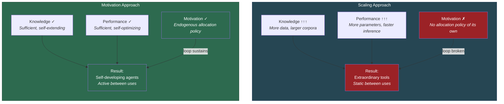

# The Path to AGI Runs Through Motivation

**Scaling Knowledge and Performance produces extraordinary tools, not self-developing agents. In the Recursive Intelligence Model, what the loop needs from Motivation is an allocation policy — something that decides how much of the loop runs, on what, and for how long — and enlarging a capacity and a store does not produce one.**

The current trajectory of AI development pursues a scaling hypothesis: more data, more parameters, more compute. In the [Recursive Intelligence Model](../intelligence/overview.md), Performance is a capacity, Knowledge is stored content, and Motivation is the policy that allocates the [recursive loop](../intelligence/recursive-loop.md)'s time. Scaling moves the first two. The author's expectation, stated in the RIM paper as a bet rather than a result, is that the route to artificial systems which develop themselves runs through the engineering of motivation rather than through further scaling of knowledge and performance. The bet is lost if such development appears in a system built by scaling alone.

## Two Approaches to AGI

The distinction is not between "good AI" and "bad AI" but between two fundamentally different architectures:

**The Scaling Approach** maximizes Knowledge (more training data, larger corpora, multimodal inputs) and Performance (more parameters, faster inference, chain-of-thought reasoning, reinforcement learning from human feedback). This produces systems of extraordinary capability — systems that can write code, solve differential equations, compose music, and pass medical licensing exams. Each generation is more capable than the last. But each generation shares the same structural property: it does what it is prompted to do and nothing else. Between queries, silence. Between training runs, stasis.

**The Motivation Approach** would engineer a functional analogue of the allocation policy that runs the recursive loop in human intelligence. Such a system would not merely respond to prompts — it would generate its own questions, identify its own knowledge gaps, seek out information to fill them, and allocate resources to learning without external instruction. It would show both expressions of the policy: *Wissensdrang* (thirst for knowledge — allocation toward understanding) and *Handlungsdrang* (urge to act — allocation toward action and exploration).

## Why Scaling Does Not Supply the Schedule

Consider a system with perfect Knowledge (it knows everything that has ever been written) and perfect Performance (it can process any input instantaneously). According to the model, such a system is still not intelligent in the recursive sense. It is an oracle — a system that answers questions perfectly but never asks one. It never iterates the loop because nothing allocates its time to iterating.

An observatory makes the difference visible. Its optics are a capacity: aperture and resolution bound what it can ever see. Its plate archive is accumulated content. The telescope-time schedule is neither — it decides which instrument points where, on which nights, for how long. Better optics and a larger archive do not produce a schedule, and **you cannot find the schedule by disassembling the instrument**, because it is not in the instrument.

The model's testable claim here is narrower than the bet. Engineered motivation already exists: curiosity rewards for improvement in an agent's own world model (Schmidhuber, 1991) and intrinsic reward from prediction error (Pathak et al., 2017) drive exploration with no external reward. RIM predicts that supplying such a drive to a system with persistent state and the capacity to modify itself will make it explore and improve on the distribution it explores, but will not, by itself, produce open-ended compounding across domains. If it does, the Motivation constituent contributes less than RIM claims. The experiment is buildable now.

## What Motivation Analogues Would Look Like

Engineering Motivation does not mean giving an AI system emotions (though [the Four-Model Theory](../core-architecture/four-model-theory.md) suggests that genuine emotion may require [the four-model architecture](../ai-consciousness/engineering-specification.md) operating in the Class 4 regime, whose neural signature is [criticality](../physical-foundations/criticality.md)). It means engineering functional analogues of the policy's two expressions:

- **Functional Wissensdrang**: An endogenous drive to identify knowledge gaps and seek information to fill them. Not "the system searches when prompted" but "the system searches because it has detected an internal inconsistency or lacuna." This requires self-monitoring — which, on the author's conjecture below, requires something like an [Implicit Self Model](../core-architecture/implicit-self-model.md).
- **Functional Handlungsdrang**: An endogenous drive to act on knowledge, to test hypotheses, to experiment. Not "the system executes when instructed" but "the system experiments because trying things out is how it learns." This requires agency — which, on the same conjecture, requires something like an [Explicit Self Model](../core-architecture/explicit-self-model.md) with [self-referential closure](../core-architecture/self-referential-closure.md).

The author's conjecture is that the path to functional Motivation leads through the [consciousness architecture](../ai-consciousness/engineering-specification.md). Self-monitoring requires a self-model. An endogenous policy requires an evaluative architecture that is not merely reactive. The [dual evaluation architecture](../mechanisms/dual-evaluation.md) described in FMT — where the substrate deploys the virtual simulation for consequence-evaluation — is the candidate mechanism for sustaining it. The conjecture is that motivation of the kind the loop needs is not economically supplied as a module bolted onto a system without a self-model: a bolt-on route is expected to pay a cost the self-model route does not, not to be impossible. RIM's predictions do not depend on this conjecture; if a system with no self-model sustains the loop, the conjecture is refuted and the recursive model is untouched.

## Figure

```mermaid
graph TB
    subgraph scaling["Scaling Approach"]
        direction TB
        SK["Knowledge ↑↑↑<br/><i>More data, larger corpora</i>"]
        SP["Performance ↑↑↑<br/><i>More parameters, faster inference</i>"]
        SM["Motivation ✗<br/><i>No allocation policy of its own</i>"]
        SR["Result:<br/>Extraordinary tools<br/><i>Static between uses</i>"]
    end

    subgraph motivation["Motivation Approach"]
        direction TB
        MK["Knowledge ✓<br/><i>Sufficient, self-extending</i>"]
        MP["Performance ✓<br/><i>Sufficient, self-optimizing</i>"]
        MM["Motivation ✓<br/><i>Endogenous allocation policy</i>"]
        MR["Result:<br/>Self-developing agents<br/><i>Active between uses</i>"]
    end

    SK --> SR
    SP --> SR
    SM -->|"loop broken"| SR

    MK --> MR
    MP --> MR
    MM -->|"loop sustains"| MR

    style scaling fill:#264653,color:#fff,stroke:#1d3557
    style motivation fill:#2d6a4f,color:#fff,stroke:#1b4332
    style SR fill:#9b2226,color:#fff
    style MR fill:#2d6a4f,color:#fff
    style SM fill:#9b2226,color:#fff
    style MM fill:#2d6a4f,color:#fff
```

*Two paths to advanced AI. The scaling approach (left) increases Knowledge and Performance indefinitely; nothing in it allocates the loop's time. The motivation approach (right) engineers an allocation policy, which the author expects to be what lets the recursive loop self-sustain: static tools vs. self-developing agents.*

## The Convergence

The RIM analysis and the FMT analysis point at the same place from different directions. RIM identifies Motivation as the loop's allocation policy, the constituent that scaling Knowledge and Performance does not supply. FMT identifies the four-model architecture in the Class 4 regime as the missing prerequisite for consciousness. On the author's conjecture, engineering functional Motivation calls for exactly the kind of self-modeling architecture that FMT specifies. If the conjecture holds, the path to AGI and the path to artificial consciousness are the same path, approached from different starting points.

This convergence is the [consciousness-intelligence bridge](../bridge/consciousness-intelligence-bridge.md): on FMT's account, consciousness enables cognitive learning, which enables the recursive intelligence loop, which needs an allocation policy, which on the conjecture calls for self-modeling, which requires the four-model architecture. The circle closes.

## Key Takeaway

The author expects the path to artificial general intelligence to run through Motivation, not through scaling Knowledge and Performance — a bet, not a result. RIM's testable claim is narrower: an exploration drive added to a self-modifying system will not by itself produce open-ended compounding across domains. The further conjecture that functional Motivation calls for self-modeling architecture links the bet to the Four-Model Theory's engineering specification for consciousness, making AGI and artificial consciousness one engineering challenge approached from different ends.

## See Also

- [The AI Diagnostic: What Machines Are Missing](../ai-consciousness/ai-diagnostic.md)
- [Three Components, Three Kinds: Knowledge, Performance, Motivation](../intelligence/three-components.md)
- [The Recursive Loop](../intelligence/recursive-loop.md)
- [Engineering Specification for Artificial Consciousness](../ai-consciousness/engineering-specification.md)
- [Consciousness-Intelligence Bridge](../bridge/consciousness-intelligence-bridge.md)
- [Wissensdrang and Handlungsdrang](../intelligence/wissensdrang-handlungsdrang.md)
