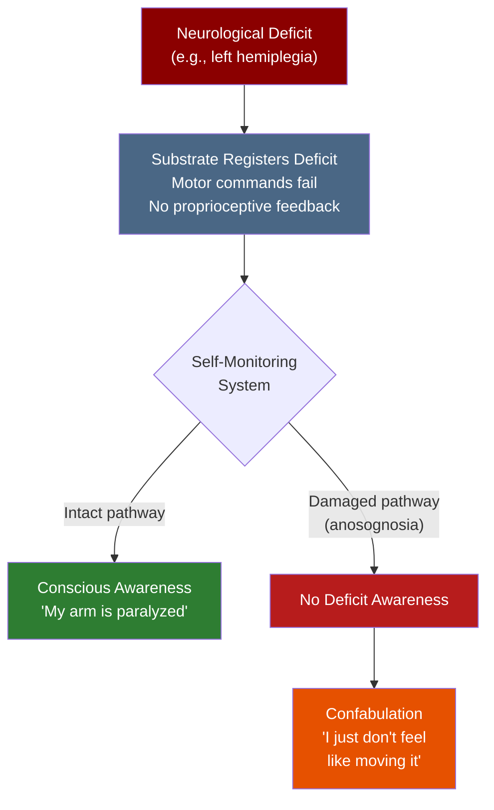

# Anosognosia

**Anosognosia is a neurological condition in which a patient is genuinely unaware of their own deficit -- not in denial, but neurologically incapable of recognizing it.**

The term was coined by Joseph Babinski in 1914 to describe stroke patients who sincerely denied their own paralysis. Unlike psychological denial, where a person knows the truth but refuses to accept it, anosognosia reflects a breakdown in the brain's ability to update its model of itself. The patient's conscious experience simply does not include the deficit. It is arguably the most unsettling demonstration that self-awareness is a construction, not a given.

## What It Looks Like

The classic presentation involves right-hemisphere stroke patients with left-sided paralysis (hemiplegia). When asked to move their paralyzed arm, they may respond "I don't feel like it right now" or "I already moved it." Some patients, when shown their own motionless limb, insist it belongs to someone else. These are not evasions -- neuropsychological testing consistently shows the patients believe what they are saying.

Anosognosia is not limited to motor deficits. **Anton's syndrome** is anosognosia for cortical blindness: the patient cannot see but does not know they cannot see, and will confabulate visual descriptions of their environment. Anosognosia has also been documented for aphasia (unawareness of language deficits), amnesia (unawareness of memory loss), and even hemianopia (unawareness of visual field loss).

The common thread is not the type of deficit but the failure of the brain's self-monitoring system to register it.

## Why It Matters for Understanding Consciousness

Anosognosia provides direct evidence that self-awareness depends on active neural processes, not passive observation. The brain does not have a transparent window into its own states. It constructs a model of itself, and that model can be wrong -- not slightly inaccurate, but missing entire categories of information.

This has three major implications. First, self-knowledge is not privileged: the brain can be catastrophically wrong about itself. Second, confabulation is the default mode of self-narrative -- when information is missing, the brain fills the gap with a plausible story rather than flagging an error. Third, the deficit must be represented somewhere in the nervous system (the body is still paralyzed, the motor system still fails) even though conscious awareness does not include it, establishing a dissociation between what the substrate processes and what reaches awareness.

## Confabulation: Filling the Gap

The confabulation seen in anosognosia is not a separate pathology but a window into normal cognitive function. Healthy brains confabulate constantly -- constructing post-hoc explanations for decisions, smoothing over gaps in perception, generating a coherent autobiographical narrative from fragmentary data. Anosognosia simply makes this process visible by creating a gap too large to paper over convincingly (at least to an outside observer -- the patient remains convinced).

Gazzaniga's "left hemisphere interpreter," first described in split-brain research, performs the same function: generating causal narratives from incomplete data. The difference is that in anosognosia, the missing data concerns the self.

## Figure

*In anosognosia, the deficit exists at the substrate level but the damaged self-monitoring pathway prevents it from reaching conscious awareness. The brain's narrative system confabulates an explanation for the unexplained gap.*

## Key Takeaway

Anosognosia demonstrates that self-awareness is an active neural construction, not a passive readout. When the construction process breaks down for a specific domain, the brain does not report an error -- it generates a plausible story instead, revealing that confabulation is the default mode of self-narrative.

## See Also

- [Anosognosia (FMT Account)](../phenomena/anosognosia.md)
- [Prediction 1: Psychedelic Alleviation of Anosognosia](../predictions/prediction-1-anosognosia.md)

*Based on: Gruber, M. (2026). The Four-Model Theory of Consciousness. Zenodo. [doi:10.5281/zenodo.19064950](https://doi.org/10.5281/zenodo.19064950)*
