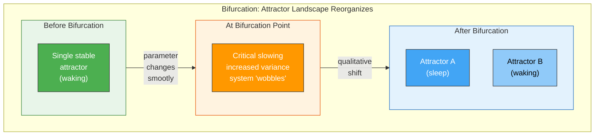

# Bifurcation and Dynamical Systems

**A bifurcation is a qualitative change in a dynamical system's behavior -- a tipping point where the system's possible long-term states suddenly restructure.**

Turn a faucet very slowly. For a while, the flow increases smoothly. Then, at some threshold, the stream abruptly breaks into drops. The system did not change gradually from stream to drops -- it snapped from one qualitative behavior to another. In the language of dynamical systems theory, it underwent a **bifurcation**: the set of stable states (attractors) reorganized, and the system jumped to a new one. Bifurcations are how continuous changes in a parameter produce discontinuous changes in behavior -- and they appear to govern some of the brain's most dramatic transitions, including the moment consciousness is lost.

## Attractors and Basins

A **dynamical system** is anything whose state evolves over time according to rules (differential equations, update functions, or physical laws). The state of the system at any moment is a point in **state space** -- an abstract space whose dimensions represent all the variables that describe the system. A pendulum's state space is two-dimensional (angle and velocity). A brain's state space has billions of dimensions.

An **attractor** is a state (or set of states) that the system tends toward over time. A marble rolling in a bowl settles at the bottom -- the bottom is the attractor. A **limit cycle** is a repeating loop the system traces -- like a heartbeat or a circadian rhythm. A **strange attractor** is a fractal structure the system orbits without ever exactly repeating -- characteristic of chaotic systems.

The **basin of attraction** is the region of state space from which the system will eventually reach a particular attractor. Think of it as the attractor's catchment area. If a landscape has two valleys separated by a ridge, each valley is an attractor and each valley's watershed is its basin. A system sitting on the ridge is at an unstable equilibrium -- the slightest push sends it into one valley or the other.

## What Bifurcation Does

A **bifurcation** occurs when a smooth change in a control parameter causes the attractor landscape to reorganize. Attractors can appear, disappear, split, merge, or change stability. The key feature is that the change is **qualitative**, not quantitative -- the system does not just move to a slightly different state; the entire repertoire of possible states changes.

Consider a ball balanced on the apex of a hill (one unstable attractor). As the hill slowly flattens, the ball stays put. But at a certain flatness, the apex becomes a valley floor and two new hills emerge on either side -- the single unstable attractor has bifurcated into one stable and two unstable attractors. The ball, which was precariously balanced, now sits comfortably in the new valley. A tiny parameter change at the bifurcation point produces a large qualitative shift.

## Relevance to Consciousness Transitions

Bifurcation dynamics are directly relevant to understanding how the brain transitions between states. The onset of sleep is not a gradual dimming of consciousness but a **bifurcation** -- a tipping point where the brain's dynamical landscape reorganizes. Recent work by Li et al. (2025) demonstrated this in over 1,000 participants: falling asleep exhibits **critical slowing** (increasing variance and autocorrelation) in the minutes before the transition, followed by an abrupt shift -- exactly the signature of a system approaching a bifurcation point. The brain does not fade smoothly from wakefulness to sleep. It tips.

The same framework applies to anesthetic induction, epileptic seizure onset, and the transitions between consciousness states described by the [variable permeability](../mechanisms/variable-permeability.md) mechanism. Each represents a bifurcation in the brain's dynamical landscape -- a reorganization of the attractor structure that governs moment-to-moment neural activity.

## Figure

*Before the bifurcation, the system has one stable state. As a control parameter changes, the system exhibits critical slowing -- then tips into a reorganized landscape with new attractors. Sleep onset, seizures, and anesthetic induction follow this pattern.*

## Key Takeaway

Bifurcations explain how smooth, continuous changes in a control parameter can produce sudden, qualitative shifts in a system's behavior. The brain's transitions between conscious states -- falling asleep, seizure onset, anesthetic induction -- are not gradual dimmings but bifurcations: tipping points where the dynamical landscape reorganizes.

## See Also

- [Criticality and the Edge of Chaos](../basics/criticality.md)
- [The Criticality Requirement](../physical-foundations/criticality.md)
- [Phase Transitions](../basics/phase-transitions.md)
- [Variable Permeability](../mechanisms/variable-permeability.md)

*Based on: Gruber, M. (2026). The Four-Model Theory of Consciousness. Zenodo. [doi:10.5281/zenodo.19064950](https://doi.org/10.5281/zenodo.19064950)*
