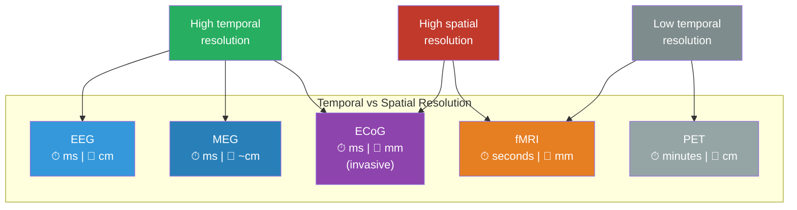

# EEG, fMRI, and Brain Imaging

**Brain imaging technologies let scientists observe the living brain in action, but each method involves a fundamental tradeoff: techniques that capture fast neural events blur spatial detail, while those that pinpoint location miss the millisecond dynamics.**

No single imaging method can see everything. Understanding how consciousness research draws its conclusions requires understanding what each tool actually measures -- and what it cannot.

## EEG: Fast but Blurry

**Electroencephalography (EEG)** records electrical activity from the scalp using an array of electrodes (typically 32-256). It measures voltage fluctuations caused by the synchronized firing of large populations of neurons, primarily in the cortex.

- **What it measures:** Postsynaptic potentials summed across millions of neurons. The signal must be spatially aligned (parallel dendrites in cortical columns) and temporally synchronized to be detectable at the scalp.
- **Temporal resolution:** Excellent -- millisecond precision. EEG can track neural events as they unfold, capturing the difference between a stimulus arriving at 100ms (feedforward) and recurrent processing kicking in at 200ms.
- **Spatial resolution:** Poor -- centimeter scale at best. Electrical signals spread through skull and scalp tissue, smearing the source. Telling whether a signal came from V1 or V2 is often impossible.
- **Key applications:** Event-related potentials (ERPs) like the P3b (a consciousness marker in Global Workspace theory), sleep staging, seizure detection, brain-computer interfaces.

The analogy: EEG is like listening to a stadium from the parking lot. You can tell *when* the crowd roars (millisecond timing), but not which section started it (spatial ambiguity).

## fMRI: Sharp but Slow

**Functional magnetic resonance imaging (fMRI)** detects changes in blood oxygenation across the brain. When neurons in a region become more active, they consume oxygen; the local blood supply compensates by delivering more oxygenated blood. fMRI detects this hemodynamic response, known as the **BOLD signal** (blood-oxygen-level-dependent contrast).

- **What it measures:** An indirect proxy for neural activity, mediated by blood flow. The BOLD signal peaks roughly 5-6 seconds after the neural event that caused it.
- **Temporal resolution:** Poor -- seconds, not milliseconds. The hemodynamic delay means fMRI cannot distinguish events separated by less than ~1-2 seconds.
- **Spatial resolution:** Excellent -- millimeter scale, down to submillimeter in high-field scanners (7T). Individual cortical layers can be resolved in specialized applications.
- **Key applications:** Mapping functional networks (including the DMN), localizing language and motor areas, studying resting-state connectivity.

The analogy: fMRI is like a thermal camera pointed at the stadium. You can see exactly *where* people are sitting (spatial precision), but the heat map updates so slowly that you cannot tell whether Section A cheered before or after Section B.

## Other Methods

**MEG (magnetoencephalography)** measures the magnetic fields produced by neural currents. It combines EEG-like temporal resolution with somewhat better spatial resolution, since magnetic fields are less distorted by the skull. The tradeoff: MEG systems cost millions and require magnetically shielded rooms.

**PET (positron emission tomography)** injects a radioactive tracer and maps its distribution. It can measure metabolic rate, neurotransmitter binding, and receptor density -- things neither EEG nor fMRI can access. Temporal resolution is measured in minutes, making it useless for tracking dynamic processes but valuable for baseline metabolic mapping.

**ECoG (electrocorticography)** places electrodes directly on the cortical surface (during neurosurgery). It combines excellent temporal resolution with good spatial resolution, but it is invasive and limited to clinical populations. Some of the most detailed data on recurrent processing comes from ECoG recordings.

**TMS (transcranial magnetic stimulation)** is not strictly imaging but is used alongside it. A magnetic pulse temporarily disrupts processing in a targeted cortical area, allowing researchers to test whether that area is necessary for a specific function. Combined with EEG, TMS yields the **Perturbational Complexity Index (PCI)** -- currently the most reliable single measure of consciousness level.

## The Resolution Tradeoff

*Each imaging method occupies a different position in the temporal-spatial tradeoff. Only ECoG offers both high temporal and spatial resolution, at the cost of being invasive. Most consciousness research combines EEG (for timing) with fMRI (for location).*

*Lateral view of the left cerebral hemisphere (Sobotta, 1908). The labeled gyri and sulci show the cortical surface that imaging methods attempt to measure. EEG electrodes on the scalp detect summed activity from the folded cortex below, with spatial smearing through skull and tissue. fMRI can resolve activity within individual sulci and gyri — but only seconds after the neural event. The folded geometry of the cortex is itself a challenge: much of the cortical surface is buried in sulci, invisible to surface electrodes.*

*Axial fMRI slices showing activation patterns. The highlighted regions indicate where the BOLD signal has increased — a proxy for neural activity mediated by hemodynamic response. Note the millimeter-scale spatial resolution: individual cortical areas can be distinguished. But these images represent a snapshot averaged over seconds, during which millions of neural events have occurred and been temporally smeared.*

## Why This Matters for Consciousness Research

The choice of imaging method constrains what questions can be asked. EEG-based research emphasizes *when* consciousness arises (the timing of the feedforward-to-recurrent transition, the P3b latency, the NCC onset). fMRI-based research emphasizes *where* consciousness is implemented (default mode network, prefrontal-parietal networks, thalamo-cortical circuits). The most powerful studies combine both, using simultaneous EEG-fMRI to capture the full spatiotemporal picture.

The Perturbational Complexity Index -- which combines TMS perturbation with EEG recording -- has emerged as the gold standard for measuring consciousness level precisely because it captures both the spatial complexity of the brain's response and its temporal dynamics in a single number.

## Key Takeaway

No brain imaging method captures everything. EEG excels at timing, fMRI excels at location, and most of what is known about the neural basis of consciousness comes from combining complementary methods to work around each one's limitations.

## See Also

- [Confirmed Predictions (Post-2015 Convergence)](../predictions/confirmed.md)
- [Anesthesia and Loss of Consciousness](../phenomena/anesthesia.md)
- [The Criticality Requirement](../physical-foundations/criticality.md)

*Based on: Gruber, M. (2026). The Four-Model Theory of Consciousness. Zenodo. [doi:10.5281/zenodo.18669891](https://doi.org/10.5281/zenodo.18669891)*
