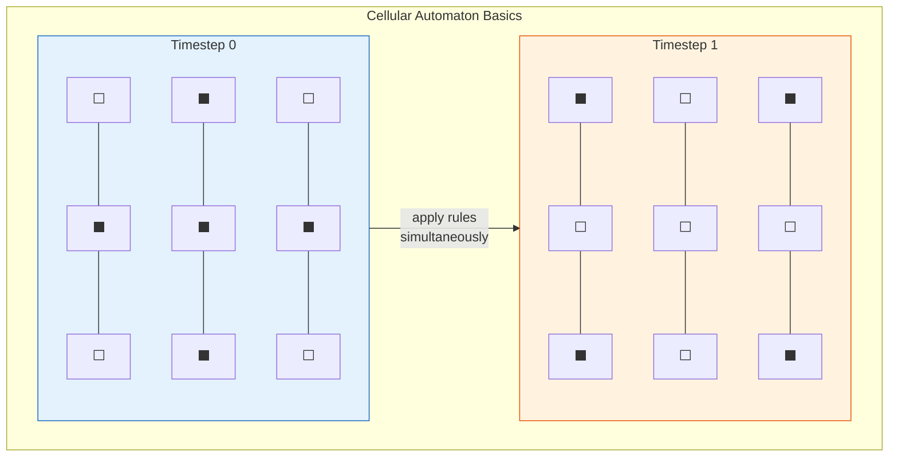

# Cellular Automata

**A cellular automaton is a grid of cells that update their states according to simple local rules, yet collectively produce behavior of staggering complexity.**

The concept is disarmingly simple: take a grid, assign each cell a state (on or off), define a rule for how each cell updates based on its neighbors, and press play. What emerges from this mechanical process ranges from static boredom to patterns indistinguishable from biological life. Cellular automata matter because they demonstrate that complexity does not require complex ingredients -- it requires the right rules applied at the right scale.

## The Idea: Cells, Neighbors, Rules

A cellular automaton (CA) consists of three components. First, a **lattice** -- a regular arrangement of cells (a line, a grid, a cube, or any higher-dimensional structure). Second, a **state set** -- the possible values each cell can hold (often just "alive" or "dead"). Third, a **transition rule** -- a function that determines each cell's next state based on its current state and the states of its neighbors.

At each discrete timestep, every cell applies the same rule simultaneously. No cell has special privileges. No central controller orchestrates the outcome. The system's behavior emerges entirely from local interactions -- like a city whose traffic patterns emerge from individual drivers following the same road rules, with no one directing the whole.

## Conway's Game of Life

The most famous cellular automaton is John Conway's **Game of Life** (1970), played on a two-dimensional grid with two states (alive or dead) and four rules:

1. A live cell with fewer than two live neighbors dies (underpopulation).
2. A live cell with two or three live neighbors survives.
3. A live cell with more than three live neighbors dies (overcrowding).
4. A dead cell with exactly three live neighbors becomes alive (reproduction).

These four rules -- expressible in a single sentence -- generate an inexhaustible zoo of behaviors: stable blocks, oscillating blinkers, gliders that traverse the grid, self-replicating patterns, and structures capable of universal computation. Conway's Game of Life is Turing-complete, meaning it can in principle compute anything a modern computer can. Four rules. Infinite computational power. The universe has a dark sense of humor about complexity.

## Why It Matters for Neural Modeling

The brain is, at a certain level of description, a cellular automaton. Cortical columns serve as cells, the six-layer architecture and lateral connectivity define transition rules, and the spatiotemporal pattern of neural firing constitutes the system state. This is not a loose analogy -- it is a literal mapping that enables the entire apparatus of computational complexity theory (Wolfram classes, criticality, phase transitions) to be applied directly to neural dynamics. The question "what kind of cellular automaton is the cortex?" turns out to have profound implications for understanding consciousness.

## Figure

*Each cell updates based on its neighbors' states. The same simple rule applied everywhere produces the next global pattern -- no central controller needed.*

## Key Takeaway

Cellular automata prove that breathtaking complexity can emerge from trivially simple rules applied in parallel. This principle -- simple local rules, complex global behavior -- is the foundation for understanding the cortex as a computational system.

## See Also

- [The Cortical Automaton](../physical-foundations/cortical-automaton.md)
- [Criticality and the Edge of Chaos](../basics/criticality.md)
- [Phase Transitions](../basics/phase-transitions.md)
- [Wolfram's Four Classes](../physical-foundations/wolfram-classes.md)

*Based on: Gruber, M. (2026). The Four-Model Theory of Consciousness. Zenodo. [doi:10.5281/zenodo.18669891](https://doi.org/10.5281/zenodo.18669891)*
