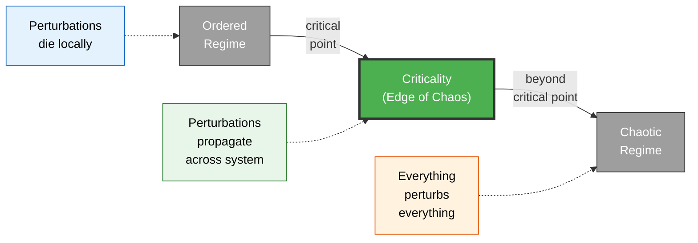

# Criticality and the Edge of Chaos

**Criticality is the state a system occupies at the exact boundary between rigid order and formless chaos -- where computational power, sensitivity, and adaptability are maximized.**

Some systems are frozen solid. Others are pure noise. The interesting ones live on the knife's edge between the two. This boundary -- called the **critical point** or **edge of chaos** -- is where systems become capable of the most complex, flexible, and information-rich behavior. It is not a metaphor for balance or moderation. It is a precise physical regime with measurable signatures.

## Order, Chaos, and the Edge

Consider a simple thought experiment. A classroom of students passes notes to each other. In the **ordered** regime, a strict teacher intercepts every note -- information dies locally, nothing propagates, and no coordination is possible. In the **chaotic** regime, every student simultaneously shouts everything they know -- information propagates everywhere but is drowned in noise, and nothing coherent emerges. At the **critical point**, notes propagate just far enough to reach relevant recipients, forming chains of communication that span the room without degenerating into cacophony.

This is not just an analogy. In physical systems, the critical point is where **correlation length diverges** -- small perturbations can propagate across the entire system. In ordered regimes, perturbations die out locally. In chaotic regimes, everything perturbs everything and no signal stands out from the noise. Only at criticality does a system achieve long-range correlations while maintaining local structure.

## Self-Organized Criticality

Some systems do not need to be tuned to the critical point -- they drive themselves there naturally. Per Bak coined the term **self-organized criticality** (SOC) in 1987, using the sandpile as the canonical example. Drop grains of sand one at a time onto a pile. Small avalanches are frequent; large avalanches are rare; the distribution follows a **power law**. The pile perpetually maintains itself at the critical angle of repose -- not because anyone calibrates it, but because the dynamics of addition and collapse converge on the critical state.

The brain appears to do the same thing. Neuronal networks maintain themselves near criticality through a balance of excitation and inhibition, producing cascading activity patterns -- **neuronal avalanches** -- whose sizes follow power-law distributions. The brain is, in this sense, a self-tuning sandpile made of neurons.

## Why Criticality Matters

Systems at criticality have three properties that no other regime provides simultaneously:

1. **Maximum dynamic range** -- sensitivity to inputs spanning many orders of magnitude, from whispers to explosions.
2. **Optimal information transmission** -- signals propagate far enough to be useful without being lost in noise.
3. **Maximum computational capacity** -- the system can sustain complex, structured, evolving patterns (Wolfram's Class 4 behavior).

These are not luxuries. They are exactly the properties a system needs to build and maintain the kind of dynamic self-model that consciousness requires.

## Figure

*At the critical point, perturbations propagate across the system without degenerating into noise -- enabling long-range coordination, maximum sensitivity, and complex computation.*

## Key Takeaway

Criticality is not a vague notion of "balance" but a precise physical regime at the boundary between order and chaos, where a system's computational power, sensitivity, and information transmission are simultaneously maximized.

## See Also

- [The Criticality Requirement](../physical-foundations/criticality.md)
- [Phase Transitions](../basics/phase-transitions.md)
- [Neuronal Avalanches](../basics/neuronal-avalanches.md)
- [Cellular Automata](../basics/cellular-automaton.md)

*Based on: Gruber, M. (2026). The Four-Model Theory of Consciousness. Zenodo. [doi:10.5281/zenodo.19064950](https://doi.org/10.5281/zenodo.19064950)*
