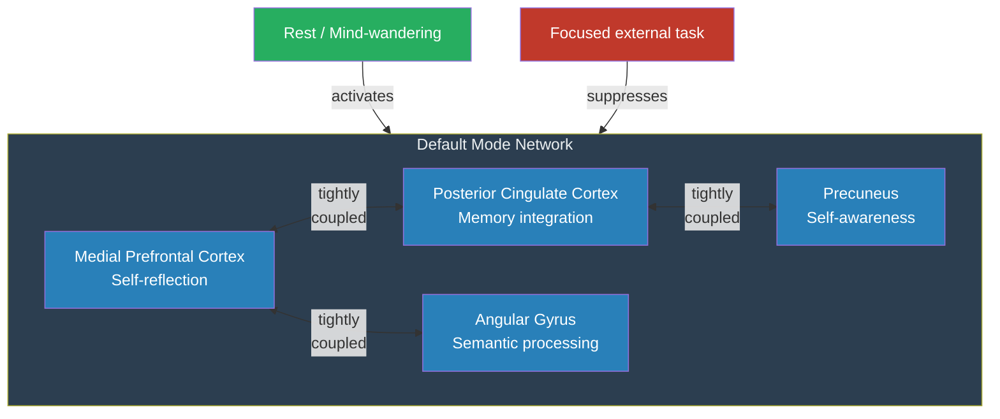

# Default Mode Network

**The default mode network (DMN) is a set of brain regions that become most active when a person is not focused on the external world -- during daydreaming, remembering, imagining the future, and thinking about the self.**

For decades, neuroscience assumed that the brain was only doing interesting things when responding to stimuli. The discovery of the DMN overturned that assumption. The brain at "rest" is not resting at all -- it is running a continuous internal narrative, modeling the self and its place in time.

## Discovery

In the early 2000s, Washington University neurologist Marcus Raichle and colleagues noticed something unexpected in PET and fMRI data. Certain brain regions consistently showed *higher* metabolic activity during rest than during demanding tasks. This was initially dismissed as noise -- surely the brain would be less active when doing nothing? But the pattern was too consistent and too reproducible. In 2001, Raichle's group formally identified these regions as a coherent network and coined the term **default mode network** ([Raichle et al., 2001](https://doi.org/10.1073/pnas.98.2.676)).

The key regions include the **medial prefrontal cortex** (self-reflection, social cognition), the **posterior cingulate cortex** (autobiographical memory integration), the **precuneus** (self-awareness, mental imagery), and the **angular gyrus** (semantic processing, episodic retrieval). These areas form a tightly interconnected system that activates as a unit and deactivates as a unit.

## What the DMN Does

The DMN is not a single function but a suite of related capacities united by their inward orientation:

- **Self-referential processing.** Thinking about one's own traits, feelings, and identity. When asked "Are you honest?", the medial prefrontal cortex lights up.
- **Mental time travel.** Remembering the past and simulating possible futures. The same network that reconstructs yesterday's lunch also generates tomorrow's job interview rehearsal.
- **Mind-wandering.** The spontaneous, unconstrained thought that fills roughly 50% of waking life. The DMN is the neural substrate of the wandering mind.
- **Theory of mind.** Modeling other people's mental states -- what they believe, intend, and feel. The social brain overlaps heavily with the self-referential brain, suggesting that understanding others depends on first having a model of oneself.

A useful analogy: if the brain's task-positive networks are an employee doing focused work, the DMN is that same employee staring out the window -- not idle, but consolidating, planning, and running simulations that no one asked for but everyone benefits from.

## Clinical and Theoretical Significance

DMN dysfunction is implicated in an extraordinary range of conditions. In Alzheimer's disease, the DMN is among the first networks to degrade, which may explain why self-continuity fractures before basic cognition does. In depression, the DMN becomes hyperactive and "stuck" -- rumination is, neurally speaking, the default mode running in a loop it cannot break. Under psychedelics like psilocybin, DMN coherence collapses, producing ego dissolution: the self-model temporarily loses its infrastructure.

For consciousness science, the DMN is significant because it provides direct neural evidence that the brain continuously maintains and updates a model of the self -- even (especially) when no external task demands it. This is precisely what a self-simulation theory would predict.

## Figure

*The DMN activates during rest and self-referential thought, and is suppressed during externally focused tasks. Its four core regions are tightly interconnected.*

## Key Takeaway

The default mode network demonstrates that the brain's "resting" state is actually a continuous process of self-modeling, memory consolidation, and future simulation -- the neural infrastructure of the self-narrative that runs whenever nothing more urgent demands attention.

## See Also

- [Explicit Self Model (ESM)](../core-architecture/explicit-self-model.md)
- [Ego Dissolution](../phenomena/ego-dissolution.md)
- [Meditation](../phenomena/meditation.md)

*Based on: Gruber, M. (2026). The Four-Model Theory of Consciousness. Zenodo. [doi:10.5281/zenodo.18669891](https://doi.org/10.5281/zenodo.18669891)*
