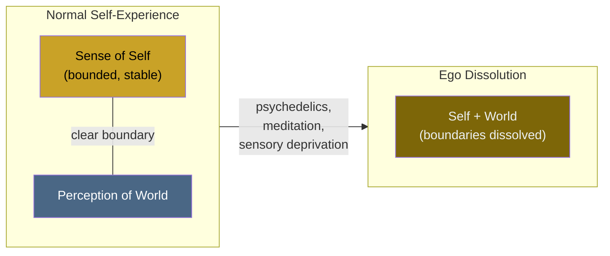

# Ego Dissolution

**Ego dissolution is the experience of losing the boundary between self and world -- the felt sense of being a distinct, bounded individual temporarily disappears.**

The phenomenon has been described across contemplative traditions for millennia and became a focus of modern neuroscience through psychedelic research. During ego dissolution, subjects report that the normal sense of "I" -- the feeling of being a separate observer looking out at the world -- weakens or vanishes entirely. The experience ranges from a gentle blurring of self-boundaries to complete loss of personal identity, where the distinction between the experiencer and the experienced collapses.

## How It Happens

Ego dissolution occurs most reliably under high-dose psychedelics (psilocybin, LSD, DMT, 5-MeO-DMT), but has also been reported during deep meditation, sensory deprivation, temporal lobe epilepsy, and near-death experiences. The common factor across these diverse triggers appears to be disruption of the brain's normal self-referential processing.

Under psychedelics, the mechanism involves serotonin 5-HT2A receptor agonism, which disrupts activity in the **default mode network** (DMN) -- a set of brain regions (medial prefrontal cortex, posterior cingulate cortex, angular gyrus) that are most active during self-referential thought. [Lebedev et al. (2015)](https://doi.org/10.1002/hbm.22562) demonstrated that the degree of ego dissolution under LSD correlated with decreased functional connectivity within the DMN, and [Nour et al. (2016)](https://doi.org/10.1177/0269881116677852) developed the Ego Dissolution Inventory (EDI), providing a validated psychometric tool for measuring the phenomenon.

The picture that emerges is not one of consciousness being reduced but of the self-model being disrupted while perceptual processing continues -- or even intensifies.

## What It Feels Like

Reports of ego dissolution cluster into recognizable patterns:

- **Boundary loss.** The felt boundary between body and environment dissolves. Subjects may feel "merged" with their surroundings or report that the distinction between inside and outside has become meaningless.
- **Identity replacement.** At higher intensities, the subject may feel they have become an object, another person, or an abstract concept. Salvia divinorum users famously report becoming furniture, walls, or geometric patterns.
- **Oceanic boundlessness.** A sense of unity with everything, often described as mystical or transcendent. This is the "oceanic feeling" Freud dismissed and that psychedelic researchers now take seriously as a measurable psychological state.
- **Loss of agency.** The sense of being an author of one's actions may disappear. Events seem to happen without anyone doing them.

Crucially, these experiences are not hallucinations in the traditional sense -- subjects typically retain awareness that something is happening. What changes is who or what is having the experience.

## Why It Matters for Consciousness Research

Ego dissolution is scientifically valuable precisely because it dissociates two things normally experienced as inseparable: consciousness and selfhood. A person undergoing ego dissolution remains conscious -- they perceive, they feel, they remember the experience afterward -- but the sense of being a self has been removed or radically altered. This demonstrates that the self is a component of conscious experience, not its foundation.

This dissociation constrains any viable theory of consciousness: the theory must explain how consciousness can persist without a stable self-model, and why the self-model is the specific component that psychedelics disrupt.

## Figure

*Under normal conditions, the self and the world are experienced as distinct. During ego dissolution, the boundary between them weakens or collapses, producing experiences of merger, identity loss, or oceanic boundlessness.*

## Key Takeaway

Ego dissolution demonstrates that the sense of self is a neurally constructed component of experience, not its prerequisite. Consciousness persists when the self-model is disrupted, proving that selfhood and awareness are dissociable -- a fundamental constraint for any theory of consciousness.

## See Also

- [Ego Dissolution (FMT Account)](../phenomena/ego-dissolution.md)
- [Psychedelic Phenomenology](../phenomena/psychedelics.md)

*Based on: Gruber, M. (2026). The Four-Model Theory of Consciousness. Zenodo. [doi:10.5281/zenodo.19064950](https://doi.org/10.5281/zenodo.19064950)*
