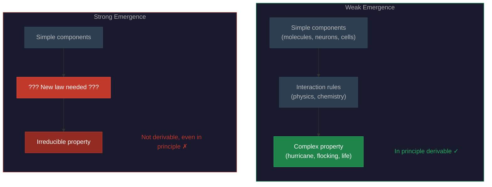

# Emergence

**Emergence is the phenomenon whereby complex systems exhibit properties and behaviors that their individual components do not possess -- the whole does things the parts cannot.**

A single water molecule is not wet. A single neuron is not conscious. A single bird does not flock. Yet wetness, consciousness, and flocking all *emerge* from the interactions of simple components. Emergence is the umbrella concept for this jump from micro-behavior to macro-properties, and it is central to the debate about consciousness because the core question is: *what kind* of emergence is consciousness?

## Weak Emergence

**Weak emergence** occurs when higher-level properties arise from lower-level interactions and are, in principle, derivable from those interactions -- even when the derivation is too complex to carry out in practice. This is the standard scientific kind of emergence, and it is everywhere.

A hurricane is weakly emergent from atmospheric physics. Given complete knowledge of every air molecule's position, velocity, temperature, and the relevant fluid dynamics, the hurricane follows -- no extra laws required. The practical impossibility of tracking every molecule does not change the principle: the hurricane is *nothing but* organized air. Similarly, the glider pattern in Conway's Game of Life is derivable from the four simple rules applied to the grid. It looks like it has a life of its own, but the rules fully determine it.

Weak emergence is epistemologically surprising but ontologically tame. The surprise is that simple rules produce complex behavior. The tameness is that no new physics is needed to explain the complex behavior -- it was all there in the rules from the start.

## Strong Emergence

**Strong emergence** is the controversial cousin. A property is strongly emergent if it is *not* derivable from lower-level properties, even in principle. Something genuinely new appears at the higher level -- a new law, a new force, a new kind of property -- that is not reducible to or predictable from the physics below.

Strong emergence, if real, would mean that physics is incomplete in a fundamental way: some facts about the universe cannot be derived from physical facts alone. This is philosophically radical. Jaegwon Kim famously argued (1999) that strong emergence is incoherent under the causal closure of physics -- if every physical event has a sufficient physical cause, there is no room for irreducible higher-level causes to do any work. Strong emergence would require either abandoning causal closure or accepting systematic overdetermination -- every conscious event caused twice, once by physics and once by the emergent property.

Despite these difficulties, some consciousness researchers invoke strong emergence either explicitly or implicitly. Any theory that treats consciousness as a fundamental feature of reality irreducible to physics (including some interpretations of panpsychism and IIT) is, whether it acknowledges it or not, committed to something like strong emergence.

## Why It Matters for Consciousness

The emergence question determines what kind of explanation consciousness needs. If consciousness is weakly emergent, then a complete neuroscience -- plus the right computational framework -- should, in principle, explain it. No new laws of nature are required. The [hard problem](../hard-problem/dissolution.md) would be the result of looking for phenomenal properties at the wrong level of description, not evidence of a gap in nature.

If consciousness is strongly emergent, then neuroscience alone will never be enough. New "psychophysical laws" would be needed -- laws that bridge the physical and the experiential in ways not derivable from physics. This is the position Chalmers explores: naturalistic dualism, where consciousness is natural but not physical.

The practical difference is stark. Under weak emergence, building an artificial conscious system is an engineering problem (build the right architecture, get the right dynamics). Under strong emergence, it may be impossible without discovering entirely new principles that current science does not possess.

## Figure

*Weak emergence (left): complex properties are derivable from simple components plus interaction rules. No new laws needed. Strong emergence (right): an irreducible property appears that cannot be derived from the components, even in principle -- requiring a new fundamental law.*

## Key Takeaway

Emergence is the bridge from simple parts to complex wholes. Weak emergence (derivable in principle) keeps consciousness within the reach of science. Strong emergence (irreducible in principle) would place it partly beyond physics. Which kind of emergence consciousness involves is one of the most consequential open questions in the field.

## See Also

- [Weak Emergence](../philosophical/weak-emergence.md)
- [Physicalism](physicalism.md)
- [Panpsychism](panpsychism.md)
- [Hard Problem Dissolution](../hard-problem/dissolution.md)
- [The Category Error](../hard-problem/category-error.md)

*Based on: Gruber, M. (2026). The Four-Model Theory of Consciousness. Zenodo. [doi:10.5281/zenodo.19064950](https://doi.org/10.5281/zenodo.19064950)*
