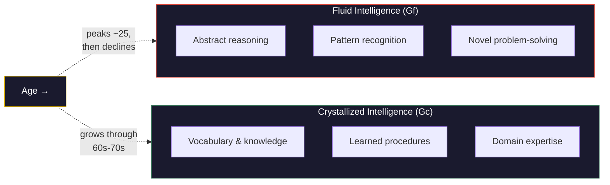

# Fluid and Crystallized Intelligence

**Fluid intelligence (Gf) is the capacity to reason and solve novel problems independent of prior knowledge, while crystallized intelligence (Gc) is the accumulated store of knowledge, skills, and strategies acquired through experience.**

Raymond Cattell proposed this distinction in 1963, and John Horn expanded it extensively. It remains one of the most empirically robust partitions in intelligence research. The distinction matters because the two types follow radically different developmental trajectories, respond differently to training, and illuminate different aspects of what it means to be intelligent.

## Fluid Intelligence (Gf)

Fluid intelligence is the ability to identify patterns, reason abstractly, and solve problems that cannot be answered by consulting stored knowledge. It is what matrix reasoning tests measure: given a novel pattern, extend it. No amount of vocabulary or historical knowledge helps with a Raven's Progressive Matrices item -- it demands on-the-spot logical inference.

Gf depends heavily on working memory capacity and processing speed. It is neurologically associated with prefrontal cortex function and peaks in the early twenties. After that, it declines -- slowly at first, then more noticeably from the fifties onward. This is the cognitive ability most vulnerable to aging, neurological insult, and sleep deprivation. It is also the ability most closely correlated with the general intelligence factor (g) in psychometric studies.

Think of Gf as the processor clock speed of the mind: how fast and flexibly the hardware can operate on information it has never seen before.

## Crystallized Intelligence (Gc)

Crystallized intelligence encompasses vocabulary, factual knowledge, learned procedures, and domain expertise. It is what crossword puzzles, trivia contests, and professional expertise tests measure. Unlike Gf, crystallized intelligence continues to increase well into the sixties and seventies, declining only late in life when neurodegeneration erodes the substrate storing it.

Gc is the return on a lifetime of cognitive investment. Every book read, skill practiced, and problem solved deposits knowledge that future reasoning can draw upon. A 60-year-old physician diagnosing a rare condition is deploying Gc: pattern recognition honed over decades, not raw abstract reasoning.

Think of Gc as the database: enormous, searchable, and growing richer with every query -- even as the processor accessing it gradually slows.

## The Divergence Problem

The Gf-Gc distinction creates a puzzle that static intelligence models struggle to explain. If intelligence is a single, stable trait, why do its components move in opposite directions across the lifespan? A 25-year-old excels at novel reasoning but knows comparatively little. A 65-year-old knows vastly more but processes novel information more slowly. Both are intelligent, but in qualitatively different ways.

This divergence also explains the **Flynn Effect** in part: rising IQ scores across generations may reflect improvements in Gf (better nutrition, education, cognitive stimulation) rather than equivalent gains in Gc, which depends on cultural knowledge accumulation and changes more slowly.

## Why the Distinction Matters

The Gf-Gc framework reveals that intelligence is not a monolithic capacity but a composite of abilities with distinct biological substrates, developmental curves, and functional roles. Any theory of intelligence that treats it as a single number -- or a single process -- is compressing away precisely the variation that matters most for understanding how cognition works, how it develops, and how it fails.

## Figure

*Fluid and crystallized intelligence follow opposite developmental trajectories. Gf peaks early and declines with age; Gc accumulates across the lifespan and remains stable into late adulthood. This divergence is one of the most robust findings in intelligence research.*

## Key Takeaway

Intelligence is not one thing. Fluid intelligence provides the raw reasoning engine; crystallized intelligence provides the accumulated knowledge base. They develop differently, decline differently, and contribute to intelligent behavior in fundamentally different ways.

## See Also

- [The Recursive Intelligence Model](../intelligence/overview.md)
- [The Recursive Loop](../intelligence/recursive-loop.md)
- [Gf-Gc Divergence](../intelligence/gf-gc-divergence.md)
- [Established Models of Intelligence](../intelligence/established-models.md)

*Based on: Gruber, M. (2026). The Four-Model Theory of Consciousness. Zenodo. [doi:10.5281/zenodo.19064950](https://doi.org/10.5281/zenodo.19064950)*
