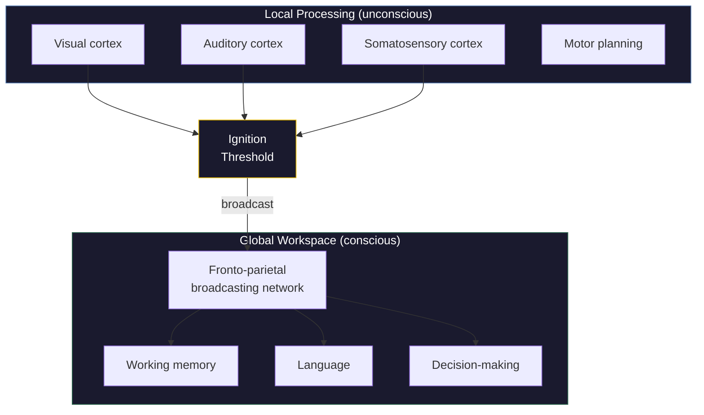

# Global Neuronal Workspace Theory

**Global Neuronal Workspace (GNW) theory proposes that consciousness arises when information is broadcast globally across the cortex via a network of long-range neurons, making it available to multiple cognitive processes simultaneously.**

Originated by Bernard Baars (1988) as the Global Workspace Theory and given a detailed neurobiological architecture by Stanislas Dehaene and Jean-Pierre Changeux (2011), GNW is arguably the most empirically successful theory of consciousness to date. It has generated testable predictions, produced reliable neural markers, and attracted both fervent support and pointed criticism. Understanding GNW is essential for navigating the landscape of consciousness science.

## The Core Idea

Most information processing in the brain is local and unconscious. Sensory cortices process their inputs in parallel, specialized modules run their computations, and none of this requires awareness. GNW proposes that consciousness occurs when information breaks out of local processing and is broadcast to a global network of neurons with long-range connections, primarily concentrated in the prefrontal and parietal cortex.

The metaphor is a theater (Baars' original framing): many processes compete backstage in the dark, but only one performer at a time can stand in the spotlight. The spotlight is global broadcasting -- the moment information is made available to working memory, language, motor planning, and decision-making simultaneously. Everything in the spotlight is conscious; everything backstage is not.

## Ignition and the P3b

GNW's most distinctive empirical contribution is the concept of **ignition** -- a sudden, nonlinear transition from local to global processing. When a stimulus crosses a threshold of strength, relevance, or attentional amplification, it triggers a cascade of recurrent activation across the fronto-parietal network. This is not a gradual brightening; it is a sudden switch, like a match catching fire.

The **P3b** event-related potential, a positive voltage deflection occurring roughly 300-500 milliseconds after stimulus onset, is GNW's signature marker. It reliably distinguishes stimuli that reach conscious awareness from those that do not. Subliminal stimuli (too brief or too masked to be seen) evoke early sensory responses but no P3b. Conscious stimuli evoke the full ignition cascade.

This has practical utility. The P3b is used clinically to assess residual consciousness in patients with disorders of consciousness -- vegetative states, minimally conscious states -- where behavioral assessment alone is unreliable.

## What GNW Explains

GNW provides a compelling account of **access consciousness** -- the set of phenomena related to information being available for verbal report, deliberate reasoning, and flexible behavioral control. It explains:

- **The attentional blink**: when the workspace is occupied broadcasting one stimulus, a second stimulus arriving within ~500ms fails to ignite and remains unconscious.
- **Subliminal processing**: stimuli that never reach the workspace can still influence behavior (priming effects), demonstrating that processing and consciousness are dissociable.
- **The all-or-nothing character of consciousness**: information is either broadcast (and conscious) or not (and unconscious). There is no half-broadcast state, which matches the phenomenology of perceptual awareness.

## The Limits

GNW's central limitation is philosophical. It explains *when* content becomes conscious (upon global broadcasting) but not *why* broadcasting is accompanied by subjective experience. A corporate email system broadcasts information globally across an organization -- that does not make the email server conscious. Broadcasting is a mechanism for availability, and availability is not experience.

This gap means GNW is, strictly speaking, a theory of access consciousness rather than phenomenal consciousness. It can explain which contents reach awareness and when, but it cannot explain why awareness feels like anything at all. The theory is silent on the Hard Problem.

## Figure

*In GNW, multiple sensory modules process information locally and unconsciously. When a stimulus crosses the ignition threshold, its content is broadcast globally via a fronto-parietal network, becoming simultaneously available to working memory, language, and decision-making. This transition from local to global is the neural correlate of conscious access.*

## Key Takeaway

Global Neuronal Workspace theory provides the best empirical account of conscious access -- explaining when and how information becomes available for report and reasoning. Its strength is precision about the mechanism of availability; its limitation is silence about why availability is accompanied by experience.

## See Also

- [FMT vs. Global Neuronal Workspace (GNW)](../comparative/vs-gnw.md)
- [Working Memory](working-memory.md)
- [Comparative Scoreboard](../comparative/scoreboard.md)
- [Hard Problem Dissolution](../hard-problem/dissolution.md)

*Based on: Gruber, M. (2026). The Four-Model Theory of Consciousness. Zenodo. [doi:10.5281/zenodo.19064950](https://doi.org/10.5281/zenodo.19064950)*
