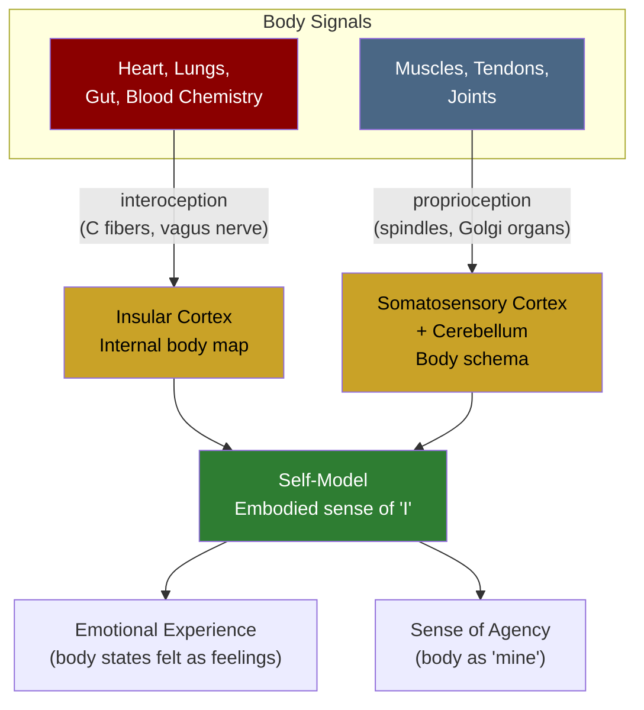

# Interoception and Proprioception

**Interoception is the sense of the body's internal state (heartbeat, hunger, breathing), while proprioception is the sense of the body's position and movement in space -- together, they form the foundation of embodied self-awareness.**

Most discussions of perception focus on the five exteroceptive senses -- vision, hearing, touch, taste, smell -- that tell the brain about the external world. But the brain also runs a continuous monitoring system directed inward. Interoception tracks the physiological condition of the body's organs. Proprioception tracks the body's spatial configuration and motion. Without these internal senses, the brain would have a model of the world but no model of the body that inhabits it.

## Interoception: Sensing the Inner Body

**Interoception** encompasses the perception of signals originating within the body: cardiac activity, respiratory rhythm, gastric contractions, bladder distension, blood chemistry, temperature, pain, and autonomic arousal. These signals travel primarily through unmyelinated C fibers and the vagus nerve to the brainstem, then to the **insular cortex** -- a deeply folded region of cortex that serves as the brain's primary hub for internal body representation.

The most studied interoceptive ability is **heartbeat detection** -- the capacity to perceive one's own heartbeat without touching the chest or feeling the pulse. Accuracy varies dramatically between individuals: some people can count heartbeats with near-perfect precision, while others perform at chance level. This variation is not trivial. [Critchley et al. (2004)](https://doi.org/10.1523/JNEUROSCI.4575-03.2004) demonstrated that interoceptive accuracy correlates with both insular cortex gray matter volume and the intensity of subjective emotional experience. People who are better at feeling their heartbeat feel their emotions more intensely.

This connection between body-sensing and emotion is not coincidental. The **somatic marker hypothesis** (Damasio, 1994) and subsequent work suggest that emotions are, at least in part, the brain's interpretation of body states. Anxiety is not just a thought -- it is the conscious registration of elevated heart rate, shallow breathing, and gut tension. Remove the body signals, and the emotional experience changes character.

## Proprioception: The Forgotten Sense

**Proprioception** is the sense of body position, movement, and force -- the reason a person can touch their nose with their eyes closed. Specialized receptors in muscles (muscle spindles), tendons (Golgi tendon organs), and joints send continuous information about limb position, movement velocity, and mechanical load to the cerebellum and somatosensory cortex.

Proprioception is so seamlessly integrated into daily life that its existence is typically noticed only when it fails. The neurologist Oliver Sacks described the case of Christina, a young woman who lost proprioception entirely due to a rare polyneuropathy. She could not feel her body's position and had to watch her limbs visually to control them. She described the experience as feeling "disembodied" -- having a body she could see but not feel. Without proprioception, the body becomes a foreign object that must be operated by remote control.

The **body schema** -- the brain's internal model of the body's spatial configuration -- is built primarily from proprioceptive data. This schema is remarkably plastic: the **rubber hand illusion** (Botvinick & Cohen, 1998) demonstrates that synchronous visual and tactile stimulation can cause the brain to incorporate a rubber hand into the body schema within minutes, complete with a proprioceptive sense of ownership and even a stress response when the rubber hand is threatened.

## Why These Senses Matter for Self-Models

Any model the brain builds of "the self" must include the body that self inhabits. Interoception and proprioception supply the raw data for this body-self: the felt sense of being a physical organism with internal states, spatial boundaries, and a position in the world.

When interoceptive input is disrupted -- whether by neurological damage, dissociative states, or pharmacological intervention -- the sense of self changes. Depersonalization (feeling detached from one's own body) and derealization (feeling that the world is unreal) are both associated with reduced interoceptive accuracy. Conversely, practices that enhance interoceptive awareness, such as mindfulness meditation, are associated with altered self-experience and, in experienced meditators, changes in insular cortex structure.

The body, it turns out, is not a vehicle the self rides in. It is a major component of what the self is made of.

## Figure

*Interoception (organ states via insular cortex) and proprioception (body position via somatosensory cortex and cerebellum) converge to build the brain's body-self -- the embodied foundation of self-awareness, emotional experience, and the sense of agency.*

## Key Takeaway

Interoception and proprioception are the internal senses that provide the raw material for the brain's body-self model. Without them, the sense of being an embodied self degrades -- demonstrating that self-awareness is not a purely cognitive achievement but is built, from the ground up, on the brain's ability to sense the body it inhabits.

## See Also

- [Implicit Self Model (ISM)](../core-architecture/implicit-self-model.md)

*Based on: Gruber, M. (2026). The Four-Model Theory of Consciousness. Zenodo. [doi:10.5281/zenodo.19064950](https://doi.org/10.5281/zenodo.19064950)*
