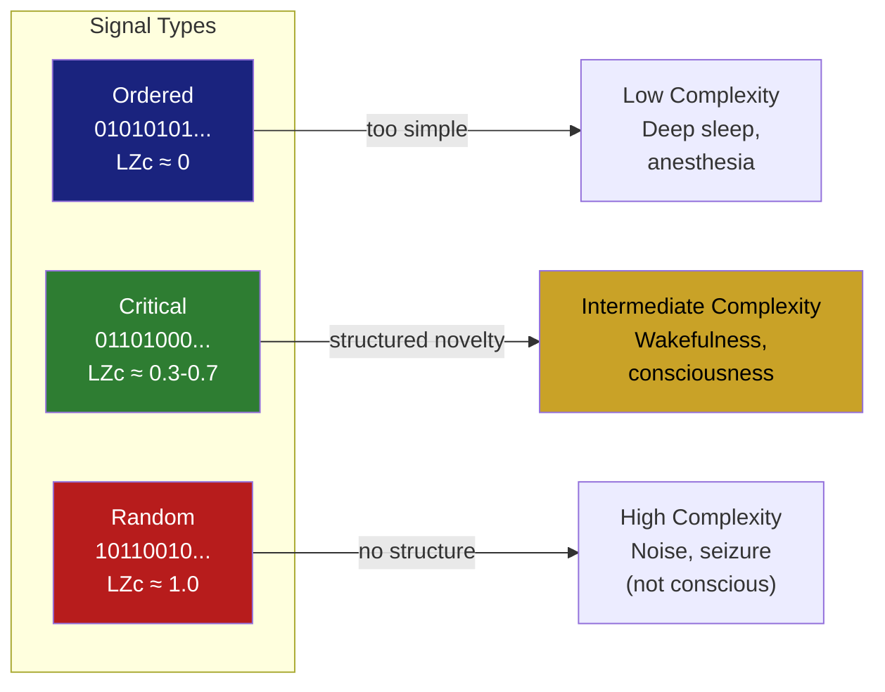

# Lempel-Ziv Complexity

**Lempel-Ziv complexity quantifies the "richness" of a signal by counting how many distinct patterns it contains -- a measure originally developed for data compression that has become a key tool in consciousness research.**

Abraham Lempel and Jacob Ziv introduced their complexity measure in 1976 as part of the theoretical foundation for lossless data compression (the same principles behind the ZIP file format). The core idea is elegant: a signal's complexity is proportional to the number of distinct subsequences needed to describe it. A signal that repeats the same pattern endlessly is low-complexity -- it compresses easily. A signal full of novel patterns is high-complexity -- it resists compression. This turns out to be exactly what consciousness researchers need: a way to measure how "rich" or "differentiated" brain activity is.

## How It Works

The algorithm scans a sequence (say, a string of EEG values converted to binary) from left to right, building a dictionary of unique subsequences. Every time it encounters a pattern it has not seen before, it adds it to the dictionary and increments the complexity count.

Consider two binary strings of equal length:

- `0101010101010101` -- highly repetitive. The dictionary grows slowly because the same pattern (01) repeats. Low Lempel-Ziv complexity.
- `0110100011011100` -- many distinct patterns. The dictionary grows rapidly. High Lempel-Ziv complexity.

The normalized Lempel-Ziv complexity (LZc) scales this count against the theoretical maximum for a random sequence of the same length, producing a value between 0 (perfectly ordered, maximally compressible) and 1 (maximally disordered, incompressible).

A perfectly ordered signal (all zeros) scores near 0. A perfectly random signal scores near 1. The interesting systems -- and brains are interesting systems -- fall somewhere in between, possessing structure that is neither trivially repetitive nor indistinguishable from noise.

## Application to Consciousness

The connection between Lempel-Ziv complexity and consciousness was established through the **Perturbational Complexity Index** (PCI), developed by [Casali et al. (2013)](https://doi.org/10.1126/scitranslmed.3006294). PCI works by delivering a magnetic pulse to the cortex (via TMS) and measuring the Lempel-Ziv complexity of the resulting EEG response. The key finding: a PCI threshold of approximately 0.31 reliably discriminates conscious from unconscious states across diverse conditions -- wakefulness, sleep, anesthesia (propofol, midazolam, xenon), minimally conscious states, and locked-in syndrome.

This works because a conscious brain produces a response that is both integrated (the perturbation spreads across regions) and differentiated (different regions respond differently). An unconscious brain either fails to propagate the perturbation (too fragmented) or responds with a uniform, stereotyped wave (too homogeneous). Both failure modes produce low Lempel-Ziv complexity.

The measure has been validated across over 150 neurological patients ([Casarotto et al., 2016](https://doi.org/10.1002/ana.24779)) and remains one of the most reliable objective indicators of consciousness available in clinical settings.

## Why Compression Equals Consciousness (Almost)

The deep reason Lempel-Ziv complexity tracks consciousness is that conscious states appear to require a specific regime of neural dynamics -- neither too ordered nor too random. This is the **criticality** regime, the computational sweet spot where a system can both maintain stable patterns and generate new ones.

Think of it like a conversation at a party: if everyone repeats the same phrase (too ordered), information content is zero. If everyone shouts random words simultaneously (too random), information content is also zero -- nothing meaningful can be extracted. Interesting conversation -- like conscious neural activity -- sits in between, with enough structure to be meaningful and enough novelty to be informative.

## Figure

*Lempel-Ziv complexity spans from ordered (compressible, low complexity) to random (incompressible, high complexity). Conscious brain states occupy the intermediate range -- structured enough to carry information, novel enough to resist trivial compression.*

## Key Takeaway

Lempel-Ziv complexity measures how many distinct patterns a signal contains, originally for data compression but now a cornerstone of consciousness measurement. The PCI threshold of ~0.31 reliably separates conscious from unconscious brain states, because consciousness requires neural dynamics that are neither too repetitive nor too random.

## See Also

- [Confirmed Predictions](../predictions/confirmed.md)
- [Criticality and the Cortical Automaton](../physical-foundations/criticality.md)

*Based on: Gruber, M. (2026). The Four-Model Theory of Consciousness. Zenodo. [doi:10.5281/zenodo.18669891](https://doi.org/10.5281/zenodo.18669891)*
