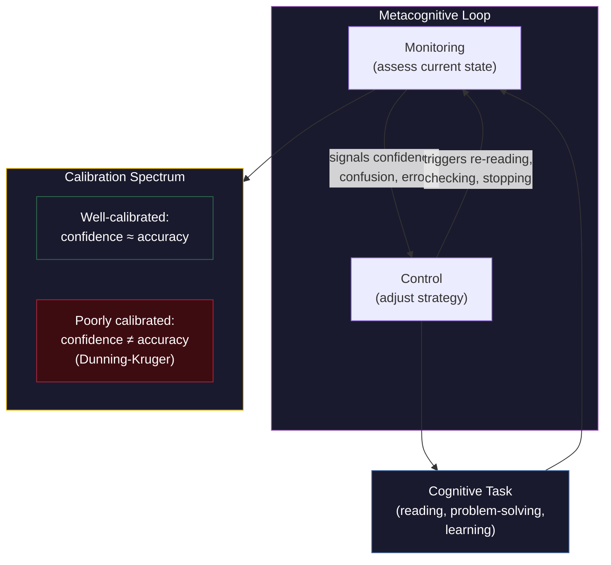

# Metacognition

**Metacognition is the capacity to monitor, evaluate, and regulate one's own cognitive processes -- thinking about thinking.**

The term was coined by John Flavell in 1979, though the phenomenon has been recognized since Socrates declared that wisdom begins with knowing what you do not know. Metacognition is what allows a student to realize they do not understand a paragraph and re-read it, a chess player to sense their position is deteriorating before they can articulate why, and a scientist to question whether their hypothesis is driven by evidence or wishful thinking. It is, in essence, cognition turned inward on itself.

## Monitoring and Control

Metacognition divides into two interacting functions.

**Metacognitive monitoring** is the assessment of one's own cognitive states. It includes judgments of learning ("Do I know this?"), feelings of knowing ("I can't recall the name, but I'd recognize it"), confidence judgments ("How sure am I?"), and error detection ("Something about that answer feels wrong"). Monitoring operates at varying levels of accuracy -- sometimes it is exquisitely precise, sometimes it is systematically wrong.

**Metacognitive control** is the regulation of cognition based on monitoring output. If monitoring signals confusion, control might trigger re-reading. If monitoring signals high confidence, control might terminate study. If monitoring signals an error, control might initiate checking. The quality of control depends entirely on the quality of monitoring -- good regulation built on bad information produces confidently wrong behavior.

Together, monitoring and control form a feedback loop: monitor the state of knowledge, adjust strategy based on the assessment, monitor the result, adjust again. The sophistication of this loop is one of the strongest predictors of learning efficiency and academic performance -- often exceeding raw intelligence as a predictor.

## Calibration and the Dunning-Kruger Effect

**Calibration** is the accuracy of metacognitive monitoring -- the degree to which confidence matches actual performance. Well-calibrated individuals are confident when they are right and uncertain when they are wrong. Poorly calibrated individuals are confident regardless.

The **Dunning-Kruger effect** (1999) is the most famous example of metacognitive miscalibration. People with low ability in a domain tend to overestimate their competence, while experts tend to underestimate theirs. This is not arrogance versus modesty -- it is a direct consequence of metacognitive architecture. Assessing one's skill at X requires some skill at X. The incompetent lack precisely the expertise needed to recognize their incompetence. A tone-deaf singer cannot hear that they are off-key -- hearing pitch accurately *is* the skill they lack.

Experts underestimate because they judge their own performance against their awareness of the field's full complexity. They know how much they do not know. Novices overestimate because their map of the territory is small enough to feel complete.

## Why Metacognition Matters for Consciousness

Metacognition occupies a privileged position in consciousness research because it is inherently self-referential -- it requires a system that can take its own processing as an object of evaluation. This is not mere information processing; it is information processing *about* information processing. Any system capable of genuine metacognition must maintain some form of self-model that can represent and evaluate its own states.

## Figure

*Metacognition operates as a feedback loop: monitoring assesses the state of ongoing cognitive processing, and control adjusts strategy based on monitoring signals. The accuracy of monitoring — calibration — determines whether control decisions are well-informed or systematically biased.*

## Key Takeaway

Metacognition is cognition reflecting on itself -- a self-referential capacity that enables learning regulation, error correction, and intellectual humility. Its accuracy (calibration) determines whether self-assessment is a reliable guide or a source of systematic overconfidence.

## See Also

- [Explicit Self Model (ESM)](../core-architecture/explicit-self-model.md)
- [The Redirectable ESM](../mechanisms/redirectable-esm.md)
- [Self-Referential Closure](../core-architecture/self-referential-closure.md)
- [The Recursive Intelligence Model](../intelligence/overview.md)

*Based on: Gruber, M. (2026). The Four-Model Theory of Consciousness. Zenodo. [doi:10.5281/zenodo.19064950](https://doi.org/10.5281/zenodo.19064950)*
