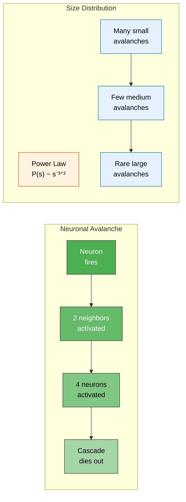

# Neuronal Avalanches

**Neuronal avalanches are cascading bursts of neural activity whose sizes follow a power-law distribution -- the signature of a system operating at or near the critical point.**

In 2003, John Beggs and Dietmar Plenz discovered something unexpected in slices of rat cortex. When they recorded the spontaneous activity of neural networks, the cascading bursts of firing did not follow a normal distribution (most events medium-sized, extremes rare). Instead, small cascades were overwhelmingly common, medium cascades less so, and large cascades rare -- but not impossibly rare. The sizes followed a **power law**, the statistical fingerprint of a system poised at [criticality](../basics/criticality.md).

## The Discovery

Beggs and Plenz recorded local field potentials from organotypic cortical cultures using multielectrode arrays. They defined an **avalanche** as a sequence of activations that propagates across electrodes without temporal gaps: activity at one electrode triggers activity at neighbors, which triggers their neighbors, and so on until the cascade dies out.

The critical observation was the distribution of avalanche sizes. If the cortex operated in an ordered regime, cascades would die out quickly -- almost all avalanches would be tiny. If it operated in a chaotic regime, every perturbation would spread everywhere -- avalanches would be uniformly large. What they found was neither: a power-law distribution with exponent approximately -3/2, meaning that an avalanche twice as large was roughly 2.8 times less likely. This specific exponent is the theoretical prediction for a system at the critical point of a branching process.

## Power Laws: The Signature of Criticality

A **power law** describes a relationship where one quantity varies as a power of another: P(s) ~ s^(-α), where s is avalanche size, P(s) is the probability of observing that size, and α is the scaling exponent. On a log-log plot, power laws appear as straight lines -- and that linearity spans orders of magnitude.

Why does this matter? Normal distributions have a characteristic scale (the mean). Power laws do not. A system producing power-law-distributed events has no preferred scale -- the same statistical pattern governs events from the smallest to the largest. This **scale-free** behavior is the mathematical consequence of operating at a [phase transition](../basics/phase-transitions.md), where correlations extend across the entire system. A brain producing power-law avalanches is a brain at the edge of chaos -- not locked into rigid patterns, not lost in noise, but balanced at the point of maximum computational flexibility.

## From Slices to Living Brains

The original finding was in cortical slices -- a preparation far removed from the intact brain. Subsequent work extended the result dramatically. Power-law neuronal avalanches have been observed in:

- **Awake behaving monkeys** (Petermann et al., 2009) -- confirming that criticality is not an artifact of isolated tissue.
- **Human MEG recordings** (Shriki et al., 2013) -- demonstrating avalanche dynamics at the whole-brain scale.
- **Developing cortex** (Gireesh & Bhatt, 2008) -- showing that criticality emerges during neural development.
- **Multiple species** across mammals and birds -- suggesting that criticality is a conserved organizational principle, not a quirk of one species' cortex.

Crucially, avalanche dynamics shift predictably with brain state. Under anesthesia, the power-law distribution breaks down as the system moves away from criticality. During sleep, avalanche statistics change in ways consistent with periodic departure from and return to criticality. These state-dependent changes confirm that the power law is not a static property of neural tissue but a dynamic signature of the brain's operating regime.

## Figure

*A neuronal avalanche begins when one neuron fires and triggers a cascade through its neighbors. The sizes of these cascades follow a power law -- many small, few large, with no characteristic scale -- the hallmark of criticality.*

## Key Takeaway

Neuronal avalanches provide the most direct empirical evidence that the brain operates near criticality. Their power-law size distribution -- observed across species, preparations, and recording methods -- is the statistical signature of a system poised at the edge of chaos, exactly where computational theories of consciousness predict it must be.

## See Also

- [Criticality and the Edge of Chaos](../basics/criticality.md)
- [The Criticality Requirement](../physical-foundations/criticality.md)
- [Phase Transitions](../basics/phase-transitions.md)
- [Confirmed Predictions](../predictions/confirmed.md)

*Based on: Gruber, M. (2026). The Four-Model Theory of Consciousness. Zenodo. [doi:10.5281/zenodo.18669891](https://doi.org/10.5281/zenodo.18669891)*
