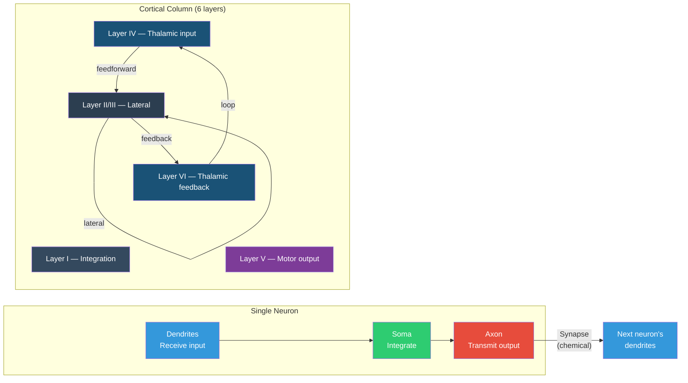

# Neurons and the Cerebral Cortex

**Neurons are the brain's information-processing cells, and the cerebral cortex -- a 2-3mm sheet of tissue folded into the skull -- is where the most complex neural computation occurs.**

Understanding consciousness at any level of detail requires understanding the hardware it runs on. This article covers the basics: what a neuron does, how neurons communicate, and how roughly 16 billion of them are organized into the cerebral cortex.

## The Neuron

A neuron is a cell specialized for electrical and chemical signaling. Its basic structure has three parts:

- **Dendrites** receive input from other neurons. A single neuron can have thousands of dendritic branches, each receiving signals from a different source.
- **Cell body (soma)** integrates those inputs. If the combined signal exceeds a threshold, the neuron fires.
- **Axon** transmits the output signal to other neurons. Axons can be very short (connecting neighbors) or very long (spanning the entire brain).

The firing event is called an **action potential** -- a brief electrical spike (~1 millisecond) that travels down the axon at speeds up to 120 meters per second. Action potentials are all-or-nothing: a neuron either fires or it does not. There is no "half fire." This binary quality is important -- it means neural computation has a digital character at the single-cell level, even though the network as a whole behaves analogically.

Where one neuron meets another is the **synapse** -- a tiny gap where the electrical signal is converted to a chemical one. The sending neuron releases **neurotransmitters** (molecules like glutamate, GABA, dopamine) into the gap. The receiving neuron's receptors detect these molecules and convert the signal back to electrical form. This chemical step is where learning happens: synapses can strengthen or weaken over time, changing which signals get through and how strongly. A single human brain contains approximately 100 trillion synapses.

## The Cerebral Cortex

The cerebral cortex is the outer layer of the brain -- the wrinkled, gray surface visible in any brain photograph. Despite being only 2-3mm thick, it contains roughly 16 billion neurons arranged in a remarkably consistent architecture.

**Six layers.** Nearly all of the cortex (the **neocortex**, specifically) is organized into six horizontal layers, numbered I (outermost) to VI (innermost). Each layer has a characteristic cell type and connectivity pattern:

| Layer | Primary role |
|-------|-------------|
| I | Mostly dendrites and axons; few cell bodies. Integration zone. |
| II/III | Lateral connections to other cortical areas. The "gossip network" -- cortex talking to cortex. |
| IV | Receives input from the thalamus (sensory relay). Thickest in primary sensory areas. |
| V | Sends output to subcortical structures (motor commands, brainstem). Contains the largest pyramidal neurons. |
| VI | Sends feedback to the thalamus. Closes the thalamo-cortical loop. |

**Cortical columns.** Perpendicular to the horizontal layers, the cortex is organized into vertical **columns** roughly 0.5mm in diameter. Each column spans all six layers and functions as a processing unit. In visual cortex, a column might respond to edges at a specific orientation; in somatosensory cortex, to touch on a specific patch of skin. The column is the cortex's repeating functional unit -- like a pixel in a screen, but vastly more complex.

## Why This Matters for Consciousness

The six-layer architecture is not decorative. The separation between feedforward input (Layer IV), lateral integration (Layers II/III), and feedback (Layer VI) creates the infrastructure for **recurrent processing** -- signals flowing not just bottom-up but also top-down and laterally. Many consciousness theories, including proposals about criticality and self-simulation, depend on this recurrent architecture. A purely feedforward system -- signals in, signals out, no loops -- could process information but likely could not sustain the kind of self-referential dynamics that consciousness may require.

The cortex is also the structure most directly associated with the content of conscious experience. Damage to specific cortical areas produces specific losses: damage to visual cortex eliminates visual experience, damage to parietal cortex disrupts spatial awareness, damage to prefrontal cortex alters self-monitoring. The cortex is where the models of world and self are constructed and maintained.

## Figure

*Left: the basic neuron — dendrites receive, soma integrates, axon transmits across a synapse to the next cell. Right: a cortical column spanning all six layers, with feedforward, lateral, and feedback connections.*

*A complete neuron showing the structures described above: dendrites (receiving input), soma (cell body), axon (wrapped in myelin sheath for fast transmission), and three types of synaptic connections — axosomatic (on the cell body), axodendritic (on dendrites), and axoaxonic (on the axon). Insets show the synapse structure (neurotransmitter release across the synaptic cleft) and myelin cross-section. Illustration by Mariana Ruiz Villarreal (public domain).*

*Histological drawing of the six neocortical layers (I-VI). Note the large pyramidal cells in layers III and V, the dense input layer IV, and the varying fiber densities across layers. This repeating six-layer motif is the cortex's fundamental organizational principle — the same basic circuit, adapted by local variations in cell density and connectivity, appears in every cortical area from primary visual cortex to prefrontal association areas.*

## Key Takeaway

The brain's computational substrate consists of neurons communicating via synapses, organized in the cerebral cortex into a six-layered, columnar architecture that supports both feedforward processing and the recurrent loops that are essential for complex cognition and, plausibly, consciousness.

## See Also

- [The Cortical Automaton](../physical-foundations/cortical-automaton.md)
- [Synaptic Weights and Plasticity](../basics/synaptic-plasticity.md)
- [Recurrent Processing](../basics/recurrent-processing.md)

*Based on: Gruber, M. (2026). The Four-Model Theory of Consciousness. Zenodo. [doi:10.5281/zenodo.19064950](https://doi.org/10.5281/zenodo.19064950)*
