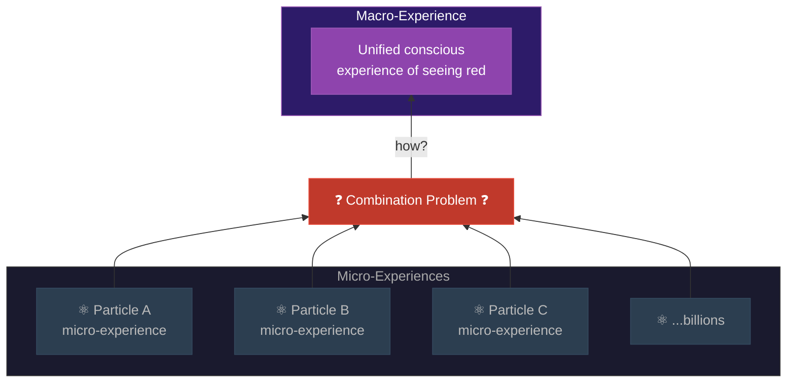

# Panpsychism

**Panpsychism is the view that consciousness -- or some precursor of it -- is a fundamental and ubiquitous feature of the physical world, present in some form even in the simplest particles of matter.**

Rather than explaining how consciousness *emerges* from non-conscious matter, panpsychism dissolves the question by denying the premise. Matter was never fully non-conscious to begin with. An electron does not think or feel in any human sense, but it possesses some minimal form of experiential quality -- a "proto-consciousness" or "micro-experience." Human consciousness, on this view, is what happens when vast numbers of these micro-experiences combine into a unified whole.

## The Appeal

Panpsychism has seen a remarkable revival in recent decades, championed by philosophers like David Chalmers, Galen Strawson, and Philip Goff. Its appeal is straightforward: it avoids the hard problem of consciousness by construction. If consciousness emerges from non-conscious matter, there is an [explanatory gap](../hard-problem/explanatory-gap.md) -- a point where subjective experience appears from ingredients that seemingly lack it, like pulling a rabbit from an empty hat. Panpsychism fills the hat. Experience does not emerge from nothing; it was there all along, in rudimentary form.

Strawson's argument (2006) is particularly direct: we know that consciousness exists (we experience it). We know that the physical world exists. The physical gave rise to the conscious. Therefore, the physical must have had the capacity for consciousness built in from the start -- otherwise, the emergence is inexplicable. The conclusion: the "intrinsic nature" of matter includes experiential properties.

Integrated Information Theory (IIT), developed by Giulio Tononi, is sometimes classified as a form of panpsychism. IIT assigns a value of integrated information (phi) to every system, including thermostats and individual particles. Any system with non-zero phi possesses some degree of consciousness. A thermostat is not very conscious, but it is not *zero* conscious either.

## The Combination Problem

Panpsychism's Achilles heel is the **Combination Problem**, first clearly articulated by William Seager and formalized by Chalmers. Grant that electrons have micro-experiences. Grant that brains contain roughly 86 billion neurons, each built from atoms that individually possess micro-experience. How do these billions of micro-experiences combine into the single, unified experience of seeing a sunset?

This is not a minor technical difficulty. It is, arguably, a problem as hard as the hard problem it was supposed to solve. The Combination Problem has several sub-problems:

- **The subject combination problem**: How do micro-subjects (each with its own perspective) merge into a single macro-subject? My experience is unified -- I do not experience 86 billion separate micro-perspectives. What makes them one?
- **The quality combination problem**: How do the micro-qualities of particle-level experience combine to produce the specific qualities of human experience -- the redness of red, the taste of chocolate? There is no obvious rule for combining "electron-experience" into "red."
- **The structural combination problem**: How does the structure of micro-level experience map onto the structure of macro-level experience? Why does this arrangement of atoms produce the smell of coffee rather than the sound of a trumpet?

The Combination Problem has resisted solution for decades. Constitutive panpsychists (who hold that macro-consciousness is literally constituted by micro-consciousness) face it most directly. Emergent panpsychists (who allow that macro-consciousness emerges from micro-consciousness via new principles) effectively reintroduce the explanatory gap they were trying to avoid.

## Figure

*Panpsychism posits that each particle has its own micro-experience. The Combination Problem is the unsolved question of how billions of these micro-experiences merge into the single, unified conscious experience of a human mind.*

## Key Takeaway

Panpsychism elegantly avoids the emergence problem by making consciousness fundamental. But it trades one hard problem for another: the Combination Problem of explaining how micro-experiences unify into macro-experience remains unsolved and may be equally intractable.

## See Also

- [Substrate Independence](../philosophical/substrate-independence.md)
- [FMT vs. IIT](../comparative/vs-iit.md)
- [Physicalism](physicalism.md)
- [Emergence](emergence.md)
- [Weak Emergence](../philosophical/weak-emergence.md)

*Based on: Gruber, M. (2026). The Four-Model Theory of Consciousness. Zenodo. [doi:10.5281/zenodo.19064950](https://doi.org/10.5281/zenodo.19064950)*
