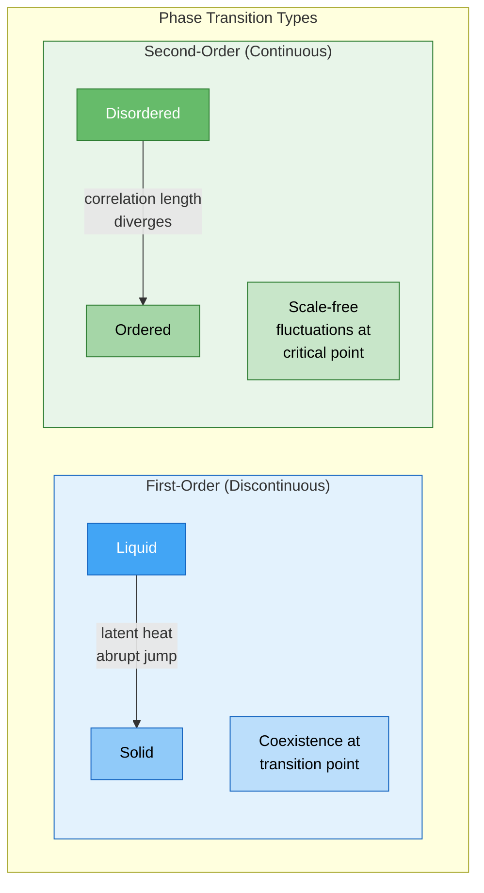

# Phase Transitions

**A phase transition is a qualitative change in a system's macroscopic behavior, triggered when a control parameter crosses a threshold.**

Water does not gradually become ice. At 0°C, something abrupt happens: molecules that were sliding past each other snap into a rigid crystal lattice. The underlying physics does not change -- the same water molecules obey the same electromagnetic forces -- but the collective behavior undergoes a discontinuous shift. Phase transitions are everywhere in nature, from boiling kettles to magnetizing iron to, as mounting evidence suggests, the moment a brain loses consciousness.

## First-Order Transitions: The Sudden Jump

In a **first-order phase transition**, the system jumps discontinuously from one state to another. Water to ice is the textbook example: at the transition temperature, the density, structure, and entropy change abruptly. The system absorbs or releases **latent heat** -- energy that goes into rearranging the molecular structure rather than changing the temperature. First-order transitions involve **coexistence**: at exactly 0°C, liquid water and ice can exist side by side, like two nations sharing an uneasy border.

The hallmark of a first-order transition is hysteresis. Supercooled water can remain liquid below 0°C; superheated ice can persist above it. The system "remembers" which phase it was in, requiring a nudge (a nucleation site, a vibration) to complete the transition. The everyday experience of a pot of water that stubbornly refuses to boil until it suddenly erupts is a first-order transition caught in the act.

## Second-Order Transitions: The Continuous Divergence

**Second-order phase transitions** (also called continuous transitions) are more subtle and, for neuroscience, far more interesting. There is no latent heat, no coexistence, no abrupt jump. Instead, certain properties of the system **diverge** as the control parameter approaches the critical point.

Consider a ferromagnet cooling toward its **Curie temperature**. Above it, atomic magnetic moments point randomly -- no net magnetization. Below it, they spontaneously align. At the transition itself, fluctuations occur at every scale simultaneously: tiny clusters and system-spanning domains coexist. The **correlation length** -- the distance over which parts of the system influence each other -- diverges to infinity. The system becomes scale-free, exhibiting the same statistical patterns whether examined at the level of a handful of atoms or the entire crystal.

This is the transition type most relevant to neural systems, because it produces exactly the conditions associated with [criticality](../basics/criticality.md): long-range correlations, power-law distributions, and maximal sensitivity.

## Critical Points and Universality

The **critical point** is where the transition happens. A remarkable feature of second-order transitions is **universality**: systems with completely different microscopic physics -- magnets, fluids, percolation networks, neural circuits -- exhibit identical scaling behavior near their critical points. The specific atoms or neurons do not matter. What matters is the dimensionality and the symmetry. A neural network near criticality and a ferromagnet near its Curie temperature share the same mathematical structure. This is why physicists' tools for studying phase transitions turn out to be directly applicable to brains.

## Figure

*First-order transitions jump abruptly between phases (water to ice). Second-order transitions diverge continuously at the critical point, producing scale-free fluctuations -- the regime most relevant to neural criticality.*

## Key Takeaway

Phase transitions are qualitative shifts in collective behavior. Second-order transitions -- where correlation length diverges and the system becomes scale-free at the critical point -- provide the mathematical framework for understanding how the brain maintains itself near criticality and what happens when it tips away.

## See Also

- [Criticality and the Edge of Chaos](../basics/criticality.md)
- [The Criticality Requirement](../physical-foundations/criticality.md)
- [Bifurcation and Dynamical Systems](../basics/bifurcation.md)
- [Neuronal Avalanches](../basics/neuronal-avalanches.md)

*Based on: Gruber, M. (2026). The Four-Model Theory of Consciousness. Zenodo. [doi:10.5281/zenodo.18669891](https://doi.org/10.5281/zenodo.18669891)*
