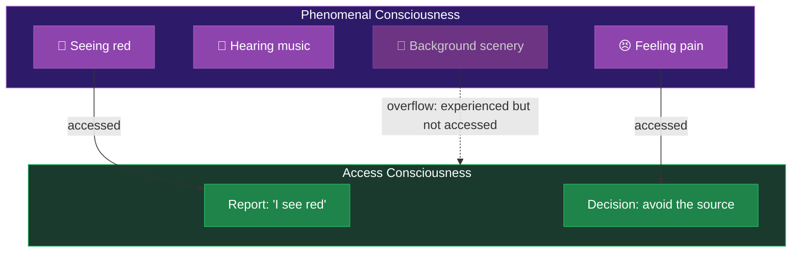

# Phenomenal Consciousness

**Phenomenal consciousness is the subjective, experiential aspect of mental life -- the "what it is like" to have an experience, as distinct from the brain's ability to use and report on that experience.**

Not all consciousness is the same kind of thing. In 1995, philosopher Ned Block drew a distinction that has shaped the field ever since: between **phenomenal consciousness** (P-consciousness) and **access consciousness** (A-consciousness). The difference is between *having* an experience and *being able to use* an experience. These two notions are often conflated, and untangling them is essential to understanding why consciousness is such a difficult scientific target.

## The Distinction

**Phenomenal consciousness** is experience itself. It is the redness of red, the sting of a paper cut, the warmth of sunlight on skin. Phenomenal consciousness is defined by its qualitative character -- the [qualia](qualia.md) that constitute it. A system is phenomenally conscious if there is something it is like to be that system.

**Access consciousness** is about information availability. A mental state is access-conscious when its content is available for reasoning, verbal report, and the control of behavior. When a person says "I see a red apple," the information about the apple is access-conscious -- it is poised for use by cognitive systems.

The key insight is that these can come apart. Consider blindsight: patients with damage to the primary visual cortex report seeing nothing in part of their visual field, yet can guess the location and orientation of objects in that "blind" region at rates far above chance. The visual information is access-conscious (it guides behavior) but arguably not phenomenally conscious (the patient reports no experience of seeing). The lights are on in the cognitive machinery, but nobody is home in the theater.

## Why the Distinction Matters

The P-consciousness / A-consciousness distinction matters because many scientific theories of consciousness explain only one side. **Global Workspace Theory** (Baars, Dehaene) provides an elegant account of access consciousness -- how information becomes globally available to multiple cognitive systems. But critics argue it leaves phenomenal consciousness unexplained. Explaining *which* information gets broadcast through the brain does not explain *why* broadcasting feels like anything.

Conversely, theories focused on phenomenal consciousness (like panpsychism or higher-order theories) sometimes struggle to explain the functional role of consciousness -- why it matters for behavior and cognition.

This is not an abstract distinction. It has practical consequences for questions like: Are patients in vegetative states conscious? Does a sophisticated AI that passes behavioral tests have experiences? Is a sleeping brain conscious? The answer depends on whether one means phenomenal or access consciousness, and assuming they always coincide leads to confusion.

## The Overflow Debate

Block also proposed **phenomenal overflow** -- the idea that phenomenal consciousness is richer than access consciousness. Visual experience seems to contain more detail than can be reported or cognitively accessed at any moment. Sperling's classic experiment (1960) showed that subjects briefly see an entire grid of letters but can only report a few before the memory fades. The full grid is phenomenally present but only partially access-conscious.

This remains contested. Some researchers argue that unreportable experience is not really experience -- that if it cannot be accessed, it is not genuinely conscious. The debate hinges on whether reportability is a reliable indicator of phenomenal consciousness, or merely a filter that lets only some experiences through.

## Figure

*Phenomenal consciousness (top) contains the full field of subjective experience. Access consciousness (bottom) captures only the subset that is available for report and cognitive use. Some experiences may "overflow" -- phenomenally present but never accessed.*

## Key Takeaway

Phenomenal consciousness is about *what it is like* to have an experience; access consciousness is about *what the brain can do* with that experience. Theories that explain one do not automatically explain the other, and conflating them is one of the most common sources of confusion in consciousness research.

## See Also

- [Hard Problem Dissolution](../hard-problem/dissolution.md)
- [Qualia](qualia.md)
- [The Explanatory Gap](../hard-problem/explanatory-gap.md)
- [FMT vs. Global Neuronal Workspace](../comparative/vs-gnw.md)
- [Not Illusionism](../philosophical/not-illusionism.md)

*Based on: Gruber, M. (2026). The Four-Model Theory of Consciousness. Zenodo. [doi:10.5281/zenodo.18669891](https://doi.org/10.5281/zenodo.18669891)*
