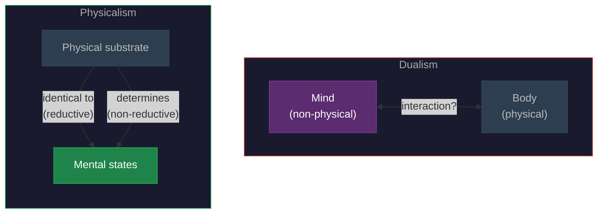

# Physicalism

**Physicalism is the view that everything that exists is physical, or depends entirely on the physical -- there are no souls, no non-physical minds, no ghostly substances outside the reach of physics.**

For most of human history, the dominant view of consciousness was **dualism**: mind and body are fundamentally different kinds of stuff. Descartes formalized this in the 17th century, proposing that the mind is a non-physical substance that interacts with the body through the pineal gland. Physicalism is, in essence, the rejection of this picture. There is one kind of stuff -- physical stuff -- and consciousness, however mysterious it seems, must ultimately be part of the physical world.

## The Core Claim

Physicalism holds that every fact about the world is ultimately a physical fact. Mental states -- beliefs, desires, experiences, [qualia](qualia.md) -- are either identical to physical states or entirely determined by them. There is no extra ingredient, no "mind-stuff" that escapes physical description.

This is not the claim that current physics is complete. Physicalists readily acknowledge that physics may need to be extended. The claim is that whatever consciousness turns out to be, it will be part of the natural order, describable by the methods of science, and not something that floats free of the physical world. A physicalist universe has no room for ghosts -- including the Cartesian ghost in the machine.

## Varieties of Physicalism

Not all physicalists agree on *how* consciousness relates to the physical. The field splits into two broad camps.

**Reductive physicalism** holds that mental states are *identical* to brain states. Pain just *is* C-fiber firing (or whatever the relevant neural correlate turns out to be). Consciousness reduces to neuroscience the way temperature reduces to mean molecular kinetic energy. On this view, once the neuroscience is complete, the mystery evaporates.

**Non-reductive physicalism** holds that mental states depend on physical states but are not identical to them. Consciousness *supervenes* on the brain -- there cannot be a change in mental states without a change in physical states -- but mental descriptions capture something that neural descriptions miss. This is analogous to how economic recessions supervene on individual transactions without being reducible to any particular set of transactions. The higher-level description does real explanatory work.

Most contemporary consciousness researchers are non-reductive physicalists. They accept that consciousness is physical but doubt that it can be fully captured by neuron-level descriptions alone. [Process physicalism](../philosophical/process-physicalism.md), for instance, holds that consciousness is a physical *process* rather than a physical *thing* -- a dynamic pattern of activity rather than a static arrangement of matter.

## The Challenge from Consciousness

Consciousness is physicalism's hardest case. Temperature was eventually identified with molecular motion, and the "mystery" of heat dissolved. But consciousness resists this treatment. Even if every neural correlate of every conscious state were identified, the question remains: *why* does this particular pattern of neural activity produce *this* particular experience? This is the [explanatory gap](../hard-problem/explanatory-gap.md), and it is the strongest objection to reductive physicalism.

Dualists argue that the explanatory gap shows physicalism is false -- that consciousness requires something beyond the physical. Physicalists counter that the gap is epistemological (a limit on our current understanding) rather than ontological (a real split in the fabric of reality). The debate is not settled, but the overwhelming majority of working neuroscientists operate within a physicalist framework, even if they disagree about the details.

## Figure

*Dualism (left) posits two fundamentally different kinds of substance with an unexplained interaction between them. Physicalism (right) holds that mental states are either identical to or fully determined by physical states -- one kind of stuff, no interaction problem.*

## Key Takeaway

Physicalism is the commitment that consciousness is part of the natural, physical world. The disagreement is about *how* -- whether consciousness reduces to brain states directly or emerges from them in a way that requires higher-level description.

## See Also

- [Process Physicalism](../philosophical/process-physicalism.md)
- [Qualia](qualia.md)
- [Weak Emergence](emergence.md)
- [Panpsychism](panpsychism.md)
- [The Explanatory Gap](../hard-problem/explanatory-gap.md)

*Based on: Gruber, M. (2026). The Four-Model Theory of Consciousness. Zenodo. [doi:10.5281/zenodo.18669891](https://doi.org/10.5281/zenodo.18669891)*
