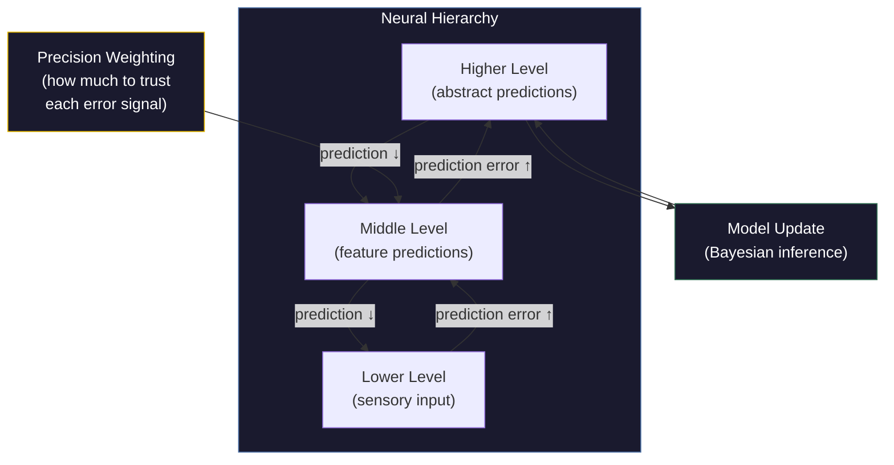

# Prediction Error

**A prediction error is the discrepancy between what the brain predicted would happen and what actually happened -- the neural surprise signal that drives learning, attention, and model updating.**

The brain is not a passive receiver of sensory data. It is a prediction machine that continuously generates expectations about incoming stimuli and then compares those expectations against reality. When the prediction matches, processing is efficient and largely unconscious. When it does not match, the resulting prediction error propagates upward through the neural hierarchy, demanding attention, triggering learning, and updating the internal model. The world is not perceived; it is predicted -- and corrected.

## The Predictive Brain

The predictive processing framework, developed by Karl Friston (2010), Andy Clark (2013), Anil Seth (2021), and others, proposes that the brain's primary function is to minimize prediction error. At every level of the neural hierarchy, higher layers send predictions downward and lower layers send prediction errors upward.

Consider hearing a familiar song. The brain predicts each note before it arrives. If the song plays as expected, minimal prediction error reaches conscious awareness -- the experience is smooth, effortless, almost automatic. Now imagine a note is wrong. The mismatch generates a prediction error that instantly captures attention: something unexpected has occurred, and the model must be updated.

This architecture explains why familiar environments feel transparent (predictions are accurate, errors are minimal) while novel environments feel overwhelming (predictions fail constantly, errors flood the system). Jet lag, culture shock, and the exhaustion of a first day at a new job are all, in part, experiences of sustained prediction error.

## Bayesian Updating

Prediction errors do not simply register "wrong." They carry information about *how* the prediction was wrong, and the brain uses this information to update its model -- a process formally analogous to **Bayesian inference**. The brain maintains prior beliefs (predictions), receives new evidence (sensory input), and computes a posterior belief (updated model) that balances prior expectations against incoming data.

If priors are strong and evidence is weak, the model barely changes -- the brain sticks with its prediction. This is why optical illusions persist even when you know they are illusions: the visual system's priors are stronger than your intellectual knowledge. If evidence is strong and priors are weak, the model updates dramatically -- the brain revises its expectations. This is learning.

## Precision Weighting

Not all prediction errors are treated equally. The brain assigns **precision weights** to both predictions and errors, reflecting confidence in each. A prediction error from a reliable sensory channel in good conditions (clear vision in daylight) is weighted heavily. The same magnitude of error from an unreliable channel (peripheral vision at night) is downweighted.

Precision weighting explains attention: attending to something increases the precision weight of its prediction errors, making them more influential on the model. It also explains psychopathology. Autism, on one influential account, involves excessively high precision on sensory prediction errors -- every mismatch demands attention, making the world feel relentlessly unpredictable. Psychosis may involve excessively low precision on prediction errors -- the brain's model drifts uncorrected because mismatches are ignored, generating hallucinations and delusions.

## Figure

*The predictive brain operates as a bidirectional hierarchy. Higher levels send predictions downward; lower levels send prediction errors upward. Precision weighting modulates how strongly each error signal influences model updating. The result is a continuously self-correcting system.*

## Key Takeaway

The brain does not passively record reality -- it actively predicts it and corrects itself via prediction errors. These error signals, weighted by precision, drive learning, attention, and perception. Understanding prediction error is foundational to understanding how the brain constructs conscious experience.

## See Also

- [FMT vs. Predictive Processing (PP)](../comparative/vs-pp.md)
- [Variable Permeability](../mechanisms/variable-permeability.md)
- [Explicit World Model (EWM)](../core-architecture/explicit-world-model.md)

*Based on: Gruber, M. (2026). The Four-Model Theory of Consciousness. Zenodo. [doi:10.5281/zenodo.18669891](https://doi.org/10.5281/zenodo.18669891)*
