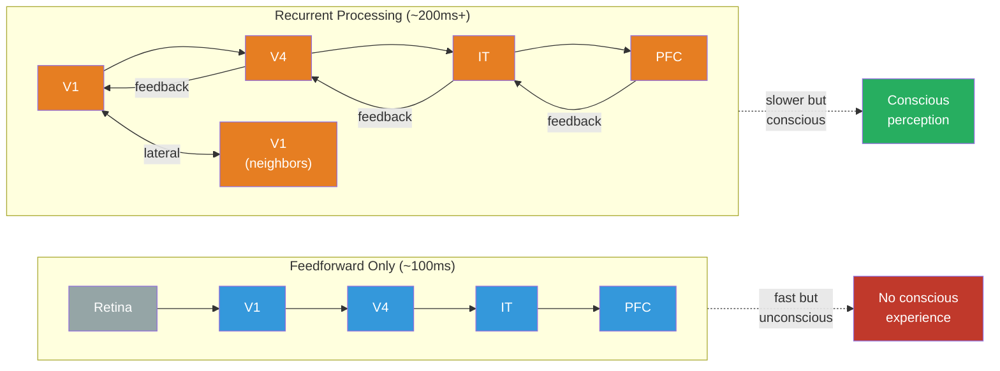

# Recurrent Processing

**Recurrent processing occurs when neural signals loop back to earlier processing stages, creating feedback cycles that transform simple detection into the kind of integrated, sustained representation that many theories consider necessary for consciousness.**

The brain does not process information in a straight line. Signals flow forward from sensory areas to higher regions, but they also flow backward, sideways, and in circles. This recurrence -- output feeding back to input -- is not a design flaw. It is, increasingly, considered the computational signature that separates conscious from unconscious processing.

## Feedforward vs. Recurrent

In **feedforward processing**, signals travel in one direction: retina to primary visual cortex (V1) to higher visual areas (V2, V4, IT) to frontal cortex. Each stage extracts more abstract features -- edges, shapes, objects, categories. This sweep is fast (~100ms for a signal to reach frontal cortex) and can support surprisingly sophisticated behavior. A feedforward network can classify an image as "face" or "not face" before the person is consciously aware of seeing anything.

In **recurrent processing**, higher areas send signals back to lower areas, and regions at the same level exchange information laterally. These feedback signals arrive at V1 roughly 100-200ms after stimulus onset -- later than the initial feedforward sweep. The result is a loop: V1 sends to V4, V4 sends back to V1, V1 re-processes and sends again. Each cycle refines, contextualizes, and integrates the representation.

The difference is like the difference between glancing at a painting and studying it. The glance (feedforward) identifies "landscape." The study (recurrent) integrates color, depth, emotional tone, memory associations, and the awareness that you are looking at a painting -- all of which require information to flow backward and laterally across the processing hierarchy.

## Lamme's Recurrent Processing Theory

Dutch neuroscientist Victor Lamme formalized the distinction between feedforward and recurrent processing into an explicit theory of consciousness ([Lamme, 2006](https://doi.org/10.1016/j.tics.2006.09.007)). His proposal is straightforward:

1. **Feedforward processing alone is unconscious.** It can drive behavior (fast reflexes, subliminal priming) but does not produce experience.
2. **Local recurrence** (loops within a single area, e.g., within V1) produces **phenomenal consciousness** -- raw experience that may not be reportable or accessible to other cognitive systems.
3. **Global recurrence** (loops spanning distant areas, involving prefrontal cortex) produces **access consciousness** -- experience that is reportable, manipulable, and available for reasoning.

The key evidence comes from masking experiments. If a brief image is followed immediately by a mask (another image that disrupts processing), the feedforward sweep reaches higher areas but recurrent signals are blocked. Result: the subject processes the image -- measurably, in their neural activity -- but reports seeing nothing. Consciousness requires the loop to complete.

## Why Loops Matter

Recurrence does several things that feedforward processing cannot:

- **Contextual modulation.** Higher areas tell lower areas what to expect, sharpening representations based on context. V1 processes the same retinal input differently depending on what the brain already knows.
- **Integration.** Recurrent loops bind features processed in different areas into unified percepts. The color, shape, motion, and identity of an object are processed in separate cortical regions; recurrence is the mechanism by which they are experienced as a single thing.
- **Sustained representation.** Feedforward signals are transient -- a brief pulse. Recurrent loops can sustain a representation over time, creating the temporal stability that experience requires.
- **Prediction and error correction.** Feedback signals carry predictions ("based on context, I expect edges here"); feedforward signals carry prediction errors ("the actual input differs from expectation"). This predictive loop is the computational core of several major theories.

## Figure

*Feedforward processing (blue) moves information forward in a single sweep -- fast but unconscious. Recurrent processing (orange) adds feedback and lateral loops that sustain and integrate representations, enabling conscious experience.*

## Key Takeaway

Recurrent processing -- signals looping back from higher to lower brain areas -- appears to be necessary for conscious experience. The feedforward sweep handles rapid classification, but consciousness requires the loop: feedback, integration, and sustained representation that only recurrence provides.

## See Also

- [FMT vs. Global Neuronal Workspace (GNW)](../comparative/vs-gnw.md)
- [The Implicit-Explicit Boundary](../mechanisms/implicit-explicit-boundary.md)
- [Neurons and the Cerebral Cortex](../basics/neurons-and-cortex.md)
- [The Criticality Requirement](../physical-foundations/criticality.md)

*Based on: Gruber, M. (2026). The Four-Model Theory of Consciousness. Zenodo. [doi:10.5281/zenodo.18669891](https://doi.org/10.5281/zenodo.18669891)*
