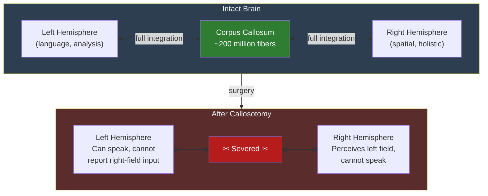

# Split-Brain and Callosotomy

**Callosotomy -- surgical severing of the corpus callosum -- reveals that the unified sense of self is a construction maintained by communication between brain hemispheres, not an intrinsic property of consciousness.**

The corpus callosum is the largest white matter structure in the brain, consisting of roughly 200 million axonal fibers connecting the left and right hemispheres. When it is cut (a procedure developed to treat severe epilepsy), the two hemispheres can no longer directly communicate. The resulting "split-brain" condition has produced some of the most striking findings in the history of neuroscience, challenging fundamental assumptions about the unity of mind.

## The Classic Experiments

Roger Sperry and Michael Gazzaniga pioneered split-brain research in the 1960s, work for which Sperry received the Nobel Prize in 1981. Their experimental paradigm exploited the anatomy of the visual system: information from the left visual field projects to the right hemisphere, and vice versa. In a normal brain, the corpus callosum instantly shares this information. In a split brain, each hemisphere sees only its half.

The key findings were startling:

- **Naming vs. pointing.** When an image was flashed to the left visual field (right hemisphere), the patient could not name it (speech is typically left-lateralized) but could point to the correct object with their left hand (controlled by the right hemisphere). The left hemisphere -- which controls speech -- literally did not know what the right hemisphere had seen.
- **Conflicting actions.** Patients occasionally experienced their two hands working at cross-purposes: one hand buttoning a shirt while the other unbuttoned it. Each hemisphere pursued its own motor agenda.
- **The interpreter.** Most remarkably, when the left hemisphere was asked to explain actions initiated by the right hemisphere (which it had no information about), it did not say "I don't know." It confabulated -- it invented a plausible but entirely fictional explanation and believed it completely.

## The Left Hemisphere Interpreter

Gazzaniga's "left hemisphere interpreter" has become one of the most influential concepts in cognitive neuroscience. In one classic experiment, the right hemisphere was shown a snow scene and the left hemisphere a chicken claw. When asked to choose related images, the right hand (left hemisphere) pointed to a chicken and the left hand (right hemisphere) pointed to a snow shovel. Asked to explain, the patient said: "The chicken claw goes with the chicken, and you need a shovel to clean out the chicken shed."

The left hemisphere had no access to the snow scene. Rather than admitting ignorance, it generated a coherent narrative linking the chicken and the shovel -- and the patient sincerely believed this explanation. This is not lying. It is the brain's narrative system doing what it always does: constructing the most coherent story from available data. In split-brain patients, the available data is incomplete, making the confabulation visible.

## Modern Reassessment

The classical "two minds in one brain" narrative has been substantially revised by modern research. [Pinto et al. (2017)](https://doi.org/10.1093/brain/aww358) demonstrated that split-brain patients maintain unified consciousness and a single sense of self, while experiencing split perception -- information presented to one visual field does not transfer to the other. This is a more nuanced picture than "two consciousnesses": the subjective experience remains unified even when perceptual channels are disconnected.

This finding suggests that whatever maintains the unity of consciousness is more distributed and redundant than a single cable connecting two halves. Cut the cable, and you get degraded communication -- not two separate minds.

## Figure

*The corpus callosum integrates the two hemispheres. After callosotomy, each hemisphere processes information independently. The left hemisphere can speak but cannot report what the right hemisphere perceives; the right hemisphere perceives the left visual field but cannot verbalize it.*

## Key Takeaway

Split-brain research reveals that the unified self is maintained by active neural communication, not by some indivisible property of consciousness. When that communication is severed, the narrative system -- the "interpreter" -- continues generating coherent stories from whatever data it has, confabulating without hesitation or awareness of its own gaps.

## See Also

- [Split-Brain Phenomena (FMT Account)](../phenomena/split-brain.md)

*Based on: Gruber, M. (2026). The Four-Model Theory of Consciousness. Zenodo. [doi:10.5281/zenodo.19064950](https://doi.org/10.5281/zenodo.19064950)*
