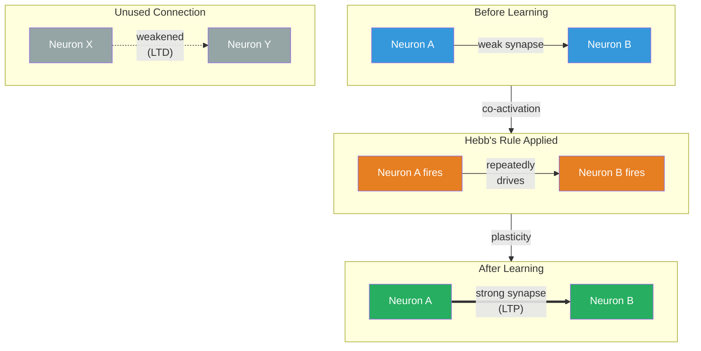

# Synaptic Weights and Plasticity

**Learning at the cellular level is the strengthening and weakening of synaptic connections between neurons -- a process called synaptic plasticity that rewires the brain through experience.**

Every skill acquired, every fact remembered, every habit formed corresponds to a physical change in the strength of connections between neurons. The brain does not learn by adding new hardware; it learns by adjusting the gain on existing connections. This mechanism -- simple in principle, staggering in scale -- is the foundation of all biological learning.

## Synaptic Weights

Each synapse has a **weight**: a measure of how effectively a signal from one neuron influences the next. A strong synapse means the presynaptic neuron can reliably cause the postsynaptic neuron to fire. A weak synapse means the signal is attenuated -- present but insufficient on its own.

Think of it as a volume knob on each connection. The brain has roughly 100 trillion such knobs, and learning is the process of turning them up and down based on experience. The pattern of weights across the entire network encodes everything the brain knows -- from the smell of coffee to the rules of grammar.

## Hebb's Rule

In 1949, Canadian psychologist Donald Hebb proposed what became the most influential idea in learning theory: "Neurons that fire together wire together." More precisely, if neuron A repeatedly contributes to firing neuron B, the synapse from A to B strengthens. The connection becomes more efficient because it has proven useful.

Hebb's rule is a **correlation detector**. It does not require a teacher or error signal -- it simply strengthens associations that co-occur. When the sight of a flame and the sensation of heat repeatedly coincide, the neurons encoding "flame" and "heat" become more tightly linked. Eventually, seeing the flame alone activates the heat representation -- you "know" it will be hot without touching it.

The inverse also holds: connections that are consistently uncorrelated weaken over time. The brain prunes what it does not use. This is not inefficiency -- it is essential. Without synaptic weakening, every connection would eventually saturate, and the network would lose its ability to discriminate between meaningful and meaningless patterns. Forgetting, at the synaptic level, is a feature.

## LTP and LTD: The Molecular Machinery

Hebb's rule was a theoretical proposal. The molecular mechanisms that implement it were discovered decades later:

**Long-term potentiation (LTP)** is the persistent strengthening of a synapse following high-frequency stimulation. First demonstrated by [Bliss and Lomo (1973)](https://doi.org/10.1113/jphysiol.1973.sp010273) in rabbit hippocampus, LTP can last hours, days, or indefinitely. The mechanism involves increased neurotransmitter release, insertion of additional receptors into the postsynaptic membrane, and ultimately structural growth of the synapse itself. LTP is the closest thing neuroscience has to a direct physical substrate of memory formation.

**Long-term depression (LTD)** is the persistent weakening of a synapse following low-frequency or poorly timed stimulation. LTD is not damage -- it is the complementary half of the learning process. Where LTP encodes "this connection matters," LTD encodes "this one does not." Together, they allow the network to sharpen its representations rather than simply accumulating noise.

The timing matters with remarkable precision. In **spike-timing-dependent plasticity (STDP)**, if the presynaptic neuron fires just before the postsynaptic neuron (within ~20ms), the synapse strengthens (LTP). If the order is reversed -- postsynaptic fires first -- the synapse weakens (LTD). This creates a directional, causal learning rule: the brain strengthens connections that predict outcomes and weakens connections that follow them. It is learning causation, not mere correlation.

## Why This Matters

Synaptic plasticity is the mechanism by which the brain builds and maintains its models of the world and the self. The implicit models -- the vast stores of learned associations, motor programs, and perceptual categories that operate below conscious awareness -- are encoded in synaptic weight configurations shaped by years of experience. Every implicit model is, at bottom, a pattern of synaptic strengths.

## Figure

*Neurons that fire together wire together (LTP strengthens the synapse). Unused connections weaken through LTD. The balance of strengthening and weakening is the basis of all neural learning.*

## Key Takeaway

All biological learning reduces to the strengthening and weakening of synaptic connections. Hebb's rule -- neurons that fire together wire together -- is implemented by LTP (strengthening) and LTD (weakening), creating a system that learns from experience by adjusting the weights of 100 trillion connections.

## See Also

- [Implicit World Model (IWM)](../core-architecture/implicit-world-model.md)
- [Neurons and the Cerebral Cortex](../basics/neurons-and-cortex.md)
- [Holographic Storage](../mechanisms/holographic-storage.md)

*Based on: Gruber, M. (2026). The Four-Model Theory of Consciousness. Zenodo. [doi:10.5281/zenodo.19064950](https://doi.org/10.5281/zenodo.19064950)*
