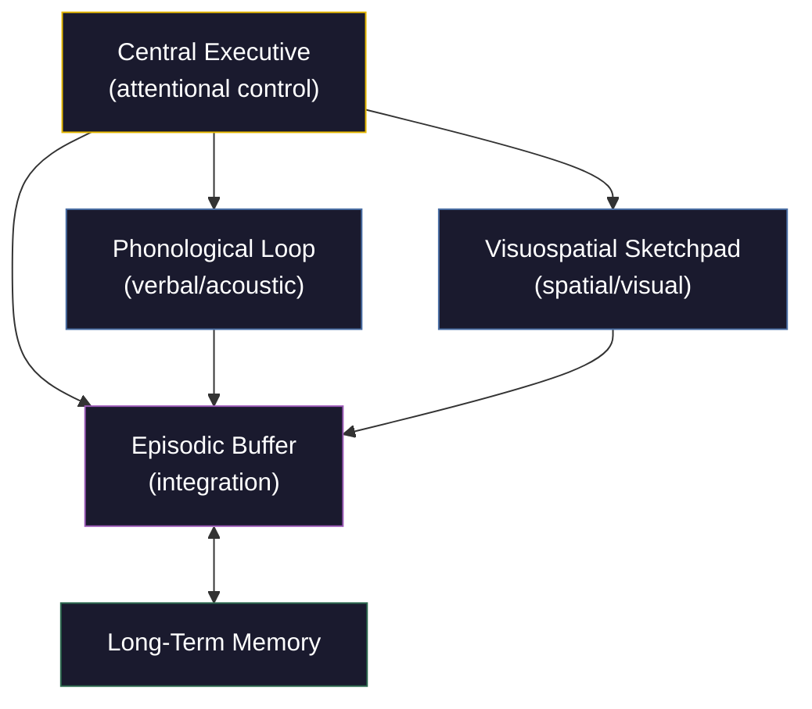

# Working Memory

**Working memory is the brain's capacity to hold and manipulate a small amount of information in real time, enabling reasoning, planning, and conscious thought.**

Unlike long-term memory, which stores vast archives of experience, working memory is the narrow bottleneck through which all deliberate cognition must pass. It is the mental workbench where information is temporarily held, combined, and transformed. Without it, reading a sentence would be impossible -- by the time the eyes reached the period, the beginning would already be gone.

## Baddeley's Multicomponent Model

The dominant model of working memory, proposed by Alan Baddeley and Graham Hitch in 1974 and refined over subsequent decades, decomposes it into distinct subsystems:

The **phonological loop** handles verbal and acoustic information. It consists of a phonological store (an "inner ear" that holds sounds for roughly two seconds) and an articulatory rehearsal process (an "inner voice" that refreshes them). This is why silently repeating a phone number keeps it available -- and why similar-sounding words are harder to hold simultaneously than dissimilar ones.

The **visuospatial sketchpad** maintains visual and spatial information -- mental images, spatial layouts, navigation paths. It is the system that lets a chess player visualize future board states or a driver remember where parked cars were a moment ago.

The **central executive** is the attentional control system that coordinates the subsystems, directs focus, and manages the interface between working memory and long-term memory. It does not store information itself -- it decides what gets stored and how it gets used. Think of it as a project manager with no desk of its own, shuffling work between departments.

Baddeley later added the **episodic buffer** (2000), a limited-capacity system that integrates information across the subsystems and binds it with long-term memory into coherent episodes -- the mechanism that lets the brain combine what something looks like, what it sounds like, and what it means into a unified experience.

## Capacity Limits

Working memory is famously constrained. George Miller's (1956) "magical number seven, plus or minus two" was the original estimate, but modern research converges on roughly **four chunks** as the true capacity of focused attention (Cowan, 2001). A chunk can be a digit, a word, or an entire familiar pattern -- expertise effectively increases capacity by making larger chunks available.

These limits are not bugs; they are architectural features. A system that held everything in active manipulation simultaneously would face a combinatorial explosion of possible interactions. The bottleneck forces prioritization, which forces relevance assessment, which forces the kind of selective processing that constitutes intelligent behavior.

## Why It Matters

Working memory capacity is one of the strongest single predictors of fluid intelligence, academic performance, and reasoning ability. The correlation between working memory span tasks and general intelligence tests is robust across cultures and age groups. This is not coincidental -- if intelligence involves manipulating abstract representations, then the system that does the manipulating is necessarily central to it.

## Figure

*Baddeley's multicomponent model of working memory. The central executive directs attention across the phonological loop and visuospatial sketchpad. The episodic buffer integrates information from all sources, including long-term memory, into coherent representations.*

## Key Takeaway

Working memory is the narrow, capacity-limited bottleneck through which all deliberate thought must pass -- its constraints shape what the brain can consciously process and are central to understanding both intelligence and conscious experience.

## See Also

- [The Three Components: Knowledge, Performance, Motivation](../intelligence/three-components.md)
- [The Recursive Intelligence Model](../intelligence/overview.md)
- [Explicit Self Model (ESM)](../core-architecture/explicit-self-model.md)

*Based on: Gruber, M. (2026). The Four-Model Theory of Consciousness. Zenodo. [doi:10.5281/zenodo.18669891](https://doi.org/10.5281/zenodo.18669891)*
