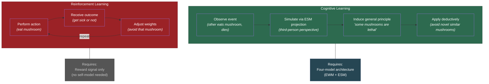

# Cognitive Learning vs. Reinforcement Learning

**Cognitive learning — the induction of general theories from particular observations — requires consciousness. Reinforcement learning — trial-and-error optimization against a reward signal — does not. This distinction is the hinge on which the consciousness-intelligence bridge turns.**

The difference between these two modes of learning is not a matter of degree. It is a qualitative difference in mechanism, capability, and prerequisite architecture. Reinforcement learning proceeds by direct experience: try, receive feedback, adjust. Cognitive learning proceeds by simulation: observe, model, induce a general principle, apply it to novel cases without direct experience. The second mode is strictly more powerful — and it requires the [four-model architecture](../core-architecture/four-model-theory.md) that constitutes consciousness.

## Reinforcement Learning: No Consciousness Required

Reinforcement learning operates through a simple loop: action, outcome, reward signal, adjustment. The system does not need to understand *why* an action succeeded or failed — it needs only to detect the correlation between action and reward and adjust its weights accordingly.

This mode of learning is available to systems without consciousness. Bacteria exhibit chemotaxis — movement toward chemical gradients — through molecular reward signals. Artificial neural networks trained via reinforcement learning (RL) master Atari games, Go, and protein folding without any self-model, without any world model in the conscious sense, and without any understanding of what they are doing. RL is powerful, general, and substrate-independent. It does not require the [explicit models](../core-architecture/real-virtual-split.md).

But RL has a critical limitation: **the learner must survive the learning trial.** An organism learning by reinforcement which foods are poisonous must eat the food and survive the consequences. For many ecological challenges — predator avoidance, toxic substance identification, dangerous terrain navigation — this is an unacceptable constraint.

## Cognitive Learning: Consciousness Required

Cognitive learning solves the survival problem through **third-person perspective simulation**. The [Explicit Self Model](../core-architecture/explicit-self-model.md) can be projected onto an observed other: by watching another organism eat a poisonous mushroom and die, a conscious system can induce the general principle "some mushrooms are lethal" without personal exposure.

This is not pattern matching (which RL can do). It is the construction of a **categorical abstraction** — a general theory — from a particular observation. The system does not merely learn "that specific mushroom is dangerous." It induces "mushrooms with these features may be dangerous" and applies the rule deductively to novel instances it has never encountered. This requires:

1. An [Explicit World Model](../core-architecture/explicit-world-model.md) capable of representing causal relationships and running hypothetical scenarios.
2. An [Explicit Self Model](../core-architecture/explicit-self-model.md) capable of perspective-taking — projecting the self-model onto observed others.
3. The [self-referential closure](../core-architecture/self-referential-closure.md) that makes the system's own modeling process available for meta-level reasoning.

These are the architectural resources that the four-model architecture provides and that non-conscious systems lack.

## Why the Recursive Loop Requires Cognitive Learning

The [recursive intelligence loop](../intelligence/recursive-loop.md) depends on the Knowledge-Performance pathway: learned strategies improve processing, and greater processing capacity enables deeper learning. This pathway requires cognitive learning because:

- **[Operational knowledge](../intelligence/operational-knowledge.md) is a product of cognitive learning.** Learning strategies, metacognitive skills, and reasoning heuristics are general theories about how to learn — induced from particular learning experiences and applied to novel domains. RL cannot produce them because RL does not produce general theories.
- **Transfer requires abstraction.** The recursive loop compounds because knowledge acquired in one domain transfers to another. Transfer requires the kind of categorical abstraction that cognitive learning provides. RL produces domain-specific optimization, not transferable strategies.
- **The loop requires self-observation.** Monitoring one's own learning process — a prerequisite for developing operational knowledge — requires the ESM to observe the system's own cognitive activity. This is precisely the self-referential capacity that consciousness provides.

## Figure

## Key Takeaway

Reinforcement learning is powerful but blind — it optimizes against a reward signal without understanding what it is doing or why. Cognitive learning sees: it observes, models, abstracts, and transfers. The difference is not sophistication but architecture. Cognitive learning requires the explicit models that consciousness provides. This is why the recursive intelligence loop — which depends on transferable strategies and self-observation — requires consciousness, and why current AI systems, despite extraordinary reinforcement-learning performance, do not exhibit self-directed intellectual development.

## See Also

- [Consciousness-Intelligence Bridge](../bridge/consciousness-intelligence-bridge.md)
- [The Dual Evaluation Architecture and Intelligence](../bridge/dual-evaluation-intelligence.md)
- [The Four-Model Theory](../core-architecture/four-model-theory.md)
- [Operational Knowledge: The Hidden Multiplier](../intelligence/operational-knowledge.md)
- [The AI Diagnostic: What Machines Are Missing](../ai-consciousness/ai-diagnostic.md)
