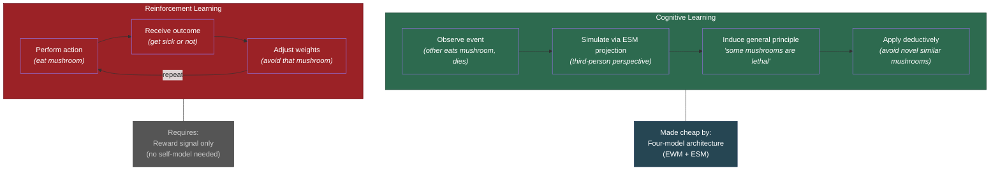

# Cognitive Learning vs. Reinforcement Learning

**Cognitive learning — the induction of general theories from particular observations — is what the conscious architecture makes affordable. Reinforcement learning — trial-and-error optimization against a reward signal — needs no self-model at all. The difference in cost between them is the hinge on which the consciousness-intelligence bridge turns.**

The two modes differ in mechanism. Reinforcement learning proceeds by direct experience: try, receive feedback, adjust. Cognitive learning proceeds by simulation: observe, model, induce a general principle, apply it to novel cases without direct experience. The [four-model architecture](../core-architecture/four-model-theory.md) that constitutes consciousness makes the second mode cheap. The advantage is one of cost, not of possibility: the theory claims no operation that non-conscious processing is barred from.

## Reinforcement Learning: No Consciousness Required

Reinforcement learning operates through a simple loop: action, outcome, reward signal, adjustment. The system does not need to understand *why* an action succeeded or failed — it needs only to detect the correlation between action and reward and adjust its weights accordingly.

This mode of learning is available to systems without consciousness. Bacteria exhibit chemotaxis — movement toward chemical gradients — through molecular reward signals. Artificial neural networks trained via reinforcement learning (RL) master Atari games and Go without any self-model, without any world model in the conscious sense, and without any understanding of what they are doing. RL is powerful, general, and substrate-independent. It does not require the [explicit models](../core-architecture/real-virtual-split.md).

But RL has a critical limitation: **the learner must survive the learning trial.** An organism learning by reinforcement which foods are poisonous must eat the food and survive the consequences. For many ecological challenges — predator avoidance, toxic substance identification, dangerous terrain navigation — this is an unacceptable constraint.

## Cognitive Learning: What Consciousness Makes Cheap

Cognitive learning solves the survival problem through **third-person perspective simulation**. The [Explicit Self Model](../core-architecture/explicit-self-model.md) can be projected onto an observed other: by watching another organism eat a poisonous mushroom and die, a conscious system can induce the general principle "some mushrooms are lethal" without personal exposure.

This goes beyond pattern matching (which RL can do): it is the construction of a **categorical abstraction** — a general theory — from a particular observation. The system does not merely learn "that specific mushroom is dangerous." It induces "mushrooms with these features may be dangerous" and applies the rule deductively to novel instances it has never encountered. This requires:

1. An [Explicit World Model](../core-architecture/explicit-world-model.md) capable of representing causal relationships and running hypothetical scenarios.
2. An [Explicit Self Model](../core-architecture/explicit-self-model.md) capable of perspective-taking — projecting the self-model onto observed others.
3. The [self-referential closure](../core-architecture/self-referential-closure.md) that makes the system's own modeling process available for meta-level reasoning.

These are the architectural resources the four-model architecture provides. Modeling another agent by re-pointing an already-rich self-model is one model in many deployments; a system without one must build a separate model per perspective and pay for each. A sufficiently elaborated world-model could in principle reach the same competence, at a price no organism under a metabolic and lifetime-bounded budget could pay.

## Why the Recursive Loop Turns on Cognitive Learning

The [recursive intelligence loop](../intelligence/recursive-loop.md) depends on the Knowledge-Performance pathway: learned strategies improve processing, and greater processing capacity enables deeper learning. This pathway turns on cognitive learning because:

- **[Operational knowledge](../intelligence/operational-knowledge.md) is a product of cognitive learning.** Learning strategies, metacognitive skills, and reasoning heuristics are general theories about how to learn — induced from particular learning experiences and applied to novel domains. Trial-and-error reward optimization reaches them, if at all, only one contingency at a time.
- **Transfer requires abstraction.** The recursive loop compounds because knowledge acquired in one domain transfers to another. Transfer requires the kind of categorical abstraction that cognitive learning supplies cheaply; plain reward optimization tends toward domain-specific solutions.
- **The loop uses self-observation.** In the conscious architecture, monitoring one's own learning process — a route to operational knowledge — is the ESM observing the system's own cognitive activity.

## Figure

```mermaid
graph TD
    subgraph CL["Cognitive Learning"]
        OBS["Observe event<br/><i>(other eats mushroom, dies)</i>"]
        SIM["Simulate via ESM projection<br/><i>(third-person perspective)</i>"]
        IND["Induce general principle<br/><i>'some mushrooms are lethal'</i>"]
        APP["Apply deductively<br/><i>(avoid novel similar mushrooms)</i>"]
        OBS --> SIM --> IND --> APP
    end

    subgraph RL["Reinforcement Learning"]
        ACT["Perform action<br/><i>(eat mushroom)</i>"]
        OUT["Receive outcome<br/><i>(get sick or not)</i>"]
        ADJ["Adjust weights<br/><i>(avoid that mushroom)</i>"]
        ACT --> OUT --> ADJ
        ADJ -->|"repeat"| ACT
    end

    REQ1["Made cheap by:<br/>Four-model architecture<br/>(EWM + ESM)"]
    REQ2["Requires:<br/>Reward signal only<br/>(no self-model needed)"]

    CL --- REQ1
    RL --- REQ2

    style CL fill:#2d6a4f,color:#fff,stroke:#1b4332
    style RL fill:#9b2226,color:#fff,stroke:#6a040f
    style REQ1 fill:#264653,color:#fff,stroke:#1d3557
    style REQ2 fill:#555,color:#ccc,stroke:#333
    style OBS fill:#2d6a4f,color:#fff
    style SIM fill:#2d6a4f,color:#fff
    style IND fill:#2d6a4f,color:#fff
    style APP fill:#2d6a4f,color:#fff
    style ACT fill:#9b2226,color:#fff
    style OUT fill:#9b2226,color:#fff
    style ADJ fill:#9b2226,color:#fff
```

## Key Takeaway

Reinforcement learning is powerful but blind — it optimizes against a reward signal without understanding what it is doing or why. Cognitive learning observes, models, abstracts, and transfers. The explicit models that consciousness provides make cognitive learning cheap enough for an organism to rely on, and the recursive intelligence loop — which depends on transferable strategies and self-observation — turns on it. The claim is about cost, not possibility. Current AI systems approximate aspects of cognitive learning through redeployment of learned structure, but they do not redeploy a self-model across perspectives and do not exhibit self-directed intellectual development.

## See Also

- [Consciousness-Intelligence Bridge](../bridge/consciousness-intelligence-bridge.md)
- [The Dual Evaluation Architecture and Intelligence](../bridge/dual-evaluation-intelligence.md)
- [The Four-Model Theory](../core-architecture/four-model-theory.md)
- [Operational Knowledge: The Hidden Multiplier](../intelligence/operational-knowledge.md)
- [The AI Diagnostic: What Machines Are Missing](../ai-consciousness/ai-diagnostic.md)
