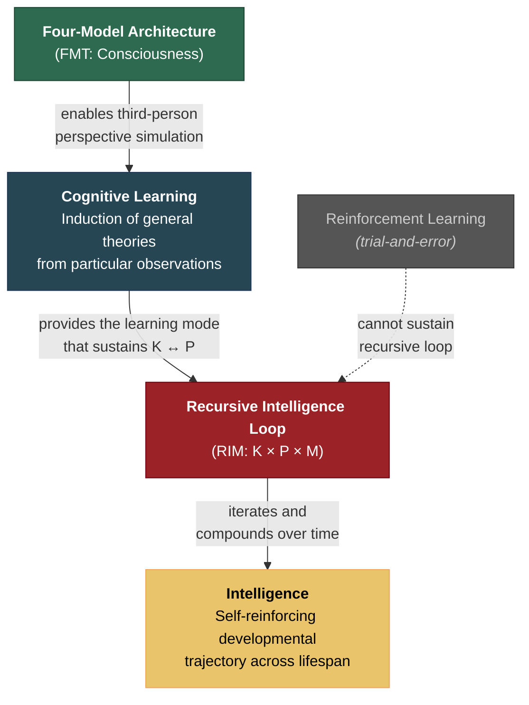

# Consciousness-Intelligence Bridge

**The Four-Model Theory and the Recursive Intelligence Model are not independent theories — they are linked by a specific causal chain: consciousness enables cognitive learning, cognitive learning enables the recursive intelligence loop, and the recursive loop constitutes intelligence.**

Consciousness and intelligence are often treated as separate research domains, studied by different communities with different methods. The Standard Model of Consciousness argues that they are causally linked through a precise mechanism: the [four-model architecture](../core-architecture/four-model-theory.md) that constitutes consciousness enables a mode of learning — **cognitive learning** — that no non-conscious system can replicate. Cognitive learning, in turn, is the prerequisite for the [recursive intelligence loop](../intelligence/recursive-loop.md) to self-sustain. Without consciousness, no cognitive learning. Without cognitive learning, no recursive loop. Without the recursive loop, no intelligence in the full sense.

## The Causal Chain

The bridge has three links:

**Link 1: Consciousness enables cognitive learning.** The [four-model architecture](../core-architecture/four-model-theory.md) — specifically the [Explicit Self Model](../core-architecture/explicit-self-model.md) and [Explicit World Model](../core-architecture/explicit-world-model.md) — enables a system to simulate consequences without experiencing them directly. A conscious system can observe another organism eat a poisonous mushroom, project its ESM onto the observed other, and induce the general principle "some mushrooms are lethal" — all without personal exposure. This is [cognitive learning](../bridge/cognitive-vs-reinforcement.md): the induction of general theories from particular observations via third-person perspective simulation.

**Link 2: Cognitive learning enables the recursive loop.** The [recursive intelligence loop](../intelligence/recursive-loop.md) requires that [Knowledge](../intelligence/three-components.md) enhance Performance, that Performance enhance Knowledge, and that both interact with Motivation. The Knowledge-Performance pathway depends on cognitive learning: it is the mechanism by which learned strategies (operational knowledge) improve processing efficiency, and by which greater processing capacity enables deeper learning. Reinforcement learning — trial-and-error — cannot sustain this recursive dynamic because it does not produce the categorical abstractions and transferable strategies that make the loop compound.

**Link 3: The recursive loop constitutes intelligence.** Intelligence is not a static trait but a [recursive system](../intelligence/overview.md) whose behavior is determined by the interaction of Knowledge, Performance, and Motivation over time. The loop iterates across a lifespan, compounding gains through the [Matthew effect](../intelligence/matthew-effect.md). This self-reinforcing dynamic is what separates intelligence from mere information processing.

## Why the Bridge Matters

The bridge has three consequences that neither theory produces alone:

First, it predicts that **consciousness is necessary for intelligence** in the full, self-developing sense. Systems without the four-model architecture can perform reinforcement learning (and perform it well), but they cannot sustain the recursive loop. This explains the [AI diagnostic](../ai-consciousness/ai-diagnostic.md): current AI systems have vast Knowledge and high Performance but no self-directed development — they lack not only Motivation but the consciousness-dependent cognitive learning that would let the loop function even if Motivation were engineered.

Second, it implies that **intelligence is an evolutionary consequence of consciousness**, not the other way around. Consciousness evolved because the four-model architecture confers a specific survival advantage (cognitive learning in environments with lethal contingencies). Intelligence — the recursive, self-reinforcing loop — is a downstream consequence of that architecture.

Third, it establishes that the [dual evaluation architecture](../bridge/dual-evaluation-intelligence.md) is the interface between the two theories: the mechanism by which the substrate deploys the conscious simulation for consequence-evaluation, and by which conscious evaluations feed back to reshape the implicit models through learning.

## Figure

## Key Takeaway

Consciousness and intelligence are not merely correlated — they are causally linked through cognitive learning. The four-model architecture enables a qualitatively different mode of learning (cognitive) that reinforcement learning cannot replicate, and this mode of learning is the prerequisite for the recursive intelligence loop that constitutes intelligence. The bridge is a specific, testable causal chain, not a philosophical gesture.

## See Also

- [Cognitive Learning vs. Reinforcement Learning](../bridge/cognitive-vs-reinforcement.md)
- [The Dual Evaluation Architecture and Intelligence](../bridge/dual-evaluation-intelligence.md)
- [The Four-Model Theory](../core-architecture/four-model-theory.md)
- [The Recursive Intelligence Model (Overview)](../intelligence/overview.md)
- [The Recursive Loop](../intelligence/recursive-loop.md)
