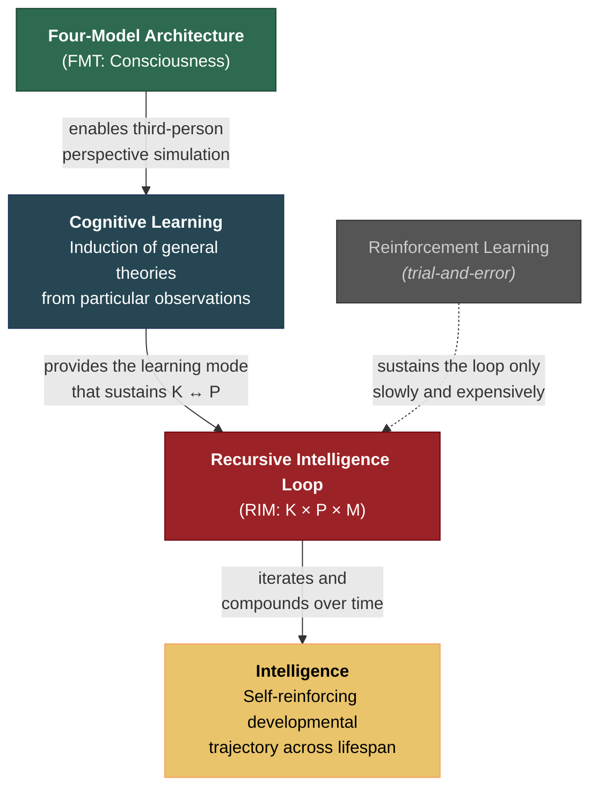

# Consciousness-Intelligence Bridge

**The Four-Model Theory and the Recursive Intelligence Model are linked by a proposed causal chain: the conscious architecture makes cognitive learning affordable, cognitive learning drives the recursive intelligence loop, and the recursive loop constitutes intelligence.**

Consciousness and intelligence are often treated as separate research domains, studied by different communities with different methods. The Four-Model Theory proposes a causal link between them: the [four-model architecture](../core-architecture/four-model-theory.md) that constitutes consciousness makes a mode of learning — **cognitive learning** — cheap for an organism under a metabolic and lifetime-bounded budget. Cognitive learning, in turn, is what the [recursive intelligence loop](../intelligence/recursive-loop.md) turns on. The advantage is one of cost, not of possibility: the theory claims no operation that non-conscious processing is barred from, only that the explicit models make a class of otherwise expensive competences affordable. The link is a conjecture. The Recursive Intelligence Model treats the four-model architecture as one candidate answer to what supplies cognitive learning, and its own claims do not depend on it.

## The Causal Chain

The bridge has three links:

**Link 1: Consciousness makes cognitive learning affordable.** The [four-model architecture](../core-architecture/four-model-theory.md) — specifically the [Explicit Self Model](../core-architecture/explicit-self-model.md) and [Explicit World Model](../core-architecture/explicit-world-model.md) — enables a system to simulate consequences without experiencing them directly. A conscious system can observe another organism eat a poisonous mushroom, project its ESM onto the observed other, and induce the general principle "some mushrooms are lethal" — all without personal exposure. This is [cognitive learning](../bridge/cognitive-vs-reinforcement.md): the induction of general theories from particular observations via third-person perspective simulation.

**Link 2: Cognitive learning enables the recursive loop.** The [recursive intelligence loop](../intelligence/recursive-loop.md) requires that [Knowledge](../intelligence/three-components.md) enhance Performance, that Performance enhance Knowledge, and that both interact with Motivation. The Knowledge-Performance pathway depends on cognitive learning: it is the mechanism by which learned strategies (operational knowledge) improve processing efficiency, and by which greater processing capacity enables deeper learning. Reinforcement learning — trial-and-error — pays for each contingency by undergoing it, so on its own it builds the categorical abstractions and transferable strategies that make the loop compound only slowly and at high cost.

**Link 3: The recursive loop constitutes intelligence.** Intelligence is not a static trait but a [recursive system](../intelligence/overview.md) whose behavior is determined by the interaction of Knowledge, Performance, and Motivation over time. The loop iterates across a lifespan, compounding gains through the [Matthew effect](../intelligence/matthew-effect.md). This self-reinforcing dynamic is what separates intelligence from mere information processing.

## Why the Bridge Matters

The bridge has three consequences that neither theory produces alone:

First, it predicts that **consciousness is what made self-developing intelligence affordable** for organisms. Systems without the four-model architecture can perform reinforcement learning (and perform it well), and in principle a sufficiently elaborated world-model could reach any competence the self-model reaches; what differs is the price of reaching it within a lifetime. This bears on the [AI diagnostic](../ai-consciousness/ai-diagnostic.md): current AI systems have vast Knowledge and high Performance but no self-directed development. Large language models approximate aspects of cognitive learning — transfer learning and in-context generalization are themselves redeployments of learned structure — but they lack Motivation, and they do not redeploy a self-model across perspectives.

Second, it implies that **intelligence is an evolutionary consequence of consciousness**, not the other way around. Consciousness evolved because the four-model architecture confers a specific survival advantage (cheap cognitive learning in environments with lethal contingencies, where learning a contingency by undergoing it can cost the organism its life). Intelligence — the recursive, self-reinforcing loop — is a downstream consequence of that architecture.

Third, it establishes that the [dual evaluation architecture](../bridge/dual-evaluation-intelligence.md) is the interface between the two theories: the mechanism by which the substrate deploys the conscious simulation for consequence-evaluation, and by which conscious evaluations feed back to reshape the implicit models through learning.

## Figure

```mermaid
graph TD
    FMT["<b>Four-Model Architecture</b><br/>(FMT: Consciousness)"]
    CL["<b>Cognitive Learning</b><br/>Induction of general theories<br/>from particular observations"]
    RL["<b>Recursive Intelligence Loop</b><br/>(RIM: K × P × M)"]
    INT["<b>Intelligence</b><br/>Self-reinforcing developmental<br/>trajectory across lifespan"]

    FMT -->|"enables third-person<br/>perspective simulation"| CL
    CL -->|"provides the learning mode<br/>that sustains K ↔ P"| RL
    RL -->|"iterates and<br/>compounds over time"| INT

    REIN["Reinforcement Learning<br/><i>(trial-and-error)</i>"]
    REIN -.->|"sustains the loop only<br/>slowly and expensively"| RL

    style FMT fill:#2d6a4f,color:#fff,stroke:#1b4332
    style CL fill:#264653,color:#fff,stroke:#1d3557
    style RL fill:#9b2226,color:#fff,stroke:#6a040f
    style INT fill:#e9c46a,color:#000,stroke:#f4a261
    style REIN fill:#555,color:#ccc,stroke:#333
```

## Key Takeaway

The proposed link between consciousness and intelligence runs through cognitive learning. The four-model architecture makes a mode of learning (cognitive) affordable that reinforcement learning reaches only at far higher cost, and the recursive intelligence loop that constitutes intelligence turns on that mode of learning. The advantage is economic, not a barrier, and the chain is a conjecture whose links can each be tested.

## See Also

- [Cognitive Learning vs. Reinforcement Learning](../bridge/cognitive-vs-reinforcement.md)
- [The Dual Evaluation Architecture and Intelligence](../bridge/dual-evaluation-intelligence.md)
- [The Four-Model Theory](../core-architecture/four-model-theory.md)
- [The Recursive Intelligence Model (Overview)](../intelligence/overview.md)
- [The Recursive Loop](../intelligence/recursive-loop.md)
