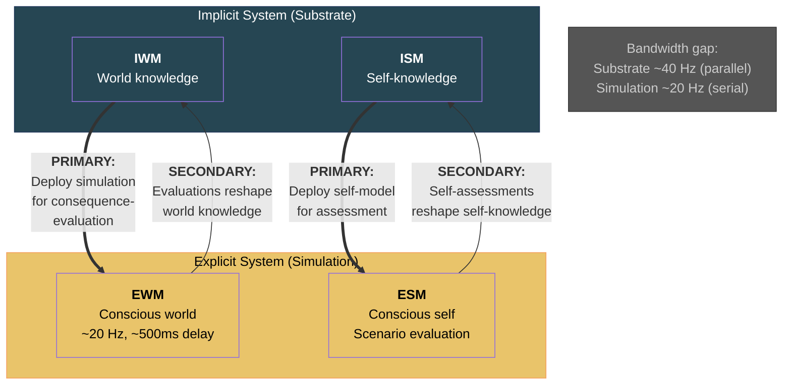

# The Dual Evaluation Architecture and Intelligence

**The substrate deploys the conscious simulation as its mechanism for consequence-evaluation — and the simulation's independent assessments, though bandwidth-limited, feed back to reshape the implicit models through learning. This two-way traffic is the interface between consciousness and intelligence.**

The relationship between substrate and simulation is not epiphenomenal. The [implicit models](../core-architecture/real-virtual-split.md) — the IWM and ISM — generate the [explicit models](../core-architecture/real-virtual-split.md) — the EWM and ESM — for a concrete adaptive reason: the explicit models serve as the substrate's evaluation mechanism. The substrate presents decisions, actions, and their consequences to the simulation so that the simulation can assess outcomes, run scenarios, and register hedonic valence. This is the primary direction of traffic. But traffic also flows in reverse: the simulation's evaluations reshape the implicit models through learning, shaping the very substrate that generates the simulation.

## The Primary Direction: Substrate Uses Simulation

The [implicit system](../core-architecture/implicit-world-model.md) processes information at vastly higher throughput than the conscious simulation — parallel, distributed, operating at approximately 40 Hz across the full cortical substrate. But raw processing power does not provide evaluation. The implicit models can pattern-match, predict, and respond, but they cannot run hypothetical scenarios or assess consequences against a self-model. That requires the virtual simulation.

The substrate actively deploys the EWM and ESM for consequence-observation. A concrete example: when the implicit system detects a potentially dangerous situation (a snake-like shape in peripheral vision), it generates a conscious scene — the EWM constructs a visual world including the object, and the ESM provides a self-perspective from which to evaluate the threat. The simulation runs the scenario: "Is this dangerous? What should I do? What are the consequences of each option?" The implicit system uses the simulation's evaluation to guide subsequent action.

This is not idle accompaniment. It is the mechanism natural selection shaped the four-model architecture to perform: consequence-observation and future-oriented adaptation through virtual scenario evaluation.

## The Secondary Direction: Simulation Reshapes Substrate

The explicit models also evaluate independently — and their evaluations feed back to modify the implicit models. This is the pathway through which conscious experience shapes future behavior.

When the simulation assesses an outcome (a hedonic valence, a judgment of success or failure, a causal attribution), that assessment is not discarded. It feeds back into the [ISM](../core-architecture/implicit-self-model.md) and [IWM](../core-architecture/implicit-world-model.md), updating the substrate's stored models. A student who consciously evaluates a failed exam ("I did not study the right material") modifies the ISM's learning strategies — a change in [operational knowledge](../intelligence/operational-knowledge.md) that will affect all subsequent learning. A child who consciously registers that a stove is hot updates the IWM's causal model of thermal objects.

This secondary pathway is what makes the dual evaluation architecture relevant to intelligence. The [recursive loop](../intelligence/recursive-loop.md) requires that learning experiences reshape the system's knowledge base and strategies. Conscious evaluation is the mechanism through which this reshaping occurs: the simulation assesses, and the assessment modifies the substrate.

## Bandwidth Limits

The simulation operates at approximately 20 Hz with a processing delay of roughly 500 ms — far slower than the substrate's processing rate. This bandwidth limitation has consequences:

- The simulation cannot evaluate everything the substrate processes. Most implicit processing proceeds without conscious evaluation.
- Conscious evaluation is selective — deployed where the implicit system detects novelty, ambiguity, or high stakes.
- The bandwidth limit explains why expertise shifts processing from conscious to automatic: once a skill is sufficiently trained, the implicit system handles it without deploying the expensive conscious evaluation mechanism.

The bandwidth gap means that the dual evaluation architecture is asymmetric: the substrate uses the simulation strategically, not continuously. The simulation is a slow but powerful evaluation instrument — deployed where its capabilities (scenario simulation, self-referential assessment, categorical abstraction) justify the processing cost.

## Figure

## Key Takeaway

The dual evaluation architecture is not a philosophical concession to the causal efficacy of consciousness — it is a concrete functional mechanism. The substrate deploys the simulation for evaluation (primary), and the simulation's evaluations reshape the substrate through learning (secondary). This two-way traffic is the interface point between consciousness (FMT) and intelligence (RIM): it is the mechanism through which conscious experience feeds into the recursive loop that constitutes intelligence.

## See Also

- [Consciousness-Intelligence Bridge](../bridge/consciousness-intelligence-bridge.md)
- [Consciousness as Process, Not Agent](../philosophical/consciousness-as-process.md)
- [The Real/Virtual Split](../core-architecture/real-virtual-split.md)
- [The Recursive Loop](../intelligence/recursive-loop.md)
- [Cognitive Learning vs. Reinforcement Learning](../bridge/cognitive-vs-reinforcement.md)
