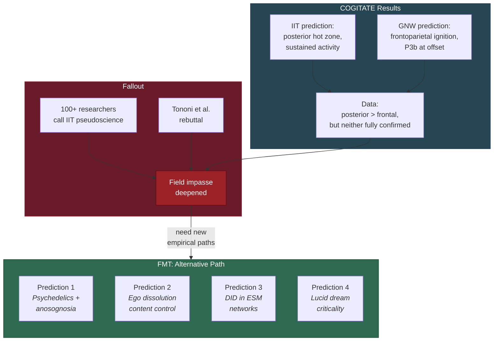

# COGITATE and Adversarial Collaborations

**The COGITATE adversarial collaboration produced equivocal results -- neither IIT nor GNW was fully confirmed -- and the subsequent IIT pseudoscience controversy exposed deep methodological fissures in consciousness science. FMT's predictions offer alternative empirical paths that do not require adjudicating between the field's two dominant camps.**

The adversarial collaboration paradigm was supposed to break the impasse in consciousness science by forcing competing theories to make divergent predictions and submit them to joint experimental test. COGITATE was the most ambitious attempt. Its results, published in *Nature* (COGITATE Consortium, 2025), did not resolve the debate but deepened it -- and the fallout has reshaped the field's self-understanding.

## What COGITATE Tested

COGITATE (protocol: Melloni et al., 2023) pitted Integrated Information Theory (IIT) against Global Neuronal Workspace (GNW) in a pre-registered adversarial design. The theories made divergent predictions about the neural signatures of conscious perception:

- **IIT** predicted that consciousness would be associated with sustained posterior cortical activity, reflecting integrated information in the posterior "hot zone."
- **GNW** predicted that consciousness would be associated with a late frontoparietal "ignition" -- a sudden, all-or-nothing broadcasting of content across the global neuronal workspace, particularly visible as a P3b event-related potential at stimulus offset.

## What COGITATE Found

The results were equivocal. The data favored posterior cortical involvement -- more consistent with IIT's spatial prediction than with GNW's frontoparietal emphasis. However, IIT's specific prediction about sustained activity was not cleanly confirmed. GNW's predicted "ignition at offset" was absent. Neither theory was fully confirmed; neither was decisively refuted.

The most accurate summary: the data told both camps they were partly right and partly wrong, and provided neither with a clean victory. For a field hoping that adversarial collaboration would produce decisive progress, COGITATE was a disappointment -- a million-dollar experiment that confirmed the [pre-paradigm state](../foundations/pre-paradigm.md) rather than resolving it.

## The IIT Pseudoscience Controversy

The equivocal COGITATE results were eclipsed by a more dramatic development: a letter signed by over 100 researchers declared IIT pseudoscientific (IIT-Concerned et al., 2025). The letter argued that IIT's core claims -- particularly the identification of consciousness with integrated information (Phi) and its panpsychist consequences -- are unfalsifiable in practice and constitute pseudoscience.

The response was fierce. Tononi, Albantakis, and colleagues published detailed rebuttals (2025), defending IIT's empirical commitments and mathematical rigor. Methodological commentary (Gomez-Marin & Seth, 2025) argued that calling a theory pseudoscientific was itself a category error -- IIT makes testable predictions, even if some are computationally intractable.

The controversy matters beyond IIT because it exposed a deeper problem: the field lacks agreed-upon criteria for what counts as a testable prediction in consciousness science. When the most mathematically rigorous theory in the field can be accused of pseudoscience by a hundred of its colleagues, the issue is not just IIT -- it is the field's epistemic foundations.

## What This Means for FMT

The COGITATE results and IIT controversy create an opening for theories that offer **alternative empirical paths** -- predictions that do not require adjudicating between IIT and GNW, do not depend on computing intractable quantities like Phi, and test mechanisms that neither IIT nor GNW addresses.

FMT's [four predictions](../predictions/confirmed.md) do exactly this:

- **[Prediction 1](../predictions/prediction-1-anosognosia.md)**: Psychedelics alleviate anosognosia. Neither IIT nor GNW generates this prediction. It tests the [variable permeability](../mechanisms/variable-permeability.md) mechanism unique to FMT.
- **[Prediction 2](../predictions/prediction-2-ego-dissolution.md)**: Ego dissolution content is controllable via sensory input. Tests the [redirectable ESM](../mechanisms/redirectable-esm.md) mechanism -- no other theory specifies what a subject will "become" during ego dissolution.
- **[Prediction 3](../predictions/prediction-3-did.md)**: DID alter switches are concentrated in ESM-related networks. IIT predicts posterior cortex integration differences; GNW predicts prefrontal ignition differences. Only FMT predicts DMN-concentrated alter-specific patterns.
- **[Prediction 4](../predictions/prediction-4-lucid-dreaming.md)**: Lucid dream onset is a criticality threshold crossing. Tests the [criticality requirement](../physical-foundations/criticality.md) in a context where IIT and GNW make different (and less specific) predictions.

None of these predictions requires taking sides in the IIT-GNW debate. They test FMT-specific mechanisms on FMT-specific phenomena. If confirmed, they would establish FMT as a theory with empirical support independent of the dominant rivalry.

## The Deeper Lesson

Adversarial collaboration assumes that progress comes from forcing a choice between existing theories. COGITATE showed the limits of this assumption: when both theories are partly right and partly wrong, a binary test produces not resolution but frustration. FMT suggests a different path: rather than adjudicating between existing frameworks, develop predictions that test *new* mechanisms -- variable permeability, the redirectable ESM, criticality-as-threshold -- that existing frameworks do not address.

## Figure

*COGITATE deepened the field's impasse rather than resolving it. FMT's predictions offer alternative empirical paths that bypass the IIT-GNW rivalry entirely.*

## Key Takeaway

COGITATE demonstrated that forcing a choice between IIT and GNW does not resolve the impasse in consciousness science. FMT's predictions test mechanisms that neither IIT nor GNW addresses, providing empirical paths forward that do not depend on settling the dominant rivalry.

## See Also

- [The Pre-Paradigm State](../foundations/pre-paradigm.md)
- [Comparative Scoreboard](scoreboard.md)
- [FMT vs. Integrated Information Theory (IIT)](vs-iit.md)
- [FMT vs. Global Neuronal Workspace (GNW)](vs-gnw.md)
- [Confirmed Predictions](../predictions/confirmed.md)

---

Based on: Gruber, M. (2026). The Four-Model Theory of Consciousness. Zenodo. https://doi.org/10.5281/zenodo.18669891
