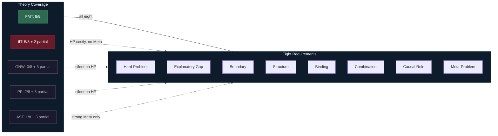

# Comparative Scoreboard

**A systematic comparison of the Four-Model Theory against six major consciousness theories across all eight requirements reveals that FMT is the only framework that addresses every requirement, while each rival theory leaves at least two requirements unaddressed.**

Any theory aspiring to be a complete account of consciousness must confront eight distinct challenges: the [Hard Problem](../hard-problem/dissolution.md), the [Explanatory Gap](../hard-problem/explanatory-gap.md), the [Boundary Problem](../foundations/eight-requirements.md), the Structure of Experience, Unity and Binding, Combination and Emergence, the Causal Role of consciousness, and the [Meta-Problem](../hard-problem/meta-problem.md). Most theories were designed to address one or two of these. The scoreboard maps which theories address which requirements -- and where the gaps are.

## The Scoring Matrix

The following table summarizes how each theory performs across the eight requirements. Ratings reflect a fair-minded assessment; where a theory's proponents would contest a rating, this is noted.

| Requirement | FMT | IIT | GNW | HOT | PP | AST | RPT |
|---|---|---|---|---|---|---|---|
| Hard Problem | Addresses | Addresses* | Silent** | Partial | Silent** | Partial | Silent |
| Explanatory Gap | Addresses | Addresses* | Silent** | Partial | Silent** | Partial | Silent |
| Boundary Problem | Addresses | Addresses | Partial | Minimal | Partial | Partial | Partial |
| Structure of Experience | Addresses | Addresses | Partial | Partial | Addresses | Partial | Partial |
| Unity and Binding | Addresses | Addresses | Partial | Minimal | Partial | Minimal | Partial |
| Combination/Emergence | Addresses | Minimal*** | N/A | N/A | N/A | N/A | N/A |
| Causal Role | Addresses | Partial | Partial | Partial | Addresses | Partial | Addresses |
| Meta-Problem | Addresses | Minimal | Partial | Partial | Partial | Addresses | Minimal |

\* IIT addresses the Hard Problem by identifying consciousness with integrated information (Phi). Whether this constitutes a solution or a redefinition is debated.
\*\* GNW and PP proponents argue they address the "real problem" of consciousness -- explaining the structure and contents of experience -- even if they do not address the Hard Problem as Chalmers defines it. The "silent" rating reflects scope, not overall merit.
\*\*\* IIT's panpsychist commitments generate the Combination Problem rather than resolving it.

## Reading the Scoreboard

Three patterns emerge from the matrix.

**No rival addresses the Hard Problem without cost.** IIT addresses it, but at the price of panpsychism and the Combination Problem. HOT and AST offer partial treatments that explain why consciousness *seems* mysterious without fully accounting for phenomenality. GNW, PP, and RPT remain silent -- deliberately, in GNW's and PP's cases, treating the Hard Problem as outside their scope.

**Access theories dominate empirically but underperform philosophically.** GNW and RPT have strong empirical support (the ignition threshold, visual masking paradigms), yet neither explains *why* broadcasting or recurrence produces experience. They describe *when* consciousness happens, not *what* it is.

**The Combination/Emergence requirement is the panpsychism filter.** Only theories with panpsychist commitments (IIT) must confront the Combination Problem. Physicalist theories face the emergence question instead, but most sidestep it. FMT addresses it directly through [weak emergence](../philosophical/weak-emergence.md): each level of the [five-system hierarchy](../physical-foundations/five-system-hierarchy.md) is fully determined by the level below, with no ontological gap.

## How FMT Achieves Full Coverage

The [Four-Model Theory](../core-architecture/four-model-theory.md) addresses all eight requirements through three interlocking mechanisms:

1. **[Virtual qualia](../hard-problem/virtual-qualia.md)** dissolve the Hard Problem and close the Explanatory Gap simultaneously -- qualia exist at the computational level, rendering the substrate-level search a [category error](../hard-problem/category-error.md).
2. **[Criticality](../physical-foundations/criticality.md) plus the four-model architecture** provides principled boundary-setting, binding through critical dynamics, and structured experience through the explicit models.
3. **The [ESM](../core-architecture/esm.md)'s opacity to its own substrate** explains the Meta-Problem as a structural consequence rather than a philosophical puzzle.

No other theory deploys mechanisms that span all eight requirements simultaneously.

## Figure

*FMT is the only theory that provides a substantive account of all eight requirements. IIT has the broadest coverage among rivals but incurs the Combination Problem. Access theories (GNW, RPT) and schema theories (AST) leave the Hard Problem and Explanatory Gap untouched.*

## Key Takeaway

The comparative scoreboard reveals a structural gap in the field: every major theory except FMT leaves at least two of the eight requirements unaddressed, and no rival addresses the Hard Problem without incurring costs (panpsychism, deflationism) that FMT avoids through its two-level ontology.

## See Also

- [Eight Requirements for a Theory of Consciousness](../foundations/eight-requirements.md)
- [FMT vs. IIT](vs-iit.md)
- [FMT vs. GNW](vs-gnw.md)
- [FMT vs. Predictive Processing](vs-pp.md)
- [FMT vs. Attention Schema Theory](vs-ast.md)
- [The Pre-Paradigm State](../foundations/pre-paradigm.md)
