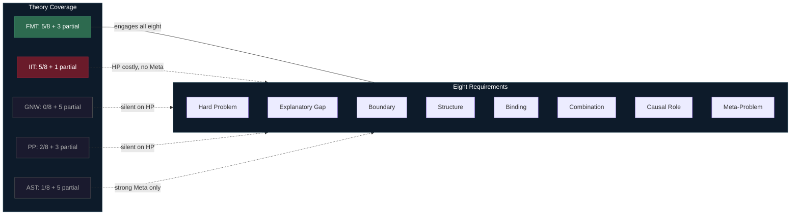

# Comparative Scoreboard

**A systematic comparison of the Four-Model Theory against six major consciousness theories across all eight requirements shows FMT engaging every requirement -- five fully and three partially -- while each rival theory leaves at least one requirement silent or only minimally treated.**

Any theory aspiring to be a complete account of consciousness must confront eight distinct challenges: the [Hard Problem](../hard-problem/dissolution.md), the [Explanatory Gap](../hard-problem/explanatory-gap.md), the [Boundary Problem](../foundations/eight-requirements.md), the Structure of Experience, Unity and Binding, Combination and Emergence, the Causal Role of consciousness, and the [Meta-Problem](../hard-problem/meta-problem.md). Most theories were designed to address one or two of these. The scoreboard maps which theories address which requirements -- and where the gaps are.

## The Scoring Matrix

The following table summarizes how each theory performs across the eight requirements. Ratings reflect the theory author's judgment; where a theory's proponents would contest a rating, this is noted. The selection of these eight requirements is itself theory-laden: they are the philosophical problems of consciousness, and a rubric weighted toward mathematical formalization, quantitative neural predictions or specific mechanisms would rank IIT, Predictive Processing and GNW considerably higher.

| Requirement | FMT | IIT | GNW | HOT | PP | AST | RPT |
|---|---|---|---|---|---|---|---|
| Hard Problem | Partial† | Addresses* | Silent** | Partial | Silent** | Partial | Silent |
| Explanatory Gap | Partial† | Addresses* | Silent** | Partial | Silent** | Partial | Silent |
| Boundary Problem | Addresses | Addresses | Partial | Minimal | Partial | Partial | Partial |
| Structure of Experience | Addresses | Addresses | Partial | Partial | Addresses | Partial | Partial |
| Unity and Binding | Addresses | Addresses | Partial | Minimal | Partial | Minimal | Partial |
| Combination/Emergence | Partial‡ | Minimal*** | N/A | N/A | N/A | N/A | N/A |
| Causal Role | Addresses | Partial | Partial | Partial | Addresses | Partial | Addresses |
| Meta-Problem | Addresses | Minimal | Partial | Partial | Partial | Addresses | Minimal |

† FMT reframes the Hard Problem through the level distinction and self-referential closure. The reframing is conditional: it renders the residual question ill-posed only if the inside/outside asymmetry that closure creates is constitutive rather than merely epistemic -- a commitment the theory argues for but does not derive. Its bridging commitment connects phenomenality to an already-perspectival property rather than to a scalar or a broadcast pattern, so the gap it crosses is narrower, not absent.
‡ FMT is non-panpsychist, so the Combination Problem does not arise for it; the partial rating covers the Emergence half of this requirement -- how consciousness arises from non-conscious processes.
\* IIT addresses the Hard Problem by identifying an experience with a maximally irreducible cause-effect structure, whose irreducibility Phi quantifies. Whether this constitutes a solution or a redefinition is debated.
\*\* GNW and PP proponents argue they address the "real problem" of consciousness -- explaining the structure and contents of experience -- even if they do not address the Hard Problem as Chalmers defines it. The "silent" rating reflects scope, not overall merit.
\*\*\* IIT's panpsychist commitments generate the Combination Problem rather than resolving it.

## Reading the Scoreboard

Three patterns emerge from the matrix.

**No rival addresses the Hard Problem without cost.** IIT addresses it, but at the price of panpsychism and the Combination Problem. HOT and AST offer partial treatments that explain why consciousness *seems* mysterious without fully accounting for phenomenality. GNW, PP, and RPT remain silent -- deliberately, in GNW's and PP's cases, treating the Hard Problem as outside their scope.

**Access theories dominate empirically but underperform philosophically.** GNW and RPT have strong empirical support (the ignition threshold, visual masking paradigms), yet neither explains *why* broadcasting or recurrence produces experience. They describe *when* consciousness happens, not *what* it is.

**The Combination/Emergence requirement is the panpsychism filter.** Only theories with panpsychist commitments (IIT) must confront the Combination Problem. Physicalist theories face the emergence question instead, but most sidestep it. FMT takes up its Emergence half directly through [weak emergence](../philosophical/weak-emergence.md): each level of the [five-system hierarchy](../physical-foundations/five-system-hierarchy.md) is fully determined by the level below, with no ontological gap.

## How FMT Covers All Eight

The [Four-Model Theory](../core-architecture/four-model-theory.md) engages all eight requirements through three interlocking mechanisms:

1. **[Virtual qualia](../hard-problem/virtual-qualia.md)** reframe the Hard Problem and relocate the Explanatory Gap -- qualia exist at the computational level, rendering the substrate-level search a [category error](../hard-problem/category-error.md). Both ratings stay partial because the step from self-referential closure to phenomenality is argued for, not derived.
2. **The [open-ended Class 4 regime](../physical-foundations/criticality.md) plus the four-model architecture** provides principled boundary-setting, binding into a single experiential field through near-critical dynamics, and structured experience through the explicit models.
3. **The [ESM](../core-architecture/explicit-self-model.md)'s opacity to its own substrate** explains the Meta-Problem as a structural consequence rather than a philosophical puzzle.

No other theory is rated at least partial on all eight requirements.

## Figure

```mermaid
graph LR
    subgraph REQ["Eight Requirements"]
        direction TB
        R1["Hard Problem"]
        R2["Explanatory Gap"]
        R3["Boundary"]
        R4["Structure"]
        R5["Binding"]
        R6["Combination"]
        R7["Causal Role"]
        R8["Meta-Problem"]
    end

    subgraph THEORIES["Theory Coverage"]
        direction TB
        FMT["FMT: 5/8 + 3 partial"]
        IIT["IIT: 5/8 + 1 partial"]
        GNW["GNW: 0/8 + 5 partial"]
        PP["PP: 2/8 + 3 partial"]
        AST["AST: 1/8 + 5 partial"]
    end

    FMT ---|"engages all eight"| REQ
    IIT -.->|"HP costly, no Meta"| REQ
    GNW -.->|"silent on HP"| REQ
    PP -.->|"silent on HP"| REQ
    AST -.->|"strong Meta only"| REQ

    style FMT fill:#2d6a4f,stroke:#40916c,color:#fff
    style IIT fill:#6a1b2a,stroke:#a4243b,color:#fff
    style GNW fill:#1a1a2e,stroke:#555,color:#aaa
    style PP fill:#1a1a2e,stroke:#555,color:#aaa
    style AST fill:#1a1a2e,stroke:#555,color:#aaa
    style REQ fill:#0d1b2a,stroke:#1b3a4b,color:#fff
    style THEORIES fill:#0d1b2a,stroke:#1b3a4b,color:#fff
```

*FMT is the only theory rated at least partial on all eight requirements, five of them fully. IIT has the broadest full coverage among rivals but incurs the Combination Problem. Access theories (GNW, RPT) leave the Hard Problem and Explanatory Gap untouched; AST treats them only in deflationary form.*

## Key Takeaway

The comparative scoreboard reveals a structural gap in the field: every major theory except FMT leaves at least one of the eight requirements silent or only minimally treated, and no rival addresses the Hard Problem without incurring costs (panpsychism, deflationism) that FMT avoids through its two-level ontology. FMT's own treatment of the Hard Problem is rated partial, because its bridging step from closure to phenomenality is argued for rather than derived.

## See Also

- [Eight Requirements for a Theory of Consciousness](../foundations/eight-requirements.md)
- [FMT vs. IIT](vs-iit.md)
- [FMT vs. GNW](vs-gnw.md)
- [FMT vs. Predictive Processing](vs-pp.md)
- [FMT vs. Attention Schema Theory](vs-ast.md)
- [The Pre-Paradigm State](../foundations/pre-paradigm.md)

---

Based on: Gruber, M. (2026). The Four-Model Theory of Consciousness. Zenodo. https://doi.org/10.5281/zenodo.18669891
