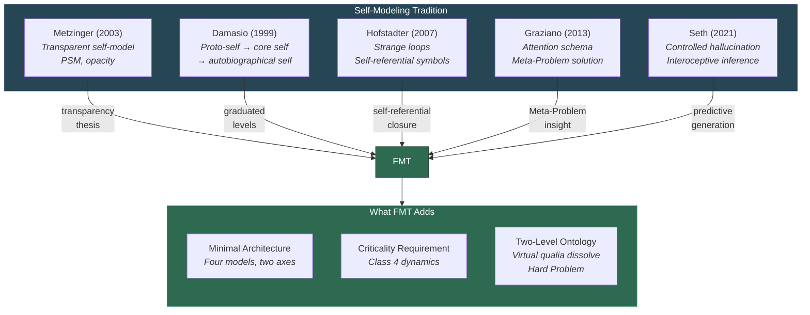

# FMT and the Self-Modeling Tradition

**FMT belongs to the self-modeling tradition in consciousness studies -- the lineage running from Metzinger through Damasio, Hofstadter, Graziano, and Seth -- but adds three elements none of its predecessors provide: a minimal architecture specification, a criticality requirement, and a two-level ontology that dissolves the Hard Problem.**

The idea that consciousness is constituted by the system's model of itself is not new. Five major theorists have developed this idea with increasing specificity over three decades. The [Four-Model Theory](../core-architecture/four-model-theory.md) extends this tradition by answering questions its predecessors leave open.

## The Lineage

### Metzinger: The Transparent Self-Model

Thomas Metzinger (2003, 2009) analyzed the **phenomenal self-model** (PSM) as a transparent representational structure -- transparent in the sense that the system cannot experience the model *as* a model. The PSM is the mechanism by which the brain creates the subjective sense of being a self. Metzinger's key insight: the self is not an entity but a process, and the process is opaque to itself.

FMT inherits Metzinger's transparency thesis directly: the [Explicit Self Model](../core-architecture/explicit-self-model.md) cannot observe the [Implicit Self Model](../core-architecture/implicit-self-model.md) that generates it. This structural opacity is FMT's account of the [Meta-Problem](../hard-problem/meta-problem.md) -- why consciousness seems mysterious from the inside.

### Damasio: The Multi-Level Self

Antonio Damasio (1999, 2010) grounded consciousness in progressively elaborated self-representations: the **proto-self** (basic body-state mapping), **core self** (moment-to-moment awareness), and **autobiographical self** (extended narrative identity). Damasio's framework is neuroanatomically grounded, linking each self-level to specific brain structures.

FMT's [graduated levels of consciousness](../mechanisms/graduated-consciousness.md) parallel Damasio's hierarchy but are defined functionally rather than anatomically: basic consciousness (minimal ESM), simply extended (first-order self-observation), doubly extended (metacognition), triply extended (philosophical reflection). FMT's substrate-independent framing means the levels are not tied to specific brain regions.

### Hofstadter: Strange Loops

Douglas Hofstadter (2007) identified the self with **strange loops** -- self-referential symbolic structures in which the system's representation of itself becomes entangled with the system itself. Hofstadter's metaphor captures the recursive, self-referential character of consciousness but remains at the level of analogy rather than architectural specification.

FMT's [self-referential closure](../core-architecture/self-referential-closure.md) is Hofstadter's strange loop made architecturally precise: the ESM models the system that generates the ESM, collapsing the inside/outside distinction. The loop is not a metaphor but a specific computational process with specific architectural requirements.

### Graziano: The Attention Schema

Michael Graziano (2013) proposed that consciousness is the brain's schema of its own attention -- an internal model of the attention process that necessarily omits mechanistic details, producing the intuition of non-physical awareness. The **Attention Schema Theory** (AST) provides the strongest existing account of the Meta-Problem.

FMT incorporates Graziano's Meta-Problem insight -- the ESM's structural inaccessibility to its own substrate explains the intuition of mystery. But AST is deflationary about phenomenality: it explains why we *think* there is experience without affirming that there is. FMT's [virtual qualia](../hard-problem/virtual-qualia.md) framework holds that phenomenal experience is real at the computational level, not an illusion.

### Seth: Interoceptive Inference

Anil Seth (2021) cast the experienced self as a **controlled hallucination** grounded in interoceptive prediction -- the brain's continuous prediction of its own body states. Seth's framework integrates consciousness with predictive processing and provides one of the field's most empirically productive research programs.

FMT agrees that prediction is central to the generation of explicit models but adds the [four-model architecture](../core-architecture/four-model-theory.md) that PP lacks. Seth's controlled hallucination is, in FMT's terms, the EWM and ESM being generated from the IWM and ISM via predictive processes. What Seth does not provide is an account of *why* the hallucination has phenomenal character -- he explicitly acknowledges this gap (Seth, 2021).

## What FMT Adds

Three elements distinguish FMT from all its predecessors in the self-modeling tradition:

1. **Minimal architecture specification.** Where Metzinger identifies the PSM, Damasio identifies three self-levels, and Graziano identifies the attention schema, FMT specifies the minimum architecture: four model kinds along [two axes](../core-architecture/two-axes.md) (scope and mode). This is a principled minimum, not an arbitrary count -- the argument is that any system capable of consciousness must model both world and self, at both the structural and simulation level.

2. **The [criticality requirement](../physical-foundations/criticality.md).** No predecessor specifies what the substrate must do for self-modeling to produce consciousness. FMT adds the computational threshold: the substrate must operate at the edge of chaos (Class 4 dynamics). This explains why not every self-modeling system is conscious.

3. **The [two-level ontology](../hard-problem/dissolution.md).** Metzinger and Graziano are deflationary about phenomenality. Damasio and Seth acknowledge it but do not explain it. FMT's virtual qualia framework provides the missing piece: qualia are constitutive properties of the computational level -- real within the simulation, incoherent at the substrate level. This dissolves the Hard Problem without denying the reality of experience.

## Figure

*FMT inherits specific insights from each predecessor in the self-modeling tradition and adds three elements -- minimal architecture, criticality, and a two-level ontology -- that none of them provide.*

## Key Takeaway

FMT is not a rejection of the self-modeling tradition but its completion. Each predecessor identified a crucial piece: Metzinger's transparency, Damasio's levels, Hofstadter's recursion, Graziano's Meta-Problem, Seth's prediction. FMT integrates these insights and adds the architectural specification, substrate requirement, and ontological framework needed to move from philosophical insight to testable theory.

## See Also

- [Historical Context](../foundations/historical-context.md)
- [Core Definition of Consciousness](../core-architecture/core-definition.md)
- [Self-Referential Closure](../core-architecture/self-referential-closure.md)
- [Virtual Qualia](../hard-problem/virtual-qualia.md)
- [The Meta-Problem Dissolved](../hard-problem/meta-problem.md)
- [FMT vs. Attention Schema Theory (AST)](vs-ast.md)

---

Based on: Gruber, M. (2026). The Four-Model Theory of Consciousness. Zenodo. https://doi.org/10.5281/zenodo.19064950
