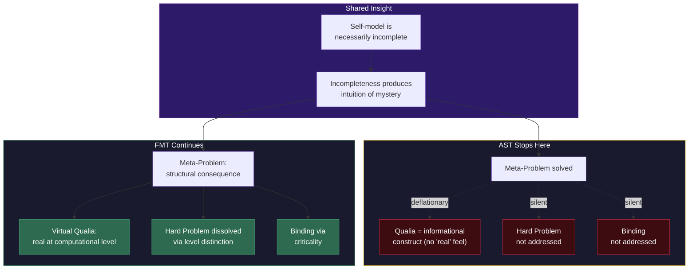

# FMT vs. Attention Schema Theory (AST)

**AST provides the strongest existing account of the Meta-Problem -- why consciousness seems mysterious -- but remains silent on the Hard Problem itself. FMT incorporates AST's core insight about self-model incompleteness while grounding it in a richer architecture that addresses phenomenality.**

Attention Schema Theory (Graziano, 2013) proposes that the brain constructs a simplified model of its own attentional processes -- an "attention schema" -- and that this schema, being necessarily incomplete, produces the intuition that consciousness is something non-physical. The comparison with the [Four-Model Theory](../core-architecture/four-model-theory.md) is instructive because the two theories share a fundamental commitment -- self-model incompleteness as the root of mystery -- while diverging sharply on what that commitment explains.

## AST's Core Insight

AST identifies a genuine and powerful explanatory principle. The brain models its own attention, but no model can fully capture the process that generates it. This incompleteness is not a flaw but a structural necessity: a complete self-model would require infinite recursion. The result is that the self-model necessarily omits the mechanistic details of how attention works, producing the intuition that there is "something more" to consciousness than physical processes can capture.

This is the **[Meta-Problem](../hard-problem/meta-problem.md)** ([Chalmers, 2018](https://consc.net/papers/solving.pdf)) -- why do we *think* there is a Hard Problem? -- and AST's answer is the most compelling available. The mystery of consciousness is not evidence of non-physical processes; it is a predictable artifact of incomplete self-modeling.

## The Shared Self-Model Foundation

FMT and AST agree on the fundamental mechanism. In FMT's terms, the [Explicit Self Model](../core-architecture/esm.md) cannot directly observe the [Implicit Self Model](../core-architecture/ism.md)'s generative machinery. The ESM is structurally sealed off from the substrate-level processes that produce it, with only occasional "leaks" through the [implicit-explicit boundary](../mechanisms/implicit-explicit-boundary.md). This is precisely AST's insight: the self-model is incomplete, and the incompleteness generates the intuition of mystery.

Both theories thus predict that consciousness *should* seem mysterious to conscious systems. The mystery is not a philosophical puzzle awaiting solution but a structural consequence of the architecture. A system that models itself will inevitably encounter the gap between what it can model and what generates the model.

## Where AST Falls Short

AST's limitation is the inverse of GNW's. Where [GNW](vs-gnw.md) explains *when* consciousness happens but not *why* it feels like something, AST explains *why it seems mysterious* but not *why it exists*.

**Silent on the Hard Problem.** AST is deflationary about phenomenality. In Graziano's framework, consciousness is an information-processing construct -- the brain's simplified model of its own attention. The subjective "feel" of experience is the schema's content, not a separate phenomenon requiring explanation. This means AST does not so much solve the Hard Problem as deny that it is a genuine problem.

FMT takes a different position: qualia are *real at the computational level*, not illusions or mere informational constructs. The [virtual qualia](../hard-problem/virtual-qualia.md) framework maintains that within the ESM/EWM, experience has genuine phenomenal character. What is illusory is not the experience itself but the assumption that phenomenal character must be a substrate-level property.

**Silent on binding.** AST provides no account of how distributed neural processes are unified into a coherent experience. The attention schema models attention, but attention is not the same as phenomenal unity. FMT addresses binding through [criticality](../physical-foundations/criticality.md) -- critical dynamics produce coherent, unified patterns across the cortical automaton.

**Narrow architectural specification.** AST identifies one component of the self-model (the attention schema) but does not specify a complete architecture. FMT's four-model structure -- with the scope and mode axes, the [real/virtual split](../core-architecture/real-virtual-split.md), and the implicit-explicit boundary -- provides a more detailed specification of the architecture that produces both consciousness and its apparent mysteriousness.

## FMT Subsumes AST's Insight

The relationship between FMT and AST is not symmetric. FMT can incorporate everything AST explains: the ESM's opacity to its own substrate is a structural consequence of the four-model architecture, and it generates exactly the Meta-Problem intuitions AST identifies. AST, however, cannot incorporate FMT's explanation of phenomenality, because AST's deflationary stance on qualia is incompatible with FMT's position that qualia are real at the computational level.

In this sense, FMT *subsumes* AST. AST's Meta-Problem solution becomes one consequence among several of the four-model architecture, rather than the theory's entire contribution.

## Figure

*FMT and AST share the core insight that self-model incompleteness produces the intuition of mystery (top). AST stops at the Meta-Problem, treating qualia as informational constructs (left). FMT extends the insight to dissolve the Hard Problem, ground phenomenality, and address binding (right).*

## Key Takeaway

AST is the best theory of *why consciousness seems mysterious*, and FMT incorporates that insight fully. But seeming mysterious and *being* something are different questions. AST answers the first; FMT answers both.

## See Also

- [Comparative Scoreboard](scoreboard.md)
- [The Meta-Problem Dissolved](../hard-problem/meta-problem.md)
- [Virtual Qualia](../hard-problem/virtual-qualia.md)
- [Self-Referential Closure](../core-architecture/self-referential-closure.md)
- [The Explicit Self Model](../core-architecture/esm.md)
