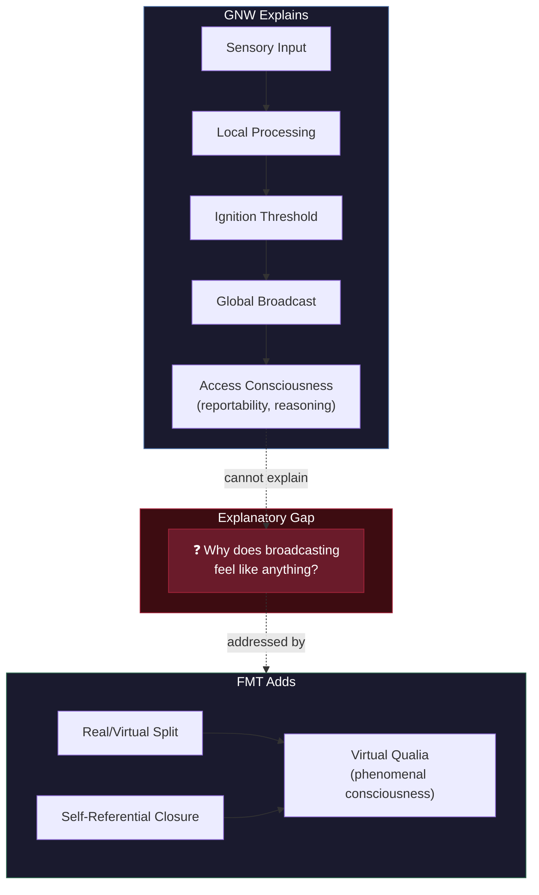

# FMT vs. Global Neuronal Workspace (GNW)

**GNW explains when content becomes conscious -- via global broadcasting -- but is structurally silent on why broadcasting produces experience, leaving the Hard Problem and Explanatory Gap entirely open.**

Global Neuronal Workspace theory (Baars, 1988; Dehaene & Changeux, 2011) is the most empirically successful consciousness theory to date. Its ignition threshold, the P3b marker, and its integration with cognitive neuroscience have made it the default framework in many laboratories. The comparison with the [Four-Model Theory](../core-architecture/four-model-theory.md) is not about empirical inadequacy -- GNW's empirical record is strong -- but about the gap between correlation and explanation.

## What GNW Gets Right

GNW identifies a genuine and important phenomenon: when sensory information crosses a threshold and is broadcast globally across the cortex, it becomes reportable and accessible to downstream processes. This transition -- from local processing to global availability -- is real, measurable, and functionally significant.

The theory's empirical contributions are substantial. The **ignition threshold** demonstrates that consciousness involves a nonlinear transition, not gradual brightening. The **P3b** event-related potential provides a reliable electrophysiological marker. The distinction between subliminal, preconscious, and conscious processing maps onto measurable differences in neural activity. These are genuine discoveries.

## The Explanatory Gap GNW Leaves Open

GNW's fundamental limitation is philosophical, not empirical. Global broadcasting explains *access consciousness* -- which contents are available for report, reasoning, and flexible behavior -- but says nothing about *phenomenal consciousness* -- why those contents are accompanied by subjective experience.

A radio broadcasts too. Broadcasting is a mechanism for making information globally available, but availability is not experience. GNW conflates two distinct questions: "What makes content globally accessible?" (which it answers well) and "Why does globally accessible content feel like anything?" (which it does not address).

This is not a minor gap. It means GNW cannot distinguish between a system that genuinely experiences broadcast content and a philosophical zombie that broadcasts identically but experiences nothing. The theory's own architecture provides no resources for making this distinction.

**The COGITATE results** (2025) compounded these philosophical difficulties with an empirical challenge. The adversarial collaboration found consciousness-related activity concentrated in posterior cortex, not the frontoparietal workspace GNW predicts. The expected "ignition at offset" was absent. While GNW proponents have offered rebuttals, the results weakened the theory's strongest empirical claim.

## Where FMT Agrees and Diverges

FMT agrees that global broadcasting is mechanistically important. Information integration across cortical regions is part of how the brain generates the [Explicit World Model](../core-architecture/ewm.md) and [Explicit Self Model](../core-architecture/esm.md). Broadcasting accelerates and coordinates the construction of the virtual models. In FMT's framework, GNW describes an important substrate-level mechanism -- but not the thing it is a mechanism *for*.

The divergence lies in what each theory considers sufficient for consciousness. For GNW, broadcasting *is* consciousness (or at least the mechanism constituting it). For FMT, broadcasting is a substrate optimization that serves the generation of explicit models, and consciousness consists in the [self-referential closure](../core-architecture/self-referential-closure.md) of those models at [criticality](../physical-foundations/criticality.md).

This divergence produces different predictions about edge cases. GNW predicts that all broadcast content is conscious and all conscious content is broadcast. FMT predicts exceptions: PTSD intrusions, unbidden memories, and involuntary pain are phenomenally conscious without being products of the workspace-access system. The experience overrides the broadcasting mechanism rather than depending on it.

## The Architecture Problem

GNW requires the specific fronto-parietal architecture of the mammalian brain. This raises difficulties for avian and cephalopod consciousness. Corvids show behavioral signatures of conscious processing despite lacking a layered cortex. Cephalopods process information through radically different neural architectures. GNW must either deny these organisms consciousness or stretch the "workspace" concept beyond its original neuroanatomical grounding.

FMT's [substrate independence](../philosophical/substrate-independence.md) avoids this problem: any substrate implementing the four-model architecture at criticality supports consciousness, regardless of whether it achieves integration through mammalian-style broadcasting, avian pallial circuits, or something else entirely.

## Figure

*GNW provides a complete account from sensory input to access consciousness (left). The explanatory gap (center) -- why broadcasting produces experience -- remains open within GNW's framework. FMT addresses this gap through the real/virtual split and self-referential closure (right).*

## Key Takeaway

GNW is an excellent theory of access consciousness masquerading as a theory of consciousness itself. It answers "when does content become conscious?" with empirical precision but cannot answer "why does conscious content feel like anything?" -- the question FMT's [virtual qualia](../hard-problem/virtual-qualia.md) framework was designed to address.

## See Also

- [Comparative Scoreboard](scoreboard.md)
- [Hard Problem Dissolution](../hard-problem/dissolution.md)
- [Virtual Qualia](../hard-problem/virtual-qualia.md)
- [Self-Referential Closure](../core-architecture/self-referential-closure.md)
- [COGITATE and Adversarial Collaborations](cogitate.md)
