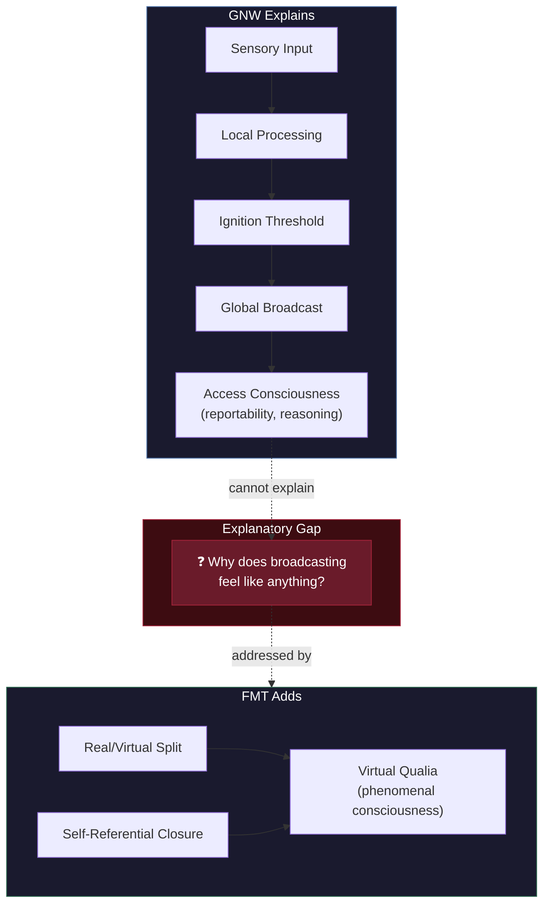

# FMT vs. Global Neuronal Workspace (GNW)

**GNW explains when content becomes conscious -- via global broadcasting -- but is structurally silent on why broadcasting produces experience, leaving the Hard Problem and Explanatory Gap entirely open.**

Global Neuronal Workspace theory (Baars, 1988; Dehaene & Changeux, 2011) is the most empirically successful consciousness theory to date. Its ignition threshold, the P3b marker, and its integration with cognitive neuroscience have made it the default framework in many laboratories. The comparison with the [Four-Model Theory](../core-architecture/four-model-theory.md) is not about empirical inadequacy -- GNW's empirical record is strong -- but about the gap between correlation and explanation.

## What GNW Gets Right

GNW identifies a genuine and important phenomenon: when sensory information crosses a threshold and is broadcast globally across the cortex, it becomes reportable and accessible to downstream processes. This transition -- from local processing to global availability -- is real, measurable, and functionally significant.

The theory's empirical contributions are substantial. The **ignition threshold** demonstrates that consciousness involves a nonlinear transition, not gradual brightening. The **P3b** event-related potential provides a reliable electrophysiological marker. The distinction between subliminal, preconscious, and conscious processing maps onto measurable differences in neural activity. These are genuine discoveries.

## The Explanatory Gap GNW Leaves Open

GNW's fundamental limitation is philosophical, not empirical. Global broadcasting explains *access consciousness* -- which contents are available for report, reasoning, and flexible behavior -- but says nothing about *phenomenal consciousness* -- why those contents are accompanied by subjective experience.

A radio broadcasts too. Broadcasting is a mechanism for making information globally available, but availability is not experience. Two questions are distinct here: "What makes content globally accessible?" (which GNW answers well) and "Why does globally accessible content feel like anything?" (which GNW deliberately leaves outside its scope).

This is not a minor gap. It means GNW cannot distinguish between a system that genuinely experiences broadcast content and a philosophical zombie that broadcasts identically but experiences nothing. The theory's own architecture provides no resources for making this distinction.

**The COGITATE results** (2025) compounded these philosophical difficulties with an empirical challenge. The adversarial collaboration found consciousness-related activity concentrated in posterior cortex, not the frontoparietal workspace GNW predicts. The expected "ignition at offset" was absent. GNW proponents have argued that the paradigm was not optimal for testing ignition dynamics, and a later reanalysis of the COGITATE data found prefrontal ignition at stimulus offset as well as onset (Bandara, Rowe, & Garrido, 2026).

## Where FMT Agrees and Diverges

FMT agrees that global broadcasting is mechanistically important. Information integration across cortical regions is part of how the brain generates the [Explicit World Model](../core-architecture/explicit-world-model.md) and [Explicit Self Model](../core-architecture/explicit-self-model.md). Broadcasting accelerates and coordinates the construction of the virtual models. In FMT's framework, GNW describes an important substrate-level mechanism -- but not the thing it is a mechanism *for*.

The divergence lies in what each theory considers sufficient for consciousness. For GNW, broadcasting *is* consciousness (or at least the mechanism constituting it). For FMT, broadcasting is a substrate optimization that serves the generation of explicit models, and consciousness consists in the [self-referential closure](../core-architecture/self-referential-closure.md) of those models in the open-ended Class 4 regime, whose neural signature is [near-criticality](../physical-foundations/criticality.md). Broadcast and ignition are the signature of content entering the closed explicit simulation, not its definition.

On FMT's account, the workspace GNW takes as a primitive is a state of a component the theory already contains: the occupancy of the low-rank channel along which the explicit models read and write the substrate. The two frameworks converge on that structure and diverge on its role. The disagreement is empirically addressable: it needs a manipulation that makes content globally available without letting it enter the self-model's update rule. No such manipulation exists in brains. Large language models now supply half of it: Gurnee et al. (2026) located in them a workspace of verbalisable representations whose contents are globally available, reportable, held across multi-step reasoning and switched in an ignition-like way, all within a single feedforward pass. On FMT's reading this is broadcast without closure: post-trained models carry a reportable representation of their own point of view in a globally available workspace, and what they lack is closure over it, persistence, and the Class 4 regime.

The divergence also bears on edge cases. FMT predicts that basic consciousness -- a rudimentary ESM with minimal self-awareness -- could exist without global broadcasting, producing phenomenal experience without full access. What Block calls phenomenal "overflow" is, on this account, a thin simulation running below the depth at which its contents reach the system's evaluative workspace, not phenomenal content filtered out by a broadcast bottleneck.

## Substrate and Anatomy

GNW's core claim concerns the computational principle of global broadcasting, not a specific anatomy, and GNW advocates have argued that the broadcasting principle is substrate-independent at the computational level (Dehaene, 2021) -- the same move FMT makes for its own architecture. Changeux and Farisco (2026) instead present GNW as a multilevel model rather than a functionalist computational theory. Corvids show behavioral signatures of conscious processing despite lacking a layered cortex, and cephalopods process information through radically different neural architectures; on either reading of GNW, these cases turn on what counts as a workspace outside the mammalian fronto-parietal network.

FMT's [substrate independence](../philosophical/substrate-independence.md) states its conditions functionally: any substrate implementing the four-model architecture in the Class 4 regime supports consciousness, regardless of whether it achieves integration through mammalian-style broadcasting, avian pallial circuits, or something else entirely.

## Figure

```mermaid
graph TB
    subgraph GNW_SCOPE["GNW Explains"]
        G1["Sensory Input"]
        G2["Local Processing"]
        G3["Ignition Threshold"]
        G4["Global Broadcast"]
        G5["Access Consciousness<br/>(reportability, reasoning)"]
        G1 --> G2 --> G3 --> G4 --> G5
    end

    subgraph GAP["Explanatory Gap"]
        Q["❓ Why does broadcasting<br/>feel like anything?"]
    end

    subgraph FMT_ADDS["FMT Adds"]
        F1["Real/Virtual Split"]
        F2["Self-Referential Closure"]
        F3["Virtual Qualia<br/>(phenomenal consciousness)"]
        F1 --> F3
        F2 --> F3
    end

    G5 -.->|"cannot explain"| Q
    Q -.->|"addressed by"| FMT_ADDS

    style GNW_SCOPE fill:#1a1a2e,stroke:#4a6fa5,color:#fff
    style GAP fill:#3d0c11,stroke:#a4243b,color:#fff
    style FMT_ADDS fill:#1a1a2e,stroke:#2d6a4f,color:#fff
    style Q fill:#6a1b2a,stroke:#a4243b,color:#fff
```

*GNW provides a complete account from sensory input to access consciousness (left). The explanatory gap (center) -- why broadcasting produces experience -- remains open within GNW's framework. FMT addresses this gap through the real/virtual split and self-referential closure (right).*

## Key Takeaway

GNW is an excellent theory of access consciousness that deliberately leaves phenomenality outside its scope. It answers "when does content become conscious?" with empirical precision but cannot answer "why does conscious content feel like anything?" -- the question FMT's [virtual qualia](../hard-problem/virtual-qualia.md) framework was designed to address.

## See Also

- [Comparative Scoreboard](scoreboard.md)
- [How FMT Answers the Hard Problem](../hard-problem/dissolution.md)
- [Virtual Qualia](../hard-problem/virtual-qualia.md)
- [Self-Referential Closure](../core-architecture/self-referential-closure.md)
- [COGITATE and Adversarial Collaborations](cogitate.md)

---

Based on: Gruber, M. (2026). The Four-Model Theory of Consciousness. Zenodo. https://doi.org/10.5281/zenodo.18669891
