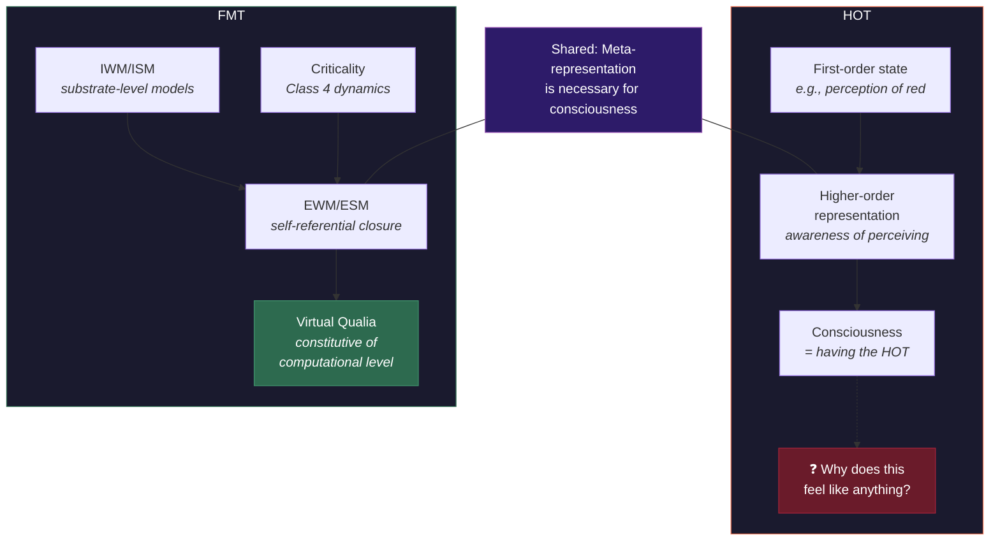

# FMT vs. Higher-Order Theories (HOT)

**FMT and HOT agree that consciousness requires self-representation -- a state is conscious when there is a higher-order representation of it. But HOT explains why we *report* having experience without explaining why higher-order representation produces phenomenality itself.**

Higher-Order Theories (Rosenthal, 2005; Lau & Rosenthal, 2011) propose that a mental state becomes conscious when it is the target of a higher-order representation -- roughly, when the system represents itself as being in that state. A perception of red becomes a *conscious* perception of red when there is a higher-order thought about that perception. This is a powerful insight that the [Four-Model Theory](../core-architecture/four-model-theory.md) shares. The disagreement is about what happens next.

## The Shared Insight

Both HOT and FMT place **meta-representation** at the center of consciousness. For HOT, a state without a higher-order representation is not conscious, even if it influences behavior. For FMT, consciousness requires the [Explicit Self Model](../core-architecture/explicit-self-model.md) -- the system's ongoing model of itself -- which is, architecturally, a form of higher-order representation. FMT's [graduated levels of consciousness](../mechanisms/graduated-consciousness.md) directly parallel HOT's hierarchy: basic consciousness corresponds to first-order self-modeling, extended consciousness to higher-order recursive self-modeling.

The convergence is not accidental. Both theories descend from the same philosophical lineage: the idea, traceable to Locke and formalized by Rosenthal, that consciousness involves a form of self-awareness -- an awareness of being aware.

## Where HOT Stops

HOT's difficulty is a gap between mechanism and phenomenality. The theory explains which states are conscious (those with higher-order representations) and partially addresses the [Meta-Problem](../hard-problem/meta-problem.md) (we think consciousness is mysterious because higher-order representations are imperfect models of first-order states). But it does not explain *why* higher-order representation produces phenomenality.

A thermostat with a second sensor monitoring the first sensor's output has a "higher-order representation" of room temperature. Nobody concludes it is conscious. HOT theorists would reply that the higher-order representation must be of the right kind -- specifically, a conceptual, assertoric representation in the right functional role. But specifying the "right kind" without circularity is precisely the challenge. The risk is that HOT explains *when* consciousness occurs without explaining *what* consciousness is.

HOT also leaves several of the [eight requirements](../foundations/eight-requirements.md) unaddressed. It has no account of [binding](../foundations/eight-requirements.md) -- how distributed neural processes are unified into coherent experience. Its boundary-setting is imprecise: where does the system end that generates the requisite higher-order representations? And the [Hard Problem](../hard-problem/dissolution.md) remains: why does a higher-order representation *feel like* anything?

## What FMT Adds

FMT embeds HOT's core insight into a richer architecture and adds three elements that HOT lacks:

1. **The four-model architecture.** HOT posits higher-order representations without specifying the minimal architecture required. FMT specifies it: four model kinds along [two axes](../core-architecture/two-axes.md) (scope and mode), with the ESM as the specific locus of higher-order self-representation. This turns a philosophical claim into an architectural specification.

2. **Virtual qualia.** FMT explains *why* self-representation produces phenomenality through the [virtual qualia](../hard-problem/virtual-qualia.md) framework: qualia are constitutive properties of the computational level, arising when [self-referential closure](../core-architecture/self-referential-closure.md) collapses the inside/outside distinction. HOT's higher-order representation is a necessary condition, but virtual qualia explain why it is sufficient.

3. **The criticality requirement.** HOT does not specify what kind of substrate supports consciousness-producing higher-order representation. FMT adds the [criticality threshold](../physical-foundations/criticality.md): the substrate must operate at the edge of chaos. This explains why not every system with higher-order representations is conscious -- the substrate must also meet the computational threshold.

## A Concrete Difference

HOT predicts that any system with the right kind of higher-order representations is conscious, full stop. FMT predicts that higher-order representation is necessary but not sufficient: without criticality and the full four-model architecture, higher-order representation does not generate phenomenality. A system could, in principle, have higher-order representations (meeting HOT's criteria) without being conscious (failing FMT's criteria). This is an empirically distinguishable prediction, though designing the experiment would be challenging.

## Figure

*Both theories agree that meta-representation is necessary for consciousness. HOT stops at the representation; FMT explains why self-referential representation at criticality produces phenomenality through virtual qualia.*

## Key Takeaway

HOT correctly identifies meta-representation as central to consciousness but provides only half the story -- *which* states are conscious. FMT takes the same starting point and adds the architectural specification, the phenomenality mechanism (virtual qualia), and the substrate requirement (criticality) that transform HOT's philosophical insight into a testable theory.

## See Also

- [Comparative Scoreboard](scoreboard.md)
- [Graduated Levels of Consciousness](../mechanisms/graduated-consciousness.md)
- [Virtual Qualia](../hard-problem/virtual-qualia.md)
- [The Meta-Problem Dissolved](../hard-problem/meta-problem.md)
- [Self-Referential Closure](../core-architecture/self-referential-closure.md)
- [FMT vs. Attention Schema Theory (AST)](vs-ast.md)

---

Based on: Gruber, M. (2026). The Four-Model Theory of Consciousness. Zenodo. https://doi.org/10.5281/zenodo.18669891
