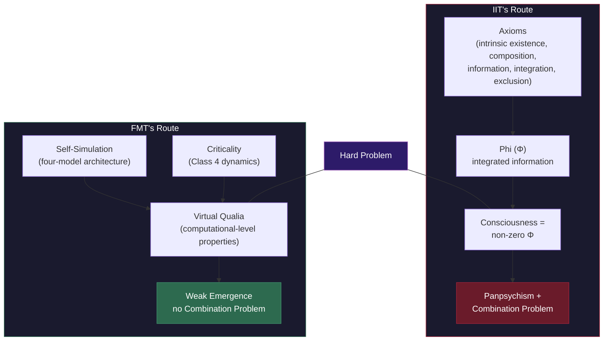

# FMT vs. Integrated Information Theory (IIT)

**IIT is FMT's most serious competitor -- mathematically rigorous and philosophically ambitious -- but its panpsychist commitments, the unresolved Combination Problem, and the computational intractability of Phi represent structural costs that FMT avoids entirely.**

Integrated Information Theory (Tononi, 2004; Albantakis et al., 2023) and the [Four-Model Theory](../core-architecture/four-model-theory.md) are the two frameworks in contemporary consciousness science that attempt to address the [Hard Problem](../hard-problem/dissolution.md) head-on rather than bracketing it. This makes their comparison especially instructive: both aim at the same target but arrive via fundamentally different routes.

## IIT's Genuine Strengths

IIT brings three substantial contributions to consciousness science that deserve recognition.

**Mathematical rigor.** IIT is the most mathematically developed consciousness theory. Its axioms, postulates, and the Phi formalism provide a precision that most theories -- including FMT in its current form -- lack. The formal apparatus makes IIT's claims testable in principle, even where computation is infeasible in practice.

**Qualia space.** IIT's treatment of experiential structure through a multidimensional qualia space is arguably its greatest achievement. The idea that the quality of an experience corresponds to the shape of the cause-effect structure captures something deep about why red feels different from blue. FMT's account of experiential structure through the [Explicit World Model](../core-architecture/ewm.md) is less formally developed.

**The exclusion postulate.** IIT provides a principled answer to the [Boundary Problem](../foundations/eight-requirements.md) through the exclusion postulate: the system with maximum Phi defines the boundary of consciousness. This is elegant, even if computationally unrealizable for biological systems.

## IIT's Structural Problems

Three difficulties are not incidental to IIT but follow necessarily from its core commitments.

**Panpsychism.** IIT's axiom-based identification of consciousness with integrated information (Phi) entails that any system with non-zero Phi has some degree of experience. This includes thermostats, logic gates, and simple feedback circuits. IIT's proponents accept this consequence; most neuroscientists find it a reductio ad absurdum. FMT avoids panpsychism entirely through [weak emergence](../philosophical/weak-emergence.md): consciousness arises at a specific computational level when both the [architectural threshold](../physical-foundations/two-thresholds.md) (four models) and [computational threshold](../physical-foundations/criticality.md) (criticality) are met.

**The Combination Problem.** If fundamental entities have micro-experience, how do these micro-experiences combine into the macro-experience of a human mind? This is not a gap in IIT's development -- it is a structural consequence of panpsychism itself ([Chalmers, 2016](https://consc.net/papers/combination.pdf)). FMT has no Combination Problem because consciousness does not emerge from the combination of proto-conscious elements. It emerges weakly from a substrate that is itself non-conscious, just as a spreadsheet sum emerges from transistors that contain no sum.

**Phi is computationally intractable.** Calculating Phi for a realistic neural system is not merely difficult but computationally intractable (Aaronson, 2014). This means IIT's predictions are often untestable in practice. FMT's predictions -- psychedelics alleviating anosognosia, controllable ego dissolution content, DID alter-switch neural signatures, lucid dream onset as criticality crossing -- require no intractable computation.

## The Divergence Point

The fundamental divergence lies in where each theory locates phenomenality. IIT identifies consciousness with intrinsic causal power: a system is conscious to the degree that it has Phi. FMT identifies consciousness with a specific *process* -- ongoing self-simulation across four models at criticality. For IIT, consciousness is everywhere Phi is non-zero. For FMT, consciousness is nowhere without the four-model architecture and criticality, regardless of how much information is integrated.

The **unfolding argument** ([Doerig et al., 2019](https://doi.org/10.1016/j.concog.2019.04.002)) sharpens this divergence: any recurrent network can be unfolded into a feedforward network that produces identical input-output mappings but has near-zero Phi. If IIT is correct, this feedforward twin is unconscious despite identical behavior. If FMT is correct, the unfolded twin is likely unconscious too -- but because it lacks criticality and self-referential closure, not because of Phi.

## Figure

*Both theories address the Hard Problem, but through fundamentally different routes. IIT's path leads through panpsychism to the Combination Problem. FMT's path through virtual qualia arrives at weak emergence with no Combination Problem.*

## Key Takeaway

IIT and FMT are the field's two most philosophically ambitious theories. IIT pays for its mathematical elegance with panpsychism, the Combination Problem, and computational intractability. FMT pays for its architectural specificity with the absence of formal mathematical development -- a gap, not a structural flaw, since formalization can follow.

## See Also

- [Comparative Scoreboard](scoreboard.md)
- [Virtual Qualia](../hard-problem/virtual-qualia.md)
- [The Boundary Problem](../foundations/eight-requirements.md)
- [Weak Emergence](../philosophical/weak-emergence.md)
- [Two Thresholds for Consciousness](../physical-foundations/two-thresholds.md)
