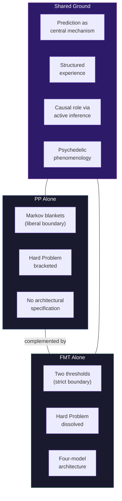

# FMT vs. Predictive Processing (PP)

**Predictive Processing is FMT's most natural ally among existing theories -- highly compatible in mechanism, overlapping in explanatory range -- but PP deliberately brackets the Hard Problem and lacks the architectural specificity that FMT provides.**

Predictive Processing (Friston, 2010; Seth, 2021; Clark, 2013) is not a consciousness theory in the narrow sense but a theory of brain function from which consciousness-relevant predictions emerge. Seth's "controlled hallucination" framework and the active inference paradigm have made PP among the most empirically productive approaches in consciousness science. The comparison with the [Four-Model Theory](../core-architecture/four-model-theory.md) is unusual: rather than a rivalry, the relationship is one of complementarity with specific points of divergence.

## Where PP and FMT Converge

The overlap between these frameworks is extensive and non-trivial.

**Prediction as the central mechanism.** PP holds that the brain continuously generates predictions about sensory input and updates its models based on prediction errors. FMT's [Explicit World Model](../core-architecture/ewm.md) performs exactly this function -- it is a continuously generated, virtual construction of the world that is updated against incoming sensory data. The EWM *is* a predictive model in PP's sense.

**Structured experience.** PP's generative models produce inherently structured output -- spatial, temporal, modal -- providing a natural account of the richness of perceptual experience. FMT agrees: the explicit models generate structured phenomenology because they are structured models. This is one of only two requirements that both theories fully address (the other being the causal role of consciousness).

**Active inference and causal role.** PP's active inference framework provides the strongest existing case for consciousness having a functional role. The system does not merely predict passively but acts to minimize prediction error. FMT's [dual evaluation architecture](../mechanisms/dual-evaluation.md) is structurally similar: the explicit models serve as the substrate's evaluation mechanism, assessing outcomes and registering hedonic valence. Both theories give consciousness genuine work to do.

**Psychedelic phenomenology.** The REBUS model ([Carhart-Harris & Friston, 2019](https://doi.org/10.1124/pr.118.017160)) -- Relaxed Beliefs Under Psychedelics -- proposes that psychedelics relax high-level priors, allowing bottom-up sensory signals to dominate. FMT's [variable permeability](../mechanisms/variable-permeability.md) mechanism produces a nearly identical prediction: psychedelics increase the permeability of the [implicit-explicit boundary](../mechanisms/implicit-explicit-boundary.md), exposing intermediate processing stages. The two accounts converge on the same phenomenology from different theoretical starting points.

## Where PP and FMT Diverge

Three points of genuine divergence emerge beneath the surface compatibility.

**The Hard Problem.** [Seth (2021)](https://doi.org/10.1017/S0140525X24003012) explicitly acknowledges that PP does not address the Hard Problem, focusing instead on what he calls the "real problem" of consciousness -- explaining the structure and contents of experience. This is a legitimate methodological choice, not a failure, but it means PP cannot explain *why* prediction error minimization is accompanied by subjective experience. FMT addresses this through [virtual qualia](../hard-problem/virtual-qualia.md): the explicit models are the computational level at which qualia are constitutive, dissolving the Hard Problem through a [level distinction](../hard-problem/category-error.md) rather than ignoring it.

**Boundary-setting.** PP uses **Markov blankets** (Friston, 2010) to define the boundary between system and environment. The concern is that Markov blankets may be too liberal: they can be drawn around thermostats, plants, and even rocks (Bruineberg et al., 2022), raising questions about whether the boundary criterion is principled. FMT sets boundaries through the [two thresholds](../physical-foundations/two-thresholds.md): only systems meeting both the architectural threshold (four-model structure) and the computational threshold ([criticality](../physical-foundations/criticality.md)) are conscious. This is more restrictive and less vulnerable to the liberality objection.

**Architectural specificity.** PP describes *how* the brain processes information (top-down predictions, bottom-up errors, precision weighting) without specifying *what architecture* is necessary for this processing to produce consciousness. Many systems minimize prediction error -- thermostats, cruise control, machine learning models -- without being conscious. FMT provides the missing specification: the four-model architecture at criticality. PP tells you how the engine works; FMT tells you which engine designs produce the phenomenon in question.

## The Complementarity Thesis

FMT and PP are not competitors -- they operate at different levels of description. PP describes the computational strategy the brain uses (predictive coding, active inference). FMT describes the architectural conditions under which that strategy produces consciousness (four models, criticality, self-referential closure). A system could implement predictive processing without being conscious (a thermostat does), and a conscious system necessarily implements something like predictive processing (the explicit models are generative, predictive models). The two theories slot together rather than conflicting.

## Figure

*PP and FMT share substantial common ground (center) while differing on boundary-setting, the Hard Problem, and architectural specificity. The divergences are complementary rather than contradictory -- PP provides the computational strategy, FMT provides the architectural conditions.*

## Key Takeaway

Predictive Processing is FMT's strongest potential ally. PP provides the computational mechanism (predictive coding, active inference) that FMT's architecture likely implements. FMT provides the architectural specificity and Hard Problem treatment that PP deliberately leaves open. Together, they are more complete than either alone.

## See Also

- [Comparative Scoreboard](scoreboard.md)
- [Variable Permeability](../mechanisms/variable-permeability.md)
- [Hard Problem Dissolution](../hard-problem/dissolution.md)
- [Two Thresholds for Consciousness](../physical-foundations/two-thresholds.md)
- [The Dual Evaluation Architecture](../mechanisms/dual-evaluation.md)
