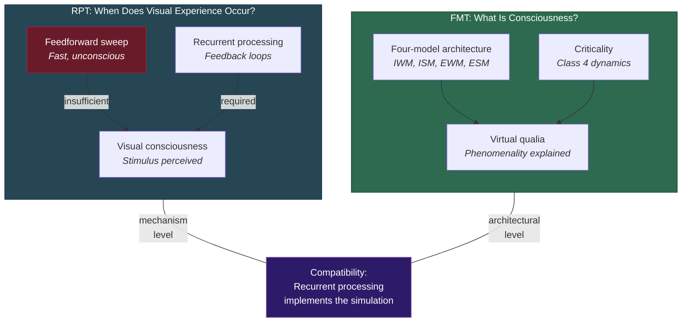

# FMT vs. Recurrent Processing Theory (RPT)

**RPT and FMT agree that recurrent (self-referential) neural dynamics are essential for consciousness, but they operate at different scopes: RPT provides a precise mechanistic account of when visual experience occurs, while FMT provides an architectural account of what consciousness is.**

Recurrent Processing Theory (Lamme, 2006, 2010) proposes that conscious perception requires recurrent processing -- feedback loops between higher and lower cortical areas -- as opposed to the initial feedforward sweep that processes visual input without producing conscious experience. RPT's strength is its empirical specificity: visual masking paradigms have provided strong support for the claim that feedforward processing alone is insufficient for consciousness. The [Four-Model Theory](../core-architecture/four-model-theory.md) is compatible with RPT at the mechanistic level but extends far beyond RPT's scope.

## RPT's Strengths

**Empirical precision.** RPT's predictions are unusually specific and testable. The theory predicts that visual stimuli processed only feedforward (masked before recurrent processing can begin) will not be consciously perceived, even if they influence behavior (priming effects). This has been robustly confirmed across dozens of visual masking studies. RPT is one of the most empirically productive theories in consciousness science.

**Causal role.** RPT provides a clear account of the causal role of consciousness: recurrent processing enables the flexible integration and report of sensory information that feedforward processing cannot achieve. The theory does not face the epiphenomenalism problem in the same way that some other theories do.

**Mechanistic clarity.** RPT specifies a concrete neural mechanism -- feedback loops between cortical areas -- rather than appealing to abstract computational principles. This makes the theory directly testable with standard neuroscience tools (TMS, EEG, masking paradigms).

## The Scope Difference

The fundamental difference between RPT and FMT is scope, not mechanism.

RPT addresses **when visual experience occurs**: consciousness of a visual stimulus requires recurrent processing. This is a claim about the neural mechanism of access -- when does a stimulus cross the threshold from unconscious processing to conscious perception?

FMT addresses **what consciousness is**: an ongoing self-simulation across four model kinds at criticality, in which phenomenality is constituted by virtual qualia at the computational level. This is a claim about the nature and architecture of consciousness as such.

The scope difference means that RPT and FMT are largely non-competing. RPT's claims about recurrent processing are compatible with -- and likely implement -- the mechanisms FMT describes at a more abstract level. Recurrent processing between cortical areas is plausibly the neural mechanism by which the [implicit-explicit boundary](../mechanisms/implicit-explicit-boundary.md) operates: information becomes conscious (crosses from implicit to explicit models) when recurrent processing establishes the feedback loops that integrate it into the ongoing simulation.

## What RPT Does Not Address

RPT is silent on several requirements that FMT addresses:

- **The [Hard Problem](../hard-problem/dissolution.md).** RPT explains when processing becomes conscious but not *why* recurrent processing produces phenomenality while feedforward processing does not. Why does a feedback loop feel like anything? RPT does not offer an answer.

- **The self.** RPT focuses on visual consciousness and does not extend to self-awareness, the [Explicit Self Model](../core-architecture/explicit-self-model.md), ego dissolution, or the architectural requirements for a unified conscious self. FMT's four-model architecture addresses this directly.

- **The [Boundary Problem](../foundations/eight-requirements.md).** RPT defines consciousness locally (stimulus-by-stimulus, based on recurrent processing), but does not provide a principled account of where the conscious system as a whole begins and ends.

- **Non-visual consciousness.** RPT was developed for visual consciousness and does not straightforwardly extend to auditory, somatosensory, emotional, or self-referential experience. FMT's architecture is modality-independent.

## The Compatibility Thesis

FMT and RPT are most productively understood as operating at different levels of description. RPT provides the neural mechanism; FMT provides the architectural and philosophical framework. Recurrent processing likely implements the ongoing simulation that FMT describes: the feedback loops between cortical areas are the substrate-level process that generates and sustains the [explicit models](../core-architecture/explicit-world-model.md).

If this compatibility thesis is correct, RPT's empirical findings are not evidence *against* FMT but evidence *for* one of its implementation-level claims: that the explicit models require recurrent neural dynamics (not feedforward processing) to be generated and sustained. The [criticality requirement](../physical-foundations/criticality.md) adds a constraint that RPT does not consider: the recurrent processing must occur in a substrate operating at the edge of chaos, not merely in any recurrent network.

## Figure

*RPT and FMT operate at different levels of description. RPT specifies the neural mechanism (recurrent processing); FMT specifies the architecture and philosophy. The two are compatible: recurrent processing plausibly implements the ongoing simulation that FMT describes.*

## Key Takeaway

RPT is not a competitor to FMT but a mechanistic complement. RPT tells us *how* (via recurrent processing) and *when* (after feedback loops are established) visual experience occurs. FMT tells us *what* consciousness is (self-simulation at criticality) and *why* it has phenomenal character (virtual qualia). A complete account of consciousness needs both levels of description.

## See Also

- [Comparative Scoreboard](scoreboard.md)
- [The Implicit-Explicit Boundary](../mechanisms/implicit-explicit-boundary.md)
- [The Criticality Requirement](../physical-foundations/criticality.md)
- [Hard Problem Dissolution](../hard-problem/dissolution.md)
- [FMT vs. Global Neuronal Workspace (GNW)](vs-gnw.md)

---

Based on: Gruber, M. (2026). The Four-Model Theory of Consciousness. Zenodo. https://doi.org/10.5281/zenodo.19064950
