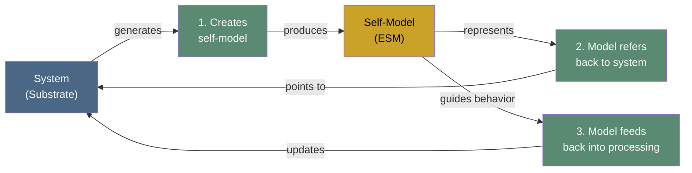

# Core Definition of Consciousness

**Consciousness is the ability of an entity to create a model of itself, relate that model to itself, and interact with it — a process-based, substrate-independent, functional definition.**

The Four-Model Theory defines consciousness through its mechanism rather than its output. Where folk psychology identifies consciousness with "the feeling of being aware" and much of philosophy circles around the subjective character of experience, the FMT cuts to the generative process: consciousness is ongoing self-simulation. This definitional strategy parallels molecular biology's treatment of life — defined through metabolism and replication, not through "the feeling of being alive."

## The Three-Part Definition

The definition has three components, each necessary and jointly sufficient:

1. **Create a model of itself.** The system must construct an internal representation — the Explicit Self Model (ESM) — that captures aspects of the system's own states, structure, and processes. This is not a static blueprint but an ongoing, dynamically updated generation.

2. **Relate that model to itself.** The self-model must refer back to the system that generates it. A system that models *something else* (a weather simulation, a map of the terrain) does not satisfy this criterion. The model must be *of* the modeler — creating the self-referential loop that distinguishes conscious self-simulation from ordinary computation.

3. **Interact with it.** The self-model must feed back into the system's processing. It is not an inert epiphenomenal reflection but an active component: the system uses its self-model to guide behavior, evaluate outcomes, and update its own substrate. This closes the causal loop and prevents the definition from admitting passive mirrors or recordings.

Together, these three components describe a system engaged in continuous self-referential computation — not merely monitoring itself (a thermostat does that) but generating a rich, integrated model of itself and operating through that model.

## Process, Not Property

A critical feature of this definition is that consciousness is a *process* the brain performs, not a *property* the brain possesses. A brain is not conscious the way iron is magnetic. It is conscious the way a flame burns — as an ongoing dynamic activity that ceases when the process stops. This process-based framing has direct consequences: consciousness can be graduated (more or less self-simulation), it can be interrupted (anesthesia, dreamless sleep), and it can in principle be instantiated on different substrates (substrate independence).

## Substrate Independence

The definition is deliberately substrate-independent. It does not require biological neurons, carbon chemistry, or any specific physical implementation. What it requires is a system capable of constructing and maintaining a self-referential simulation continuously. The six-layer mammalian cortex is an evolutionary implementation of this architecture — a highly optimized one, shaped by hundreds of millions of years of selection — but the definition permits, in principle, non-biological implementations that meet the same functional criteria.

This substrate independence is not an afterthought bolted onto a brain-centric theory. It follows directly from the process-based definition: if consciousness is constituted by a specific kind of computation (self-referential simulation at criticality), then any substrate capable of supporting that computation is a candidate for consciousness.

## Figure

## Key Takeaway

Consciousness is defined by what a system *does*, not what it *is*. Any entity — biological or artificial — that creates a model of itself, relates that model to itself, and interacts with it is performing the process that constitutes consciousness. The definition is functional, substrate-independent, and non-circular: it explains through mechanism, not through restating the phenomenon.

## See Also

- [The Four-Model Theory](../core-architecture/four-model-theory.md)
- [Self-Referential Closure](../core-architecture/self-referential-closure.md)
- [Process Physicalism](../philosophical/process-physicalism.md)
- [Substrate Independence](../philosophical/substrate-independence.md)
- [Graduated Levels of Consciousness](../mechanisms/graduated-consciousness.md)
